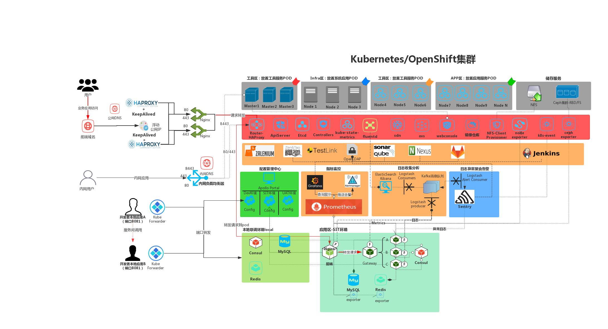
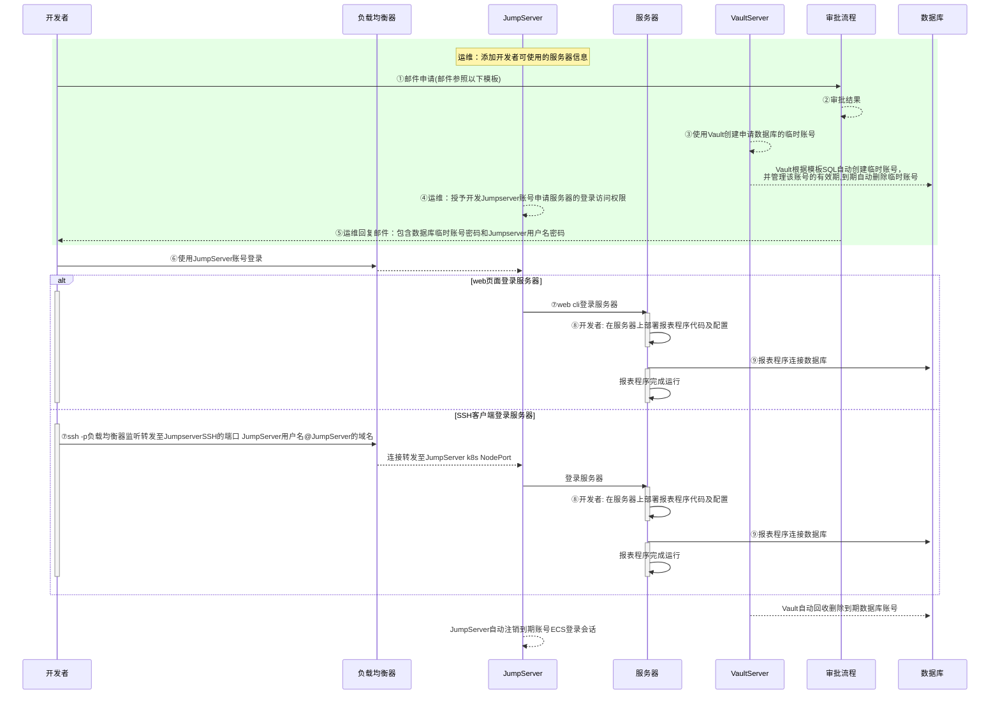
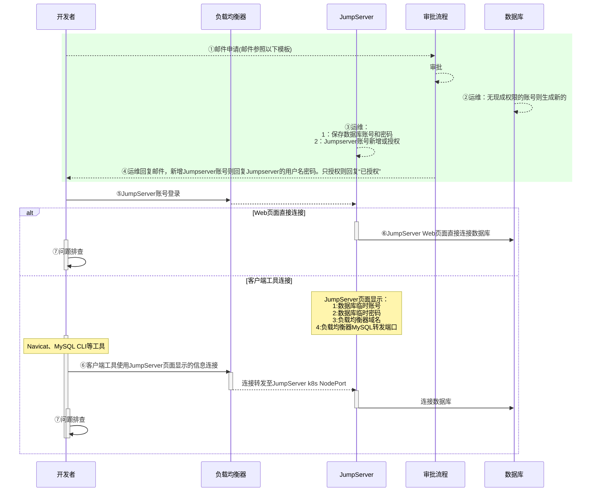
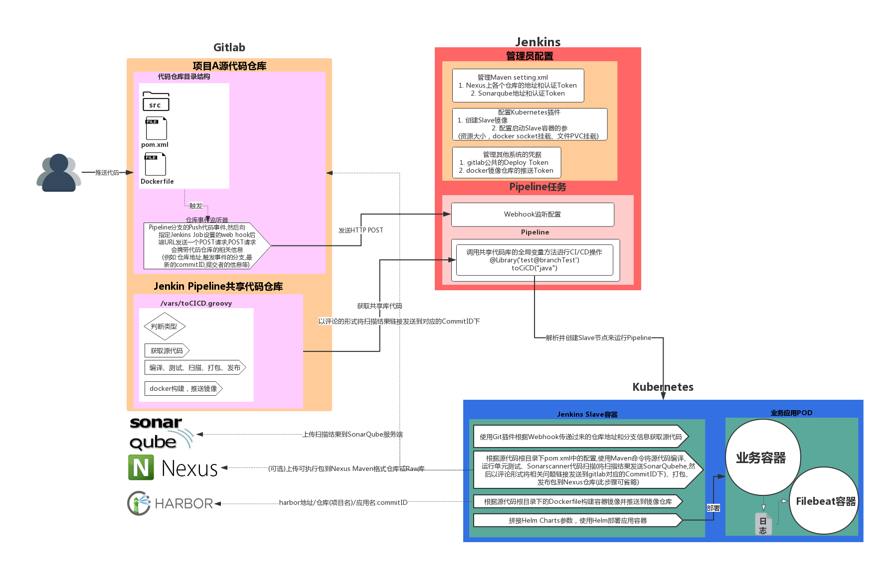
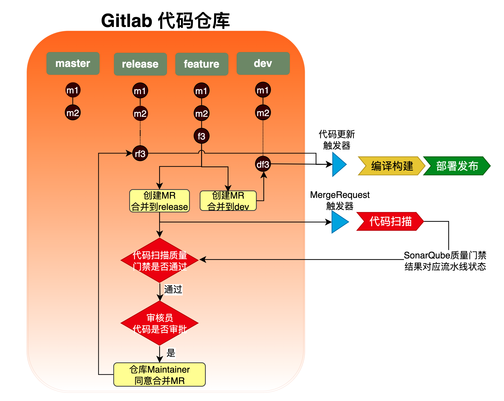
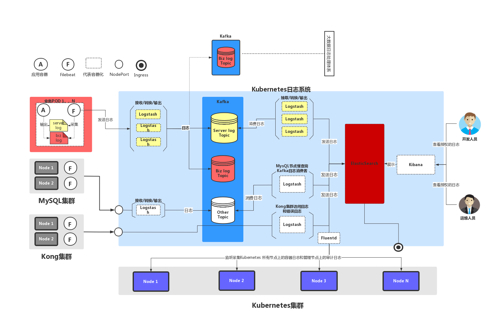
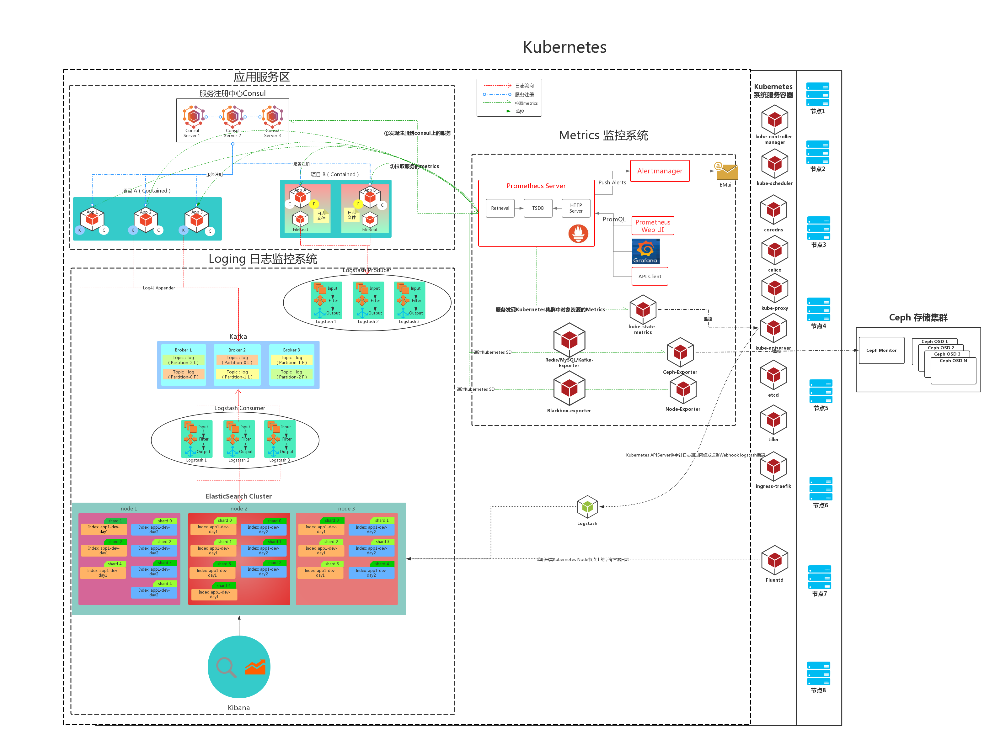

# **Curiouser's Devops Roadmap**

This gitbook record the technical roadmap of Devops Curiouser.

## **Link**

`GitBook Access URL`: [https://gitbook.curiouser.top](https://gitbook.curiouser.top)

`GitHub`: [https://github.com/RationalMonster](https://github.com/RationalMonster)

## What I had done at Openshift or Kubernetes

## Database Connect Secrity

JumpServer结合VaultServer实现隔离数据库直连、自动生成有效期数据库账号

JumpServer使用自带数据库应用功能，实现隔离数据库直连、自动生成临时有效期数据库账号

## kubernetes

## Jenkins CI/CD Flow

### 1. Gitlab Webhook + Jenkins SharedLibraries/Kubernetes + SonarScanner Maven Plugin

## Gitlab CI/CD Workflow

### 1、Trigger pipeline to Scan code when create a MergeRequest 

## Logging

## Logging与Metrics

