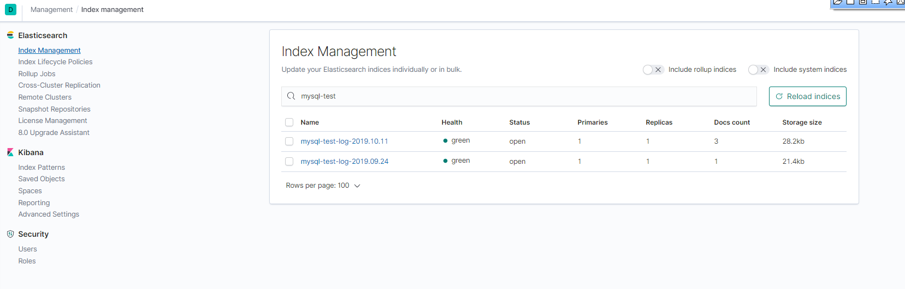
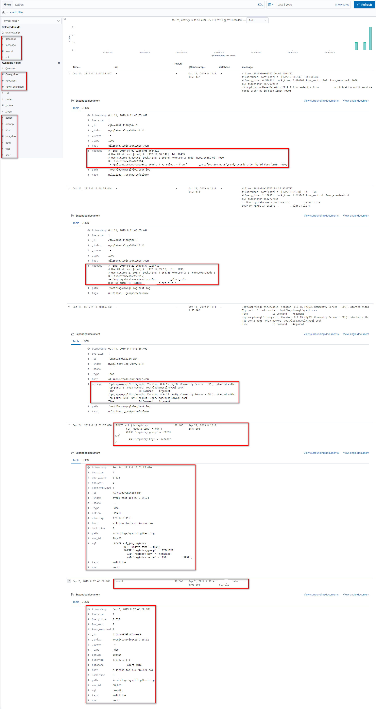
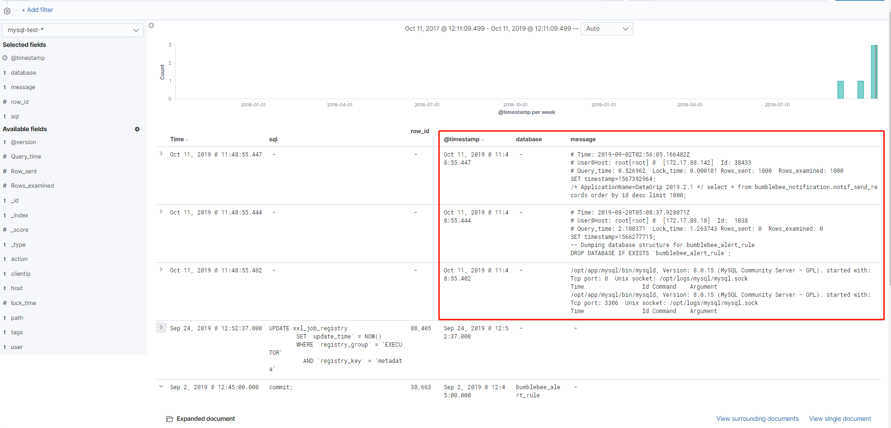

# Logstash采集MySQL慢查询日志到Elasticsearch

# 一、原始日志数据

```json
---------------------------------------标识分隔符（源文件中不存在）----------------------------------------------------
/opt/app/mysql/bin/mysqld, Version: 8.0.15 (MySQL Community Server - GPL). started with:
Tcp port: 0  Unix socket: /opt/logs/mysql/mysql.sock
Time                 Id Command    Argument
/opt/app/mysql/bin/mysqld, Version: 8.0.15 (MySQL Community Server - GPL). started with:
Tcp port: 3306  Unix socket: /opt/logs/mysql/mysql.sock
Time                 Id Command    Argument
---------------------------------------标识分隔符（源文件中不存在）----------------------------------------------------
# Time: 2019-08-20T05:08:37.928071Z
# User@Host: root[root] @  [172.17.89.18]  Id:  1038
# Query_time: 2.100371  Lock_time: 1.263743 Rows_sent: 0  Rows_examined: 0
SET timestamp=1566277715;
-- Dumping database structure for curiouser_alert_rule
DROP DATABASE IF EXISTS `curiouser_alert_rule`;
---------------------------------------标识分隔符（源文件中不存在）----------------------------------------------------
# Time: 2019-09-02T02:56:05.166482Z
# User@Host: root[root] @  [172.17.88.142]  Id: 38433
# Query_time: 0.526962  Lock_time: 0.000101 Rows_sent: 1000  Rows_examined: 1000
SET timestamp=1567392964;
/* ApplicationName=DataGrip 2019.2.1 */ select * from curiouser_notification.notif_send_records order by id desc limit 1000;
---------------------------------------标识分隔符（源文件中不存在）----------------------------------------------------
# Time: 2019-09-24T04:52:37.816164Z
# User@Host: root[root] @  [172.17.0.115]  Id: 88405
# Query_time: 0.622215  Lock_time: 0.000149 Rows_sent: 0  Rows_examined: 1
SET timestamp=1569300757;
UPDATE xxl_job_registry
        SET `update_time` = NOW()
        WHERE `registry_group` = 'EXECUTOR'
          AND `registry_key` = 'metadata'
          AND `registry_value` = '192.168.215.94:9999';
---------------------------------------标识分隔符（源文件中不存在）--------------------------------------------------	
# Time: 2019-09-02T04:45:00.840024Z
# User@Host: root[root] @  [172.17.0.113]  Id: 38663
# Query_time: 0.557195  Lock_time: 0.000000 Rows_sent: 0  Rows_examined: 0
use curiouser_alert_rule;
SET timestamp=1567399500;
commit;
```

**`Note`**：只摘录了几种典型格式的日志

# 二、Pipeline

**`Note`**：Input插件将指定分割的多行数据变成一行放到一个Event的message中供filter插件处理

```json
input {
  file{
      path => "/root/logs/mysql-log/test.log"
      start_position => "beginning"
      codec => multiline {
        # 以"# Time:"为分隔符，中间的所有多行内容归为一行并填充到Event时间中
        pattern => "^# Time:"
        negate => true
        what => "previous"
    	# 指定最多读取多少行，默认500行（以防执行初始数据库数据sql语句超过默认行）
        max_lines => 20000 
      }
  }
}

filter {

  grok {
    # 在使用codec/multiline搭配使用的时候，需要注意，grok和普通正则一样默认是不支持匹配回车换行的。就像你需要=～//m一样也需要单独指定，具体写法是在表达式开始位置加(?m)标记
    match => { "message" => "(?m)^# Time:.*\s+#\s+User@Host:\s+%{USER:user}\[[^\]]+\]\s+@\s+(?:(?<clientip>\S*) )?\[(?:%{IPV4:clientip})?\]\s+Id:\s+%{NUMBER:row_id:int}\n#\s+Query_time:\s+%{NUMBER:Query_time:float}\s+Lock_time:\s+%{NUMBER:lock_time:float}\s+Rows_sent:\s+%{NUMBER:Row_sent:int}\s+Rows_examined:\s+%{NUMBER:Rows_examined:int}\n\s*(?:use %{DATA:database};\s*\n)?SET\s+timestamp=%{NUMBER:timestamp};\n\s*(?<sql>(?<action>\w+)\b.*)$" }
    
    # 对于能匹配上面Grok正则的message就删除掉，不能匹配会原始保留
    remove_field => [ "message" ] 
  }

  #mutate {
  #  gsub => [ "sql", "\n# Time: \d+\s+\d+:\d+:\d+", "" ]
  #}

  date {
    match => [ "timestamp", "UNIX" ]
    remove_field => [ "timestamp" ]
  }

}

output {

  #stdout { }

  elasticsearch { 
    id => "logstash_mysqlslowsql"
    hosts => ["localhost:9200"] 
    index=>"mysql-test-log-%{+YYYY.MM.dd}"
    document_type => "_doc"
    http_compression => true
    user => "elastic"
    password => "elastic"
  }

  #file{
  #  path => "/root/logs/mysql-log/test-out.log"
  #}
}

# ---------------------------------如果以"^# User@Host:“为分隔符时的Grok正则表达式------------------------------

match => { "message" => "(?m)^# User@Host: %{USER:User}\[[^\]]+\] @ (?:(?<clienthost>\S*) )?\[(?:%{IP:Client_IP})?\]\s.*# Query_time: %{NUMBER:Query_Time:float}\s+Lock_time: %{NUMBER:Lock_Time:float}\s+Rows_sent: %{NUMBER:Rows_Sent:int}\s+Rows_examined: %{NUMBER:Rows_Examined:int}\s*(?:use %{DATA:Database};\s*)?SET timestamp=%{NUMBER:timestamp};\s*(?<Query>(?<Action>\w+)\s+.*)\n# Time:.*$" }

match => { "(?m)^#\s+User@Host:\s+%{USER:user}\[[^\]]+\]\s+@\s+(?:(?<clientip>\S*) )?\[(?:%{IPV4:clientip})?\]\s+Id:\s+%{NUMBER:row_id:int}\n#\s+Query_time:\s+%{NUMBER:Query_time:float}\s+Lock_time:\s+%{NUMBER:lock_time:float}\s+Rows_sent:\s+%{NUMBER:Row_sent:int}\s+Rows_examined:\s+%{NUMBER:Rows_examined:int}\n\s*(?:use %{DATA:database};\s*\n)?SET\s+timestamp=%{NUMBER:timestamp};\n-{0,2}\s*(?<sql>(?<action>\w+)\b.*;)\s*(?:\n#\s+Time)?.*$" }
```

# 三、日志数据经logstash处理后的数据格式

```json
{"message":"/opt/app/mysql/bin/mysqld, Version: 8.0.15 (MySQL Community Server - GPL). started with:\nTcp port: 0  Unix socket: /opt/logs/mysql/mysql.sock\nTime                 Id Command    Argument\n/opt/app/mysql/bin/mysqld, Version: 8.0.15 (MySQL Community Server - GPL). started with:\nTcp port: 3306  Unix socket: /opt/logs/mysql/mysql.sock\nTime                 Id Command    Argument","host":"allinone.tools.curiouser.com","path":"/root/logs/mysql-log/test.log","tags":["multiline","_grokparsefailure"],"@timestamp":"2019-10-11T03:48:55.402Z","@version":"1"}
{"message":"# Time: 2019-08-20T05:08:37.928071Z\n# User@Host: root[root] @  [172.17.89.18]  Id:  1038\n# Query_time: 2.100371  Lock_time: 1.263743 Rows_sent: 0  Rows_examined: 0\nSET timestamp=1566277715;\n-- Dumping database structure for curiouser_alert_rule\nDROP DATABASE IF EXISTS `curiouser_alert_rule`;","host":"allinone.tools.curiouser.com","path":"/root/logs/mysql-log/test.log","tags":["multiline","_grokparsefailure"],"@timestamp":"2019-10-11T03:48:55.444Z","@version":"1"}
{"message":"# Time: 2019-09-02T02:56:05.166482Z\n# User@Host: root[root] @  [172.17.88.142]  Id: 38433\n# Query_time: 0.526962  Lock_time: 0.000101 Rows_sent: 1000  Rows_examined: 1000\nSET timestamp=1567392964;\n/* ApplicationName=DataGrip 2019.2.1 */ select * from curiouser_notification.notif_send_records order by id desc limit 1000;","host":"allinone.tools.curiouser.com","path":"/root/logs/mysql-log/test.log","tags":["multiline","_grokparsefailure"],"@timestamp":"2019-10-11T03:48:55.447Z","@version":"1"}
{"host":"allinone.tools.curiouser.com","row_id":88405,"tags":["multiline"],"clientip":"172.17.0.115","@timestamp":"2019-09-24T04:52:37.000Z","@version":"1","user":"root","sql":"UPDATE xxl_job_registry\n        SET `update_time` = NOW()\n        WHERE `registry_group` = 'EXECUTOR'\n          AND `registry_key` = 'metadata'\n          AND `registry_value` = '192.168.215.94:9999';","Query_time":0.622215,"path":"/root/logs/mysql-log/test.log","action":"UPDATE","Row_sent":0,"lock_time":1.49E-4,"Rows_examined":1}
{"host":"allinone.tools.curiouser.com","row_id":38663,"tags":["multiline"],"clientip":"172.17.0.113","@timestamp":"2019-09-02T04:45:00.000Z","@version":"1","user":"root","sql":"commit;","database":"curiouser_alert_rule","Query_time":0.557195,"path":"/root/logs/mysql-log/test.log","action":"commit","Row_sent":0,"lock_time":0.0,"Rows_examined":0}
```

# 四、日志数据在Elasticsearch中存储的结构

```json
{
  "_index": "mysql-test-log-2019.09.24",
  "_type": "_doc",
  "_id": "klPvuG0BV8kuVZccHbmj",
  "_version": 1,
  "_score": null,
  "_source": {
    "host": "allinone.tools.curiouser.com",
    "row_id": 88405,
    "tags": [
      "multiline"
    ],
    "clientip": "172.17.0.115",
    "@timestamp": "2019-09-24T04:52:37.000Z",
    "@version": "1",
    "user": "root",
    "sql": "UPDATE xxl_job_registry\n        SET `update_time` = NOW()\n        WHERE `registry_group` = 'EXECUTOR'\n          AND `registry_key` = 'metadata'\n          AND `registry_value` = '192.168.215.94:9999';",
    "Query_time": 0.622215,
    "path": "/root/logs/mysql-log/test.log",
    "action": "UPDATE",
    "Row_sent": 0,
    "lock_time": 0.000149,
    "Rows_examined": 1
  },
  "fields": {
    "@timestamp": [
      "2019-09-24T04:52:37.000Z"
    ]
  },
  "sort": [
    1569300757000
  ]
}
```






# 五、问题：

1. 有几种特殊格式的日志能采集到，但无法格式解析(时间戳会是以采集时间为准)

   

2. 日志文件中最后一条最新的日志在logstash退出时才进行了收集

# 附录：

## 1、filter中grok插件的正则

- `^`  : 匹配输入字符串的开始位置
- `\s` : 匹配任何不可见字符，包括空格、制表符、换页符等等。等价于`[ \f\n\r\t\v]`
- `\S` : 匹配任何可见字符。等价于[^ \f\n\r\t\v]
- `\n` : 匹配一个换行符。等价于`\x0a`和`\cJ`
- `\b` : 匹配一个单词边界，也就是指单词和空格间的位置（即正则表达式的“匹配”有两种概念，一种是匹配字符，一种是匹配位置，这里的\b就是匹配位置的）。例如，“`er\b`”可以匹配“never”中的“`er`”，但不能匹配“verb”中的“`er`”
- `\w` : 匹配包括下划线的任何单词字符。类似但不等价于“`[A-Za-z0-9_]`”，这里的"单词"字符使用Unicode字符集

默认的正则匹配模式：`%{NUMBER:row_id:int}` 匹配模式:字段名:数值类型

自定义的正则匹配模式：  `(?<field_name>the pattern here)`


## 2、MySQL开启慢查询日志

```json
# slow_query_log 慢查询开启状态
# slow_query_log_file 慢查询日志存放的位置（这个目录需要MySQL的运行帐号的可写权限，一般设置为MySQL的数据存放目录）
# long_query_time 查询超过多少秒才记录

# 查看慢查询相关参数
mysql> show variables like 'slow_query%';
mysql> show variables like 'long_query_time';

# 全局变量设置
mysql> set global slow_query_log='ON'; 
mysql> set global slow_query_log_file='/usr/local/mysql/data/slow.log';
mysql> set global long_query_time=1;

# 修改配置文件my.cnf

[mysqld]
slow_query_log = ON
slow_query_log_file = /usr/local/mysql/data/slow.log
long_query_time = 1	
```

5.5版本慢查询日志

```json
# Time: 180810  8:45:12
# User@Host: select[select] @  [10.63.253.59]
# Query_time: 1.064555  Lock_time: 0.000054 Rows_sent: 1  Rows_examined: 319707
SET timestamp=1533861912;
SELECT COUNT(*) FROM hs_forum_thread t  WHERE t.`fid`='50' AND t.`displayorder`>='0';
```

5.6版本慢查询日志

```json
# Time: 160928 18:36:08
# User@Host: root[root] @ localhost []  Id:  4922
# Query_time: 5.207662  Lock_time: 0.000085 Rows_sent: 1  Rows_examined: 526068
use db_name;
SET timestamp=1475058968;
select count(*) from redeem_item_consume where id<=526083;
```

5.7版本慢查询日志

```json
# Time: 2018-07-09T10:04:14.666231Z
# User@Host: bbs_code[bbs_code] @  [10.82.9.220]  Id: 9304381
# Query_time: 5.274805  Lock_time: 0.000052 Rows_sent: 0  Rows_examined: 2
SET timestamp=1531130654;
SELECT * FROM pre_common_session WHERE  sid='Ba1cSC'  OR lastactivity<1531129749;
```

慢查询日志异同点：

1. 每个版本的Time字段格式都不一样

2. 相较于5.6、5.7版本，5.5版本少了Id字段

3. `use db`语句不是每条慢日志都有的

4. 可能会出现像下边这样的情况，慢查询块`# Time：`下可能跟了多个慢查询语句

   ```json
   # Time: 160918  2:00:03
   # User@Host: dba_monitor[dba_monitor] @  [10.63.144.82]  Id:   968
   # Query_time: 0.007479  Lock_time: 0.000181 Rows_sent: 172  Rows_examined: 344
   SET timestamp=1474135203;
   SELECT table_schema as 'DB',table_name as 'TABLE',CONCAT(ROUND(( data_length + index_length ) / ( 1024 * 1024 *1024 ), 2), '') as 'TOTAL',TABLE_COMMENT  FROM information_schema.TABLES ORDER BY data_length + index_length DESC;
   # User@Host: dba_monitor[dba_monitor] @  [10.63.144.82]  Id:   969
   # Query_time: 0.003303  Lock_time: 0.000395 Rows_sent: 233  Rows_examined: 233
   SET timestamp=1474135203;
   select TABLE_SCHEMA,TABLE_NAME,COLUMN_NAME,ORDINAL_POSITION,COLUMN_TYPE,ifnull(COLUMN_COMMENT,0) from COLUMNS where table_schema not in ('mysql','information_schema','performance_schema','test');
   ```

   

# 参考链接

1. https://my.oschina.net/lics/blog/916618
2. https://blog.51cto.com/fengwan/1758920
3. https://www.elastic.co/guide/en/logstash/current/plugins-filters-grok.html