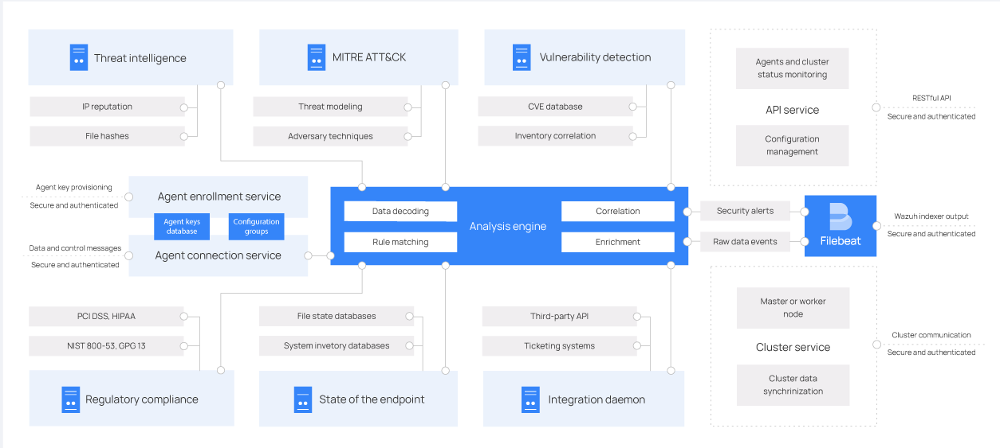

# Wazuh 基础

# 一、简介

# 二、架构组件

## 架构及组件


- [Wazuh indexer](https://documentation.wazuh.com/current/getting-started/components/wazuh-indexer.html) ：高度可扩展的全文搜索和分析引擎。该组件索引并存储 Wazuh 服务器生成的警报。
- [Wazuh server](https://documentation.wazuh.com/current/getting-started/components/wazuh-server.html) analyzes data received from the agents. It processes it through decoders and rules, using threat intelligence to look for well-known indicators of compromise (IOCs). A single server can analyze data from hundreds or thousands of agents, and scale horizontally when set up as a cluster. This central component is also used to manage the agents, configuring and upgrading them remotely when necessary.
- [Wazuh dashboard](https://documentation.wazuh.com/current/getting-started/components/wazuh-dashboard.html) is the web user interface for data visualization and analysis. It includes out-of-the-box dashboards for threat hunting, regulatory compliance (e.g., PCI DSS, GDPR, CIS, HIPAA, NIST 800-53), detected vulnerable applications, file integrity monitoring data, configuration assessment results, cloud infrastructure monitoring events, and others. It is also used to manage Wazuh configuration and to monitor its status.

## 组件数据流向


## Server架构及组件



- **功能**
  - **Agent enrollment service：**用于注册新的agent。该服务向每个agent提供并分发唯一的身份验证密钥。可通过 TLS/SSL 证书或提供固定密码进行身份验证。
  - **Agent connection service：** 从agent接收数据。它使用注册服务共享的密钥来验证每个agent身份，并加密 Wazuh agent和 Wazuh server之间的通信。此外，该服务还提供集中配置管理，能够远程推送新的agent设置。
  - **Analysis engine：**这是执行数据分析的服务器组件。它使用解码器来识别正在处理的信息类型（Windows 事件、SSH 日志、Web 服务器日志等）。这些解码器还从日志消息中提取相关数据元素，例如源 IP 地址、事件 ID 或用户名。然后，通过使用规则，引擎识别解码事件中的特定模式，这些模式可能会触发警报，甚至可能调用自动对策（例如，禁止 IP 地址、停止正在运行的进程或删除恶意软件工件）。
  - **Wazuh RESTful API：** 该服务提供了与 Wazuh 基础设施交互的接口。用于管理agent和服务器的配置设置，监控基础设施状态和整体运行状况，管理和编辑 Wazuh 解码器和规则，以及查询受监控端点的状态。 Wazuh 仪表板也使用它
  - **Wazuh cluster daemon：**  用于水平扩展 Wazuh 服务器，将它们部署为集群。这种配置与网络负载平衡器相结合，提供高可用性和负载平衡。是 Wazuh服务器用来相互通信并保持同步的工具。
  - **Filebeat：** 它读取 Wazuh 分析引擎的输出并实时向 Wazuh Index服务器发送事件和警报。当连接到多节点 Wazuh 索引器集群时，还提供负载平衡。


## Agent架构及组件


- **功能**
  - **日志收集器Log collector：**读取平面日志文件和 Windows 事件，收集操作系统和应用程序的日志消息。它支持 Windows 事件的 XPath 过滤器；能识别 Linux多行格式的审计日志等；还可以使用额外的元数据来丰富 JSON 事件。
  - **命令执行Command execution：**agent定期运行授权的命令，收集其输出并传回 Wazuh Server服务进行分析。同时也可以将此模块用于不同的目的，例如监控硬盘空剩余间，或查看最后登录用户的日志等。
  - **文件完整性监控File integrity monitoring (FIM)：**该模块监控文件系统。报告文件何时创建、删除或修改，跟踪文件属性、权限、所有权和内容的更改。当事件发生时，它会实时捕获人物、事件和时间的详细信息。此外，`FIM 模块还构建并维护一个包含受监控文件状态的数据库，允许远程运行查询。`
  - **安全配置评估 Security configuration assessment (SCA)：**该组件利用基于互联网安全中心 (CIS) 基准的开箱即用检查，提供持续的配置评估。用户还可以创建自己的 SCA 检查来监控和实施其安全策略。
  - **系统清单System inventory：**该模块定期运行进行扫描进程，收集agent主机的清单数据，例如操作系统版本、网络接口、正在运行的进程、已安装的应用程序和开放端口列表。`扫描结果存储在本地SQLite数据库中，可以远程查询。`
  - **恶意软件检测Malware detection：**该组件使用非基于签名的方法，检测异常情况和可能存在的 Rootkit。此外，它还会在监视系统调用时查找隐藏进程、隐藏文件和隐藏端口。
  - **主动响应Active response：**当检测到威胁时，该模块会运行自动操作，触发响应，例如阻止网络连接、停止正在运行的进程、或删除恶意文件。用户还可以在必要时创建自定义的威胁响应，例如在沙箱中运行二进制文件、捕获网络流量以及使用防病毒软件扫描文件的响应。
  - **容器安全监控Container security monitoring：**该模块与 Docker Engine API 集成，用于监控容器化环境中的变化。例如检测容器映像、网络配置或数据卷的更改。此外，还会针对以特权模式运行的容器以及用户在正在运行的容器中执行命令发出警报。
  - **云安全监控Cloud security monitoring：**该组件监控 Amazon Web Services、Microsoft Azure 或 Google GCP 等云提供商。它本身就与他们的 API 进行通信。它能够检测云基础设施的变化（例如创建新用户、修改安全组、停止云实例等）并收集云服务日志数据（例如AWS Cloudtrail、AWS Macie、AWS GuardDuty、Azure Active Directory 等）
- **支持的操作系统**
  - **Linux, Windows, macOS, Solaris, AIX, HP-UX**

## Wazuh各组件端口

| 组件            | 端口      | 协议           | 作用                                |
| --------------- | --------- | -------------- | ----------------------------------- |
| Wazuh server    | 1514      | TCP (默认)/UDP | Agent 连接服务                      |
|                 | 1515      | TCP            | Agent 注册服务                      |
|                 | 1516      | TCP            | Wazuh cluster daemon                |
|                 | 514       | UDP (默认)/TCP | Wazuh系统日志收集器                 |
|                 | 55000     | TCP            | Wazuh服务端RESTful API接口          |
| Wazuh indexer   | 9200      | TCP            | Wazuh indexer服务RESTful API接口    |
|                 | 9300-9400 | TCP            | Wazuh indexer cluster communication |
| Wazuh dashboard | 443       | TCP            | Wazuh Web-UI接口                    |

# 三、安全概念

## 1、合规性监管 Compliance Regulatory

- **PCI DSS：**The Payment Card Industry Data Security Standard
- **GDPR：**The European Union's General Data Protection Regulation
- **HIPAA：**The Health Insurance Portability and Accountability Act 
- **NIST 800-53：** a cybersecurity framework developed by the National Institute of Standards and Technology


# 四、安装部署

## 1、OVA

- **文档地址：**https://documentation.wazuh.com/current/deployment-options/virtual-machine/virtual-machine.html

- **下载地址：**https://packages.wazuh.com/4.x/vm/wazuh-4.9.0.ova

- **OVA 虚拟机信息**

  - 硬件配置：4核 8G 内存 50G 系统盘
  - OS：Amazon Linux 2

  - 软件版本
    - `Wazuh manager 4.9.0` 、`Wazuh indexer 4.9.0` 、`Filebeat-OSS 7.10.2` 、`Wazuh dashboard 4.9.0`

  - 用户密码：`wazuh-user / wazuh`
  - Wazuh Dashboard 用户密码：`admin / admin`

## 2、Docker/Kubernetes

文档地址：

- https://documentation.wazuh.com/current/deployment-options/docker/index.html
- https://documentation.wazuh.com/current/deployment-options/deploying-with-kubernetes/index.html

## 3、二进制

https://documentation.wazuh.com/current/installation-guide/packages-list.html

# 五、客户端


# 六、客户端配置

## 1、可远程集中配置的参数项

- [File Integrity monitoring](https://documentation.wazuh.com/current/user-manual/capabilities/file-integrity/index.html) (**syscheck**)
- [Rootkit detection](https://documentation.wazuh.com/current/user-manual/capabilities/malware-detection/index.html) (**rootcheck**)
- [Log data collection](https://documentation.wazuh.com/current/user-manual/capabilities/log-data-collection/index.html) (**localfile**)
- [Security policy monitoring](https://documentation.wazuh.com/current/user-manual/capabilities/policy-monitoring/index.html) (**wodle name="open-scap"**, **wodle name="cis-cat"**)
- [Remote commands](https://documentation.wazuh.com/current/user-manual/reference/ossec-conf/wodle-command.html) (**wodle name="command"**)
- [Labels for agent alerts](https://documentation.wazuh.com/current/user-manual/agent/agent-management/labels.html) (**labels**)
- [Security Configuration Assessment](https://documentation.wazuh.com/current/user-manual/capabilities/sec-config-assessment/index.html) (**sca**)
- [System inventory](https://documentation.wazuh.com/current/user-manual/capabilities/system-inventory/index.html) (**syscollector**)
- [Avoid events flooding](https://documentation.wazuh.com/current/user-manual/reference/ossec-conf/client-buffer.html) (**client_buffer**)
- [Configure osquery wodle](https://documentation.wazuh.com/current/user-manual/reference/ossec-conf/wodle-osquery.html) (**wodle name="osquery"**)
- [force_reconnect_interval setting](https://documentation.wazuh.com/current/user-manual/reference/ossec-conf/client.html) (**client**)


# 七、Wazuh Server API

Wazuh Server API文档：https://documentation.wazuh.com/current/user-manual/api/reference.html

## 1、请求与响应

### 请求格式

> curl -k -X GET -H  "Authorization: Bearer $TOKEN"    "https://localhost:55000/<ENDPOINT>" 

### 响应格式

响应体为 JSON 格式

```json
{
  "data": {
    "affected_items": [
      "master-node",
      "worker1"
    ],
    "total_affected_items": 2,
    "failed_items": [],
    "total_failed_items": 0
  },
  "message": "Restart request sent to all specified nodes",
  "error": 0
}

```

| **属性** | 子属性               | **描述**                                                     |
| -------- | -------------------- | ------------------------------------------------------------ |
| data     | affected_items       | 列出请求中成功受影响的项目                                   |
|          | total_affected_items | 成功受影响的项目总数                                         |
|          | failed_items         | 请求中每个失败项目的列表                                     |
|          | total_failed_items   | 失败项目总数                                                 |
| message  |                      | 结果描述                                                     |
| error    |                      | 对于 HTTP 200 响应，响应是完整 (0)、失败 (1) 还是部分 (2)。对于 HTTP 4xx 或 5xx 响应，它确定与失败相关的错误代码。 |

## 2、常用 API

### 获取 Token

> ```bash
> curl -u <USER>:<PASSWORD> -k -X POST "https://<HOST_IP>:55000/security/user/authenticate"
> ```

### 获取agent详细状态

> GET /agents/<YOUR_AGENT_ID>/stats/agent

```bash
```

# 参考

- https://documentation.wazuh.com/4.8/getting-started/use-cases/container-security.html
- https://wazuh.com/blog/auditing-kubernetes-with-wazuh/
- https://wazuh.com/blog/exploring-security-alerting-options-for-improved-threat-detection-in-wazuh-part-1
- https://wazuh.com/blog/exploring-security-alerting-options-for-improved-threat-detection-in-wazuh-part-2
- https://wazuh.com/blog/enhancing-it-security-with-anomaly-detection/#failed-logins-anomaly
- https://documentation.wazuh.com/current/user-manual/reference/centralized-configuration.html
- https://l0n9w4y.cc/posts/22306/