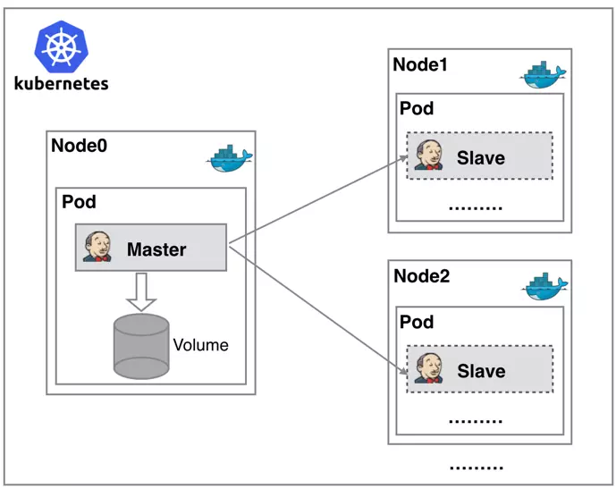
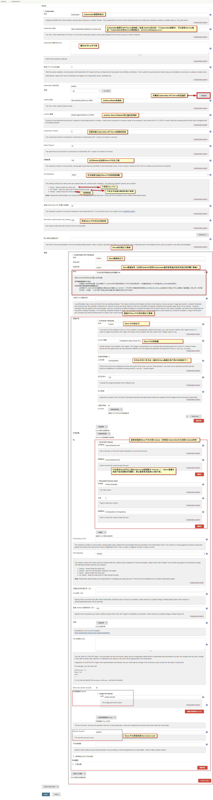
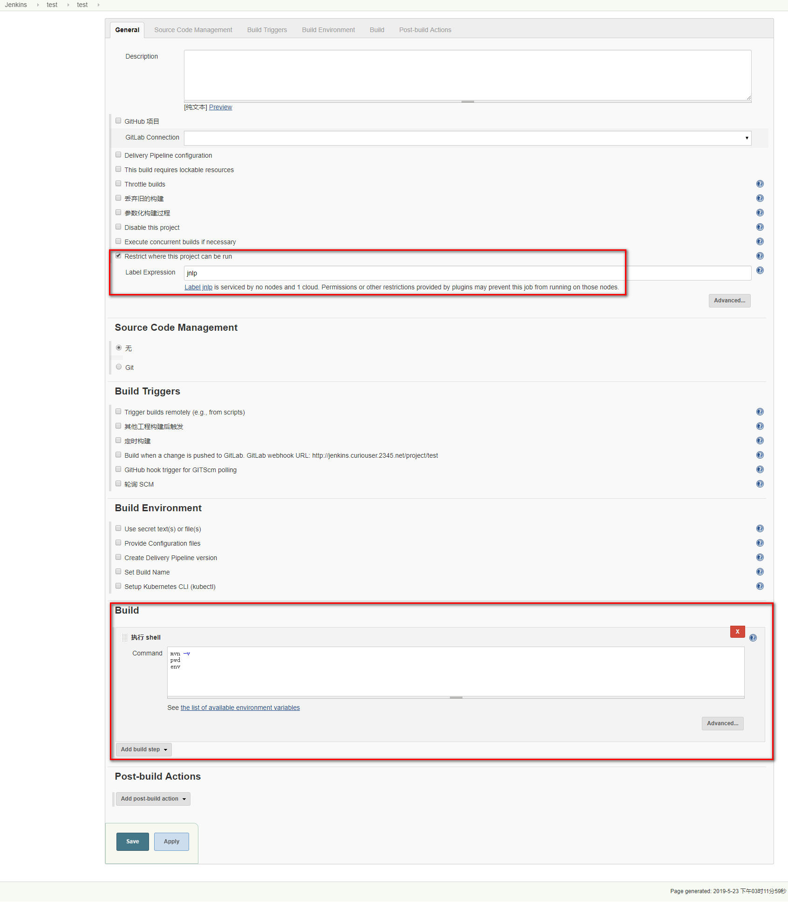
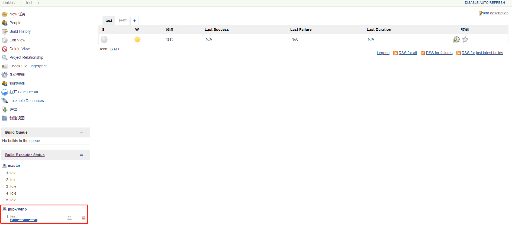
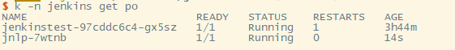
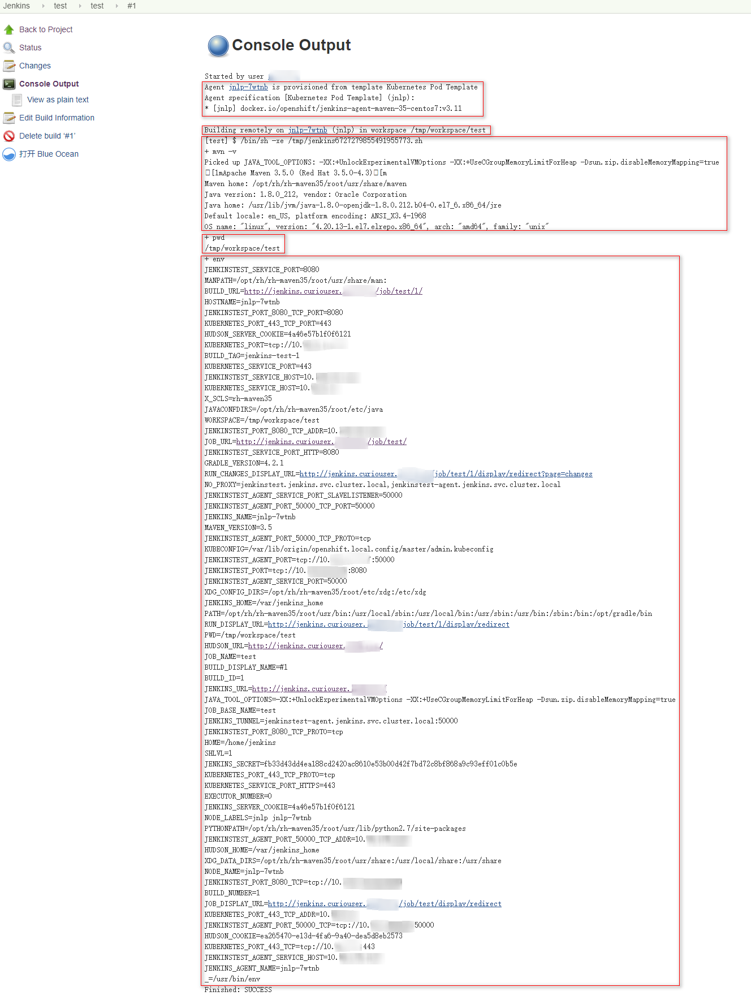

# Jenkins在Kubernetes上使用Kubernetes插件动态创建Slave节点

# 一、Context

 插件GIthub地址：https://github.com/jenkinsci/kubernetes-plugin

 Jenkins 分布式架构是由一个 Master 和多个 Slave Node组成的分布式架构。在 Jenkins Master 上管理你的项目，可以把你的一些构建任务分担到不同的 Slave Node 上运行，Master 的性能就提高了。Master/Slave相当于Server和agent的概念。Master提供web接口让用户来管理job和slave，job可以运行在master本机或者被分配到slave上运行构建。一个master（jenkins服务所在机器）可以关联多个slave用来为不同的job或相同的job的不同配置来服务。
    传统的 Jenkins Slave 一主多从式会存在一些痛点。比如：

* 主 Master 发生单点故障时，整个流程都不可用了；
* 每个 Slave 的配置环境不一样，来完成不同语言的编译打包等操作，但是这些差异化的配置导致
  管理起来非常不方便，维护起来也是比较费劲；
* 资源分配不均衡，有的 Slave 要运行的 job 出现排队等待，而有的 Slave 处于空闲状态；
* 资源有浪费，每台 Slave 可能是实体机或者 VM，当 Slave 处于空闲状态时，也不会完全释放掉资源。



 而使用Kubernetes插件可以在Kubernetes上动态创建slave POD作为Slave节点。Jenkins Master 和 Slave 节点以 Docker Container 形式运行在 Kubernetes 集群的 Node 上，Master 运行在其中一个节点，并且将其配置数据存储到一个 Volume 上去，Slave 运行在各个节点上，并且它不是一直处于运行状态，它会按照需求动态的创建并自动删除。

 这种方式的工作流程大致为：当 Jenkins Master 接收到 Build 请求时，会根据配置的 Label 动态创建一个运行在 Docker Container 中的 Jenkins Slave 并注册到 Master 上，当运行完 Job 后，这个 Slave 会被注销并且 Docker Container 也会自动删除，恢复到最初状态。这种方式带来的好处有很多：
1. 服务高可用，当 Jenkins Master 出现故障时，Kubernetes 会自动创建一个新的 Jenkins Master 容器，并且将 Volume 分配给新创建的容器，保证数据不丢失，从而达到集群服务高可用。
2. 动态伸缩，合理使用资源，每次运行 Job 时，会自动创建一个 Jenkins Slave，Job 完成后，Slave 自动注销并删除容器，资源自动释放，而且 Kubernetes 会根据每个资源的使用情况，动态分配 Slave 到空闲的节点上创建，降低出现因某节点资源利用率高，还排队等待在该节点的情况。
3. 扩展性好，当 Kubernetes 集群的资源严重不足而导致 Job 排队等待时，可以很容易的添加一个 Kubernetes Node 到集群中，从而实现扩展。
   
# 二、Jenkins与Slave的连接方式
Jenkins的Master/Slave相当于Server和agent的概念。Master提供web接口让用户来管理job和slave，job可以运行在master本机或者被分配到slave上运行。一个master可以关联多个slave用来为不同的job或相同的job的不同配置来服务。当job被分配到slave上运行的时候，此时master和slave其实是建立的双向字节流的连接，其中连接方法主要有如下几种：
1. **SSH**：Jenkins内置有ssh客户端实现，可以用来与远程的sshd通信，从而启动slave agent。这是对*unix系统的slave最方便的方法，因为*unix系统一般默认安装有sshd。在创建ssh连接的slave的时候，你需要提供slave的host名字，用户名和ssh证书。创建public/private keys，然后将public key拷贝到slave的~/.ssh/authorized_keys中，将private key 保存到master上某ppk文件中。jenkins将会自动地完成其他的配置工作，例如copy slave agent的binary，启动和停止slave。

2. **Java web start**（JNLP：Java Network Lancher Protocol）：jnlp连接方式有个好处就是不用master和slave之间能够ssh连接，只需要能够ping即可。并且如果slave的机器是windows的话，也是可以的这个其实是非常实用的

3. **WMI+DCOM**：对于Windows的Slave，Jenkins可以使用Windows2000及以后内置的远程管理功能（WMI+DCOM），你只需要提供对slave有管理员访问权限的用户名和密码，jenkins将远程地创建windows service然后远程地启动和停止他们。对于windows的系统，这是最方便的方法，但是此方法不允许运行有显示交互的GUI程序。
在Kubernetes上的Jenkins通过Kubernetes插件动态创建的Slave POD节点是通过JNLP的方式与Jenkins Master进行通信的！

# 三、Jenkins Kubernetes插件的安装配置

1. 安装
   
    
2. 配置

    

# 四、定制Slave镜像

Slave镜像中安装的软件信息

| 工具 | 版本 | 说明 |
| ----|----| -----|-----|
| Oracel JDK | 1.8.0_171 | Maven编译打包时使用 |
| Apache Maven | 3.6.1 | 在Slave容器中使用MAVEN编译打包源代码 |
| helm | v2.13.1 | helm客户端 |
| git | 1.8.3.1 | git命令 |
| docker client | 1.13.1 | Dockers客户端，用于在Slave容器中构建应用镜像 |
| sonar-scanner | 3.3.0.1492 | 用于扫描源代码 |


```bash
FROM centos:7.4.1708 

ENV TZ=Asia/Shanghai \
    LANG=en_US.UTF-8 \
    JDK_VERSION=Oracle_1.8.0_171 \
    MAVEN_VERSION=Apache_3.6.1 \
    HOME=/home/jenkins \
    MAVEN_HOME=/opt/apache-maven-3.6.1 \
    JAVA_HOME=/opt/jdk1.8.0_171 \
    SONARSCANNER_HOME=/opt/sonar-scanner-3.3.0.1492-linux
   
COPY jdk1.8.0_171 /opt/jdk1.8.0_171
COPY apache-maven-3.6.1 /opt/apache-maven-3.6.1
COPY helm /usr/bin/helm
COPY sonar-scanner-3.3.0.1492-linux  /opt/sonar-scanner-3.3.0.1492-linux
RUN curl https://download.docker.com/linux/centos/docker-ce.repo -o /etc/yum.repos.d/docker-ce.repo \
  && yum makecache \
  && yum install -y git docker-ce-cli make \
  && yum clean all \
  && groupadd -g 1000 jenkins \
  && useradd -c "Jenkins user" -d /home/jenkins -u 1000 -g 0 -m jenkins \
  && mkdir /home/jenkins/.m2 \
  && chown -R 1000.0 /home/jenkins \
  && ln -s /opt/jdk1.8.0_171/bin/java /usr/bin/java \
  && ln -s /opt/apache-maven-3.6.1/bin/mvn /usr/bin/mvn \
  && ln -s /opt/sonar-scanner-3.3.0.1492-linux/bin/sonar-scanner /usr/bin/sonar-scanner

USER jenkins

WORKDIR /home/jenkins
COPY dumb-init /usr/bin/dumb-init
ADD run-jnlp-client /usr/bin/
ENTRYPOINT ["/usr/bin/dumb-init", "--", "/usr/bin/run-jnlp-client"]
```


# 五、Pipeline或者Job中使用验证

1. Job

    创建一个自由风格的Job

    

    点击构建后，会自动创建一个Slave POD，并通过JNLP协议与Jenkins Master的Agent端口5000进行通通信
    
    
    
    

2. Declarative Pipeline
    ```bash
    pipeline {
        agent {
            label 'maven'
        }

        stages {
            stage ("代码编译") {
                steps {
                    configFileProvider([configFile(fileId: 'nexus-maven-settings', targetLocation: 'settings.xml')]){
                        sh 'mvn -s settings.xml compile'
                    }
                }
            }
            stage("代码扫描"){
                steps{
                    sh "sonar-scanner \
                            -Dsonar.projectName=demo-springboot2 \
                            -Dsonar.projectKey=demo-springboot2 \
                            -Dsonar.sources=src \
                            -Dsonar.host.url=http://sonarqube.apps.okd311.curiouser.com \
                            -Dsonar.login=****** \
                            -Dsonar.java.binaries=. \
                            -Dsonar.sourceEncoding=UTF-8 \
                            -Dsonar.java.source=8 \
                            -Dsonar.gitlab.project_id=1 \
                            -Dsonar.issuesReport.html.enable=true \
                            -Dsonar.gitlab.commit_sha=$GIT_COMMIT \
                            -Dsonar.gitlab.ref_name=$GIT_BRANCH \
                            -Dsonar.gitlab.user_token=***** \
                            -Dsonar.gitlab.url=http://gitlab.apps.okd311.curiouser.com/ \
                            -Dsonar.gitlab.ignore_certificate=true \
                            -Dsonar.gitlab.comment_no_issue=true \
                            -Dsonar.gitlab.max_global_issues=1000 \
                            -Dsonar.gitlab.unique_issue_per_inline=true"
                }
            }
            stage ("代码打包") {
                steps {
                    sh "mvn -s settings.xml package"
                }
            }
            stage("上传制品"){
                steps{
                    script{
                        def pomfile = readMavenPom file: 'pom.xml'
                        sh "curl -sL -w 'Upload the jar to the repository status code: %{http_code}\n' -u devops:**** " +
                                "--upload-file target/${pomfile.artifactId}-${pomfile.version}.${pomfile.packaging} " +
                                "http://nexus.apps.okd311.curiouser.com/repository/jenkins-product-repo/${pomfile.artifactId}-${pomfile.version}-${env.GIT_COMMIT}.${pomfile.packaging}"
                    }
                }
            }
            stage("构建应用镜像"){
                steps{
                    sh 'docker login -p ********** -u unused docker-registry-default.apps.okd311.curiouser.com'
                    sh 'make'
                }
            }
        }
        post {
            always {
                emailext attachLog: true, body: '''
                    构建任务的完整日志详见见附件,Jenkins查看链接: $BUILD_URL''', subject: '$PROJECT_NAME的第$BUILD_NUMBER次构建$BUILD_STATUS !', to: '*******@163.com'
            }
        }
    }
    ```

# 参考博客：
1. https://github.com/easzlab/kubeasz/blob/master/docs/guide/jenkins.md
2. https://www.qikqiak.com/k8s-book/docs/36.Jenkins%20Slave.html
3. https://jenkins.io/blog/2018/09/14/kubernetes-and-secret-agents/
4. https://www.jianshu.com/p/1440b5b4b980
5. https://www.cnblogs.com/guguli/p/7827435.html
6. https://blog.csdn.net/felix_yujing/article/details/78725142
7. https://jicki.me/kubernetes/2018/02/08/kubernetes-jenkins/
8. https://testerhome.com/topics/17251