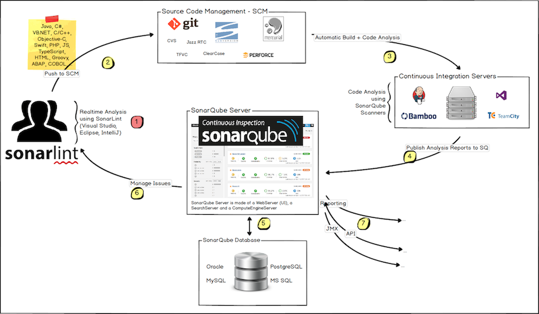

# 一、静态代码分析

**Why**：在软件开发过程中，开发团队往往要花费大量的时间和精力发现并修改代码缺陷。而

- 发现BUG越晚，修复的成本越大
- 缺陷引入的大部分是在编码阶段，但发现更多的是在单元测试、集成测试、功能测试阶段
- 30% 至 70% 的代码逻辑设计和编码缺陷是可以通过静态代码分析来发现和修复的

**How**：在编码阶段，可以通过以下手段发现源代码问题，从源头及时规避，保证代码质量

- 静态代码扫描工具
- Code Review

**What**：`Code Review`往往要求大量的时间消耗和相关知识的积累，因此对于软件开发团队来说，使用静态代码分析工具自动化执行代码检查和分析，能够极大地提高软件可靠性并节省软件开发和测试成本。

- 帮助程序开发人员自动执行静态代码分析，快速定位代码隐藏错误和缺陷
- 助代码设计人员更专注于分析和解决代码设计缺陷
- 显著减少在代码逐行检查上花费的时间，提高软件可靠性并节省软件开发和测试成本

常见的一些静态分析工具

- **Checkstyle**：SourceForge 的开源项目，通过检查对代码编码格式，命名约定，Javadoc，类设计等方面进行代码规范和风格的检查，从而有效约束开发人员更好地遵循代码编写规范
- **FindBugs**：由马里兰大学提供的一款开源 Java 静态代码分析工具。FindBugs 通过检查类文件或 JAR 文件，将字节码与一组缺陷模式进行对比从而发现代码缺陷，完成静态代码分析
- **PMD**：由 DARPA 在 SourceForge 上发布的开源 Java 代码静态分析工具。PMD 通过其内置的编码规则对 Java 代码进行静态检查，主要包括对潜在的 bug，未使用的代码，重复的代码，循环体创建新对象等问题的检验


# 二、Sonar简介

- Sonar是一个用于代码质量管理的开源平台，可以从 [七个维度](#1、Sonar检查代码质量的七个维度)检测代码质量

- Sonar可以通过PMD、CheckStyle、Findbugs等代码规则检测工具来检测你的代码，帮助你发现代码的漏洞，Bug，异味等信息。

- Sonar最大的特点就是插件化，可以根据不同的场景需求进行插件化安装，可以同时可以检测Python、C++等多种语言。

- Sonar客户端可以采用`IDE插件`、`Sonar-Scanner插件`、`Ant插件`和`Maven插件`等多种方式，并通过各种不同的分析机制对项目源代码进行分析和扫描，并把分析扫描后的结果上传到sonar的数据库，通过sonar web界面对分析结果进行管理

**Sonar的架构体系**


- `Project`：是需要被分析的源码
- `SonarQube Scanner`：用于执行代码分析的工具，SonarQube Scanner分析完毕之后，会将结果上报到指定的SonarQube Server。
- `SonarQube Server`：显示分析结果的Web Server，在SonarQube Scanner第一次将一个工程的分析结果上报给SonarQube Server后，Server上会自动创建一个工程显示分析的结果，可以在Server上设置代码质量管理相关的各种配置，如设置代码检查规则（Rule）和质量门限（Quality Gate）等。SonarQube Server包含三个子进程（web服务（界面管理）、搜索服务、计算引擎服务（写入数据库））
- `SonarQube Database`：保存SonarQube服务端的权限配置，插件配置，项目快照，项目视图等


# 三、自动化扫描分析源代码的流程

## 官方推荐的自动化扫描流程



## 自动化静态代码扫描流程


**本地开发**：JetBrains Intellij IDEA 、Eclipse安装阿里巴巴的代码检查规范插件，可在编写代码时提示规范信息；安装使用sonarlint插件在本地运行代码扫描

**Gitlab**：Gitlab代码仓库可设置事件监听器，例如PUSH事件、Merge Request事件等。发送Web-hook到外部系统

**Jenkins**：Jenkins中可安装Gitlab插件，用于设置特定的Web-hook后端监听器来触发当前任务。

**Jenkins Pipeline**：在Jenkins Pipeline中获取Web-hook信息来拉取代码，然后编译、执行Sonar Scanner扫描源代码文件或二进制文件，最后将扫描的结果发送SnarQube进行存储、展示、管理等操作

**SonarQube**：

# 四、SonarQube服务端配置

## 1. 配置代码规则插件

## 2. 配置全局参数 

## 3. 管理扫描结果

## 4. 质量门禁


# 五、Sonar体系中的配置参数生效优先级

1. **UI界面中的全局参数配置**
2. **项目UI界面中的参数配置**
3. **项目分析客户端全局配置文件中的参数**
   - 例如sonar scanner的全局配置文件/opt/sonarscanner/conf/sonar.properties中的参数
   - 例如sonar scanner Maven插件在settings.xml中配置的参数
4. **项目分析客户端命令行运行时配置的参数，例如sonar-scanner二进制命令行运行时以“-D”开头的配置参数**

# 六、扫描器

当SonarQube服务端搭建配置好了，Sonar提供了各种插件形式的Sonar Scanner扫描器供你选择来扫描你的源代码。

- **SonarScanner**：二进制客户端
- **SonarScanner for Maven**：Maven插件
- **SonarScanner for Jenkins**：Jenkins插件
- **SonarScanner for Gradle**：Gradle插件
- **SonarScanner for Ant**：Ant插件

## SonarScanner扫描参数

[官方文档说明](https://docs.sonarqube.org/latest/analysis/analysis-parameters/)

| 参数                            | 描述                                                         | 默认值                                                       | 是否必要 |
| ------------------------------- | ------------------------------------------------------------ | ------------------------------------------------------------ | -------- |
| sonar.host.url                  | SonarQube服务端地址                                          | http://localhost:9000                                        | 是       |
| sonar.projectKey                | 项目的唯一标识。以`字母`,`-`,`_`,`:`,至少有一个非数字        | 对于Maven插件的话,默认值是 `<groupId>:<artifactId>`<br/>其他形式插件不提供默认值 | 是       |
| sonar.projectName               | 在SonarQube Web UI上面显示的项目名                           | 对于Maven插件形式,默认值是`<name>`<br/>其他形式插件不提供默认值 | 否       |
| sonar.projectVersion            | 项目的扫描版本                                               | 对于Maven插件形式,默认值是`<version>`<br/>其他形式插件不提供默认值 | 否       |
| sonar.login                     | 发送扫描结果到SonarQube时的认证方式之一。值类型可为`用户生成的认证Token`，`用户名` |                                                              | 是       |
| sonar.password                  | 当`sonar.login`值类型为认证Token时，则不填                   |                                                              | 是       |
| sonar.ws.timeout                | 等待服务端响应的最大秒数                                     | 60                                                           | 否       |
| sonar.projectDescription        | 项目描述。用于在项目Web UI中显示项目的描述                   | 对于Maven插件形式,默认值是`<description>`                    | 否       |
| sonar.links.homepage            | 项目地址。用于在项目Web UI中显示项目访问链接                 | 对于Maven插件形式,默认值是`<url>`                            | 否       |
| sonar.links.issue               | 项目代码Issue管理地址。用于在项目Web UI中显示Issue管理链接   | 对于Maven插件形式,默认值是`<issueManagement><url>`           | 否       |
| sonar.links.scm                 | 项目源代码仓库地址。用于在项目Web UI中显示源代码仓库链接     | `<scm><url>` for Maven projects                              | 否       |
| sonar.sources                   | 以逗号分割的main源代码文件夹路径                             |                                                              | 否       |
| sonar.tests                     | 以逗号分割的测试源代码文件夹路径                             |                                                              | 否       |
| sonar.sourceEncoding            | 源代码文件的编码格式，例如：`UTF-8`, `MacRoman`, `Shift_JIS` | 系统的编码格式                                               | 否       |
| sonar.externalIssuesReportPaths |                                                              |                                                              | 否       |
| sonar.projectDate               | 格式： `yyyy-MM-dd`, 例如: 2010-12-01                        | Current date                                                 | 否       |
| sonar.projectBaseDir            | 针对多模块项目时，指定要扫描源代码的目录路径                 |                                                              | 否       |
| sonar.working.directory         | 指定Sonarscanner的工作空间。必须是不存在的，相对路径。针对MSBuild的插件，此参数不兼容 | ~/.scannerwork                                               | 否       |
| sonar.scm.provider              |                                                              |                                                              | 否       |
| sonar.scm.forceReloadAll        |                                                              |                                                              | 否       |
| sonar.scm.exclusions.disabled   |                                                              |                                                              | 否       |
| sonar.scm.revision              |                                                              |                                                              | 否       |
| sonar.buildString               |                                                              | 100                                                          | 否       |
| sonar.analysis.[yourKey]        |                                                              | 10                                                           | 否       |
| sonar.log.level                 | 控制Sonarscanner输出日志的级别                               | INFO                                                         | 否       |
| sonar.verbose                   | 输出更多Sonarscanner客户端和Sonarqube服务的扫描信息          | false                                                        | 否       |
| sonar.showProfiling             |                                                              |                                                              | 否       |
| sonar.scanner.dumpToFile        | 输出扫描期间所有的配置参数到文件中                           |                                                              | 否       |
| sonar.scanner.metadataFilePath  | 指定report-task.txt文件的生成路径                            | 等于sonar.working.directory的值                              | 否       |

## 1. SonarScanner

下载地址：https://docs.sonarqube.org/latest/analysis/scan/sonarscanner/

### 配置文件

- 全局配置文件路径：`$安装目录/conf/sonar-scanner.properties`
- 项目配置文件路径：`$项目根目录/sonar-project.properties`

### CLI命令参数

```
$ sonar-scanner
usage: sonar-scanner [options]

参数:
 -D,--define <arg>     Define property
 -h,--help             Display help information
 -v,--version          Display version information
 -X,--debug            Produce execution debug output
 
If you need more debug information you can add one of the following to your command line: -X, --verbose, or -Dsonar.verbose=true.
```

## 2. SonarScanner for Maven

官方文档：https://docs.sonarqube.org/latest/analysis/scan/sonarscanner-for-maven/

**注意：**

- 从maven-sonar-plugin 3.4.0.905开始，不再支持SonarQube <5.6。如果使用5.6之前的SonarQube实例，则应该使用maven-sonar-plugin 3.3.0.603。
- 从maven-sonar-plugin 3.1开始，不再支持Maven <3.0。如果在3.0之前使用Maven，你应该使用maven-sonar-plugin 3.0.2。

**全局参数**

详见[SonarQube服务端配置](#1. 配置全局参数)

**配置Maven的setting.xml**

```xml

<settings>
  <!-- ....上文省略.... -->
  <pluginGroups>
      <pluginGroup>org.sonarsource.scanner.maven</pluginGroup>
  </pluginGroups>
  <profiles>
      <profile>
          <id>sonar</id>
          <activation>
              <activeByDefault>true</activeByDefault>
          </activation>
          <properties>
              <!-- 配置SonarQube服务端地址 -->
              <sonar.host.url>http://myserver:9000</sonar.host.url>
              <!-- 配置SonarQube服务端认证Token -->
              <sonar.login>f6eedc3d8bfa850a15f2ffcd</sonar.login>
          </properties>
      </profile>
   </profiles>
   <!-- ....下文省略.... -->
</settings>
```
**在项目pom.xml中配置项目扫描参数**

```xml
<project>
....上文省略....

  <groupId>com.curiosuer</groupId>
  <artifactId>springboot2</artifactId>
  <version>0.0.1</version>

    <!-- 用于在SonarQube服务端Web UI界面显示的一些链接 -->
    <description>用于演示Spring Boot2的一些功能</description>
    <name>Curiouser-Demo-SpringBoot2-${gitlabBranch}</name>
    <url>http://springboot2-demo.apps.okd311.curiouser.com/swagger-ui.html</url>
    <scm>
        <url>${gitlabSourceRepoHomepage}/commit/${gitlabMergeRequestLastCommit}</url>
    </scm>
    <issueManagement>
        <url>${gitlabSourceRepoHomepage}/issues</url>
    </issueManagement>
    <ciManagement>
        <url>${BUILD_URL}</url>
    </ciManagement>

    <properties>
        <project.build.sourceEncoding>UTF-8</project.build.sourceEncoding>
        <project.reporting.outputEncoding>UTF-8</project.reporting.outputEncoding>
        <java.version>1.8</java.version>
    <!-- SonarScanner Maven插件相关参数 -->
        <!-- 以Jenkins上拉取代码时的CommitID为Sonarqube UI显示版本号的标识.该参数覆盖默认值,不然Sonarqube UI上的版本号显示的是POM文件中<version></version>指定的值 -->
        <sonar.projectVersion>${gitlabMergeRequestLastCommit}</sonar.projectVersion>
        <!-- 该参数覆盖默认值src/main/java,不然src/main/resources路径下的文件无法扫描到 -->
        <sonar.sources>src/main/</sonar.sources>
        <!-- Sonarqube服务端Gitlab插件的配置.使用该插件的目的是为了将扫描结果的链接以评论的形式同步到以Jenkins上拉取代码时的Commit下 -->
        <sonar.gitlab.project_id>1</sonar.gitlab.project_id>
        <sonar.gitlab.commit_sha>${gitlabMergeRequestLastCommit}</sonar.gitlab.commit_sha>
        <sonar.gitlab.ref_name>${gitlabMergeRequestLastCommit}</sonar.gitlab.ref_name>
        <!-- 设置单元测试和生成Jacoco覆盖率报告的配置.目的是让Sonarqube显示单元测试和覆盖率等参数 -->
        <sonar.dynamicAnalysis>reuseReports</sonar.dynamicAnalysis>
        <sonar.java.coveragePlugin>jacoco</sonar.java.coveragePlugin>
    </properties>
....下文省略....
</project>
```

注意：pom.xml中有些参数的值是可以在Jenkins CI流水线中通过环境变量获取的。

**执行扫描命令**

```bash
mvn test sonar:sonar -Dspring.profiles.active=local
```

**默认参数**

- `sonar.projectKey` ==> POM中的`<groupId>:<artifactId>`
- `sonar.projectName`  ==> POM中的``<name>``
- `sonar.projectVersion` ==> POM中的`<version>`
- `sonar.projectDescription` ==> POM中的`<description>`
- `sonar.links.homepage` ==> POM中的`<url>`
- `sonar.links.ci` ==> POM中的`<ciManagement><url>`
- `sonar.links.issue` ==> POM中的`<issueManagement><url>`
- `sonar.links.scm` ==> POM中的`<scm><url>`

# 七、扫描结果解析


# 附录

## 1、Sonar检查代码质量的七个维度

- 复杂度分布（complexity）：代码复杂度过高将难以理解、难以维护
- 重复代码（duplications）：程序中包含大量复制粘度的代码是质量低下的表现
- 单元测试（unit tests）：统计并展示单元测试覆盖率
- 编码规范（coding rules）：通过Findbugs、PMD、CheckStyle等规范代码编写
- 注释（commments）：少了可读性差，多了看起来费劲
- 潜在的Bug（potential bugs）：通过Findbugs、PMD、CheckStyle等检测潜在bug
- 结构与设计（architecture & design）：依赖i、耦合等
  

## 2、常见检查分析工具的内置规范

**Checkstyle**：分析源代码文件

- Javadoc 注释：检查类及方法的 Javadoc 注释
- 命名约定：检查命名是否符合命名规范
- 标题：检查文件是否以某些行开头
- Import 语句：检查 Import 语句是否符合定义规范
- 代码块大小，即检查类、方法等代码块的行数
- 空白：检查空白符，如 tab，回车符等
- 修饰符：修饰符号的检查，如修饰符的定义顺序
- 块：检查是否有空块或无效块
- 代码问题：检查重复代码，条件判断，魔数等问题
- 类设计：检查类的定义是否符合规范，如构造函数的定义等问题

**FindBugs**：分析字节码文件

- Bad practice 坏的实践：常见代码错误，用于静态代码检查时进行缺陷模式匹配
- Correctness 可能导致错误的代码，如空指针引用等
- 国际化相关问题：如错误的字符串转换
- 可能受到的恶意攻击，如访问权限修饰符的定义等
- 多线程的正确性：如多线程编程时常见的同步，线程调度问题。
- 运行时性能问题：如由变量定义，方法调用导致的代码低效问题。

**PMD**：：分析源代码文件

- 可能的 Bugs：检查潜在代码错误，如空 try/catch/finally/switch 语句
- 未使用代码（Dead code）：检查未使用的变量，参数，方法
- 复杂的表达式：检查不必要的 if 语句，可被 while 替代的 for 循环
- 重复的代码：检查重复的代码
- 循环体创建新对象：检查在循环体内实例化新对象
- 资源关闭：检查 Connect，Result，Statement 等资源使用之后是否被关闭掉

**Jtest**

- 可能的错误：如内存破坏、内存泄露、指针错误、库错误、逻辑错误和算法错误等
- 未使用代码：检查未使用的变量，参数，方法
- 初始化错误：内存分配错误、变量初始化错误、变量定义冲突
- 命名约定：检查命名是否符合命名规范
- Javadoc 注释：检查类及方法的 Javadoc 注释
- 线程和同步：检验多线程编程时常见的同步，线程调度问题
- 国际化问题：
- 垃圾回收：检查变量及 JDBC 资源是否存在内存泄露隐患
