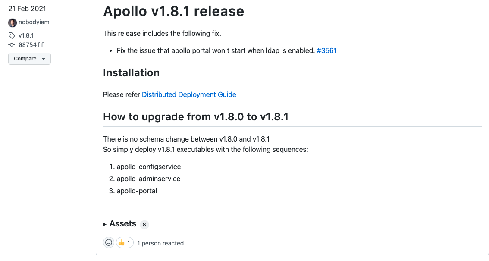
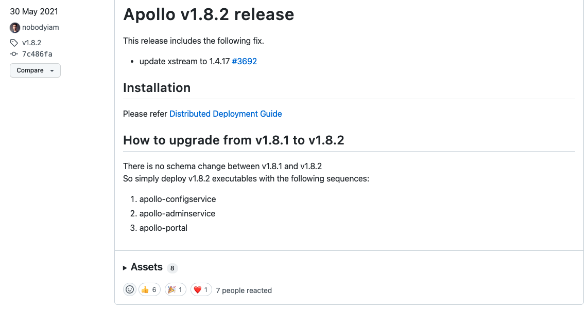

# Apollo简介、部署与配置

# 一、简介

GitHub：https://github.com/apolloconfig/apollo

文档：https://www.apolloconfig.com/#/zh/README

# 二、源代码构建


# 三、部署

## 1、二进制

## 2、Docker

### Allinone(docker)

- 数据库初始化文件[初始化SQL文件](https://github.com/apolloconfig/apollo/tree/master/scripts/docker-quick-start/sql),请先导入数据库中。
- 使用其他MySQL服务

```bash
docker run --restart=always -d --name apollo \
   --link mysql5.7:apollo-db \
   -p 8070:8070 \
   -p 8080:8080 \
   -p 8090:8090 \
   -e JAVA_OPTS="-Xms100m -Xmx1000m -Xmn100m -Xss256k -XX:MetaspaceSize=10m -XX:MaxMetaspaceSize=250m" \
   -e APOLLO_CONFIG_DB_USERNAME=apollo \
   -e APOLLO_CONFIG_DB_PASSWORD=apollo \
   -e APOLLO_PORTAL_DB_USERNAME=apollo \
   -e APOLLO_PORTAL_DB_PASSWORD=apollo \
   nobodyiam/apollo-quick-start
```

### Allinone(docker-compose)

数据库初始化文件[初始化SQL文件](https://github.com/apolloconfig/apollo/tree/master/scripts/docker-quick-start/sql)请放置在[docker-compose.yml](https://github.com/apolloconfig/apollo/blob/master/scripts/docker-quick-start/docker-compose.yml)同级目录下

```yaml
version: '2'
services:
  apollo-quick-start:
    image: nobodyiam/apollo-quick-start
    container_name: apollo-quick-start
    depends_on:
      - apollo-db
    ports:
      - "8080:8080"
      - "8090:8090"
      - "8070:8070"
    links:
      - apollo-db
  apollo-db:
    image: mysql:5.7
    container_name: apollo-db
    environment:
      TZ: Asia/Shanghai
      MYSQL_ALLOW_EMPTY_PASSWORD: 'yes'
    depends_on:
      - apollo-dbdata
    ports:
      - "13306:3306"
    volumes:
      - ./sql:/docker-entrypoint-initdb.d
    volumes_from:
      - apollo-dbdata
```

> 注1：数据库用户名是root，密码留空。
>
> 注2：Apollo UI访问地址：http://127.0.0.1:8070/ 。用户名apollo，密码admin

## 3、K8S

### Helm

```bash
helm repo add apollo https://charts.apolloconfig.com
helm repo update

helm install -n test apollo-service \
    --set configdb.host=1.2.3.4 \
    --set configdb.userName=apollo \
    --set configdb.password=apollo \
    --set configdb.service.enabled=true \
    --set configdb.connectionStringProperties="characterEncoding=utf8&useSSL=false" \
    --set configService.replicaCount=1 \
    --set adminService.replicaCount=1 \
    apollo/apollo-service --debug --version 0.5.0

helm install -n tool apollo-portal \
    --set portaldb.host=1.2.3.4 \
    --set portaldb.userName=apollo \
    --set portaldb.password=apollo \
    --set portaldb.service.enabled=true \
    --set config.envs="dev\,stg\,pro" \
    --set config.metaServers.test=http://apollo-service-test-apollo-configservice.test.svc:8080 \
    --set config.metaServers.stg=http://apollo-service-stg-apollo-configservice.stg.svc:8080 \
    --set replicaCount=1 \
    apollo/apollo-portal --debug --version 0.5.0
```

# 四、配置

## 1、开启Webhook通知

从 1.8.0 版本开始，apollo 增加了 webhook 支持，从而可以在配置发布时触发 webhook 并告知配置发布的信息。

### ① Apollo配置

配置项统一存储在`ApolloPortalDB.ServerConfig`表中，也可以通过`管理员工具 - 系统参数`页面进行配置，修改完一分钟实时生效。

- **webhook.supported.envs**：开启 webhook 的环境列表，多个环境以英文逗号分隔，例如`DEV,FAT,UAT,PRO`
- **config.release.webhook.service.url：**webhook 通知的 url 地址，需要接收 HTTP POST 请求。如有多个地址，以英文逗号分隔，例如：`http://www.xxx.com/webhook1,http://www.xxx.com/webhook2`

### ② webhook的POST请求体样本

`http://www.xxx.com/webhook1?env=DEV`

```json
{
    "id": 11,
    "appId": "test",
    "clusterName": "default",
    "namespaceName": "application",
    "branchName": "default",
    "operator": "apollo",
    "releaseId": 11,
    "releaseTitle": "20220610174331-release",
    "releaseComment": "",
    "releaseTime": "2022-06-10T17:43:33.000+0800",
    "releaseTimeFormatted": "now",
    "configuration": [
        {
            "firstEntity": "dingding_token",
            "secondEntity": "****"
        },
        {
            "firstEntity": "dingding_secret",
            "secondEntity": "**"
        },
        {
            "firstEntity": "test",
            "secondEntity": "66"
        }
    ],
    "isReleaseAbandoned": false,
    "previousReleaseId": 10,
    "operation": 0,
    "operationContext": {
        "isEmergencyPublish": false
    }
}
```

### ③使用Go gin写一个Webhook请求后端，将通知转发到钉钉机器人群中

```go


```

文档：https://www.apolloconfig.com/#/zh/development/portal-how-to-enable-webhook-notification

# 五、Apollo升级

## 0、简介

### 升级原因

- 版本更新带来的新增功能和bug修复
- 修复已知版本的安全漏洞问题

### 已知升级修复问题

- 1.8.0 升级至 1.8.2，可修复XStream < 1.4.15造成的安全漏洞问题。1.8.2版本升级XStream到了1.4.17版本
  - XStream < 1.4.15已知漏洞：任意文件删除漏洞、组件反序列化漏洞

## 1、升级路径

升级说明在release页面：https://github.com/apolloconfig/apollo/releases

`1.8.0 –> 1.8.1 –> 1.8.2` 没有数据库层面的变更





## 2、升级步骤

- 先升级apollo-configservice
- 再升级apollo-adminservice
- 再升级apollo-portal

