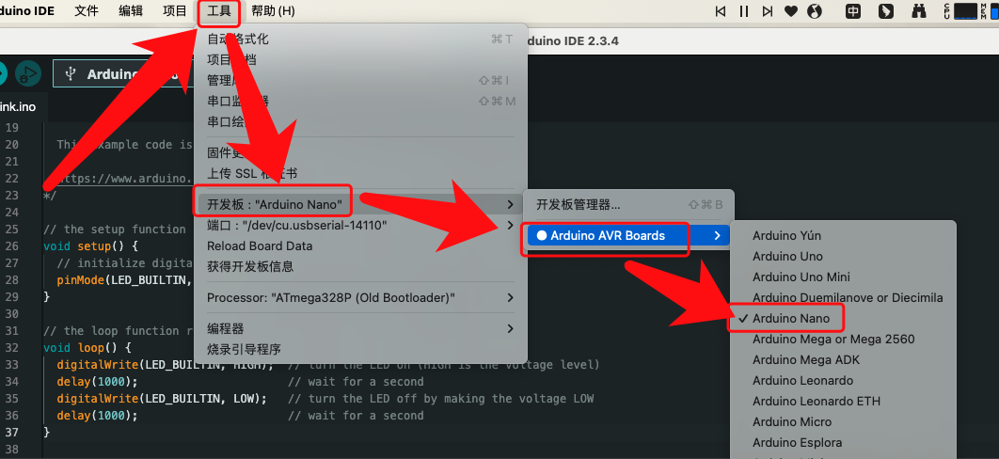
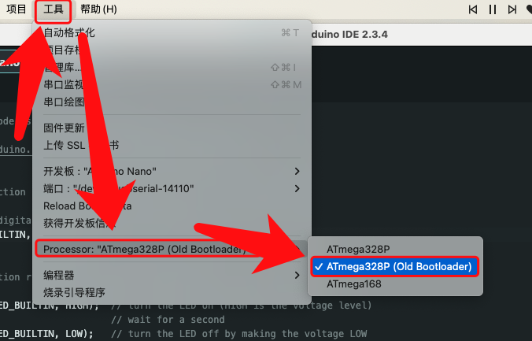
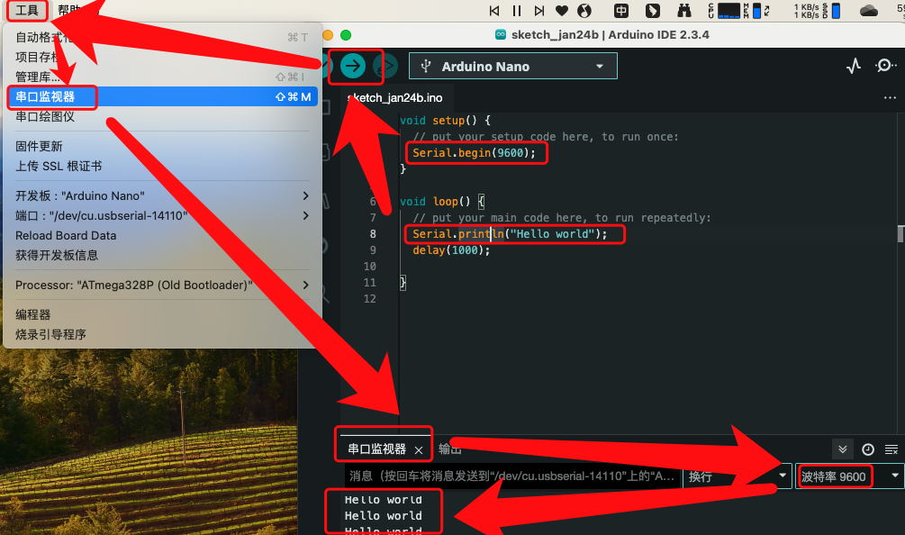

# Arduino IDE及编程语法

# 一、简介

Arduino语法是建立在`C/C++基础上`的，其实也就是基础的C语法，Arduino语法只不过把相关的一些参数设置都函数化。

Arduino板通过**`串行通信`**的方式与Arduino IDE通信，实现串口数据的发送接收。从Arduino IDE向Arduino板烧录程序（Arduino IDE中称为`上传`），即将编译好的二进制程序代码写入ATmega单片机的程序存储器，这一过程也是通过串行通信实现的。因此，在使用Arduino之前必须确保串行通信的正常工作。由于当前多数电脑均不再配置对外的串行通信接口，所以采用**`USB转串口（TTL电平）`的**方式来实现。

 Arduino所采用的USB转串口的方式主要有两种：一是采用专用芯片（Arduino官方采用的主要是**FT232RL**），一是采用内置转换功能的单片机（如**ATmage 16U2**等），其中NANO采用的是前者，UNO采用的是后者。不论采用哪一种方式，必须正确安装相应芯片的驱动程序，才能确保其与Arduino IDE正常通信。

官网地址：https://www.arduino.cc/en/Guide

文档地址：https://docs.arduino.cc/

# 二、设置

## 0、(可选)安装驱动

**CH34X串口转USB芯片驱动**：https://www.wch.cn/download/CH341SER_EXE.html

## 1、示例程序

Arduino IDE的文件-示例菜单中包含了大量实例程序，这是学习Arduino编程开发的宝贵资源，值得我们充分利用。另外，添加了标准格式的Arduino库之后，也会在这个菜单项里找到库所带的示例程序。

这些示例程序也是我们进行各种测试的便捷工具。在安装完成IDE后，通常我们会打开文件-示例**Basics-Blink**项目来进行编译和上传程序的测试。

- **` Basic / Blink`**，该程序功能是让Arduino`板载的LED灯`（连接Arduino 13号GPIO）进行频率为0.5Hz的闪烁(`亮灭各1S循环往复`)，可以`检测编译、上传(烧录)以及Arduino板的电路运行是否正常。`
- **`Communications / ASCII Table`**，该程序功能是系统上电后通过串口以9600bps波特率输出ASCII码表，可以`验证串口通信功能`。

示例程序文档地址：https://docs.arduino.cc/built-in-examples

## 2、设置

正确上传（烧录）程序需要进行的三项设置：`工具菜单`，分别设定`开发板`、`处理器`和`端口`三个项目。

- **开发板设置：**按照所使用的Arduino板的型号名称进行设置

  常用的Arduino UNO选择`Arduino/Genuino UNO`，Arduino NANO选择`Arduino NANO`。

  

- **处理器设置：**选择开发板对应的Atmega单片机型号

  

  需要注意的是

  - 对于Arduino NANO，Arduino官方于2018年1月更新了Bootloader代码，而早期及非官方版本的Arduino NANO有些仍然采用老版本的Bootloader代码，因此必须特别注意选择`ATmega328P (Old Bootloader)`，否则会出现上传代码时长时间停留在`上传……`经一段时间后提示`上传失败`的现象。对于2018年1月后官方版的NANO，选择`ATmega328P`。对任何版本的UNO，由于没有更新Bootloader，因此没有`ATmega328P (Old Bootloader)`这一选项，选择`ATmega328P`即可。
  - 如果使用内置新Bootloader的NANO，但Arduino IDE却是老版本（如1.8.4），则需要升级到新版本，否则也会因为Bootloader不匹配而导致上述故障。
  
- **端口设置**

  注意选择当前Arduino板连接的COM端口号
  

正确设置以上参数后，单击工具栏上的右向箭头图标即可完成“编译+上传”的过程，也可以使用菜单项目-上传。工具栏上的对号图标是仅编译，与菜单项目-验证/编译功能一致。以上是使用Arduino板载USB口上传程序时使用的，若使用其他编程器进行上传，则需首先在工具-编程器菜单中选择对应型号的编程器，在确保编程器与Arduino板正确连接的情况下，使用项目-使用编程器上传来上传程序。

## 3、串口监控

# 三、电路常识

## 1、数字电平

Arduino Uno的引脚0-13用作数字输入/输出引脚。其中，引脚13连接到板载的LED指示灯；引脚3、5、6、9、10、11具有PWM功能

需要注意的是：

●  每个引脚可提供/接收最高40 mA的电流。但推荐的电流是20毫安。

●  所有引脚提供的绝对最大电流为200mA。

数字是一种表示1位电压的方式：0或1。

Arduino上的数字引脚是根据用户需求设计为输入或输出的引脚。数字引脚可以打开或关闭。开启时，它们处于5V的高电平状态，当关闭时，它们处于0V的低电平状态。在Arduino上，

- 当数字引脚配置为`输出`时，它们设置为`0或5V`

- 当数字引脚配置为`输入`时，电压`由外部设备提供`。该电压可以在0-5V之间变化，并`转换成数字表示（0或1）`。为了确定这一点，有2个阈值：
  - **低于0.8v - 视为0**
  - **高于2.0v - 视为1**

将组件连接到数字引脚时，确保逻辑电平匹配。如果电压在阈值之间，则返回值将不确定。

## 2、PWM

通常，脉宽调制（PWM）是一种调制技术，用于将消息编码为脉冲信号。 PWM由两个关键部分组成：频率和占空比。 PWM频率决定了完成单个周期（周期）所需的时间以及信号从高到低的波动速度。占空比决定信号在总时间段内保持高电平的时间。占空比以百分比表示。

在Arduino中，支持PWM的引脚产生约500Hz的恒定频率，而占空比根据用户设置的参数而变化。见下图：

# 四、编程语法

文档地址：https://docs.arduino.cc/language-reference/

## 1、变量及常量

- `HIGH | LOW` 表示数字IO口的电平，HIGH 表示高电平（1），LOW 表示低电平（0）。 
- `INPUT | OUTPUT`  表示数字IO引脚（Digital pins）的方向，INPUT 表示输入（高阻态），OUTPUT 表示（AVR单片机能提供5V电压，40mA输出）。输入还有INPUT_PULLUP
-  `true | false` 逻辑层定义
- `integer constants`整数常量
- `floating point constants`浮点常量

## 2、结构

### 初始函数

- setup() 初始化，只执行一次。

  当Arduino板起动时setup()函数会被调用。用它来初始化变量，引脚模式，开始使用某个库，等等。该函数在Arduino板的每次上电和复位时只运行一次。

- loop() 循环执行体，无限循环

  在创建setup函数，该函数初始化和设置初始值，loop()函数所做事的正如其名，连续循环，允许你的程序改变状态和响应事件。可以用它来实时控制arduino板。

### 控制结构

- if 如果，满足条件执行
- if...else  如果，，，否则
- for   有限循环体，变量，条件，步进
- switch case 多项判断，case 值:    break终止，default:条件之外的部分
- while 满足条件执行循环
- do... while   先执行后判断条件
- break 跳出，用在for和while，switch中
- continue 继续下一循环，不跳出循环体，跳出当前条件
- return 返回，跳出循环，后面的代码是无法执行的。
- goto 定向跳转，用的较少

### 算数运算符

- =（赋值运算符）
- +（加）
- -（减）
- *（乘）
- /（除）
- %（模）取余

### 比较运算符

- ==（等于）
- !=（不等于）
- <（小于）
- \>（大于）
- \<=（小于等于）
- \>=（大于等于）

### 布尔运算符

- &&（与）     条件同时满足

- ||（或）        条件只要满足一个

-  !（非）          取反，布尔型或=号时用

### 指针运算符

* 取消引用运算符

- & 引用运算符

### 位运算符

- & (bitwise and)

- | (bitwise or)

- ^ (bitwise xor)

- ~ (bitwise not)

- << (bitshift left)

- \>> (bitshift right)

### 复合运算符

- ++ (increment)

- -- (decrement)

- += (compound addition)

- -= (compound subtraction)

- *= (compound multiplication)

- /= (compound division)

- &= (compound bitwise and)

- |= (compound bitwise or)

## 3、函数

### 数字I/O

- **digitalWrite(uint8_t pin, uint8_t value) **：写数字引脚, 对应引脚的高低电平. 在写引脚之前, 需要将引脚设置为OUTPUT模式，pin值为`0～13`，value为`HIGH或LOW`
  - 模拟引脚也可以当作数字引脚使用, 编号为14(对应模拟引脚0)到19(对应模拟引脚5).
- **digitalRead(uint8_t pin)**：读数字引脚, 返回引脚的高低电平. 在读引脚之前, 需要将引脚设置为INPUT模式，pin值为`0～13`。比如可以读数字传感器
  - 如果引脚没有链接到任何地方, 那么将随机返回 HIGH 或 LOW.

- **pinMode(uint8_t pin, uint8_t mode)**：配置引脚为输入或输出模式，pin为引脚编号，值为`0～13`， mode表示为`INPUT`、`OUTPUT` 或 `INPUT_PULLUP`。 
  - 模拟引脚也可以当作数字引脚使用, 编号为14(对应模拟引脚0)到19(对应模拟引脚5).

### 数学

- **abs(x)**：计算绝对值

- **constrain(x, a, b))**：约束函数，下限a，上限b，x必须在ab之间才能返回。 

- **map(value, fromLow, fromHigh, toLow, toHigh) **:  约束函数，value必须在fromLow与toLow之间和fromHigh与toHigh之间。  

- **max(x, y)**：求最大值 

- **min(x, y)**：求最小值 

- **pow(base, exponent)**：开方函数，base的exponent次方

- **sq(x)**：平方

- **sqrt(x)**：开根号

### 位与字节操作

- **bit()**：

- **bitClear()**：

- **bitRead()**：

- **bitSet()**：

- **bitWrite()**：

- **highByte()**：

- **lowByte()**：

### 模拟I/O

- **analogRead(pin)**： 模拟IO口读函数，pin表示为`0～5`。比如可以读模拟传感器（10位AD，`0～5V表示为0～1023`）。
- **analogWrite(pin, value)**：  PWM 数字IO口PWM输出函数，Arduino数字IO口 标注了PWM的IO口可使用该函数，pin表示`3, 5, 6, 9, 10, 11`，value表示为`0～255`。  

- **analogWriteResolution()**：
- **analogReadResolution()**：

- **analogReference()**： : 默认5V. `INTERNAL`: 低功耗模式. ATmega168和ATmega8对应1.1V到2.56V. EXTERNAL: 扩展模式. 通过AREF引脚获取参考电压.

### 三角函数

- **cos()**：

- **sin()**：

- **tan()**：

#### 外部中断

- **attachInterrupt()**：

- **detachInterrupt()**：

- **digitalPinToInterrupt()**：

#### 高级 I/O

- **noTone()**：

- **pulseIn()**：

- **pulseInLong()**：

- **shiftIn()**：

- **shiftOut()**：

- **tone()**：

### Characters

- **isAlpha()**：

- **isAlphaNumeric()**：

- **isAscii()**：

- **isControl()**：

- **isDigit()**：

- **isGraph()**：

- **isHexadecimalDigit()**：

- **isLowerCase()**：

- **isPrintable()**：

- **isPunct()**：

- **isSpace()**：

- **isUpperCase()**：

- **isWhitespace()**：

### 中断

- **interrupts()**：

- **noInterrupts()**：

### 时间

- **delay()**：延时函数（单位ms）

- **delayMicroseconds() **：延时函数（单位us）

- **micros()**：

- **millis()**：

### 随机数

- **random()**：

- **randomSeed()**：

#### 通信

- **SPI**：

- **Print**：

- **Serial**：

- **Stream**：

- **Wire**：

### USB

- **Keyboard**：

- **Mouse**：

### Wi-Fi

- **Wi-Fi Overview**：

- **WiFi Network**：

- **IPAddress**：

- **WiFiClient**：

- **WiFiServer**：

- **WiFiUDP**：

# 参考

- https://blog.csdn.net/uaime/article/details/124763499
- https://www.w3cschool.cn/arduino/arduino_overview.html
- https://wiki.dfrobot.com.cn/Arduino%E5%85%A5%E9%97%A8%E6%95%99%E7%A8%8B
