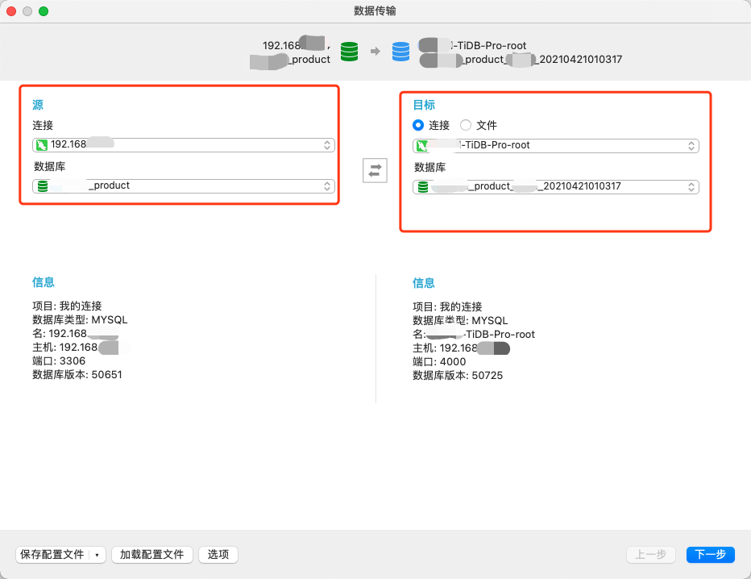
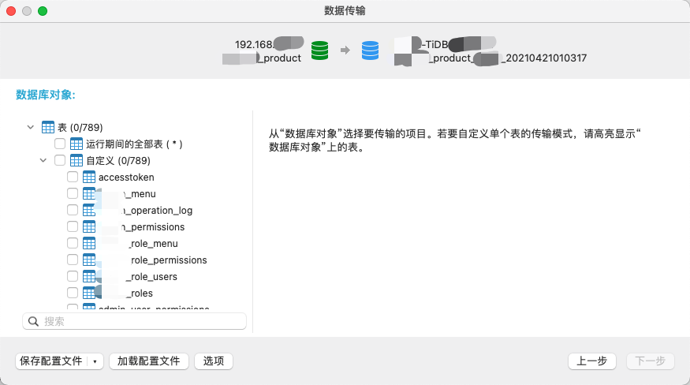
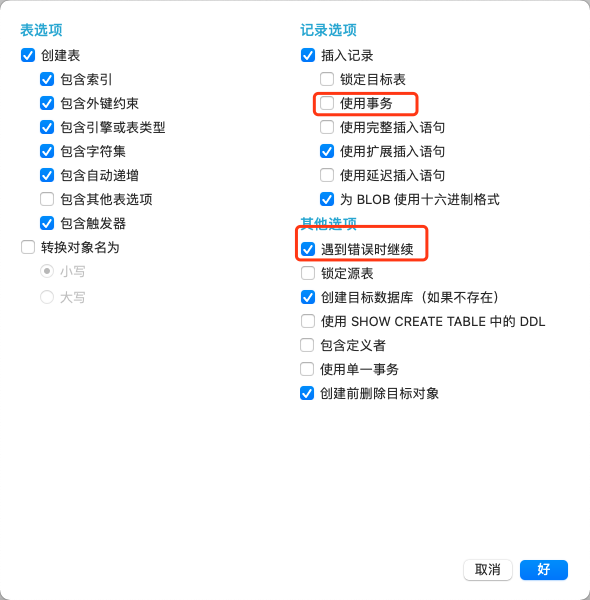

# 大数据的数据迁移

# 一、简介

迁移全量MySQL数据到TIDB。情况如下：

- **源库**：RDS备份文件启动的MySQL实例，一个DB，数据量大约800张表，数据大小500+GB

- **目标库**：TIDB集群


将源库中的数据导入TiDB

# 二、方案

## 1、Navicat的数据传输工具

- 直接使用Navicat的数据传输工具，配置数据源连接和目标源连接。








## 2、TiDB生态圈工具

- **TiDB Dumping导出**：导出源MySQL中的数据为SQL文件
- **修改SQL文件命名**：修改TiDB Dumping导出的SQL文件命名格式
- **TiDB Lighting导入**：将SQL文件导入到TiDB 

### TiDB Dumpling

```bash
version=v4.0.5 && \
curl -# https://download.pingcap.org/tidb-toolkit-$version-linux-amd64.tar.gz | tar -zxC /opt && \
ln -s /opt/tidb-toolkit-$version-linux-amd64 /opt/tidb-toolkit-$version && \
echo "export PATH=/opt/tidb-toolkit-$version/bin:$PATH" >> /etc/profile && \
mkdir -p /data/dumping-export/sql && \
source /etc/profile && \
nohup dumpling \
  -u 用于导出数据的用户 \    				# 用于导出数据的用户要拥有SELECT、RELOAD、LOCK TABLES、REPLICATION CLIENT服务器权限
  -p 用于导出数据的用户密码 \
  -P 3306 \
  -h 192.168.1.4 \
  -B database \										# 指定要导出的Database
  --filetype sql \								# 指定导出文件类型（可为csv/sql）
  --threads 32 \									# 指定备份并发线程数
  -o /data/dumping-export/sql \		# 指定导出文件存储路径
  -F 256MiB \											# 指定导出文件最大大小
  --logfile /data/dumping-export/export-task.log >/data/dumping-export/dumpling-nohupout.log 2>&1 &
```

### 批量修改SQL文件

```bash
# 例如源库DB为Test，想把数据导入到目标库Test-2中
old_database_name=test
new_database_name=Test-2
for i in $(ls /data/dumping-export/sql/*.sql | grep -v schema-create );do 
		mv /data/dumping-export/sql/$i /data/dumping-export/sql/$new_database_name.${i#*.};
done
mv /data/dumping-export/sql/${old_database_name}-schema-create.sql /data/dumping-export/sql/${new_database_name}-schema-create.sql
echo "" > ${new_database_name}-schema-create.sql
```

### TiDB Lighting

```bash
nohup /opt/tidb-toolkit-v4.0.5-linux-amd64/bin/tidb-lightning \
  -config /data/dumping-export/tidb-lightning.toml \
  --log-file /data/dumping-export/import-task.log > /data/dumping-export/lightning-nohupout.log 2>&1 &
  
  
nohup tidb-lightning \
  -L info \
  -log-file /data/dumping-export/import-task.log \
  -backend tidb \
  -status-addr 10080 \
  -d /data/dumping-export/sql \
  -tidb-host 192.168.1.4 \
  -tidb-port 4000 \
  -tidb-user root \
  -tidb-password ***** > /data/dumping-export/lightning-nohupout.log 2>&1 &
```


# 三、结论

大约**`三千万条`**记录的表，**`Navicat数据传输工具同步完耗时约3个小时`**，`而使用TiDB生态圈的工具耗时26分钟`


# 四、其他

## 1、查询DB下所有表的行数

由于从`INFORMATION_SCHEMA.TABLES`中显示的表的行数不准确，需要使用count函数来统计表的行数

```bash
SELECT CONCAT( 'SELECT "', TABLE_NAME, '", COUNT(*) FROM ', TABLE_SCHEMA, '.', TABLE_NAME, ' UNION ALL' )  EXEC_SQL
FROM INFORMATION_SCHEMA.TABLES WHERE TABLE_SCHEMA = 'DB名字';
```

上述SQL会输出用于统计表的SQL语句，复制以后，删除最后一行末尾的`UNION ALL`，然后执行

