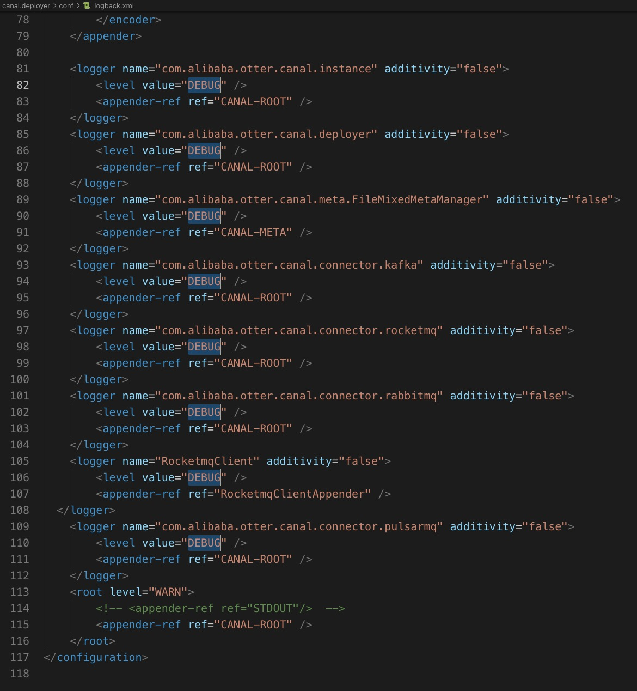
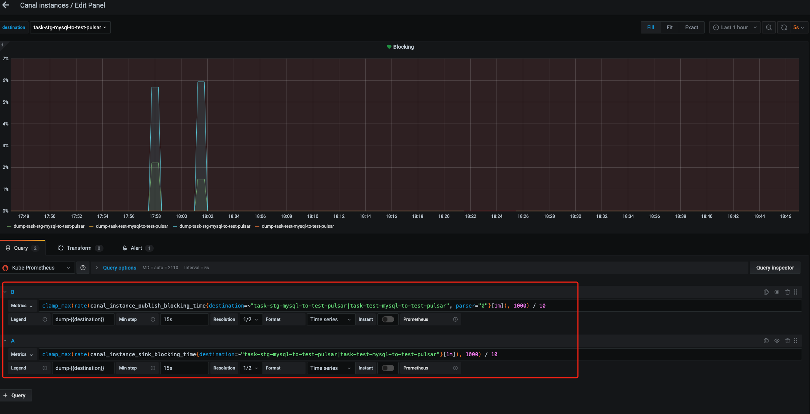
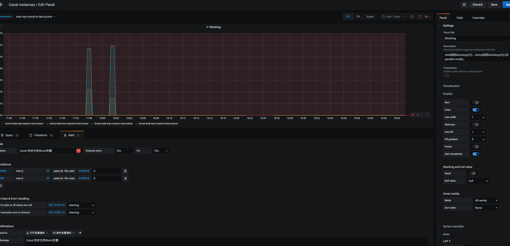
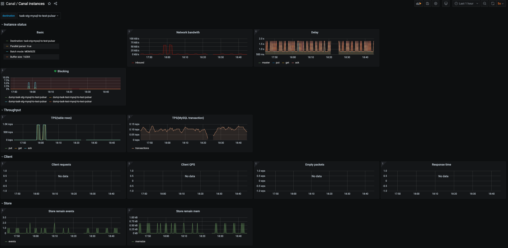

# Canal

# 一、简介

Github：https://github.com/alibaba/canal

## 功能简介

基于日志增量订阅和消费的业务包括

- 数据库镜像
- 数据库实时备份
- 索引构建和实时维护(拆分异构索引、倒排索引等)
- 业务 cache 刷新
- 带业务逻辑的增量数据处理

当前的 canal 支持源端 MySQL 版本包括 5.1.x , 5.5.x , 5.6.x , 5.7.x , 8.0.x

## MySQL主备复制原理


- MySQL master 将数据变更写入二进制日志( binary log, 其中记录叫做二进制日志事件binary log events，可以通过 show binlog events 进行查看)
- MySQL slave 将 master 的 binary log events 拷贝到它的中继日志(relay log)
- MySQL slave 重放 relay log 中事件，将数据变更反映它自己的数据

## canal 工作原理


- canal 模拟 MySQL slave 的交互协议，伪装自己为 MySQL slave ，向 MySQL master 发送dump 协议
- MySQL master 收到 dump 请求，开始推送 binary log 给 slave (即 canal )
- canal 解析 binary log 对象(原始为 byte 流)

# 二、部署

## 1、二进制

```bash
canal_version=1.1.6
wget https://github.com/alibaba/canal/releases/download/canal-$canal_version/canal.adapter-$canal_version.tar.gz -P /tmp
mkdir /opt/canal.adapter-$canal_version && tar -zxvf /tmp/canal.adapter-$canal_version.tar.gz -C /opt/canal.adapter-$canal_version
ln -s /opt/canal.adapter-$canal_version /opt/canal.adapter

canal_version=1.1.6
wget https://github.com/alibaba/canal/releases/download/canal-$canal_version/canal.admin-$canal_version.tar.gz -P /tmp
mkdir /opt/canal.admin-$canal_version && tar -zxvf /tmp/canal.admin-$canal_version.tar.gz -C /opt/canal.admin-$canal_version
ln -s /opt/canal.admin-$canal_version /opt/canal.admin

canal_version=1.1.6
wget https://github.com/alibaba/canal/releases/download/canal-$canal_version/canal.deployer-$canal_version.tar.gz -P /tmp
mkdir /opt/canal.deployer-$canal_version && tar -zxvf /tmp/canal.deployer-$canal_version.tar.gz -C /opt/canal.deployer-$canal_version
ln -s /opt/canal.deployer-$canal_version /opt/canal.deployer
```

## 2、Docker

文档：https://github.com/alibaba/canal/wiki/Docker-QuickStart

docker镜像：https://hub.docker.com/r/canal/canal-server/tags/

- docker模式下，单docker实例只能运行一个instance


# 三、启动

## 1、debug方式启动

默认使用suspend=y，阻塞等待你remote debug链接成功

```bash
sh startup.sh debug 9099
```

## 2、设置输出日志级别

修改`conf/logback.xml`




# 四、配置

## 1、数据库设置

- 开启 Binlog 写入功能，配置 binlog-format 为 ROW 模式，配置如下

  ```ini
  [mysqld]
  log-bin=mysql-bin # 开启 binlog
  binlog-format=ROW # 选择 ROW 模式
  server_id=1 # 配置 MySQL replaction 需要定义，不要和 canal 的 slaveId 重复
  ```

  ```sql
  show variables like 'binlog_format';
  show variables like 'log_bin';
  ```

- 授权 canal 链接 MySQL 账号具有作为 MySQL slave 的权限, 如果已有账户可直接 grant

  ```sql
  CREATE USER canal IDENTIFIED BY 'canal';  
  GRANT SELECT, REPLICATION SLAVE, REPLICATION CLIENT ON *.* TO 'canal'@'%';
  -- GRANT ALL PRIVILEGES ON *.* TO 'canal'@'%' ;
  FLUSH PRIVILEGES;
  ```

## 2、配置文件

- canal.properties  (系统根配置文件)

  ```bash
  #################################################
  ######### 		   Canal配置       		#############
  #################################################
  # canal server绑定的本地IP信息，如果不配置，默认选择一个本机IP进行启动服务
  canal.ip =
  # canal server注册到外部zookeeper、admin的ip信息 (针对docker的外部可见ip)
  canal.register.ip =
  # canal server提供socket服务的端口	
  canal.port = 11111
  canal.metrics.pull.port = 11112
  # canal instance user/passwd
  # canal.user = canal
  # canal.passwd = E3619321C1A937C46A0D8BD1DAC39F93B27D4458
  
  # canal链接canal-admin的地址 
  # canal.admin.manager = 127.0.0.1:8089
  
  # admin管理链接端口
  canal.admin.port = 11110
  # admin管理指令链接的ACL配置
  canal.admin.user = admin
  canal.admin.passwd = 4ACFE3202A5FF5CF467898FC58AAB1D615029441
  # admin auto register
  #canal.admin.register.auto = true
  #canal.admin.register.cluster =
  #canal.admin.register.name =
  
  # canal server链接zookeeper集群的链接信息
  canal.zkServers =
  # canal持久化数据到zookeeper上的更新频率，单位毫秒
  canal.zookeeper.flush.period = 1000
  canal.withoutNetty = false
  # tcp, kafka, rocketMQ, rabbitMQ, pulsarMQ
  canal.serverMode = tcp
  # flush meta cursor/parse position to file
  canal.file.data.dir = ${canal.conf.dir}
  canal.file.flush.period = 1000
  # canal内存store中可缓存buffer记录数，需要为2的指数
  canal.instance.memory.buffer.size = 16384
  # 内存记录的单位大小，默认1KB，和buffer.size组合决定最终的内存使用大小
  canal.instance.memory.buffer.memunit = 1024 
  # canal内存store中数据缓存模式
  # 1. ITEMSIZE : 根据buffer.size进行限制，只限制记录的数量
  # 2. MEMSIZE : 根据buffer.size  * buffer.memunit的大小，限制缓存记录的大小
  canal.instance.memory.batch.mode = MEMSIZE
  canal.instance.memory.rawEntry = true
  
  #################################################
  ###       Canal 数据库连接心跳检查、切换配置      ###
  #################################################
  ## 是否开启心跳检查	
  canal.instance.detecting.enable = false
  # 心跳检查sql	
  canal.instance.detecting.sql = select 1
  # 心跳检查频率，单位秒
  canal.instance.detecting.interval.time = 3
  # 心跳检查失败重试次数
  canal.instance.detecting.retry.threshold = 3
  # 心跳检查失败后，是否开启自动mysql自动切换。
  # 说明：比如心跳检查失败超过阀值后，如果该配置为true，canal就会自动链到mysql备库获取binlog数据
  # 发生master/standby的切换的条件：(heartbeatHaEnable = true) && (失败次数>=retry.threshold). 
  canal.instance.detecting.heartbeatHaEnable = false
  
  # 最大事务完整解析的长度支持超过该长度后，一个事务可能会被拆分成多次提交到canal store中，无法保证事务的完整可见性
  canal.instance.transaction.size =  1024
  # canal发生mysql切换时，在新的mysql库上查找binlog时需要往前查找的时间，单位秒。
  # 说明：mysql主备库可能存在解析延迟或者时钟不统一，需要回退一段时间，保证数据不丢
  canal.instance.fallbackIntervalInSeconds = 60
  
  #################################################
  ######### 		Canal 网络连接配置       #############
  #################################################
  # 网络链接参数，SocketOptions.SO_RCVBUF
  canal.instance.network.receiveBufferSize = 16384
  # 网络链接参数，SocketOptions.SO_SNDBUF
  canal.instance.network.sendBufferSize = 16384
  # 网络链接参数，SocketOptions.SO_TIMEOUT
  canal.instance.network.soTimeout = 30
  
  #################################################
  ######### 		 Canal Binlog配置     #############
  #################################################
  
  # 是否使用druid处理所有的ddl解析来获取库和表名
  canal.instance.filter.druid.ddl = true
  # 是否忽略dcl语句
  canal.instance.filter.query.dcl = false
  # 是否忽略dml语句
  # (mysql5.6之后，在row模式下每条DML语句也会记录SQL到binlog中,可参考MySQL文档)
  canal.instance.filter.query.dml = false
  # 是否忽略ddl语句
  canal.instance.filter.query.ddl = false
  # 是否忽略binlog表结构获取失败的异常
  # 主要解决回溯binlog时,对应表已被删除或者表结构和binlog不一致的情况
  canal.instance.filter.table.error = false
  # 是否dml的数据变更事件.(主要针对用户只订阅ddl/dcl的操作)
  canal.instance.filter.rows = false
  # 是否忽略事务头和尾,比如针对写入kakfa的消息时，不需要写入TransactionBegin/Transactionend事件
  canal.instance.filter.transaction.entry = false
  canal.instance.filter.dml.insert = false
  canal.instance.filter.dml.update = false
  canal.instance.filter.dml.delete = false
  
  # 支持的binlog format格式列表(otter会有支持format格式限制)
  canal.instance.binlog.format = ROW,STATEMENT,MIXED 
  # 支持的binlog image格式列表(otter会有支持format格式限制)
  canal.instance.binlog.image = FULL,MINIMAL,NOBLOB
  
  # ddl语句是否单独一个batch返回 (比如下游dml/ddl如果做batch内无序并发处理,会导致结构不一致)
  canal.instance.get.ddl.isolation = false
  
  # 是否开启binlog并行解析模式(串行解析资源占用少,但性能有瓶颈, 并行解析可以提升近2.5倍+)
  # 如果系统是1个 cpu，需要将 canal.instance.parser.parallel 设置为 false
  canal.instance.parser.parallel = true
  # binlog并行解析的异步ringbuffer队列(必须为2的指数)
  canal.instance.parser.parallelBufferSize = 256
  
  # 是否开启tablemeta的tsdb能力
  canal.instance.tsdb.enable = true
  # 主要针对h2-tsdb.xml时对应h2文件的存放目录,默认为conf/xx/h2.mv.db
  canal.instance.tsdb.dir = ${canal.file.data.dir:../conf}/${canal.instance.destination:}
  # jdbc url的配置(h2的地址为默认值，如果是mysql需要自行定义)
  canal.instance.tsdb.url = jdbc:h2:${canal.instance.tsdb.dir}/h2;CACHE_SIZE=1000;MODE=MYSQL;
  canal.instance.tsdb.dbUsername = canal
  canal.instance.tsdb.dbPassword = canal
  # dump snapshot interval, default 24 hour
  canal.instance.tsdb.snapshot.interval = 24
  # purge snapshot expire , default 360 hour(15 days)
  canal.instance.tsdb.snapshot.expire = 360
  
  #################################################
  ######### 		Canal配置		          #############
  #################################################
  canal.destinations = example
  # conf root dir
  canal.conf.dir = ../conf
  # auto scan instance dir add/remove and start/stop instance
  canal.auto.scan = true
  canal.auto.scan.interval = 5
  # set this value to 'true' means that when binlog pos not found, skip to latest.
  # WARN: pls keep 'false' in production env, or if you know what you want.
  canal.auto.reset.latest.pos.mode = false
  
  canal.instance.tsdb.spring.xml = classpath:spring/tsdb/h2-tsdb.xml
  #canal.instance.tsdb.spring.xml = classpath:spring/tsdb/mysql-tsdb.xml
  
  canal.instance.global.mode = spring
  canal.instance.global.lazy = false
  canal.instance.global.manager.address = ${canal.admin.manager}
  #canal.instance.global.spring.xml = classpath:spring/memory-instance.xml
  canal.instance.global.spring.xml = classpath:spring/file-instance.xml
  #canal.instance.global.spring.xml = classpath:spring/default-instance.xml
  
  ##################################################
  ######### 	      消息队列通用配置      #############
  ##################################################
  # aliyun ak/sk , support rds/mq
  canal.aliyun.accessKey =
  canal.aliyun.secretKey =
  canal.aliyun.uid=
  
  # 是否为json格式,如果设置为false,对应MQ收到的消息为protobuf格式.需要通过CanalMessageDeserializer进行解码
  canal.mq.flatMessage = true
  # Canal的批处理数据大小, 默认50K, 由于kafka最大消息体限制请勿超过1M(900K以下)
  canal.mq.canalBatchSize = 50
  # Canal get数据的超时时间, 单位: 毫秒, 空为不限超时
  canal.mq.canalGetTimeout = 100
  # 是否为阿里云模式，可选值local/cloud	
  canal.mq.accessChannel = local
  # 是否开启database混淆hash,确保不同库的数据可以均匀分散,如果关闭可以确保只按照业务字段做MQ分区计算
  canal.mq.database.hash = true
  # MQ消息发送并行度	
  canal.mq.send.thread.size = 30
  # MQ消息构建并行度	
  canal.mq.build.thread.size = 8
  
  ##################################################
  ######### 		     Kafka 		     #############
  ##################################################
  # kafka为bootstrap.servers，rocketMQ中为nameserver列表
  kafka.bootstrap.servers = 127.0.0.1:9092
  kafka.acks = all
  # 压缩类型	
  kafka.compression.type = none
  kafka.batch.size = 16384
  kafka.linger.ms = 1
  kafka.max.request.size = 1048576
  kafka.buffer.memory = 33554432
  kafka.max.in.flight.requests.per.connection = 1
  # 发送失败重试次数	
  kafka.retries = 0
  
  kafka.kerberos.enable = false
  kafka.kerberos.krb5.file = "../conf/kerberos/krb5.conf"
  kafka.kerberos.jaas.file = "../conf/kerberos/jaas.conf"
  
  ##################################################
  ######### 		    RocketMQ	     #############
  ##################################################
  rocketmq.producer.group = test
  rocketmq.enable.message.trace = false
  rocketmq.customized.trace.topic =
  rocketmq.namespace =
  rocketmq.namesrv.addr = 127.0.0.1:9876
  rocketmq.retry.times.when.send.failed = 0
  rocketmq.vip.channel.enabled = false
  rocketmq.tag = 
  
  rabbitmq.host =
  rabbitmq.virtual.host =
  rabbitmq.exchange =
  rabbitmq.username =
  rabbitmq.password =
  rabbitmq.deliveryMode =
  ##################################################
  ######### 		      Pulsar         #############
  ##################################################
  pulsarmq.serverUrl =
  pulsarmq.roleToken =
  pulsarmq.topicTenantPrefix =
  ```

- instance.properties  (instance级别的配置文件，每个instance一份)

  ```bash
  # 是否启用mysql gtid的订阅模式	
  canal.instance.gtidon=false
  
  # mysql主库链接地址
  canal.instance.master.address=127.0.0.1:3306
  # mysql主库链接时起始的binlog文件	
  canal.instance.master.journal.name=
  # mysql主库链接时起始的binlog偏移量	
  canal.instance.master.position=
  # mysql主库链接时起始的binlog的时间戳	
  canal.instance.master.timestamp=
  # mysql主库链接时对应的gtid位点	
  canal.instance.master.gtid=
  
  # 目前配置只支持一个standby配置
  #canal.instance.standby.address =
  #canal.instance.standby.journal.name =
  #canal.instance.standby.position =
  #canal.instance.standby.timestamp =
  #canal.instance.standby.gtid=
  
  # rds oss binlog
  canal.instance.rds.accesskey=
  canal.instance.rds.secretkey=
  canal.instance.rds.instanceId=
  
  # table meta tsdb info
  canal.instance.tsdb.enable=true
  #canal.instance.tsdb.url=jdbc:mysql://127.0.0.1:3306/canal_tsdb
  #canal.instance.tsdb.dbUsername=canal
  #canal.instance.tsdb.dbPassword=canal  
  # username/password
  canal.instance.dbUsername=canal
  canal.instance.dbPassword=canal
  # 数据库的编码方式对应到 java 中的编码类型，比如 UTF-8，GBK , ISO-8859-1
  canal.instance.connectionCharset = UTF-8
  # enable druid Decrypt database password
  canal.instance.enableDruid=false
  #canal.instance.pwdPublicKey=MFwwDQYJKoZIhvcNAQEBBQADSwAwSAJBALK4BUxdDltRRE5/zXpVEVPUgunvscYFtEip3pmLlhrWpacX7y7GCMo2/JM6LeHmiiNdH1FWgGCpUfircSwlWKUCAwEAAQ==
  
  # table regex
  canal.instance.filter.regex=.*\\..*
  # table black regex
  canal.instance.filter.black.regex=mysql\\.slave_.*
  # table field filter(format: schema1.tableName1:field1/field2,schema2.tableName2:field1/field2)
  #canal.instance.filter.field=test1.t_product:id/subject/keywords,test2.t_company:id/name/contact/ch
  # table field black filter(format: schema1.tableName1:field1/field2,schema2.tableName2:field1/field2)
  #canal.instance.filter.black.field=test1.t_product:subject/product_image,test2.t_company:id/name/contact/ch
  
  # mq config
  canal.mq.topic=example
  # dynamic topic route by schema or table regex
  #canal.mq.dynamicTopic=mytest1.user,topic2:mytest2\\..*,.*\\..*
  canal.mq.partition=0
  # hash partition config
  #canal.mq.enableDynamicQueuePartition=false
  #canal.mq.partitionsNum=3
  #canal.mq.dynamicTopicPartitionNum=test.*:4,mycanal:6
  # 库名.表名: 唯一主键，多个表之间用逗号分隔
  canal.mq.partitionHash=test.table:id^name,.*\\..*
  ```

## 3、源库DB-表正则匹配设置

格式：`schema.table`


```bash
canal.instance.filter.regex=A.*,B.*,C.*
```

## 4、消息队列Topic正则匹配设置

- **使用正则路由schema和table到不同的Topic**

  格式：`topic:schema.table,topic:schema.table,topic:schema.table`

  ```bash
  canal.mq.dynamicTopic=topic_A:db_test,topic_B:db_test\.*,topic_C:db_test.test_table
  # topic_A:db_test     :db_test库的所有表都会发送到topic_A下
  # topic_B:db_test\.*  :db_test库正则*匹配的所有表都会发送到topic_B下
  # topic_C:db_test.test_table   :db_test库的test_table表都会发送到topic_C下
  
  ```

- **默认的topic**

  ```bash
  canal.mq.topic=canal_ddl
  ```

  一些mysql schema的binlog也会读进来（建表语句，grant语句等），如果没有这个默认的topic，会报找不到分区的错误，从而导致canal停止写入

参考：https://www.cnblogs.com/xiexiandong/p/12881011.html

# 五、MySQL To Kafka

`conf/canal.properties`

```bash
...
canal.serverMode = kafka
...

kafka.bootstrap.servers = localhost:9092
kafka.acks = all
kafka.compression.type = none
kafka.batch.size = 16384
kafka.linger.ms = 1
kafka.max.request.size = 1048576
kafka.buffer.memory = 33554432
kafka.max.in.flight.requests.per.connection = 1
kafka.retries = 0
kafka.kerberos.enable = false
kafka.kerberos.krb5.file = "../conf/kerberos/krb5.conf"
kafka.kerberos.jaas.file = "../conf/kerberos/jaas.conf"
```

`conf/example/instance.properties`

```bash
...
# mq config
canal.mq.topic=canal_ddl
# dynamic topic route by schema or table regex
canal.mq.dynamicTopic=db.table:db\\.table
canal.mq.partition=0
# hash partition config
canal.mq.enableDynamicQueuePartition=false
canal.mq.partitionsNum=3
canal.mq.dynamicTopicPartitionNum=test.*:4,mycanal:6
canal.mq.partitionHash=test.table:id^name,.*\\..*
...
```

# 六、MySQL To Pulsar

文档：https://pulsar.apache.org/docs/io-canal-source/#configuration

`conf/canal.properties`

```bash
...
canal.serverMode = pulsarMQ
...

pulsarmq.serverUrl = pulsar://127.0.0.1:30065
pulsarmq.roleToken =
pulsarmq.topicTenantPrefix = public/default
```

`conf/example/instance.properties`

```bash
...
# mq config
canal.mq.topic=canal_ddl
# dynamic topic route by schema or table regex
canal.mq.dynamicTopic=db.table:db\\.table
canal.mq.partition=0
# hash partition config
canal.mq.enableDynamicQueuePartition=false
canal.mq.partitionsNum=3
canal.mq.dynamicTopicPartitionNum=test.*:4,mycanal:6
canal.mq.partitionHash=test.table:id^name,.*\\..*
...
```

# 七、Aliyun RDS MySQL To Pulsar

同第六章的相同配置。

# 八、表与消费队列Topic对应实操

适应于投递MySQL Binlog到kafka和pulsar

## 1、同库多表对应一个topic

```bash
canal.instance.filter.regex=test.jobs1,test.jobs2
canal.mq.dynamicTopic=test.jobs:test.*
```


# 九、监控

## 1、配置canal

`conf/canal.properties`

```bash
canal.metrics.pull.port = 11112
```

## 2、配置prometheus刮取canal端点数据

```json
- job_name: "test-stg-canal"
  scrape_interval: 15s
  scrape_timeout: 10s
  metrics_path: /
  scheme: http
  static_configs:
  - targets: ['192.168.1.20:11112']
```

## 3、Grafana导入Dashboard

[Dashboard josn文件](https://github.com/alibaba/canal/blob/master/deployer/src/main/resources/metrics/Canal_instances_tmpl.json)

## 4、配置告警



去除默认无用的两条数据显示，只保存上图中的两条，同时查询条件进行精确匹配不要用变量引用进行可变搜索。不然无法创建告警Alert，会显示`“Template variables are not supported in alert queries”`



## 5、效果



## 6、监控指标释义

| 指标                                  | 说明                                                         | 单位 | 精度 |
| ------------------------------------- | ------------------------------------------------------------ | ---- | ---- |
| canal_instance_transactions           | instance接收transactions计数                                 | -    | -    |
| canal_instance                        | instance基本信息                                             | -    | -    |
| canal_instance_subscriptions          | instance订阅数量                                             | -    | -    |
| canal_instance_publish_blocking_time  | instance dump线程提交到异步解析队列过程中的阻塞时间(仅parallel解析模式) | ms   | ns   |
| canal_instance_received_binlog_bytes  | instance接收binlog字节数                                     | byte | -    |
| canal_instance_parser_mode            | instance解析模式(是否开启parallel解析)                       | -    | -    |
| canal_instance_client_packets         | instance client请求次数的计数                                | -    | -    |
| canal_instance_client_bytes           | 向instance client发送数据包字节计数                          | byte | -    |
| canal_instance_client_empty_batches   | 向instance client发送get接口的空结果计数                     | -    | -    |
| canal_instance_client_request_error   | instance client请求失败计数                                  | -    | -    |
| canal_instance_client_request_latency | instance client请求的响应时间概况                            | -    | -    |
| canal_instance_sink_blocking_time     | instance sink线程put数据至store的阻塞时间                    | ms   | ns   |
| canal_instance_store_produce_seq      | instance store接收到的events sequence number                 | -    | -    |
| canal_instance_store_consume_seq      | instance store成功消费的events sequence number               | -    | -    |
| canal_instance_store                  | instance store基本信息                                       | -    | -    |
| canal_instance_store_produce_mem      | instance store接收到的所有events占用内存总量                 | byte | -    |
| canal_instance_store_consume_mem      | instance store成功消费的所有events占用内存总量               | byte | -    |
| canal_instance_put_rows               | store put操作完成的table rows                                | -    | -    |
| canal_instance_get_rows               | client get请求返回的table rows                               | -    | -    |
| canal_instance_ack_rows               | client ack操作释放的table rows                               | -    | -    |
| canal_instance_traffic_delay          | server与MySQL master的延时                                   | ms   | ms   |
| canal_instance_put_delay              | store put操作events的延时                                    | ms   | ms   |
| canal_instance_get_delay              | client get请求返回events的延时                               | ms   | ms   |
| canal_instance_ack_delay              | client ack操作释放events的延时                               | ms   | ms   |

## 7、Dashboard

| 指标                                                         | 简述                                                         | 多指标 |
| ------------------------------------------------------------ | ------------------------------------------------------------ | ------ |
| [Basic](https://github.com/alibaba/canal/wiki/Canal-prometheus#状态信息) | Canal instance 基本信息。                                    | 是     |
| [Network bandwith](https://github.com/alibaba/canal/wiki/Canal-prometheus#网络带宽kbs) | 网络带宽。包含inbound(canal server读取binlog的网络带宽)和outbound(canal server返回给canal client的网络带宽) | 是     |
| [Delay](https://github.com/alibaba/canal/wiki/Canal-prometheus#delayseconds) | Canal server与master延时；store 的put, get, ack操作对应的延时。 | 是     |
| [Blocking](https://github.com/alibaba/canal/wiki/Canal-prometheus#blocking) | sink线程blocking占比；dump线程blocking占比(仅parallel mode)。 | 是     |
| [TPS(transaction)](https://github.com/alibaba/canal/wiki/Canal-prometheus#tpsmysql-transaction) | Canal instance 处理binlog的TPS，以MySQL transaction为单位计算。 | 否     |
| [TPS(tableRows)](https://github.com/alibaba/canal/wiki/Canal-prometheus#tpstable-row) | 分别对应store的put, get, ack操作针对数据表变更行的TPS        | 是     |
| [Client requests](https://github.com/alibaba/canal/wiki/Canal-prometheus#client-requests) | Canal client请求server的请求数统计，结果按请求类型分类(比如get/ack/sub/rollback等)。 | 否     |
| [Response time](https://github.com/alibaba/canal/wiki/Canal-prometheus#response-time) | Canal client请求server的响应时间统计。                       | 否     |
| [Empty packets](https://github.com/alibaba/canal/wiki/Canal-prometheus#empty-packets) | Canal client请求server返回空结果的统计。                     | 是     |
| [Store remain events](https://github.com/alibaba/canal/wiki/Canal-prometheus#event-store占用) | Canal instance ringbuffer中堆积的events数量。                | 否     |
| [Store remain mem](https://github.com/alibaba/canal/wiki/Canal-prometheus#event-store-memory占用kb-仅memory-mode) | Canal instance ringbuffer中堆积的events内存使用量。          | 否     |
| [Client QPS](https://github.com/alibaba/canal/wiki/Canal-prometheus#client-qps) | client发送请求的QPS，按GET与CLIENTACK分类统计                | 是     |

参考：https://github.com/alibaba/canal/wiki/Prometheus-QuickStart

# 十、错误处理

**1、如果canal启动时候从日志看到报这个错误：`can't find start position for example`。**

**解决方法：**

- **单机**
  删除meta.dat文件，重启canal，问题解决。
- **集群**
  进入canal对应的zookeeper集群下，删除节点`/otter/canal/destinations/实例/1001/cursor`，重启canal即可恢复
