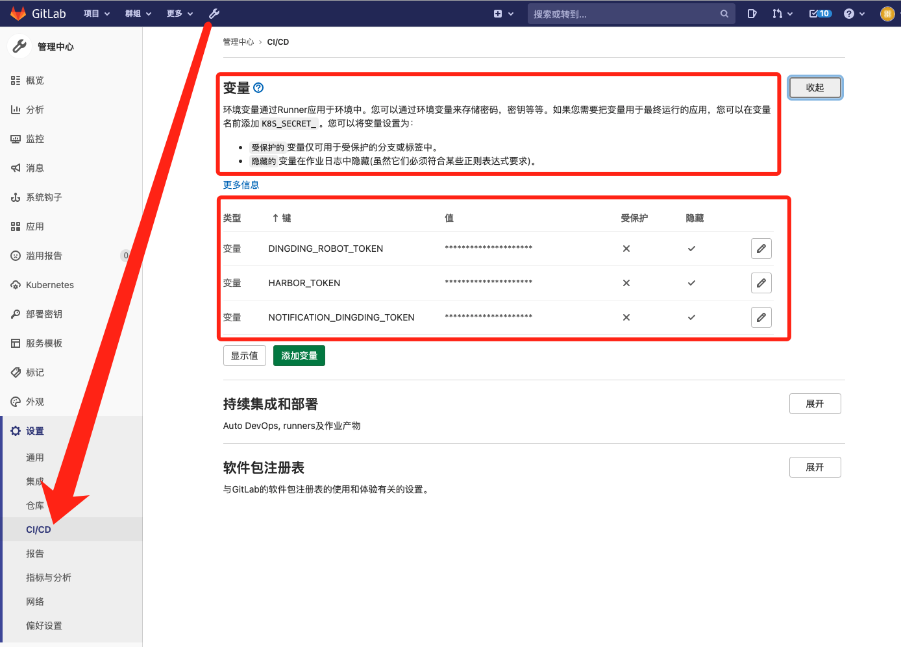

# CICD优化总结

# 一、Gitlab pipeline + k8s

## 1、gitlab代码仓库的命名

如果是要设计通配类型的CICD流程，那代码仓库的命名对于后续CICD中的脚本至关重要（可以通过Gitlab Runner中的环境变量获取当前仓库的名字、commit id、提交者信息等信息）。例如以下场景：

- 可以根据仓库名，作为该应用在k8s中资源标识，如Deployment的名字，Configmap的名字等等。
- 可以根据`日期+Commit ID`作为镜像的版本

`config.sh`

```bash
#!/bin/sh

if [ ! -n "$1" ]; then
  echo 'must input file name '
  exit 1
else
  cat $1 |
    sed 's/\$NAMESPACE'"/$NAMESPACE/g" |
    sed 's~\$IMAGE_NAME'"~$IMAGE_NAME~g" |
    sed 's~\$APPENV'"~$APPENV~g" |
    sed 's~\$POD_NUM'"~$POD_NUM~g" |
    sed 's~\$CI_PROJECT_NAME'"~$CI_PROJECT_NAME~g" |
    cat -
fi

exit 0
```

`k8s-application.tpl.yaml`

```yaml
apiVersion: apps/v1
kind: Deployment
metadata:
  name: $CI_PROJECT_NAME
  namespace: $NAMESPACE
  annotations:
    kubernetes.io/change-cause: $IMAGE_NAME
  labels:
    app: $CI_PROJECT_NAME
spec:
  selector:
    matchLabels:
      app: $CI_PROJECT_NAME
  replicas: $POD_NUM
  template:
    metadata:
      labels:
        app: $CI_PROJECT_NAME
    spec:
      containers:
        - name: app
          image: $IMAGE_NAME
          imagePullPolicy: IfNotPresent
....
```

使用上述脚本可以替换指定环境变量到k8s模板资源文件中，从而生成最终的部署资源文件

```bash
- ./config.sh ./k8s-application.tpl.yaml > k8s-application.yaml
```

## 2、K8S部署版本说明

Deployment或者statefulset添加`kubernetes.io/change-cause`的注解用以标注发布变更历史。可以使用镜像版本号作为说明，也可以时间戳等。

```yaml
...
metadata:
  annotations:
    kubernetes.io/change-cause: $IMAGE_NAME
...    
```

```bash
$ kubectl rollout history deployment test-nginx
REVISION  CHANGE-CAUSE
1        harbor.curiouser.com/test-nginx/stg:20210908-a3das215
2        harbor.curiouser.com/test-nginx/stg:20210908-8020cdfh
```

## 3、验证部署状态并增加回退通知流程

在CD步骤中，直接k8s资源配置文件apply发布到k8s集群中，要检测是否已部署成功，pod个数、状态是否已到预期。不成功，要自动回滚到上一个版本，并发送钉钉通知

```bash
  - kubectl -n $NAMESPACE rollout status --timeout=50s deployment/$CI_PROJECT_NAME || exit_code=$?
  - |
    if [ $exit_code -ne 0 ];then 
      ROLLBACK_ID=$(kubectl -n $NAMESPACE rollout undo deployment/$CI_PROJECT_NAME -ojson | jq -r '.status.observedGeneration') ;
      curl -s https://oapi.dingtalk.com/robot/send?access_token="$PIPELINE_DINGDING_ROBOT_TOKEN" -H 'Content-Type: application/json' -d '{"msgtype": "markdown","markdown": {"title": "Gitlab流水线部署失败","text": "['$CI_PROJECT_NAME']('$CI_PROJECT_URL'/-/tree/'$CI_BUILD_REF_NAME')的'$APPENV'环境第['$CI_PIPELINE_ID']('$CI_PIPELINE_URL')号流水线'$CI_JOB_STAGE'阶段失败，已回滚至最近一个稳定版本'$ROLLBACK_ID'，请检查相关错误！"},"at": {"isAtAll": true}}' > /dev/null;
      exit 1;
    fi
```

## 4、关键信息的隐藏保护

- CICD脚本中禁止直接使用用户名密码
- 通过变量引用的用户名密码也要禁止显示，加以保护
- 引用的CICD基础镜像中也要禁止明文使用用户名密码
- 涉及到要保护的密码、密钥：
  - 内网Harbor登录用户名密码或Token：CI脚本中上传构建好的应用镜像或者下载内部的基础应用运行镜像等。
  - 内网Nexus登录用户名密码或Token：一般会在Maven管理的JAVA项目POM文件中会使用到
  - 服务器主机登录SSH公私钥：一般
  - Gitlab API Token或用户名密码、部署SSH公私钥：
  - 内网SonarQube服务端Token或密码




## 5、Gitlab的安全设置

①禁止使用HTTP协议作为git访问协议，只允许SSH。`管理员-设置-通用-可见性与访问控制-启用 Git 访问协议-选择"only ssh"`

②禁止自动注册用户，必须有管理员创建邀请。`管理员-设置-通用-注册限制-不勾选"已启用注册功能"和"新的注册需要管理员批准"`

③设置gitlab runner只能在组项目使用，而组只能管理员才能创建项目

④禁止用户创建仓库， `Account and limit 中的 Default projects limit 设置为 0`

⑤禁止用户创建任何级别的仓库，`Restricted visibility levels` 全选

