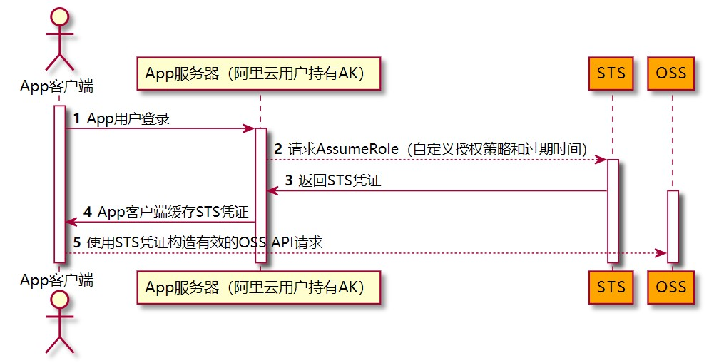

# 一、资源分组

创建云产品时进行“资源分组“，方便RAM子账号进行精准授权

# 二、OSS

对于要使用OSS产品的应用程序。需要

- 判断使用哪种类型的OSS Bucket？
  - 对于存放用户上传的文件，统一使用私有类型的Bucket。
    - 文件访问失效时间与用户登录系统的Token失效时间保持一致
  - 对于一些公用的前端静态资源文件或无用户隐私数据的数据文件
    - 可共用一个公共读类型的Bucket，多个应用以文件路径进行区分。
- 对测试环境与生产环境的Bucket进行账号层面的权限隔离
  - 以项目为单位，以`项目名+环境名`的命名规则，创建多个子账号。例如：`crm-test`。使用的进而创建access Secret。在Bucket中对子账号进行精准授权访问控制。
  - 项目中多个应用可使用公共子账号下的Bucket。但需要以应用名作为文件路径进行区分。例如crm项目有个crm-api的应用在测试环境中需要存储文件到OSS。则给他`crm-test`子账号下的Access Secret。

# 三、不同环境的ECS进行隔离

- VPC隔离进而区分环境，例如test-vpc为测试环境VPC，放置测试环境相关原产品。方便网络层面隔离。如需联动，进行VPC网络隧道打通，例如测试环境和
- ECS进行标签区分。使用`环境+功能(例如：test-k8s)`进行区分。方便批量操作


# 四、STS操作OSS

## 适用场景

移动App使用阿里云OSS服务来保存App的终端用户数据，并且要保证每个App用户之间的数据隔离。此时，您可以使用STS授权用户直接访问OSS。不必将AccessKey ID 和 AccessKey Secret暴露在移动APP的代码里



## 1、创建用户

- 用户不允许控制台访问操作
- 创建AccessKey
- 授予`AliyunSTSAssumeRoleAccess`的系统权限策略

## 2、创建自定义权限策略

```json
{
    "Version": "1",
    "Statement": [
        {
            "Effect": "Allow",
            "Action": "oss:PutObject",
            "Resource": [
                "acs:oss:*:***62314********:OSS Bucket名字",
                "acs:oss:*:***62314********:OSS Bucket名字/目录路径",
                "acs:oss:*:***62314********:OSS Bucket名字/目录路径/*"
            ]
        }
    ]
}
```

| 元素名称          | 描述                                            |
| :---------------- | :---------------------------------------------- |
| 效果（Effect）    | 授权效果包括两种：允许（Allow）和拒绝（Deny）。 |
| 操作（Action）    | 操作是指对具体资源的操作。                      |
| 资源（Resource）  | 资源是指被授权的具体对象。                      |
| 条件（Condition） | 条件是指授权生效的条件。                        |

- 针对OSS资源对象的操作参照：

  https://help.aliyun.com/document_detail/100680.htm#section-x3c-nsm-2gb

## 3、创建角色

- 授予第2步创建的自定义权限

- 修该信任策略。只允许指定子用户可以扮演该角色

```bash
{
  "Statement": [
    {
      "Action": "sts:AssumeRole",
      "Effect": "Allow",
      "Principal": {
        "RAM": [
          "acs:ram::子用户所在主账号的ID:user/子用户名"
        ]
      }
    }
  ],
  "Version": "1"
}
```

