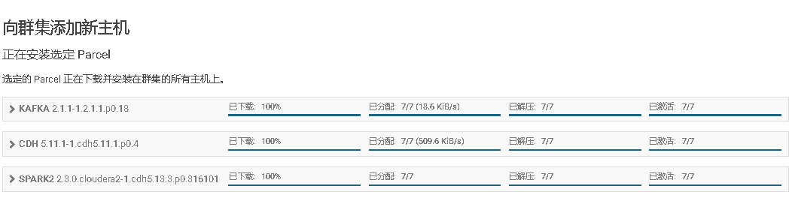
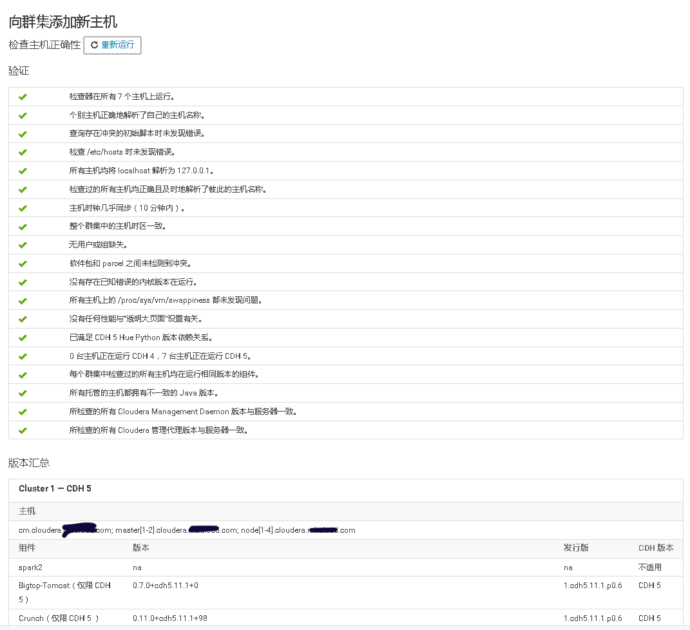
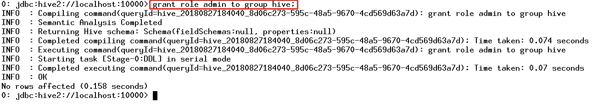
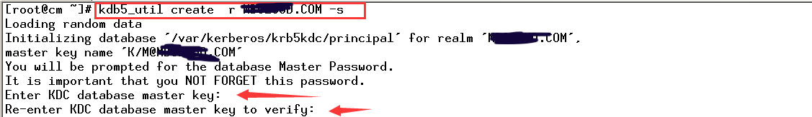

# Cloudera 集群管理

# 一、集群扩容添加节点

### 1、新建主机Prerequisite

关闭防火墙，SELinux，IPV6，禁止内存交换，关闭透明大页面-->hosts添加域名IP映射-->其他节点hosts添加新主机IP域名映射-->打通CM节点到新主机SSH免密钥登录-->修改YUM源-->挂载硬盘-->NTP-->安装JDK -->安装并配置Kerberos客户端

```
systemctl stop firewalld  &&\
systemctl disable firewalld ;\
systemctl stop iptables &&\
systemctl disable iptables;\
systemctl stop ip6tables &&\
systemctl disable ip6tables ;\
setenforce 0 &&\
sed -i 's/SELINUX=enforcing/SELINUX=disabled/' /etc/sysconfig/selinux ;\
echo never > /sys/kernel/mm/transparent_hugepage/enabled &&\
echo never > /sys/kernel/mm/transparent_hugepage/defrag ;\
echo 'GRUB_CMDLINE_LINUX="transparent_hugepage=never"' >> /etc/default/grub &&\
grub2-mkconfig -o /boot/grub2/grub.cfg &&\
sed -i '$a NETWORKING_IPV6=no' /etc/sysconfig/network &&\
echo "net.ipv6.conf.all.disable_ipv6=1" >> /etc/sysctl.conf &&\
sysctl -p &&\
cat /proc/sys/net/ipv6/conf/all/disable_ipv6 ;\
sysctl vm.swappiness=0 &&\
echo " vm.swappiness = 0" >> /etc/sysctl.conf 
```

新增节点配置集群其他主机的IP域名解析

```
hostnamectl --static set-hostname node4.cloudera.curiouser.com ;\
sed -i '$d' /etc/hosts ;\
echo "172.16.0.8 node4.cloudera.curiouser.com" >> /etc/hosts ;\
echo "172.16.0.3 master1.cloudera.curiouser.com" >> /etc/hosts ;\
echo "172.16.0.2 cm.cloudera.curiouser.com" >> /etc/hosts ;\
echo "172.16.0.4 master2.cloudera.curiouser.com" >> /etc/hosts ;\
echo "172.16.0.5 node1.cloudera.curiouser.com" >> /etc/hosts ;\
echo "172.16.0.6 node2.cloudera.curiouser.com" >> /etc/hosts ;\
echo "172.16.0.7 node3.cloudera.curiouser.com" >> /etc/hostts ;\
reboot now
```

集群其他节点hosts文件中添加新增节点IP域名解析

```
echo "172.16.0.8 node4.cloudera.curiouser.com" >> /etc/hosts
```

打通CM节点到新增节点的SSH免密登录

```
ssh-copy-id -i node4.cloudera.curiouser.com
```

配置YUM源 

```
mkdir /etc/yum.repos.d/bak  &&\
mv /etc/yum.repos.d/r* /etc/yum.repos.d/bak/ &&\
bash -c 'cat > /etc/yum.repos.d/rhel74.repo <<EOF
[rhel74]
name =rhel74
baseurl = http://cm.cloudera.curiouser.com/rhel74
gpgcheck = 0
EOF' ;\
yum clean all ;\
yum makecache
```

挂载额外LVM硬盘 

```
disk=sdb &&\
yum install -y lvm2 &&\
pvcreate /dev/${disk} &&\
vgcreate -s 4M data /dev/${disk} &&\
PE_Number=`vgdisplay|grep "Free  PE"|awk '{print $5}'` &&\
lvcreate -l ${PE_Number} -n data data &&\
mkfs.xfs /dev/data/data &&\
echo "/dev/data/data /data xfs defaults 0 0" >> /etc/fstab &&\
mkdir /data &&\
mount -a &&\
df -mh
```

配置新增节点NTP客户端同步集群时间

```
yum install -y ntp ;\
rm -rf /etc/ntp.conf ;\
bash -c 'cat > /etc/ntp.conf << EOF
driftfile /var/lib/ntp/drift
restrict default kod nomodify notrap nopeer noquery
restrict -6 default kod nomodify notrap nopeer noquery
restrict 127.0.0.1 
restrict -6 ::1
##NTP服务端IP
server cm.cloudera.curiouser.com                      
includefile /etc/ntp/crypto/pw
keys /etc/ntp/keys
EOF' ;\
  sed -i -c -e '/^$/d;/^##/d' /etc/ntp.conf ;\
  systemctl enable ntpd ;\
  systemctl start ntpd ;\
  ntpstat
```

安装JDK

```
yum localinstall -y http://cm.cloudera.curiouser.com/oracle-jdk/jdk-8u144-linux-x64.rpm ;\
yum install -y wget  ;\
rm -rf /usr/java/jdk1.8.0_144/jre/lib/security/{local_policy.jar,US_export_policy.jar} ;\
wget http://cm.cloudera.curiouser.com/oracle-jdk/{local_policy.jar,US_export_policy.jar} -P /usr/java/jdk1.8.0_144/jre/lib/security/ 
```

安装kerberos客户端

```
yum -y install krb5-libs krb5-workstation &&\
scp cm.cloudera.curiouser.com:/etc/krb5.conf /etc/
```

### 2、Cloudera Manager Web UI界面上添加主机

 
  
  
  
  
  
  
  
  
  
  
 

### 3、将添加现有服务的角色到新增主机上

 
  
 

```
mkdir -p /data/zookeeper/version-2;\
chown -R zookeeper:zookeeper /data/zookeeper
```

 


# 二、修改Cloudera Manager Server的日志存储位置

关闭Cloudera Manager Server服务

```
systemctl stop cloudera-scm-server
```

在/etc/default/cloudera-scm-server配置文件中追加日志存储位置的变量配置

```
echo "export CMF_VAR=/opt" >> /etc/default/cloudera-scm-server
```

创建相关目录并修改权限

```
cd /opt
mkdir log
chown cloudera-scm:cloudera-scm log
mkdir /opt/log/cloudera-scm-server
chown cloudera-scm:cloudera-scm log/cloudera-scm-server
mkdir run
chown cloudera-scm:cloudera-scm run
```

重启Cloudera Manager Server服务

```
systemctl start cloudera-scm-server
```

# 三、安装CDH集群报“出现 Entropy 不良问题”

## 原因：系统熵值低于 CDH 检测的阀值引起的 

## 解决方案：

### 1：查询系统熵值大小

```
cat /proc/sys/kernel/random/entropy_avail
```

### 2：配置

```
sudo yum install rng-tools && \
cp /usr/lib/systemd/system/rngd.service /etc/systemd/system/ && \
sed -i -e 's/ExecStart=\/sbin\/rngd -f/ExecStart=\/sbin\/rngd -f -r \/dev\/urandom/' /etc/systemd/system/rngd.service && \
systemctl daemon-reload && \
systemctl start rngd && \
systemctl enable rngd
```

官方参考文章：https://www.cloudera.com/documentation/enterprise/latest/topics/encryption_prereqs.html#concept_by1_pv4_y5

## 参考阅读：

### 什么是随机数

很多软件和应用都需要随机数，从纸牌游戏中纸牌的分发到 SSL 安全协议中密钥的产生，到处都有随机数的身影。随机数至少具备两个条件：

1. 数字序列在统计上是随机的
2. 不能通过已知序列推算后面的序列

自从计算机诞生起，寻求用计算机产生高质量的随机数序列的研究就一直是研究者长期关注的课题。一般情况下，使用计算机程序产生一个真正的随机数是很难的， 因为程序的行为是可预测的，计算机利用设计好的算法结合用户提供的种子产生的随机数序列通常是“伪随机数”（pseudo-random  number），伪随机数就是我们平时经常使用的“随机数”。伪随机数可以满足一般应用的需求，但是在对于安全要求比较高的环境和领域中存在明显的缺点：

1. 伪随机数是周期性的，当它们足够多时，会重复数字序列
2. 如果提供相同的算法和相同的种子值，将会得出完全一样的随机数序列
3. 可以使用逆向工程，猜测算法与种子值，以便推算后面所有的随机数列

只有实际物理过程才是真正的随机，只有借助物理世界中事物的随机性才能产生真正的随机数，比如真空内亚原子粒子量子涨落产生的噪音、超亮发光二极管在噪声的量子不确定性和放射性衰变等。

### 随机数为什么如此重要

生成随机数是密码学中的一项基本任务，是生成加密密钥、加密算法和加密协议所必不可少的，随机数的质量对安全性至关重要。最近报道有人利用随机数缺点成功 攻击了某网站，获得了管理员的权限。美国和法国的安全研究人员最近也评估了两个 Linux 内核 PRNG——/dev/random  和/dev/urandom 的安全性，认为 Linux  的伪随机数生成器不满足鲁棒性的安全概念，没有正确积累熵。可见随机数在安全系统中占据着非常重要的地位。

来源： https://blog.csdn.net/Mask_V/article/details/82983679

# 四、添加第三方jar到cloudear 安装的服务中

对于cloudear 安装的服务如果需要添加第三方jar，添加到/var/lib/ 目录中对应的服务目录下即可

# 五、修改Cloudera集群中服务默认的JAVA

官方文档：https://www.cloudera.com/documentation/enterprise/5-11-x/topics/cm_ig_java_home_location.html#cmig_topic_16

# 六、Cloudera集群开启邮件告警功能

## 1.CM节点安装SNMP告警接收服务

```
yum -y install net-snmp net-snmp-devel net-snmp-utils
```

## 2.修改/etc/snmp/snmptrapd.conf配置文件 

```
echo "authCommunity   log,execute,net public" >> /etc/snmp/snmptrapd.conf
```

## 3.启动snmptrapd服务并检查 

```
snmptrapd -C -c /etc/snmp/snmptrapd.conf -df -Lo


#启动参数说明：
-C ：表示不使用net-snmp默认路径下的配置文件snmptrapd.conf
-c ：指定snmptrapd.conf文件
-d ：显示收到和发送的数据报，通过这个选项可以看到数据报文
-f  ：默认情况下，snmptrapd是在后台中运行的，加上这个选项，表示在前台运行
-L ：指定日志记录在哪里，后面的o表示直接输出到屏幕上，如果是跟着f表示日志记录到指定的文件中
```


# 七、在未启用认证(kerberos/LDAP)情况下安装及使用Sentry

  CDH平台中的安全，认证（Kerberos/LDAP）是第一步，授权（Sentry）是第二步。如果要启用授权，必须先启用认证。但在CDH平台中给出了一种测试模式，即不启用认证而只启用Sentry授权。但强烈不建议在生产系统中这样使用，因为如果没有用户认证，授权没有任何意义形同虚设，用户可以随意使用任何超级用户登录HiveServer2或者Impala，并不会做密码校验。注：本文档仅适用于测试环境。





# 八、HDFS资源配额限制


对于/user/hdfs目录设置只有1M配额


然后使用hdfs用户上传一个4K的文件


发现无法上传。然后将/user/hdfs目录配额设置为500M


然后再次上传，发现可以上传


在HDFS查看该文件，发现一个实际大小为17B的小文件，在hdfs却占用HDFS 384MB的空间。实际原因是，该大小的文件使用了HDFS一个Block块，默认HDFS的Block块大小为128MB，文件Block块复制因子为3，就是一个Block块有3个副本。


# 九、Cloudera集群开启Kerberos认证

### 1、将 KDC 服务安装在 Cloudera Manager Server 所在服务器CM主机上

```
yum install -y krb5-server krb5-libs krb5-auth-dialog krb5-workstation 
```

### 2、修改/etc/krb5.conf 配置

```
# Configuration snippets may be placed in this directory as well
includedir /etc/krb5.conf.d/
[logging]
 default = FILE:/var/log/krb5libs.log
 kdc = FILE:/var/log/krb5kdc.log
 admin_server = FILE:/var/log/kadmind.log
[libdefaults]
 dns_lookup_realm = false
 ticket_lifetime = 24h
 renew_lifetime = 7d
 forwardable = true
 ################################################
 rdns = true
 default_realm = CURIOUSER.COM
 default_ccache_name = KEYRING:persistent:%{uid}
[realms]
 CURIOUSER.COM = {
  kdc = cm.cloudera.CURIOUSER.com
  admin_server = cm.cloudera.CURIOUSER.com
 }
[domain_realm]
 .cm.cloudera.CURIOUSER.com = CURIOUSER.COM
 cm.cloudera.CURIOUSER.com = CURIOUSER.COM
```


### 3、修改/var/kerberos/krb5kdc/kadm5.acl 配置

```
*/admin@CURIOUSER.COM *
```


### 4、修改/var/kerberos/krb5kdc/kdc.conf 配置 

```
[kdcdefaults]
 kdc_ports = 88
 kdc_tcp_ports = 88
[realms]
 CURIOUSER.COM = {
  #master_key_type = aes256-cts
  max_renewable_life= 7d 0h 0m 0s
  acl_file = /var/kerberos/krb5kdc/kadm5.acl
  dict_file = /usr/share/dict/words
  admin_keytab = /var/kerberos/krb5kdc/kadm5.keytab
  supported_enctypes = aes256-cts:normal aes128-cts:normal des3-hmac-sha1:normal arcfour-hmac:normal camellia256-cts:normal camellia128-cts:normal des-hmac-sha1:normal des-cbc-md5:normal des-cbc-crc:normal
 }
​````

### 5、创建 Kerberos 数据库
​```shell
# kdb5_util create -r CURIOUSER.COM -s 
Loading random data
Initializing database '/var/kerberos/krb5kdc/principal' for realm 'CURIOUSER.COM',
master key name 'K/M@CURIOUSER.COM'
You will be prompted for the database Master Password.
It is important that you NOT FORGET this password.
Enter KDC database master key: 
Re-enter KDC database master key to verify: 
```



### 6、创建 Kerberos 的管理账号

```
# kadmin.local
Authenticating as principal root/admin@CURIOUSER.COM with password.
kadmin.local: addprinc admin/admin@CURIOUSER.COM
WARNING: no policy specified for admin/admin@CURIOUSER.COM; defaulting to no policy
Enter password for principal "admin/admin@CURIOUSER.COM": 
Re-enter password for principal "admin/admin@CURIOUSER.COM": 
Principal "admin/admin@CURIOUSER.COM" created.
kadmin.local: exit
```


### 7、将 Kerberos 服务添加到自启动服务，并启动 krb5kdc 和 kadmin 服务 

```
systemctl enable krb5kdc &&\
systemctl start krb5kdc &&\
systemctl status krb5kdc &&\
systemctl enable kadmin &&\
systemctl start  kadmin &&\
systemctl status kadmin 
```

### 8、测试 Kerberos 的管理员账号

```
kinit admin/admin@CURIOUSER.COM
```


```
# klist
Ticket cache: KEYRING:persistent:0:0
Default principal: admin/admin@CURIOUSER.COM

Valid starting Expires Service principal
07/23/2018 23:43:13 07/24/2018 23:43:13 krbtgt/CURIOUSER.COM@CURIOUSER.COM
        renew until 07/30/2018 23:43:13
```


### 9、为集群安装所有 Kerberos 客户端（包括 Cloudera Manager服务主机CM节点）

```
yum -y install krb5-libs krb5-workstation 
```

### 10、在 Cloudera Manager 服务主机CM节点上安装额外的包 

```
yum -y install openldap-clients 
```

### 11、将 KDC Server 上的 krb5.conf 文件拷贝到所有Kerberos 客户端

```
for i in {master1,master2,node1,node2,node3};do scp /etc/krb5.conf  $i.cloudera.CURIOUSER.com:/etc/ ;done
```

### 12、在 KDC 中给 Cloudera Manager 添加管理员账号

```
# kadmin.local
Authenticating as principal admin/admin@CURIOUSER.COM with password.
kadmin.local: addprinc cloudera-scm/admin@CURIOUSER.COM
WARNING: no policy specified for cloudera-scm/admin@CURIOUSER.COM; defaulting to no policy
Enter password for principal "cloudera-scm/admin@CURIOUSER.COM": 
Re-enter password for principal "cloudera-scm/admin@CURIOUSER.COM": 
Principal "cloudera-scm/admin@CURIOUSER.COM" created.
kadmin.local: exit
```


### 13、在Cloudera Manager Web UI 界面开启Kerberos认证

 
 
 
 
 
 
 
 
 


# 十、开启HDFS NameNode的HA高可用


 


# 十一、Cloudera Manager大版本升级

## 0、升级说明

1. 版本升级路径参考：https://docs.cloudera.com/documentation/enterprise/upgrade/topics/ug_upgrade_paths.html#ug_upgrade_paths
2. 只升级Cloudera Manage
3. cm5.11.1升级至cm5.15.0

## 1、CM主机停止Cloudera Manager server，所有主机停止Cloudera Manager agent


```
systemctl stop cloudera-scm-server 
systemctl stop cloudera-scm-agent
```

## 2、备份CM主机MySQL数据库中的所有Database

```
mysqldump -uroot -p --all-databases > cloudera-mysql-backup.sql
```

## 3、备份Cloudera Manager server、agent的配置文件

```
mkdir ~/bak &&\
cp -r /etc/cloudera-scm-server/ ~/bak/ &&\
cp -r /etc/cloudera-scm-agent/ bak/
```

## 4、所有主机配置新版本CM RPM包的YUM源

```
bash -c 'cat > /etc/yum.repos.d/cm5.15.0.repo <<EOF
name = Cloudera Manager 5.15.0
baseurl = http://cm.cloudera.curiouser.com/cloudera/cm/5.15.0 
gpgcheck = 0
EOF' &&\
yum clean all &&\
yum repolist
```

## 5、使用rpm包升级ClouderaManager 的Server和Agent

升级Cloudera Manage Server

```
yum -y upgrade cloudera-manager-server &&\
systemctl start cloudera-scm-server
```

升级Cloudera Manage agent

```
yum upgrade -y cloudera-manager-agent &&\
systemctl start cloudera-scm-agent
```

## 6、验证

