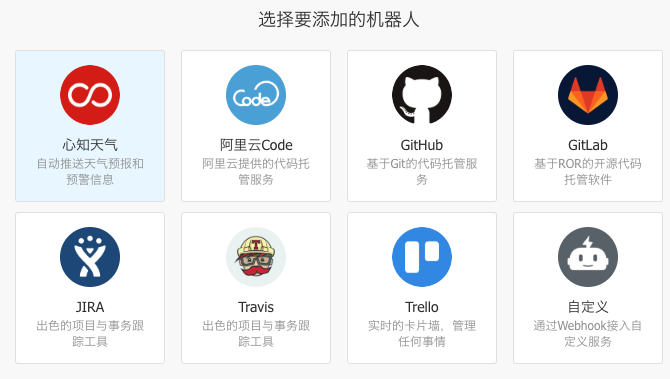
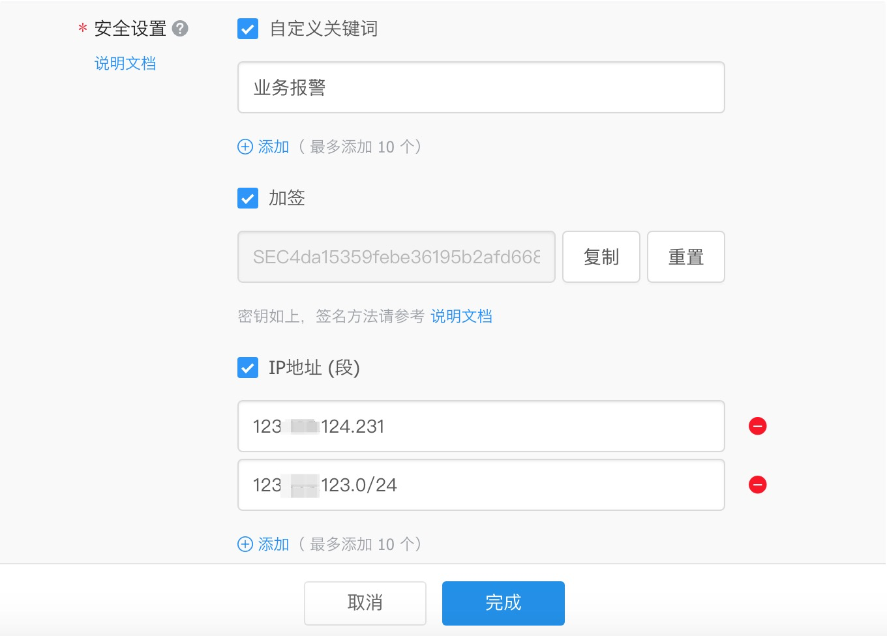

# 钉钉的机器人

# 一、简介




钉钉机器人类型

- 自定义机器人webhook
- 

机器人限制：每个机器人每分钟最多发送20条。如果超过20条，会限流10分钟。

# 二、自定义类型的Wehook Rebot



## 安全设置

安全设置目前有3种方式：

**（1）方式一，自定义关键词**

最多可以设置10个关键词，消息中至少包含其中1个关键词才可以发送成功。

例如：添加了一个自定义关键词：监控报警

则这个机器人所发送的消息，必须包含 监控报警 这个词，才能发送成功。


**（2）方****式二，加签**

第一步，把timestamp+"\n"+密钥当做签名字符串，使用HmacSHA256算法计算签名，然后进行Base64 encode，最后再把签名参数再进行urlEncode，得到最终的签名（需要使用UTF-8字符集）。


| **参数**  | **说明**                                                    |
| --------- | ----------------------------------------------------------- |
| timestamp | 当前时间戳，单位是毫秒，与请求调用时间误差不能超过1小时     |
| secret    | 密钥，机器人安全设置页面，加签一栏下面显示的SEC开头的字符串 |


签名计算代码示例（Java）

```
Long timestamp = System.currentTimeMillis();
String stringToSign = timestamp + "\n" + secret;
Mac mac = Mac.getInstance("HmacSHA256");
mac.init(new SecretKeySpec(secret.getBytes("UTF-8"), "HmacSHA256"));
byte[] signData = mac.doFinal(stringToSign.getBytes("UTF-8"));
return URLEncoder.encode(new String(Base64.encodeBase64(signData)),"UTF-8");
```


签名计算代码示例（Python）

```python
#python 2.7
import time
import hmac
import hashlib
import base64
import urllib

secret = '密钥'
timestamp = long(round(time.time() * 1000))
secret_enc = bytes(secret).encode('utf-8')
string_to_sign = '{}\n{}'.format(timestamp, secret)
string_to_sign_enc = bytes(string_to_sign).encode('utf-8')
hmac_code = hmac.new(secret_enc, string_to_sign_enc, digestmod=hashlib.sha256).digest()
sign = urllib.quote_plus(base64.b64encode(hmac_code))
print(timestamp)
print(sign)
```


第二步，把 timestamp和第一步得到的签名值拼接到URL中。

| **参数**  | **说明**             |
| --------- | -------------------- |
| timestamp | 第一步使用到的时间戳 |
| sign      | 第一步得到的签名值   |


```
https://oapi.dingtalk.com/robot/send?access_token=XXXXXX&timestamp=XXX&sign=XXX
```


**（3）方****式三，IP地址（段）**

设定后，只有来自IP地址范围内的请求才会被正常处理。支持两种设置方式：IP、IP段，暂不支持IPv6地址白名单，格式如下:


**注意：安全设置的上述三种方式，需要****至少****设置其中一种，以进行安全保护**。校验不通过的消息将会发送失败，错误如下：

```
// 消息内容中不包含任何关键词
{
  "errcode":310000,
  "errmsg":"keywords not in content"
}

// timestamp 无效
{
  "errcode":310000,
  "errmsg":"invalid timestamp"
}

// 签名不匹配
{
  "errcode":310000,
  "errmsg":"sign not match"
}

// IP地址不在白名单
{
  "errcode":310000,
  "errmsg":"ip X.X.X.X not in whitelist"
}
```

# 三、测试Webhook

## Python

```python
#!/usr/bin/python
# coding=utf-8
# -*- coding: utf-8 -*-
def dingding_alert(msg):
    secret = "**密钥***"
    access_token = "*********"
    # 生成加密验签
    timestamp = long(round(time.time() * 1000))
    secret_enc = bytes(secret).encode('utf-8')
    string_to_sign = '{}\n{}'.format(timestamp, secret)
    string_to_sign_enc = bytes(string_to_sign).encode('utf-8')
    hmac_code = hmac.new(secret_enc, string_to_sign_enc, digestmod=hashlib.sha256).digest()
    sign = urllib.quote_plus(base64.b64encode(hmac_code))
    # 拼接带验签的Dingding API URL 
    url = "https://oapi.dingtalk.com/robot/send?access_token=" + access_token+"&timestamp=" + str(timestamp)+"&sign="+str(sign)
    header = {
            "Content-Type": "application/json",
            "charset": "utf-8"
            }
    data = {
            "msgtype": "text", "text": { "content": msg }, "at": { "isAtAll":True }
            }
    sendData = json.dumps(data)
    request = urllib2.Request(url,data = sendData,headers = header)
    urlopen = urllib2.urlopen(request)
    
dingding_alert("haha测试")
```

