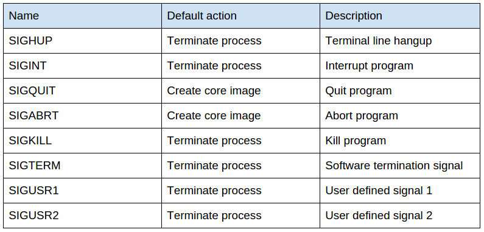

# Docker容器中进程管理工具

# 一、简介

为了防止容器中直接使用ENTRYPOINT或CMD指令启动命令或应用程序产生PID为1的进程无法处理传递信号给子进程或者无法接管孤儿进程，进而导致产生大量的僵尸进程。对于没有能力处理以上两个进程问题的PID进程，建议使用dumb-int或tini这种第三方工具来充当1号进程。

Linux系统中，PID为1的进程需要担任两个重要的使命：

1. **传递信号给子进程**

   如果pid为1的进程，无法向其子进程传递信号，可能导致容器发送SIGTERM信号之后，父进程等待子进程退出。此时，如果父进程不能将信号传递到子进程，则整个容器就将无法正常退出，除非向父进程发送SIGKILL信号，使其强行退出，这就会导致一些退出前的操作无法正常执行，例如关闭数据库连接、关闭输入输出流等。

2. **接管孤儿进程，防止出现僵尸进程**

   如果一个进程中A运行了一个子进程B，而这个子进程B又创建了一个子进程C，若子进程B非正常退出（通过SIGKILL信号，并不会传递SIGKILL信号给进程C），那么子进程C就会由进程A接管，一般情况下，我们在进程A中并不会处理对进程C的托管操作（进程A不会传递SIGTERM和SIGKILL信号给进程C），结果就导致了进程B结束了，倒是并没有回收其子进程C，子进程C就变成了僵尸进程。


在docker中，`docker stop`命令会发送`SIGTERM`信号给容器的主进程来处理。如果主进程没有处理这个信号，docker会在等待一段优雅grace的时间后，发送`SIGKILL`信号来强制终止




# 二、容器中僵尸进程的危害

详情参考：

1、https://blog.phusion.nl/2015/01/20/docker-and-the-pid-1-zombie-reaping-problem/

2、https://medium.com/@gchudnov/trapping-signals-in-docker-containers-7a57fdda7d86


# 三、dumb-int

Github：https://github.com/Yelp/dumb-init

dumb-int是一个用C写的轻量级进程管理工具。类似于一个初始化系统，

它充当PID 1，并立即以子进程的形式允许您的命令，注意在接收到信号时正确处理和转发它们

dumb-init 解决上述两个问题：向子进程代理发送信号和接管子进程。

默认情况下，dumb-init 会向子进程的进程组发送其收到的信号。原因也很简单，前面已经提到过，像 bash 这样的应用，自己接收到信号之后，不会向子进程发送信号。当然，dumb-init 也可以通过设置环境变量`DUMB_INIT_SETSID=0`来控制只向它的直接子进程发送信号。

另外 dumb-init 也会接管失去父进程的进程，确保其能正常退出。

## 安装

- Alpine镜像的APK可以直接安装

  ```bash
  FROM alpine:3.11.5
  RUN sed -i "s/dl-cdn.alpinelinux.org/mirrors.aliyun.com/g" /etc/apk/repositories \
      && apk add --no-cache dumb-init
  ENTRYPOINT ["dumb-init", "--"]
  CMD ["/usr/local/bin/docker-entrypoint.sh"] 
  ```

- 二进制安装

  ```bash
  RUN version=v1.2.2 && \
      wget -O /usr/local/bin/dumb-init https://github.com/Yelp/dumb-init/releases/download/$version/dumb-init_$version_amd64 && \
      chmod +x /usr/local/bin/dumb-init
  ```

- DEB/RPM安装

  ```bash
  RUN version=v1.2.2 && \
      wget https://github.com/Yelp/dumb-init/releases/download/$version/dumb-init_$version_amd64.deb | dpkg -i 
  
  apt-get instal dumb-init
  ```

- pip安装

  ```bash
  pip install dumb-init
  ```

# 三、tini

Github：https://github.com/krallin/tini 

## 安装

Alpine镜像的APK可以直接安装

```bash
FROM alpine:3.11.5
RUN sed -i "s/dl-cdn.alpinelinux.org/mirrors.aliyun.com/g" /etc/apk/repositories \
    && apk add --no-cache tini

ENTRYPOINT ["tini", "--"]
CMD ["/your/program", "-and", "-its", "arguments"]
```

# 四、应用场景

## 1、php-fpm进程的接管

针对php应用，通常采用`nginx+php-fpm`的架构来处理请求。为了保证php-fpm进程出现意外故障能够自动恢复，通常使用supervisor进程管理工具进行守护。php-fpm的进程管理类也类似于nginx，由master，worker进程组成。master进程不处理请求，而是由worker进程处理！master进程只负责管理worker进程。

master进程负责监听子进程的状态，子进程挂掉之后，会发信号给master进程，然后master进程重新启一个新的worker进程。

```bash
进程号 父进程号 进程
21 		10 			master
22		21				|----worker1
23		21				|----worker2
```

使用Supervisor启动、守护php-fpm进程时的进程树

```bash
进程号 父进程号 进程
10    9       supervisor
21 		10 					|---master
22		21								|----worker1
23		21								|----worker2

# 使用supervisor启动、守护的是php-fpm的master进程，然后master进程再根据配置启动对应数量的worker进程。
```

当php-fpm的master进程意外退出后的进程树

```bash
进程号 父进程号 进程
10    9       supervisor
22		1			  worker1
23		1			  worker2 

# 此时worker进程成为僵尸进程，被1号进程接管
```

此时supervisor检测到php-fpm master进程不存在就会在重新创建一个新的php-fpm master进程。但是会因为原先的php-fpm worker没有被杀掉，成为僵尸进程、依旧占用着端口而失败。本以为php-fpm会


# 参考

1. https://www.infoq.cn/article/2016/01/dumb-init-Docker
2. https://blog.phusion.nl/2015/01/20/docker-and-the-pid-1-zombie-reaping-problem/
3. https://medium.com/@gchudnov/trapping-signals-in-docker-containers-7a57fdda7d86