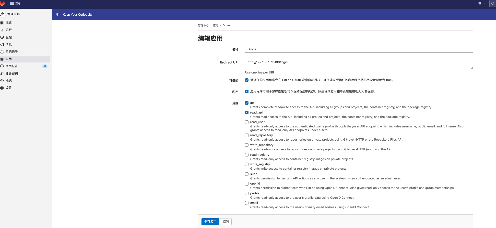

# Drone部署及配置

# 一、简介

# 二、部署

## 1、对接gitlab

- **生成随机secret**

  ```bash
  openssl rand -hex 16
  # 611f45c7*****b715da0cb17c91
  ```

- **配置Gitlab**

  - 在gitlab的管理中心添加集成应用，获取应用客户端的ID和Secret。权限授予`api`和`read_api`

  

- **docker-compose**

  `integrated-gitlab-docker-compose.yaml`

  ```yaml
  drone:
    image: 'drone/drone:2.12.1'
    restart: always
    container_name: drone
    environment:
      TZ: Asia/Shanghai
      # gitlab地址
      DRONE_GITLAB_SERVER: http://192.168.1.7:30000
      DRONE_GITLAB_CLIENT_ID: 876442ae9a*****0cd35a2
      DRONE_GITLAB_CLIENT_SECRET: 053d4a*****1dd3b81bece
      # 指定与runner通信的随机secret
      DRONE_RPC_SECRET: 611f45c7*****b715da0cb17c91
      DRONE_SERVER_HOST: 192.168.1.7:3180
      DRONE_SERVER_PROTO: http
      # 指定gitlab的用户为admin角色
      DRONE_USER_CREATE: username:root,admin:true
    ports:
      - '3180:80'
    volumes:
      - '/data/drone/data:/data'
  runner-ssh:
    image: 'drone/drone-runner-ssh:linux-amd64'
    restart: always
    container_name: drone-runner-ssh
    environment:
      TZ: Asia/Shanghai
      DRONE_RPC_PROTO: http
      DRONE_RPC_HOST: 192.168.1.7:3180
      DRONE_RPC_SECRET: 611f45c7*****b715da0cb17c91
    volumes:
      - '/data/drone/runner-data/ssh:/drone/src'
  runner-docker:
    image: 'drone/drone-runner-docker:1.8.2'
    restart: always
    container_name: drone-runner-docker
    environment:
      TZ: Asia/Shanghai
      DRONE_RPC_PROTO: http
      DRONE_RPC_HOST: 192.168.1.7:3180
      DRONE_RPC_SECRET: 611f45c7*****b715da0cb17c91
      DRONE_RUNNER_CAPACITY: 2
      DRONE_RUNNER_NAME: runner-docekr
    volumes:
      - '/var/run/docker.sock:/var/run/docker.sock'
      - '/data/drone/runner-data/docker:/drone/src'
  ```

  ```bash
  docker-compose -f integrated-gitlab-docker-compose.yaml up -d
  ```

参考：https://docs.drone.io/server/provider/gitlab/

## 2、对接Gogs

- **生成随机secret**

  ```bash
  openssl rand -hex 16
  # 8433b8***d0bf5
  ```

- **docker-compose**

  `integrated-gogs-docker-compose.yaml`

  ```yaml
  drone:
    image: 'drone/drone:2.12.1'
    restart: always
    container_name: drone
    environment:
      TZ: Asia/Shanghai
      DRONE_AGENTS_ENABLED: "true"
      DRONE_GOGS_SERVER: http://192.168.1.7:10880
      DRONE_RPC_SECRET: 8433b8***d0bf5
      DRONE_SERVER_HOST: 192.168.1.7:3180
      DRONE_SERVER_PROTO: http
      DRONE_USER_CREATE: username:root,admin:true
    ports:
      - '3180:80'
    volumes:
      - '/data/drone/integrated-gogs-data:/data'
  runner-ssh:
    image: 'drone/drone-runner-ssh:linux-amd64'
    restart: always
    container_name: drone-runner-ssh
    environment:
      TZ: Asia/Shanghai
      DRONE_RPC_PROTO: http
      DRONE_RPC_HOST: 192.168.1.7:3180
      DRONE_RPC_SECRET: 8433b8***d0bf5
    volumes:
      - '/data/drone/runner-data/ssh:/drone/src'
  runner-docker:
    image: 'drone/drone-runner-docker:1.8.2'
    restart: always
    container_name: drone-runner-docker
    environment:
      TZ: Asia/Shanghai
      DRONE_RPC_PROTO: http
      DRONE_RPC_HOST: 192.168.1.7:3180
      DRONE_RPC_SECRET: 8433b8***d0bf5
      DRONE_RUNNER_CAPACITY: 2
      DRONE_RUNNER_NAME: runner-docekr
    volumes:
      - '/var/run/docker.sock:/var/run/docker.sock'
      - '/data/drone/runner-data/docker:/drone/src'
  ```

  

参考：https://docs.drone.io/server/provider/gogs/


# 三、Pipeline


```bash
---
kind: pipeline
type: docker
name: default

workspace:
  path: /drone/src

steps:
- name: build
  image: golang
  volumes:
  - name: cache
    path: /tmp/cache
  commands:
  - export GOPROXY=https://goproxy.io,direct
  - export GOCACHE=/tmp/cache
  - go build
trigger:
  branch:
  - master

volumes:
- name: cache
  host:
    path: /data/drone/runner-data/docker/go-cache
```


# 参考：

- https://blog.csdn.net/uisoul/article/details/113554242
- https://docs.drone.io/server/provider/gitlab/
- https://docs.drone.io/server/provider/gogs/
- https://blog.csdn.net/qq_35425070/article/details/106822191
- https://blog.csdn.net/qq_35425070/article/details/106822146

