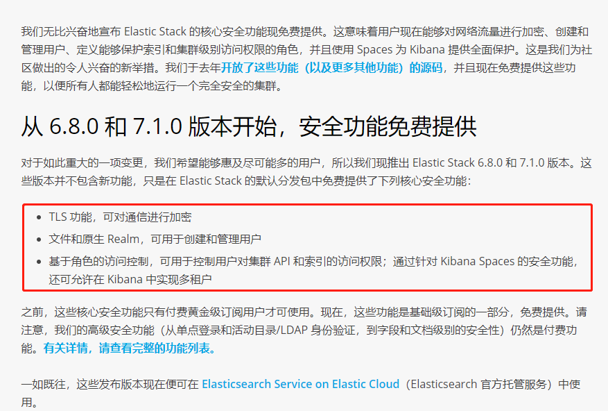
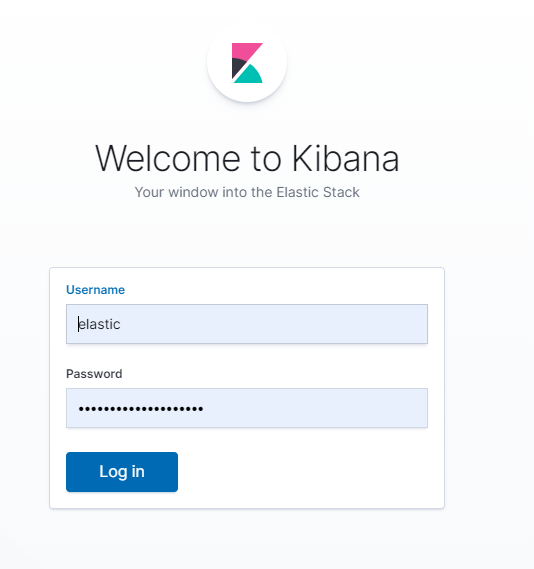
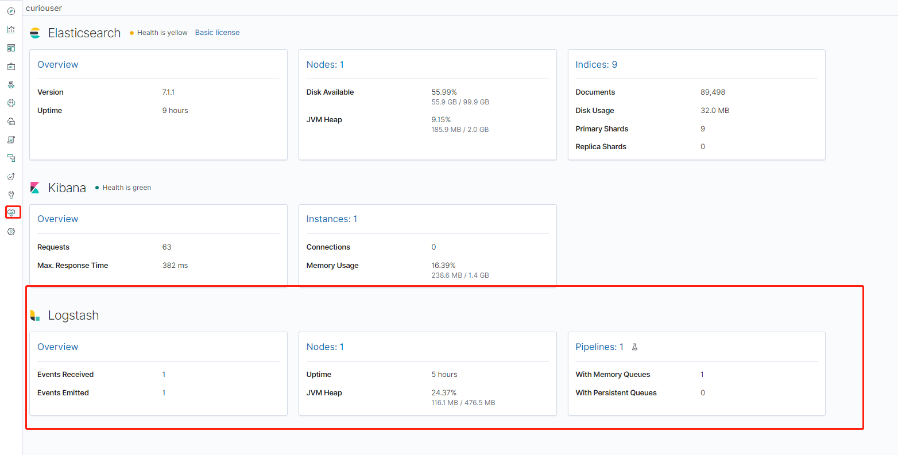
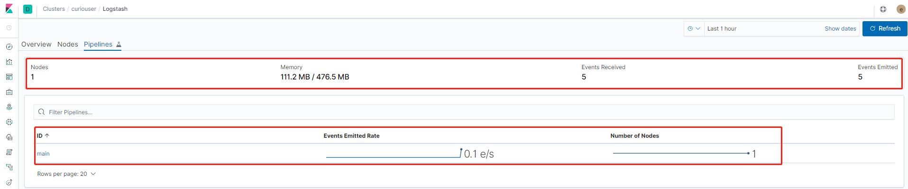
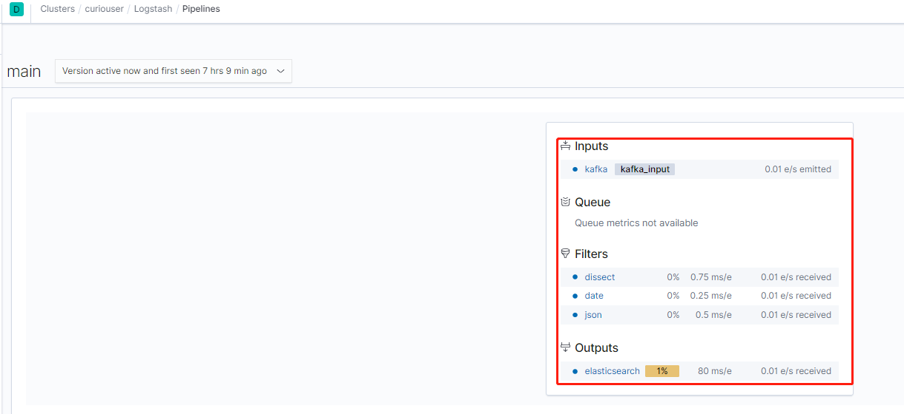
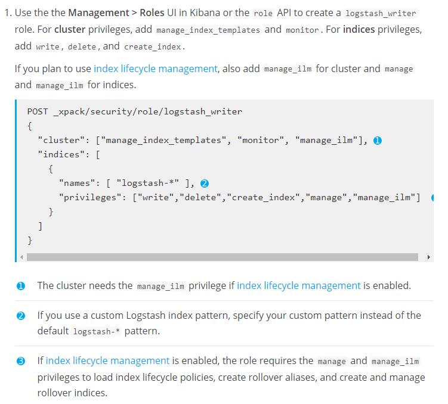
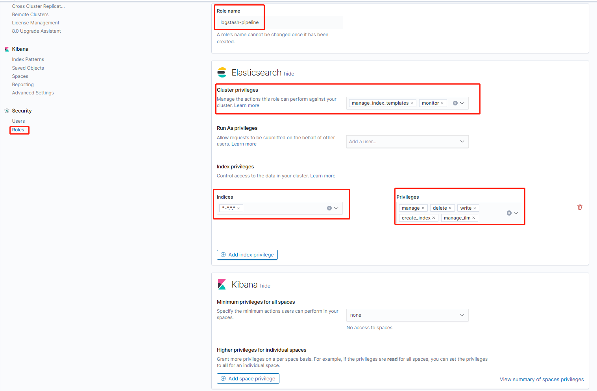
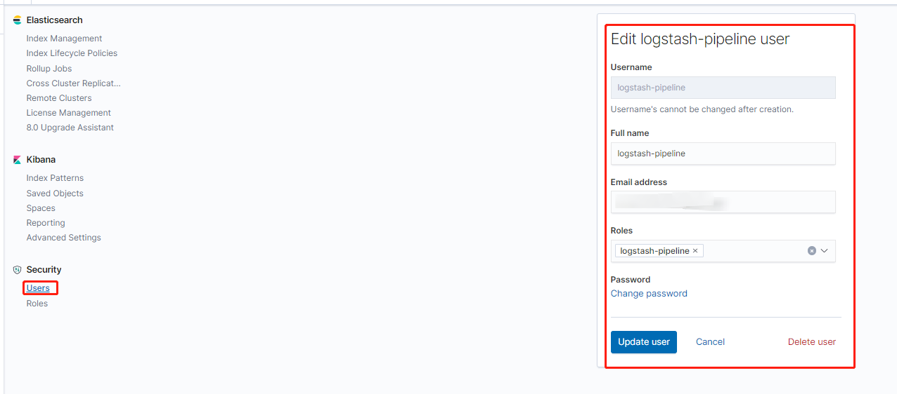
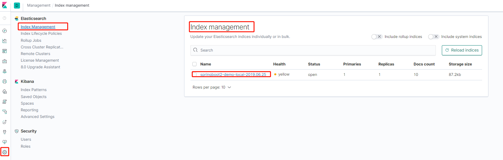

# 一、Context
之前ELK套装安装X-Pack的安全功能时，只有安装30天的试用许可证时间，以允许访问所有功能。 当许可证到期时，X-Pack将以降级模式运行。可以购买订阅以继续使用X-Pack组件的全部功能（https://www.elastic.co/subscriptions）。但是,最近官方从6.8.0和7.1.0开始免费提供安全功能. 


**`本次实验,所有ELK组件版本均为7.1.0,以容器单节点运行`**

# 二. Elasticsearch开启Xpack
1. elasticsearch的容器化部署参考笔记: ElasticSearch的容器化部署.md 
2. 配置参数可以通过环境变量的方式注入,主要的几个环境变量参数
   * xpack.monitoring.collection.enabled(开启自我监控): true
   * path.repo(设置snapshot存储仓库的路径): /usr/share/elasticsearch/snapshots-repository
   * discovery.type(设置当前节点为单节点模式): single-node
   * cluster.name(设置elasticsearch的集群名): curiouser
   * bootstrap.memory_lock: 'true'
   * TZ(设置时区): Asia/Shanghai
   * ES_JAVA_OPTS(设置elasticsearch的JVM堆栈大小): '-Xms1g -Xmx2g'
   * ELASTIC_USERNAME: "kibana"
   * ELASTIC_PASSWORD: "kibana"
   * xpack.security.enabled: 'true'
   * xpack.security.transport.ssl.enabled: "true"
   * xpack.security.transport.ssl.verification_mode: "certificate"
   * xpack.security.transport.ssl.keystore.path: "/usr/share/elasticsearch/config/certs/elastic-certificates.p12"
   * xpack.security.transport.ssl.truststore.path: "/usr/share/elasticsearch/config/certs/elastic-certificates.p12"
   * xpack.security.http.ssl.enabled: "false"

3. 查看elasticsearch是否开启xpack的安全验证


```bash
curl  -XGET 'localhost:9200/_cat/health?v&pretty'
# curl -XGET "http://127.0.0.1:9200/_cat/health?v&pretty"
# 使用上述命令会返回401,提示未授权验证,使用以下命令进行安全验证地访问
curl --user kibana:****kibana用户的密码**** -XGET 'localhost:9200/_cat/health?v&pretty'
```

# 三、Kibana开启Xpack

1. kibana的容器化部署详见笔记: Kibana的容器化部署.md
2. 配置参数可以通过环境变量的方式注入,主要的几个环境变量参数:

   * `ELASTICSEARCH_USERNAME`: ****kibana用户****
   * `ELASTICSEARCH_PASSWORD`: ****kibana用户的随机密码****
   * `TZ(设置时区)`: Asia/Shanghai

3. 镜像中默认指定的elasticsearch地址为:http://elasticsearch:9200,刚好在open shift中部署的elasticsearch的svc名为"elasticsearch",它的访问方式为:http://elasticsearch:9200或者http://elasticsearch.命名空间.svc:9200

4. 登录Kibana进行验证
    
    使用elastic 超级用户进行登录，密码来自 setup-passwords 命令输出的结果

    

# 四、Logstash开启Xpack

1. 配置logstash发送监控数据到elasticsearch
   ```bash
    xpack.monitoring.elasticsearch.hosts: "http://elasticsearch:9200"
    xpack.monitoring.enabled: "true"
    xpack.monitoring.elasticsearch.username: "logstash_system"
    xpack.monitoring.elasticsearch.password: "***logstash_system用户的密码****"
   ```

2. 在kibana中查看logstash的监控数据

    
    
    

3. 在kibana中创建logstash-pipeline角色,授予"manage_index_template","monitor"的集群权限和"write","delete","create_index","manage_ilm","manage"的Index权限,然后绑定到logstash-pipeline用户上,用以创建Index并向其中写入数据

   
   
   

4. 在pipeline的elasticsearch output插件中设置用户和密码
   ```bash
    output{
        elasticsearch{
            hosts => "elasticsearch:9200"
            index => "%{AppID}-%{+YYYY.MM.dd}"
            user => "logstash-pipeline"
            password => "****logstash-pipeline用户密码****"
        }
    }
   ```

5. 查看logstash的pipeline是否将数据写入的elasticsearch



# 附录：Kibana上的角色权限

**`Cluster相关的角色权限`**

| 角色权限 | 权限描述 |
| ----------------------------- | ------------------------------------------------------------ |
| all | Privileges to create snapshots for existing repositories. Can also list and view details on existing repositories and snapshots. |
| create_snapshot | Privileges to create snapshots for existing repositories. Can also list and view details on existing repositories and snapshots. |
| manage | Builds on `monitor` and adds cluster operations that change values in the cluster. This includes snapshotting, updating settings, and rerouting. It also includes obtaining snapshot and restore status. This privilege does not include the ability to manage security. |
| manage_ccr | All cross-cluster replication operations related to managing follower indices and auto-follow patterns. It also includes the authority to grant the privileges necessary to manage follower indices and auto-follow patterns. This privilege is necessary only on clusters that contain follower indices. |
| manage_data_frame_transforms | All operations on index templates. |
| manage_ilm | All operations on index templates. |
| manage_index_templates | All operations on index templates. |
| manage_ingest_pipelines | All operations on ingest node pipelines. |
| manage_ml | All machine learning operations, such as creating and deleting datafeeds, jobs, and model snapshots.<br/>Note：Datafeeds that were created prior to version 6.2 or created when security features were disabled run as a system user with elevated privileges, including permission to read all indices. Newer datafeeds run with the security roles of the user who created or updated them. |
| manage_pipeline | All operations on ingest pipelines. |
| manage_rollup | All rollup operations, including creating, starting, stopping and deleting rollup jobs. |
| manage_saml | Enables the use of internal Elasticsearch APIs to initiate and manage SAML authentication on behalf of other users. |
| manage_security | All security-related operations such as CRUD operations on users and roles and cache clearing. |
| manage_token | All security-related operations on tokens that are generated by the Elasticsearch Token Service. |
| manage_watcher | All watcher operations, such as putting watches, executing, activate or acknowledging.<br/>Note：Watches that were created prior to version 6.1 or created when the security features were disabled run as a system user with elevated privileges, including permission to read and write all indices. Newer watches run with the security roles of the user who created or updated them. |
| monitor | All cluster read-only operations, like cluster health and state, hot threads, node info, node and cluster stats, and pending cluster tasks. |
| monitor_data_frame_transforms | All read-only operations related to data frames. |
| monitor_ml | All read-only machine learning operations, such as getting information about datafeeds, jobs, model snapshots, or results. |
| monitor_rollup | All read-only rollup operations, such as viewing the list of historical and currently running rollup jobs and their capabilities. |
| monitor_watcher | All read-only watcher operations, such as getting a watch and watcher stats. |
| read_ccr | All read-only cross-cluster replication operations, such as getting information about indices and metadata for leader indices in the cluster. It also includes the authority to check whether users have the appropriate privileges to follow leader indices. This privilege is necessary only on clusters that contain leader indices. |
| read_ilm | All read-only index lifecycle management operations, such as getting policies and checking the status of index lifecycle management |
| transport_client | All privileges necessary for a transport client to connect. Required by the remote cluster to enable Cross Cluster Search. |

**`Index相关的角色权限`**

| 角色权限 | 权限描述 |
| ------------------------ | ------------------------------------------------------------ |
| all | Any action on an index |
| create | Privilege to index documents. Also grants access to the update mapping action.<br/>Note<br/>This privilege does not restrict the index operation to the creation of documents but instead restricts API use to the index API. The index API allows a user to overwrite a previously indexed document. |
| create_index | Privilege to create an index. A create index request may contain aliases to be added to the index once created. In that case the request requires the manage privilege as well, on both the index and the aliases names. |
| delete | Privilege to delete documents. |
| delete_index | Privilege to delete an index. |
| index | Privilege to index and update documents. Also grants access to the update mapping action. |
| manage | All monitor privileges plus index administration (aliases, analyze, cache clear, close, delete, exists, flush, mapping, open, force merge, refresh, settings, search shards, templates, validate). |
| manage_follow_index | All actions that are required to manage the lifecycle of a follower index, which includes creating a follower index, closing it, and converting it to a regular index. This privilege is necessary only on clusters that contain follower indices. |
| manage_ilm | All index lifecycle management operations relating to managing the execution of policies of an index This includes operations like retrying policies, and removing a policy from an index. |
| manage_leader_index | All actions that are required to manage the lifecycle of a leader index, which includes forgetting a follower. This privilege is necessary only on clusters that contain leader indices. |
| monitor | All actions that are required for monitoring (recovery, segments info, index stats and status). |
| read | Read-only access to actions (count, explain, get, mget, get indexed scripts, more like this, multi percolate/search/termvector, percolate, scroll, clear_scroll, search, suggest, tv). |
| read_cross_cluster | Read-only access to the search action from a remote cluster. |
| view_index_metadata | Read-only access to index metadata (aliases, aliases exists, get index, exists, field mappings, mappings, search shards, type exists, validate, warmers, settings, ilm). This privilege is primarily available for use by Kibana users. |
| write | Privilege to perform all write operations to documents, which includes the permission to index, update, and delete documents as well as performing bulk operations. Also grants access to the update mapping action. |

# 参考链接

https://www.elastic.co/cn/blog/getting-started-with-elasticsearch-security 
https://www.elastic.co/guide/en/elasticsearch/reference/current/docker.html 
https://www.elastic.co/guide/en/elastic-stack-overview/7.1/get-started-logstash-user.html 
https://www.elastic.co/guide/en/logstash/current/ls-security.html 
https://www.elastic.co/guide/en/logstash/current/docker-config.html#docker-env-config


