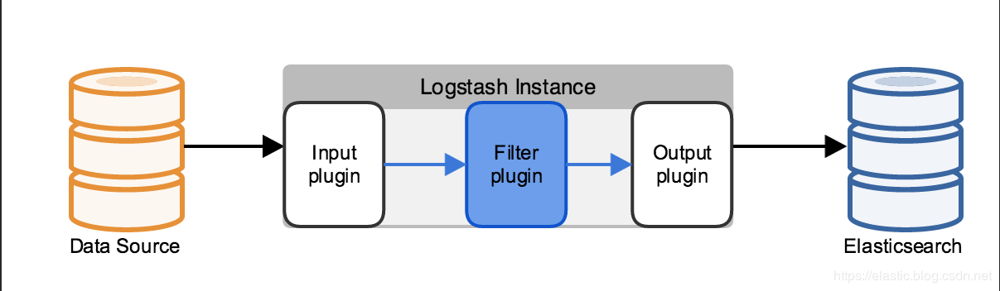
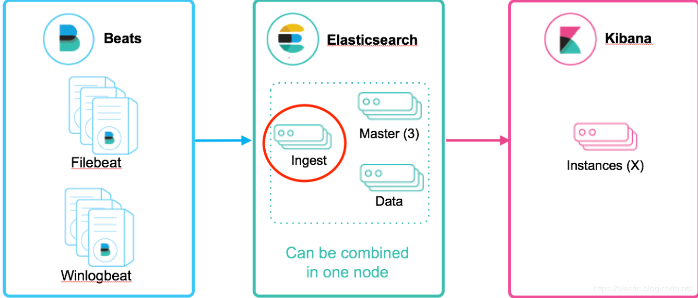

# ElasticSearch的Ingest角色节点

# 一、简介

Elasticsearch集群中的每一个节点有着各自的角色，不同的功能，共同保证集群存储分片、分词索引、聚合搜索等功能。

- **Master节点**：负责集群相关的操作，例如创建或删除索引，跟踪哪些节点是集群的一部分，以及决定将哪些分片分配给哪些节点。
  拥有稳定的主节点是衡量集群健康的重要标志。
- **Data节点**：保存包含索引文档的分片数据，执行CRUD、搜索、聚合相关的操作。属于内存、CPU、IO密集型，对硬件资源要求高。
- **Coordinating节点**：
  - 每一个节点都默认设置为了协调节点。
  - 搜索请求或大容量索引请求可能涉及不同数据节点上的数据。例如，搜索请求是分两个阶段执行的，由接收客户端请求的节点(即协调节点)进行协调。在分散阶段，协调节点将请求转发给持有数据的数据节点。每个数据节点在本地执行请求并将结果返回给协调节点。在收集阶段，协调节点将每个数据节点的结果简化为单个全局结果集。
- **Ingest节点**：可以看作是数据前置处理转换的节点。在实际的文档索引发生之前，Ingest节点会`拦截批量和索引请求`，然后使用ingest Pipeline对文档进行过滤、转换等`数据转换预处理操作`，然后`将文档传递回索引或批量API`。类似于 logstash 中 filter 的作用。
  - Ingest是5.X版本就有的特性
  - Ingest节点是通过包含多个processor的pipeline对文档进行预处理操作，processor是实际处理数据的插件。
  - 默认情况下，所有节点都启用Ingest角色，因此任何节点都可以处理Ingest任务
  - 可以创建专用的Ingest节点
  - 要禁用节点的Ingest功能，需要在elasticsearch.yml 设置"node.ingest：false"

# 二、Ingest Pipeline与Logstash Filter

**Logstash处理数据的流程**：logstash在pipeline filter中设置不同的插件对从Input传过来的数据进行加工处理，再输出带output中。



**Easticsearch Ingest Pipeline节点处理数据的流程**：Ingest Pipeline是Ingest节点上用于



|                        | Logstash Filter                                              | Ingest Pipeline                                              |
| ---------------------- | ------------------------------------------------------------ | ------------------------------------------------------------ |
| 支持的数据源           | 大量的输入和输出插件（比如：kafka，redis等）可供使用         | 不能从外部来源（例如消息队列或数据库）提取数据，必须批量bulk或索引index请求将数据推送到 Elasticsearch |
| 应对数据激增的能力不同 | Logstash 可在本地对数据进行缓冲以应对采集骤升情况。Logstash 支持与大量不同的消息队列类型进行集成。 | 极限情况下会出现：在长时间无法联系上 Elasticsearch 或者 Elasticsearch 无法接受数据的情况下，均有可能会丢失数据。 |
| 处理能力不同           | 支持的插件和功能点较Ingest节点多很多。                       | 支持为数不多处理器操作。Ingest节点管道只能在单一事件的上下文中运行。Ingest通常不能调用其他系统或者从磁盘中读取数据。 |
| 排他式功能支持不同     | 支持采集附件处理器插件，此插件可用来处理和索引常见格式（例如 PPT、XLS 和 PDF）的附件。 | 不支持如上文件附件类型。                                     |

# **三、Ingest Pipeline**

## 1. Ingest Pipeline的定义及使用

Ingest Pipeline中每个processor实现了对文档的某种转换，如移除某个字段，重命名某个字段等操作。pipeline定义语法格式如下：

```json
PUT _ingest/pipeline/my-pipeline-id
{
  "description" : "...",		# Pipeline功能描述(必须，string类型)
  "version" : 123,				# 用于管理ingest pipeline的版本号(可选，Integer类型)
  "processors" : [ ... ]		# 指定1个或多个processor(必须，数组类型)
}
```

要使用某个pipeline，只需要在请求中简单的指定pipeline的id就可以了：

```
PUT my-index/_doc/doc_id?pipeline=my_pipeline_id
{
  "a": "b",
  "foo": "bar"
}
```

## 2. Ingest Pipeline的管理API

### ① [Put](https://www.elastic.co/guide/en/elasticsearch/reference/current/put-pipeline-api.html) 

添加或更新Pipeline

```json
PUT /_ingest/pipeline/my-pipeline-id
{
  "description" : "describe pipeline",
  "version" : 123,
  "processors" : [
    {
      "set" : {
        "field": "foo",
        "value": "bar"
      }
    }
  ]
}
```

### ② [Get](https://www.elastic.co/guide/en/elasticsearch/reference/current/get-pipeline-api.html) 

查看指定的Pipeline

```json
GET _ingest/pipeline/my-pipeline-id
```

查看Pipeline的指定参数，例如查看Pipeline的版本号字段

```json
GET /_ingest/pipeline/my-pipeline-id?filter_path=*.version
```

### ③ [Delete](https://www.elastic.co/guide/en/elasticsearch/reference/current/delete-pipeline-api.html) 

删除指定Pipeline

```json
DELETE /_ingest/pipeline/my-pipeline-id
```

删除模糊匹配的Pipeline

```json
DELETE /_ingest/pipeline/pipeline-*
```

删除所有Pipeline

```json
DELETE /_ingest/pipeline/*
```

### ④ 模拟测试

调用Ingest pipeline对指定的文档进行模拟测试。可以指定一个现有的Ingest pipeline来对提供的文档进行模拟测试，也可以在请求体中提供Ingest pipeline定义。

```json
POST _ingest/pipeline/_simulate
{
  "pipeline": {
    "description": "template",
    "processors": [
      {
        "set": {
          "field": "{{name}}",
          "value": "{{name}} {{age}} {{birth}}"
        }
      },
      {
        "set": {
          "field": "time",
          "value": "{{_ingest.timestamp}}"
        }
      }
    ] 
  }, 
  "docs": [
    {
      "_index": "simulate_test",
      "_source": {
        "name": "kyle",
        "age": 18,
        "birth": "1993-09-01"
      }
    },
    {
      "_index": "simulate_test",
      "_source": {
        "name": "reason",
        "age": 20,
        "birth": "1990-02-03"
      }
    }
    ]
}
```

模拟测试调用已经创建的Ingest Pipeline

```json
POST /_ingest/pipeline/my-pipeline-id/_simulate
{
  "docs": [
    {
      "_index": "index",
      "_id": "id",
      "_source": {
        "foo": "bar"
      }
    },
    {
      "_index": "index",
      "_id": "id",
      "_source": {
        "foo": "rab"
      }
    }
  ]
}
```

**`docs`**(必须, 数组)字段支持的参数:

- **`_index`**：(可选, string类型) 包含文档的索引名
- **`_id`**：(可选, string类型) 文档的唯一标识
- **`_source`**：(必须, json对象) 文档的JSON数据

## 3. Index Setting设置索引默认Ingest Pipeline

可在Index Setting中设置`“index.default_pipeline”`参数指定默认Ingest Pipeline。如果Index Setting设置了默认Ingest Pipeline,但Ingest Pipeline不存在，索引请求将会失败。参数值设为`_none`则表示不使用Ingest Pipeline进行文档预处理

```json
PUT test/_settings
{
  "number_of_replicas": 0,
  "index":{
    "analysis.analyzer.default.type":"ik_max_word",
    "analysis.search_analyzer.default.type":"ik_smart",
    "default_pipeline": "my-pipeline-id"
  }
}
```

# 四、Ingest Pipeline中的Processors

- Processor的配置格式如下

  ```json
  {
    "PROCESSOR_NAME" : {
      ... processor configuration options ...
    }
  }
  ```

- 所有Processors支持以下通用参数
  - **tag**：只是Pipeline中特定Processors实例化的字符串标识符。tag字段不影响处理Processors的行为，但是对于特定Processors的记录和跟踪错误非常有用。
  - **on_failure**：用于设置Pipeline或Processor中的异常处理。详情见[Ingest Pipeline的异常处理](.\#五、ingest-pipeline的异常处理)
  - **if**：设置判断条件来决定Processors是否处理符合条件的文档。详情见[Processor中的条件判断](.\#2-processor中的条件判断)

## 1. Processor获取、处理文档中的字段数据

- **获取文档`_source` 原始数据中的字段**

  ```json
  {
    "set": {
      "field": "my_field",
      "value": 582.1
    }
  }
  # 或者
  {
    "set": {
      "field": "_source.my_field",
      "value": 582.1
    }
  }
  ```

- **获取文档Metadata元数据中的字段**

  Processor可直接处理文档Metadata元数据中`_index`,`_type`,`_id`,`_routing` 

  Elasticsearch不允许原始数据`_source`中的字段与Metadata元数据中的字段相同

  ```json
  {
    "set": {
      "field": "_id",
      "value": "1"
    }
  }
  ```

- **获取Ingest的元数据字段**

  除了文档`Metadata`元数据和`_source`原始数据中的字段外，Processor可以在文档处理过程中添加与Ingest相关的元数据。Ingest元数据是暂时的，在文档被管道处理之后就会丢失，因此不会被索引。

  例如ingest会在在`_ingest`下添加了ingest时间戳，用于标识对文档进行预处理的时间，获取方式如下：
  
  ```json
  # 该示例添加了一个名称为received的字段。该值是es收到index 或 bulk 请求预处理文档的时间。
  {
    "set": {
      "field": "received",
      "value": "{{_ingest.timestamp}}"
    }
  }
  ```

## 2. Processor中的条件判断

- Ingest pipeline的processor支持if判断来决定是否处理指定条件的文档。if字段必须包含返回布尔值的脚本。如果脚本的计算结果为true，那么将为给定的文档执行Processor，否则将跳过它。
- Ingest pipeline processor中的`if`判断语句会被解释为elasticsearch官方支持的“`Painless script`”格式脚本
- if字段使用脚本选项中定义的脚本字段作为对象，并通过脚本处理程序中脚本使用的相同的ctx变量访问文档的只读版本。

### ① 在判断条件中获取文档中的嵌套字段

- 在文档中原始数据`_source`下有大量的嵌套JSON数据，那如何在Processor中的条件获取中嵌套较深的字段数据呢？可使用“a.b.c”这种形式获取。

- 如果原始数据中没有a.b存在，条件语句会抛出“`NullPointerExceptions`”的异常，可在Processor的条件判断引用字段时使用“`?.`”

```json
PUT _ingest/pipeline/drop_guests_network
{
  "processors": [
    {
      "drop": {
        "if": "ctx.network?.name == 'Guest'"
      }
    }
  ]
}
```

### ② 复杂的条件判断

例如可以在drop processor中，判断原始数据某个数组类型的字段中是否包含"prod"特殊字符

```json
PUT _ingest/pipeline/not_prod_dropper
{
  "processors": [
    {
      "drop": {
        "if": """
            Collection tags = ctx.tags;
            if(tags != null){
              for (String tag : tags) {
                  if (tag.toLowerCase().contains('prod')) {
                      return false;
                  }
              }
            }
            return true;
        """
      }
    }
  ]
}
# 以下文档会被丢弃
POST test/_doc/1?pipeline=not_prod_dropper
{
  "tags": ["application:myapp", "env:Stage"]
}
# 以下文档不会被丢弃
POST test/_doc/2?pipeline=not_prod_dropper
{
  "tags": ["application:myapp", "env:Production"]
}
```

### ③ 判断条件的正则表达式

如果要在if条件中使用正则表达式，需要在elasticsearch.yml中设置`script.painless.regex.enabled: true`

```json
PUT _ingest/pipeline/check_url
{
  "processors": [
    {
      "set": {
        "if": "ctx.href?.url =~ /^http[^s]/",
        "field": "href.insecure",
        "value": true
      }
    }
  ]
}
```

```json
PUT _ingest/pipeline/check_url
{
  "processors": [
    {
      "set": {
        "if": "ctx.href?.url != null && ctx.href.url.startsWith('http://')",
        "field": "href.insecure",
        "value": true
      }
    }
  ]
}
```

### ④ Pipeline Processor中的条件判断

可在Pipeline Processor中设置判断条件来决定是否调用其他Pipeline

```json
PUT _ingest/pipeline/logs_pipeline
{
  "description": "A pipeline of pipelines for log files",
  "version": 1,
  "processors": [
    {
      "pipeline": {
        "if": "ctx.service?.name == 'apache_httpd'",
        "name": "httpd_pipeline"
      }
    },
    {
      "pipeline": {
        "if": "ctx.service?.name == 'syslog'",
        "name": "syslog_pipeline"
      }
    },
    {
      "fail": {
        "message": "This pipeline requires service.name to be either `syslog` or `apache_httpd`"
      }
    }
  ]
}
```

## 3. 内置的Processors

- [Append Processor](https://www.elastic.co/guide/en/elasticsearch/reference/current/append-processor.html)
- [Bytes Processor](https://www.elastic.co/guide/en/elasticsearch/reference/current/bytes-processor.html)
- [Circle Processor](https://www.elastic.co/guide/en/elasticsearch/reference/current/ingest-circle-processor.html)
- [Convert Processor](https://www.elastic.co/guide/en/elasticsearch/reference/current/convert-processor.html)
- [Date Processor](https://www.elastic.co/guide/en/elasticsearch/reference/current/date-processor.html)
- [Date Index Name Processor](https://www.elastic.co/guide/en/elasticsearch/reference/current/date-index-name-processor.html)
- [Dissect Processor](https://www.elastic.co/guide/en/elasticsearch/reference/current/dissect-processor.html)
- [Dot Expander Processor](https://www.elastic.co/guide/en/elasticsearch/reference/current/dot-expand-processor.html)
- [Drop Processor](https://www.elastic.co/guide/en/elasticsearch/reference/current/drop-processor.html)
- [Fail Processor](https://www.elastic.co/guide/en/elasticsearch/reference/current/fail-processor.html)
- [Foreach Processor](https://www.elastic.co/guide/en/elasticsearch/reference/current/foreach-processor.html)
- [GeoIP Processor](https://www.elastic.co/guide/en/elasticsearch/reference/current/geoip-processor.html)
- [Grok Processor](https://www.elastic.co/guide/en/elasticsearch/reference/current/grok-processor.html)
- [Gsub Processor](https://www.elastic.co/guide/en/elasticsearch/reference/current/gsub-processor.html)
- [HTML Strip Processor](https://www.elastic.co/guide/en/elasticsearch/reference/current/htmlstrip-processor.html)
- [Join Processor](https://www.elastic.co/guide/en/elasticsearch/reference/current/join-processor.html)
- [JSON Processor](https://www.elastic.co/guide/en/elasticsearch/reference/current/json-processor.html)
- [KV Processor](https://www.elastic.co/guide/en/elasticsearch/reference/current/kv-processor.html)
- [Lowercase Processor](https://www.elastic.co/guide/en/elasticsearch/reference/current/lowercase-processor.html)
- [Pipeline Processor](https://www.elastic.co/guide/en/elasticsearch/reference/current/pipeline-processor.html)
- [Remove Processor](https://www.elastic.co/guide/en/elasticsearch/reference/current/remove-processor.html)
- [Rename Processor](https://www.elastic.co/guide/en/elasticsearch/reference/current/rename-processor.html)
- [Script Processor](https://www.elastic.co/guide/en/elasticsearch/reference/current/script-processor.html)
- [Set Processor](https://www.elastic.co/guide/en/elasticsearch/reference/current/set-processor.html)
- [Set Security User Processor](https://www.elastic.co/guide/en/elasticsearch/reference/current/ingest-node-set-security-user-processor.html)
- [Split Processor](https://www.elastic.co/guide/en/elasticsearch/reference/current/split-processor.html)
- [Sort Processor](https://www.elastic.co/guide/en/elasticsearch/reference/current/sort-processor.html)
- [Trim Processor](https://www.elastic.co/guide/en/elasticsearch/reference/current/trim-processor.html)
- [Uppercase Processor](https://www.elastic.co/guide/en/elasticsearch/reference/current/uppercase-processor.html)
- [URL Decode Processor](https://www.elastic.co/guide/en/elasticsearch/reference/current/urldecode-processor.html)
- [User Agent processor](https://www.elastic.co/guide/en/elasticsearch/reference/current/user-agent-processor.html)

## 4. 自定义processors 

自定义的processors必须让所有elasticsearch节点都要安装，在elasticsearch.yml中添加“plugin.mandatory：ingest-attachment”

# 五、Ingest Pipeline的异常处理

针对一些比较复杂的Pipeline，其中可能定义了多个Processor进行文档处理，而这些Processor是按照顺序执行，如果在执行过程中一个遇到了异常，后续processor将不会执行，这是不可取的。

- 可以在pipeline或processor语法块中使用on_failure参数进行异常捕获。
- 如果在processor语法块指定了on_failure配置，不管它是否为空，processor抛出的任何异常都会被捕获，而Pipeline将继续执行其他的processor。

- 因为可以在on_failure语句的范围内定义更多的处理器，所以可以嵌套失败处理。

- 同时也可以设置`"on_failure": true`进行忽略异常，而不做任何处理

  ```json
  {
    "description" : "my first pipeline with handled exceptions",
    "processors" : [
      {
        "rename" : {
          "field" : "foo",
          "target_field" : "bar",
          "ignore_failure" : true
        }
      }
    ]
  }
  ```

以下Ingest Pipeline在rename processor中设置了当文档中没有指定字段"foo"时，会在异常处理参数中使用set processor添加"error"字段

```json
{
  "description" : "my first pipeline with handled exceptions",
  "processors" : [
    {
      "rename" : {
        "field" : "foo",
        "target_field" : "bar",
        "on_failure" : [
          {
            "set" : {
              "field" : "error",
              "value" : "field \"foo\" does not exist, cannot rename to \"bar\""
            }
          }
        ]
      }
    }
  ]
}
```

以下Ingest Pipeline在全局定义块中设置了当匹pipeline其中processor处理抛出异常，整个pipeline出错时，会在异常处理参数中使用set processor添加"_index"字段

```json
{
  "description" : "my first pipeline with handled exceptions",
  "processors" : [ ... ],
  "on_failure" : [
    {
      "set" : {
        "field" : "_index",
        "value" : "failed-{{ _index }}"
      }
    }
  ]
}
```

# 六、Filebeat Modules模块的Ingest Pipeline

以Filebeat Nginx模块处理访问日志的Ingest PIpeline为例，文件路径：` /usr/share/filebeat/module/nginx/access/ingest/default.json`   

```json
{
    "description": "Pipeline for parsing Nginx access logs. Requires the geoip and user_agent plugins.",
    "processors": [
        {
            "grok": {
                "field": "message",
                "patterns": [
                    "\"?(?:%{IP_LIST:nginx.access.remote_ip_list}|%{DATA:source.address}) - %{DATA:user.name} \\[%{HTTPDATE:nginx.access.time}\\] \"%{DATA:nginx.access.info}\" %{NUMBER:http.response.status_code:long} %{NUMBER:http.response.body.bytes:long} \"%{DATA:http.request.referrer}\" \"%{DATA:user_agent.original}\""
                ],
                "pattern_definitions": {
                    "IP_LIST": "%{IP}(\"?,?\\s*%{IP})*"
                },
                "ignore_missing": true
            }
        },
        {
            "grok": {
                "field": "nginx.access.info",
                "patterns": [
                    "%{WORD:http.request.method} %{DATA:url.original} HTTP/%{NUMBER:http.version}",
                    ""
                ],
                "ignore_missing": true
            }
        },
        {
            "remove": {
                "field": "nginx.access.info"
            }
        },
        {
            "split": {
                "field": "nginx.access.remote_ip_list",
                "separator": "\"?,?\\s+",
                "ignore_missing": true
            }
        },
        {
            "split": {
                "field": "nginx.access.origin",
                "separator": "\"?,?\\s+",
                "ignore_missing": true
            }
        },
        {
            "set": {
                "field": "source.ip",
                "value": ""
            }
        },
        {
            "script": {
                "lang": "painless",
                "source": "boolean isPrivate(def dot, def ip) { try { StringTokenizer tok = new StringTokenizer(ip, dot); int firstByte = Integer.parseInt(tok.nextToken());       int secondByte = Integer.parseInt(tok.nextToken());       if (firstByte == 10) {         return true;       }       if (firstByte == 192 && secondByte == 168) {         return true;       }       if (firstByte == 172 && secondByte >= 16 && secondByte <= 31) {         return true;       }       if (firstByte == 127) {         return true;       }       return false;     } catch (Exception e) {       return false;     }   }   try {    ctx.source.ip = null;    if (ctx.nginx.access.remote_ip_list == null) { return; }    def found = false;    for (def item : ctx.nginx.access.remote_ip_list) {        if (!isPrivate(params.dot, item)) {            ctx.source.ip = item;            found = true;            break;        }    }    if (!found) {     ctx.source.ip = ctx.nginx.access.remote_ip_list[0];   }} catch (Exception e) { ctx.source.ip = null; }",
                "params": {
                    "dot": "."
                }
            }
        },
        {
            "remove": {
                "field": "source.ip",
                "if": "ctx.source.ip == null"
            }
        },
        {
            "convert": {
                "field": "source.ip",
                "target_field": "source.address",
                "type": "string",
                "ignore_missing": true
            }
        },
        {
            "remove": {
                "field": "message"
            }
        },
        {
            "rename": {
                "field": "@timestamp",
                "target_field": "event.created"
            }
        },
        {
            "date": {
                "field": "nginx.access.time",
                "target_field": "@timestamp",
                "formats": [
                    "dd/MMM/yyyy:H:m:s Z"
                ],
                "on_failure": [{"append": {"field": "error.message", "value": "{{ _ingest.on_failure_message }}"}}]
            }
        },
        {
            "remove": {
                "field": "nginx.access.time"
            }
        },
        {
            "user_agent": {
                "field": "user_agent.original"
            }
        },
        {
            "geoip": {
                "field": "source.ip",
                "target_field": "source.geo",
                "ignore_missing": true
            }
        },
        {
            "geoip": {
                "database_file": "GeoLite2-ASN.mmdb",
                "field": "source.ip",
                "target_field": "source.as",
                "properties": [
                    "asn",
                    "organization_name"
                ],
                "ignore_missing": true
            }
        },
        {
            "rename": {
                "field": "source.as.asn",
                "target_field": "source.as.number",
                "ignore_missing": true
            }
        },
        {
            "rename": {
                "field": "source.as.organization_name",
                "target_field": "source.as.organization.name",
                "ignore_missing": true
            }
        }
    ],
    "on_failure": [
        {
            "set": {
                "field": "error.message",
                "value": "{{ _ingest.on_failure_message }}"
            }
        }
    ]
}
```

# 七、logstash对接Ingest Pipeline

```yaml
input {
  beats {
    port => 5044
    id => "log-logstash-input-beat"
  }
}

filter {
  ...省略...
}

output {
 if "app-log" in [tags] {
    elasticsearch {
      id => "logstash-app-log-json"
      hosts => ["http://localhost:9200"]
      index => "%{[app]}-%{+YYYY-MM-dd}"
      # 此处指定使用的ingest Pipeline
      pipeline => "ingest pipeline的名字"
      http_compression => true
      user => "elastic"
      password => "***elastic用户名的密码***"
    }
}
```


# 参考文档

1. https://www.elastic.co/guide/en/elasticsearch/reference/current/ingest.html
2. https://blog.csdn.net/laoyang360/article/details/93376355
3. https://www.elastic.co/guide/en/logstash/current/use-ingest-pipelines.html