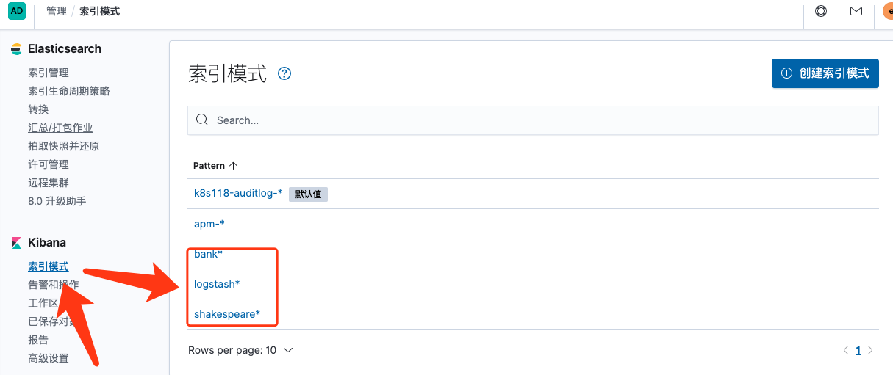
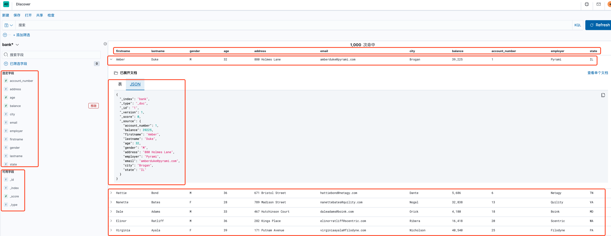
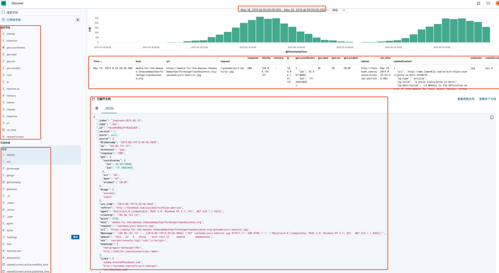
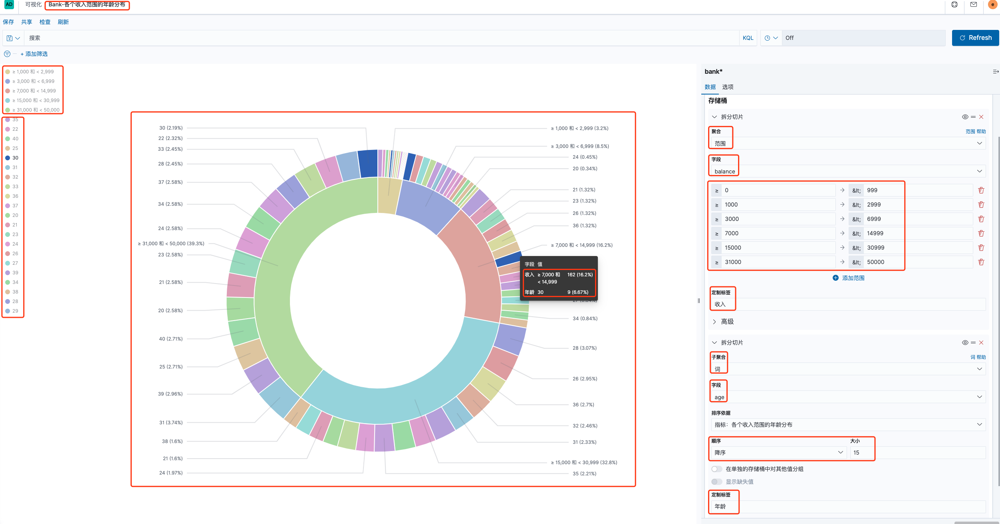

# 一、示例数据集说明

**示例数据集下载地址：**

```bash
curl -O https://download.elastic.co/demos/kibana/gettingstarted/8.x/shakespeare.json && \
curl -O https://download.elastic.co/demos/kibana/gettingstarted/8.x/accounts.zip && \
curl -O https://download.elastic.co/demos/kibana/gettingstarted/8.x/logs.jsonl.gz && \
unzip accounts.zip && \
gunzip logs.jsonl.gz
```

## ①shakespeare.json

莎士比亚所有的作品集。数据集的数据组织格式：

```json
{
    "line_id": INT,
    "play_name": "String",
    "speech_number": INT,
    "line_number": "String",
    "speaker": "String",
    "text_entry": "String",
}
```

## ②accounts.json

随机生成的虚拟账号信息，数据集的数据组织格式 

```json
{
    "account_number": INT,
    "balance": INT,
    "firstname": "String",
    "lastname": "String",
    "age": INT,
    "gender": "M or F",
    "address": "String",
    "employer": "String",
    "email": "String",
    "city": "String",
    "state": "String"
}
```

## ③logs.json

随机生成的日志数据，日志数据有几十个不同的字段，但是在教程中关注的字段如下：

```json
{
    "memory": INT,
    "geo.coordinates": "geo_point"
    "@timestamp": "date"
}
```

# 二、映射数据集

​    在导入数据集之前，我们需要为各个字段建立一个映射。映射把索引里的文档划分成逻辑组，定义字段的特性，如字段是否可被搜索、是否被标记、是否能被拆分成多个文字等。

## ①映射莎士比亚作品数据集

```json
PUT /shakespeare
{
  "mappings": {
    "properties": {
    "speaker": {"type": "keyword"},
    "play_name": {"type": "keyword"},
    "line_id": {"type": "integer"},
    "speech_number": {"type": "integer"}
    }
  }
}
#因为speaker和play_name字段是“keyword”字段，所以他们不参与处理分析。字符类型的字段被当做做单一单元，即使字段值有多个字符
```

## ②日志数据需要一个映射表明地理位置的经纬度，通过在那些字段使用一个geo_point类型。

```json
PUT /logstash-2015.05.18
{
  "mappings": {
    "properties": {
      "geo": {
        "properties": {
          "coordinates": {
            "type": "geo_point"
          }
        }
      }
    }
  }
}
```


```json
PUT /logstash-2015.05.19
{
  "mappings": {
    "properties": {
      "geo": {
        "properties": {
          "coordinates": {
            "type": "geo_point"
          }
        }
      }
    }
  }
}
```

```json
PUT /logstash-2015.05.20
{
  "mappings": {
    "properties": {
      "geo": {
        "properties": {
          "coordinates": {
            "type": "geo_point"
          }
        }
      }
    }
  }
}
```

## ③账号数据不需要任何映射，直接用ElasticSearch的bulk API导入数据

## ④Curl命令导入

```bash
curl -X PUT "localhost:9200/shakespeare?pretty" -H 'Content-Type: application/json' -d'
{
  "mappings": {
    "properties": {
    "speaker": {"type": "keyword"},
    "play_name": {"type": "keyword"},
    "line_id": {"type": "integer"},
    "speech_number": {"type": "integer"}
    }
  }
}
'


curl -X PUT "localhost:9200/logstash-2015.05.18?pretty" -H 'Content-Type: application/json' -d'
{
  "mappings": {
    "properties": {
      "geo": {
        "properties": {
          "coordinates": {
            "type": "geo_point"
          }
        }
      }
    }
  }
}
'
curl -X PUT "localhost:9200/logstash-2015.05.19?pretty" -H 'Content-Type: application/json' -d'
{
  "mappings": {
    "properties": {
      "geo": {
        "properties": {
          "coordinates": {
            "type": "geo_point"
          }
        }
      }
    }
  }
}
'
curl -X PUT "localhost:9200/logstash-2015.05.20?pretty" -H 'Content-Type: application/json' -d'
{
  "mappings": {
    "properties": {
      "geo": {
        "properties": {
          "coordinates": {
            "type": "geo_point"
          }
        }
      }
    }
  }
}
'

```

# 三、导入数据集

## 1、在数据集所在主机的shell利用curl命令导入数据集

①导入莎士比亚作品数据集到shakespeare索引里

```bash
curl -u elastic:密码 -H 'Content-Type: application/x-ndjson' \
-XPOST '127.0.0.1:9200/shakespeare/_bulk?pretty' \
--data-binary @shakespeare.json
```

②导入日志数据集

```bash
curl -u elastic:密码 -H 'Content-Type: application/x-ndjson' \
-XPOST '127.0.0.1:9200/_bulk?pretty' \
--data-binary @logs.jsonl
```

③导入账号数据集到bank索引

```bash
curl -u elastic:密码 -H 'Content-Type: application/x-ndjson' \
-XPOST '127.0.0.1:9200/bank/account/_bulk?pretty' \
--data-binary @accounts.json 
```

## 2、验证数据是否导入成功

在kibana的Dev Tools工具利用命令查看所有索引信息

```bash
GET _cat/indices/bank,shakespeare,logstash-2015*?v
health status index               pri rep docs.count docs.deleted store.size pri.store.size
green open   bank                  5   1       1000            0    418.2kb        418.2kb
green open   shakespeare           5   1     111396            0     17.6mb         17.6mb
green open   logstash-2015.05.18   5   1       4631            0     15.6mb         15.6mb
green open   logstash-2015.05.19   5   1       4624            0     15.7mb         15.7mb
green open   logstash-2015.05.20   5   1       4750            0     16.4mb         16.4mb
```

# 四、数据查询

## 1、只显示某些字段

```bash
GET /bank/_search
{
  "query": { "match_all": {} },
  "_source": ["account_number", "balance"]
}
# 或者
curl -X GET "localhost:9200/bank/_search" -H 'Content-Type: application/json' -d'
{
  "query": { "match_all": {} },
  "_source": ["account_number", "balance"]
}'
```

## 2、查询某字段值为20的Doc 

```json
GET /bank/_search
{
  "query": { "match": { "account_number": 20 } }
}
# 或者
curl -X GET "localhost:9200/bank/_search" -H 'Content-Type: application/json' -d'
{
  "query": { "match": { "account_number": 20 } }
}'
```

## 3、查询某字段包含"mill"的Doc

```json
GET /bank/_search
{
  "query": { "match": { "address": "mill" } }
}
# 或者
curl -X GET "localhost:9200/bank/_search" -H 'Content-Type: application/json' -d'
{
  "query": { "match": { "address": "mill" } }
}'
```

## 4、查询某字段包含"mill"或"lane"的Doc

```json
GET /bank/_search
{
  "query": { "match": { "address": "mill lane" } }
}
# 或者
curl -X GET "localhost:9200/bank/_search" -H 'Content-Type: application/json' -d'
{
  "query": { "match": { "address": "mill lane" } }
}'
```

```json
GET /bank/_search
{
  "query": {
    "bool": {
      "must": [
        { "match": { "address": "mill" } },
        { "match": { "address": "lane" } }
      ]
    }
  }
}
# 或者
curl -X GET "localhost:9200/bank/_search" -H 'Content-Type: application/json' -d'
{
  "query": {
    "bool": {
      "must": [
        { "match": { "address": "mill" } },
        { "match": { "address": "lane" } }
      ]
    }
  }
}
' 
```

```json
GET /bank/_search
{
  "query": {
    "bool": {
      "should": [
        { "match": { "address": "mill" } },
        { "match": { "address": "lane" } }
      ]
    }
  }
}
# 或者
curl -X GET "localhost:9200/bank/_search" -H 'Content-Type: application/json' -d'
{
  "query": {
    "bool": {
      "should": [
        { "match": { "address": "mill" } },
        { "match": { "address": "lane" } }
      ]
    }
  }
}'
```

# 五、数据搜索及可视化

## 1、创建索引模式



## 2、Discover中搜索数据





## 3、可视化数据

### 饼图显示bank数据各个收入范围的年龄分布



# 参考

1. https://www.elastic.co/guide/en/kibana/7.9/tutorial-build-dashboard.html