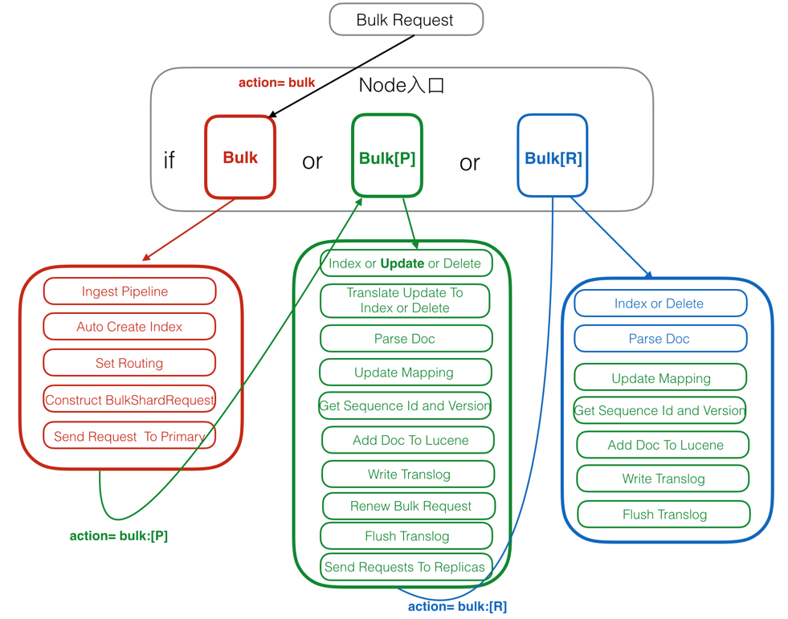

# Elasticsearch基础知识

# Document 文档

- **Elasticsearch 是面向Document文档的，文档是所有可搜索数据的最小单位**

- **文档会被序列化JSON格式，保存在Elasticsearch中**
  - JSON对象由字段组成
  - 每个字段都有对应的字段类型 (字符串/数值/布尔/日期/二进制/范围类型)

- **每个文档都有一个Unique ID**
  - 手动指定ID
  - 通过Elasticsearch自动生成
- **一个文档由Meta Data元数据与Source Data原始数据组成**

```json
{
  "_index": "***",					# 文档所存在的索引名
  "_type": "_doc",					# 文档所属的类型名
  "_id": "***",						# 文档的唯一ID
  "_version": 1,					# 文档的版本信息
  "_score": null,					# 文档相关性打分
  "_source": { .... },				# 文档的原始JSON数据
  "fields": { "***": [ "***" ] },	# 额外添加的字段
  "sort": [ 1575256044058 ]			# 排序
}
```

# Index 索引

索引，即一系列documents的集合。

# Shard 分片

 分片是独立的，对于一个Search Request的行为，每个分片都会执行这个Request。

分片分为两种类型：主分片（Primary Shard）和副本分片（Replica Shard）

- 主分片：用以解决数据水平扩展的问题，通过主分片，可以将数据分布到集群内的所有节点上(主从复制)
  - 主分片在索引创建时指定，后续不允许修改，除非reindex
  - 一个分片是一个运行的Lucene实例，Integer.MAX_VALUE - 128 = 2,147,483,519 个docs。
- 副本分片：用于解决数据高可用的问题，是主分片的拷贝（可以提高读吞吐量）
  - 副本分片数，可动态调整

主分片和备分片不会出现在同一个节点上（防止单点故障


# 集群节点类型

一个节点就是一个ElasticSearch的实例，本质上就是一个Java进程。

每个节点都有名字，通过配置文件，或者启动时候 -E node.name = node1指定

每一个节点在启动之后，会分配一个UID，保存在data目录下

生产环境中一个节点应该设置单一的角色（意味着节点可以多角色）

| 节点类型         | 配置参数    | 默认值                  | 作用                                                         | 备注                                                      |
| ---------------- | ----------- | ----------------------- | ------------------------------------------------------------ | --------------------------------------------------------- |
| master eligible  | node.master | true                    | 每个节点启动后，默认就是一个Master eligible节点（可以设置node.master:false 禁止）,Master-eligible节点可以参与选主流程，成为Master节点每个节点上都保存了集群的状态信息(所有节点信息，所有的索引和其相关的Mapping和Setting信息，分片路由信息)，只有Master节点可以修改集群状态信息 | 可以参加选主                                              |
| data             | node.data   | true                    | 当第一个节点启动，它会将自己选举成Master节点保存包含索引文档的分片数据，执行CRUD、搜索、聚合相关的操作。属于内存、CPU、IO密集型，对硬件资源要求高。 | 存储数据                                                  |
| ingest           | node.ingest | True                    |                                                              | ingest节点可以运行一些pipeline的脚本                      |
| Coordinating     | 无          |                         | 负责接收Client请求，将请求分发到合适的节点，最终把结果汇聚在一起返回给客户端。每个节点默认都起到了Coordinating Node的职责 | 每个节点默认都是coordinating节点，设置其他类型全部为false |
| machine learning | node.ml     | true(需要enable x-pack) |                                                              | 机器学习                                                  |


# 集群状态

ES集群状态有三种：

- **Green**：所有主分片和备份分片都准备就绪（分配成功），即使有一台机器挂了（假设一台机器一个实例），数据都不会丢失，但会变成Yellow状态
- **Yellow**：所有主分片准备就绪，但存在至少一个主分片（假设是A）对应的备份分片没有就绪，此时集群属于警告状态，意味着集群高可用和容灾能力下降，如果刚好A所在的机器挂了，并且你只设置了一个备份（已处于未就绪状态），那么A的数据就会丢失（查询结果不完整），此时集群进入Red状态
- **Red**：：至少有一个主分片没有就绪（直接原因是找不到对应的备份分片成为新的主分片）,此时查询的结果会出现数据丢失（不完整）


# Elasticsearch的写入请求

- Elasticsearch的写入请求主要包括：index、create、update、delete、bulk。bulk是实现对前四种的批量操作。

- 在6.x版本以后实际上走的都是bulk接口了。
- create/index是直接新增doc，delete是直接根据_id删除doc。


ES的任意节点都可以作为协调节点(coordinating node)接受请求，当协调节点接受到请求后进行一系列处理，然后通过_routing字段找到对应的primary shard，并将请求转发给primary shard, primary shard完成写入后，将写入并发发送给各replica， raplica执行写入操作后返回给primary shard， primary shard再将请求返回给协调节点

# Elasticsearch写入过程

- Elasticsearch中每个index由多个shard组成，默认是5个，每个shard分布在不同的机器上。shard分为主分片和副本分片。
- 
- 




​                      红色：Client Node（客户端节点）绿色：Primary Node（主分片节点）蓝色：Replica Node（副本分片节点）


# Elasticsearch索引过程

# Elasticsearch搜索过程

# Elasticsearch的准实时

Elasticsearch的核心优势就是近乎实时，为什么说是近乎实时而非真实意义上的实时呢，因为Elasticsearch能够做到准实时，而并不是完全的实时。