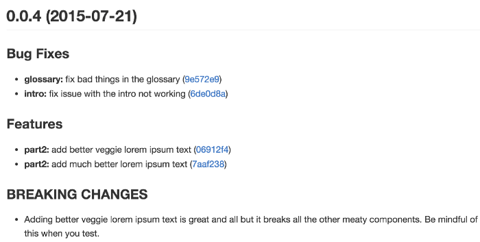
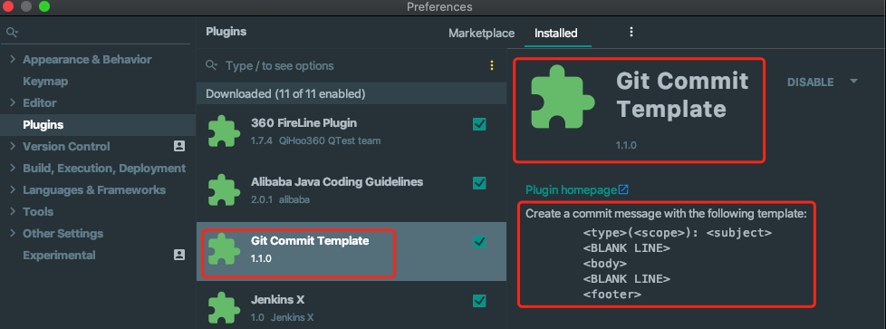
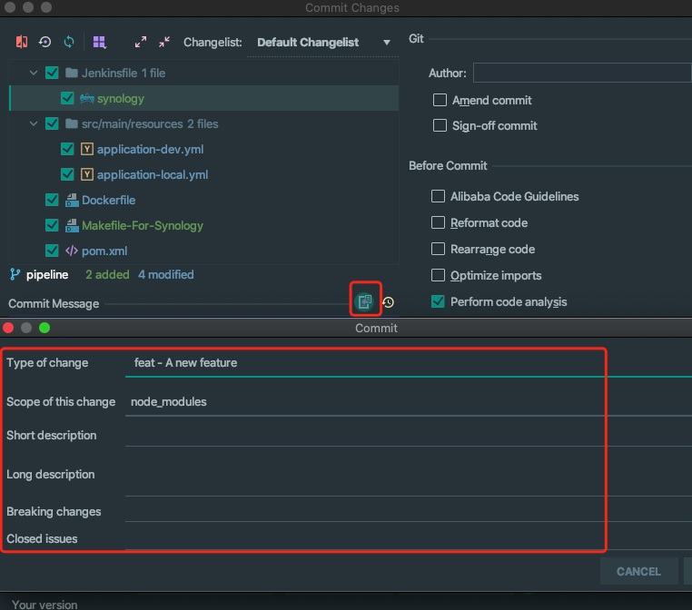
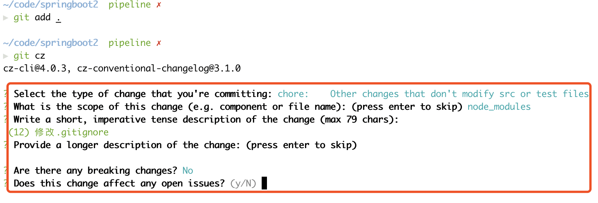

# git提交规范

# 一、规范的好处

当我们提交代码的时候，需要编写提交信息（commit message）。而提交信息的主要用途是：**告诉这个项目的人，这次代码提交里做了些什么**。所以每次的提交信息大家应该按照某种规范进行提交，最好是能有规范和工具的约束。

- **易于阅读，在最短时间清楚每次提交的意义**

  良好的Git提交日志非常重要，最明显的一点是，它让整个Git提交历史的阅读变得非常轻松。大多数情况下，看提交历史的人跟提交代码的人都不是同一个人，当别人阅读你的提交历史时，他很可能是不知道具体代码细节的，你如何在最短的时间内让他一眼知道每次提交的意义

  - 每次提交影响的具体范围？
  - 这个bug在哪次提交中被修复了？
  - 这个新功能是在哪次提交中增加的？
  - 修改是否向下兼容？
  - 是否回滚了代码？
  - 是否只是修改了文档、调整了代码格式？
  - 是否修改了测试、是否进行了重构？
  - 是否对代码进行了性能优化？

- **提供更多的历史信息，方便快速浏览。**

  ```bash
  git log <branch/tag> HEAD --pretty=format:%s
  ```

  

- **便于快速查找信息**

  可以过滤筛选某些commit

  ```bash
  git log <branch/tag> HEAD --grep feature
  ```

- **生成CHANGELOG**

  规范的Git提交历史，还可以直接生成项目发版的CHANGELOG

  

# 二、开源社区的Angular提交规范

与我们日常工作稍有不同的是：工作中的 Release 计划一般都是事先安排好的，不需要一些 CHANGELOG 什么的。而开源应用、开源库需要有对应的 CHANELOG，则添加了什么功能、修改了什么等等。毕竟有很多东西是由社区来维护的。目前，社区有多种 Commit message 的写法规范。[Angular 规范](https://docs.google.com/document/d/1QrDFcIiPjSLDn3EL15IJygNPiHORgU1_OOAqWjiDU5Y/edit#heading=h.greljkmo14y0)是目前使用最广的写法，比较合理和系统化，并且有配套的工具。

## 1. Angular规范的格式：

>  每个提交消息都由一个标题、一个正文和一个页脚组成。而标题又具有特殊格式，包括修改类型、影响范围和内容主题

```bash
<type修改类型>(<scope影响范围>): <subject标题或描述>
<--空行-->
[body正文]
<--空行-->
[footer注脚]
=============中文版==================
注意：
  <>中为必填项
  []中为可选项
  提交消息的任何一行都不能超过100个字符（为了让消息在GitHub以及各种Git工具中都更容易阅读）
```

### type: 修改类型

每个类型值都表示了不同的含义，类型值必须是以下的其中一个：

- 主要type
  - **feat：**提交了新功能
  - **fix**：修复了bug
- 次要type
  - **docs**：只改动了文档相关的内容
  - **style**：调整代码格式，未修改代码逻辑（比如修改空格、格式化、缺少分号等）
  - **refactor**：代码重构，既没修复bug也没有添加新功能
  - **build**：构造工具或者外部依赖的改动，例如webpack，npm，pom
- 特殊type
  - **perf**：性能优化，提高性能的代码更改
  - **test**：添加或修改代码测试
  - **ci**：与CI（持续集成服务）有关的改动
  - **chore**：对构建流程或辅助工具和依赖库（如文档生成等）的更改

当一次改动包括主要type与次要type时，统一采用主要type。

### scope: 影响范围

- scope也为必填项，用于描述改动的范围，格式为项目名/模块名，例如：node-pc/common rrd-h5/activity，而we-sdk不需指定模块名。如果一次commit修改多个模块，建议拆分成多次commit，以便更好追踪和维护。

- 当修改影响多个范围时，也可以使用“*”。

- 它可以是你提交代码实际影响到的任何内容。例如$location、$browser、$compile、$rootScope、ngHref、ngClick、ngView等，唯一需要注意的是它必须足够简短。

### subject: 标题

标题是对变更的简明描述：

- 使用祈使句，现在时态：是“change”不是“changed”也不是“changes”
- 不要大写首字母
- 结尾不要使用句号

### body: 正文

正文是对标题的补充，但它不是必须的。和标题一样，它也要求使用祈使句且现在时态，正文应该包含更详细的信息，如代码修改的动机，与修改前的代码对比等。

### footer: 注脚

当有以下两种情况需要写footer注脚：

- **不兼容的改变**

  如果当前代码有重大更改，应该以`BREAKING CHANGE`这个词开头，带一个空格或者两个换行符，然后是对变动的描述，变动理由以及如何迁移。

- **关闭issue**

  如果当前commit针对某个issue，可以以`Closes`为开头。

任何**Breaking Changes（破坏性变更，不向下兼容）**都应该在页脚中进行说明，它经常也用来引用[本次提交解决的GitHub Issue](https://link.zhihu.com/?target=https%3A//help.github.com/articles/closing-issues-via-commit-messages/)。

**Breaking Changes**应该以“BREAKING CHANGE:”开头，然后紧跟一个空格或两个换行符，其他要求与前面一致。

### Revert

还有一种特殊情况，如果当前 commit 用于撤销以前的 commit，则必须以`revert:`开头，后面跟着被撤销 Commit 的 Header。

> ```bash
> revert: feat(pencil): add 'graphiteWidth' option
> 
> This reverts commit 667ecc1654a317a13331b17617d973392f415f02.
> ```

Body部分的格式是固定的，必须写成`This reverts commit <hash>.`，其中的`hash`是被撤销 commit 的 SHA 标识符。

如果当前 commit 与被撤销的 commit，在同一个发布（release）里面，那么它们都不会出现在 Change log 里面。如果两者在不同的发布，那么当前 commit，会出现在 Change log 的`Reverts`小标题下面。

## 2、提交规范的辅助工具

### **IDEA插件Git Commit Template**





### [commitizen](https://github.com/commitizen/cz-cli): 辅助撰写格式化的commit message

1. 安装、配置

```bash
npm install -g commitizen
```

2. commitizen工具是基于Node.js的，而`非前端项目工程`目录下是没有package.json文件，所以会报错：

```bash
npm WARN saveError ENOENT: no such file or directory, open './package.json'
npm WARN enoent ENOENT: no such file or directory, open './package.json'
```

对于此种错误，创建一个空的package.json文件，然后进入到项目目录，执行

```kotlin
npm init --yes
```

3. 在项目目录里，使其支持 Angular 的 Commit message 格式。

```bash
commitizen init cz-conventional-changelog --save --save-exact
```

4. 以后，凡是用到`git commit`命令，一律改为使用`git cz`。这时，就会出现选项，用来生成符合格式的 Commit message。



### [conventional-changelog](https://github.com/conventional-changelog/conventional-changelog): 生成CHANGELOG

如果你的所有 Commit 都符合 Angular 格式，那么发布新版本时， Change log 就可以用脚本自动生成，生成的文档包括以下三个部分。

- New features
- Bug fixes
- Breaking changes


安装配置

```bash
npm install -g conventional-changelog

# 生成CHANGELOG
conventional-changelog -p angular -i CHANGELOG.md -w
	# 命令不会覆盖以前的 Change log，只会在CHANGELOG.md的头部加上自从上次发布以来的变动

# 生成所有发布的 Change log
conventional-changelog -p angular -i CHANGELOG.md -w -r 0
```


# 三、基于Jira的提交规范

