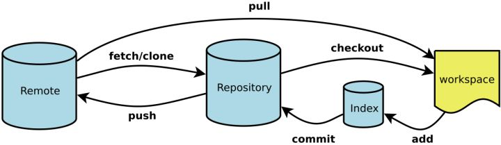
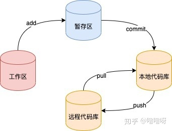
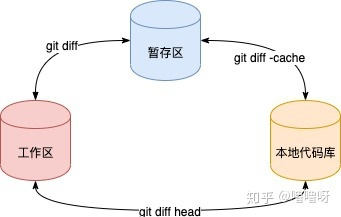

# git原理

# 一、git是什么？

Git是一款免费、开源的分布式版本控制系统

- **Workspace**：工作区
- **Index / Stage**：暂存区
- **Repository**：仓库区（或本地仓库）
- **Remote**：远程仓库

当我们把代码从git hub档下来或者说初始化git项目后，便有了这三个分区的概念

# 二、git是怎么储存信息的

git object有三种类型：

- **Blob**
- **Tree**
- **Commit**

在Git仓库里面，HEAD、分支、普通的Tag可以简单的理解成是一个指针，指向对应commit的SHA1值。

# 四、git命令

## 分区转换命令

### 1. git add

数据从工作区转移至暂存区

### 2. git commit

数据从暂存区转移至版本库，也就是本地仓库

### 3. git push

数据从版本库中发送到远程仓库

## 分区对比命名

### 4. git diff

工作区与暂存区对比

### 5. git diff head

工作区与版本库对比

### 6. git diff -cached

暂存区与版本库对比

## 

# 参考

1. https://zhuanlan.zhihu.com/p/96631135
2. https://www.zhihu.com/search?type=content&q=git

