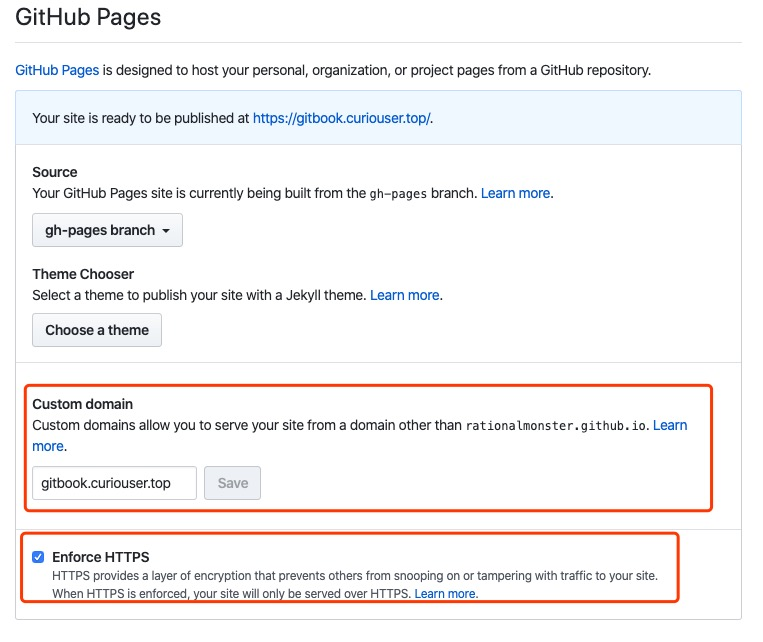
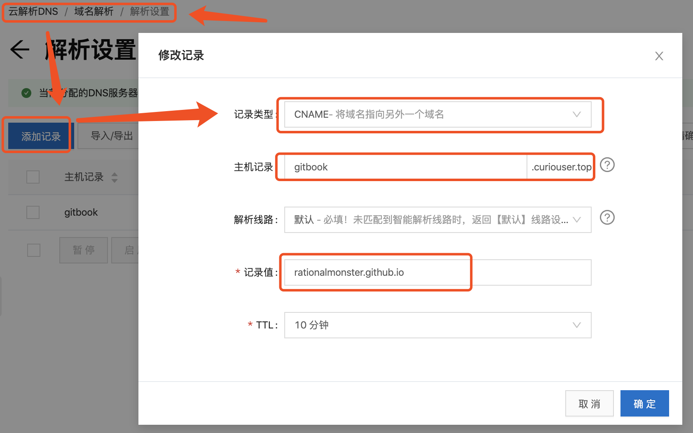
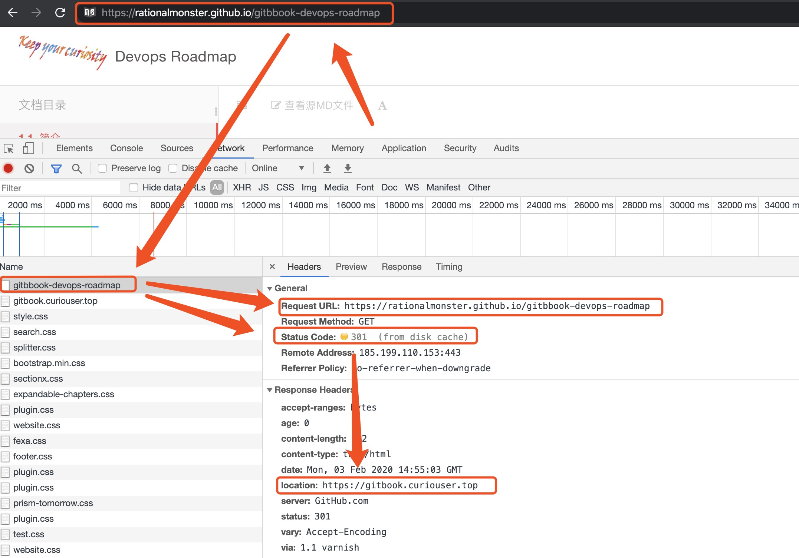

# GitBook简介安装配置

# 一、GitBook简介

- gitbook 是一个基于node.js的命令行工具
- gitbook 支持markdown/asciiDoc语法格式构建书籍
- gitbook 支持输出静态网页（可定制和可扩展）和电子书（PDF，ePub或Mobi）等多种格式，其中默认输出静态网页格式
- gitbook 不仅支持本地构建书籍,还可以托管在gitbook 官网上，或者Github上

# 二、GitBook安装

## 1、安装NodeJs环境

NodeJs官网下载链接:https://nodejs.org/en/download/ 

### **`Linux`**

以安装NodeJs 10.16.3为例

```bash
wget https://nodejs.org/dist/v10.16.3/node-v10.16.3-linux-x64.tar.xz && \
tar -xvf node-v10.16.3-linux-x64.tar.xz -C /opt/ && \
rm -rf node-v10.16.3-linux-x64.tar.xz && \
ln -s /opt/node-v10.16.3-linux-x64 /opt/nodejs && \
sed -i '$a export NODEJS_HOME=/opt/nodejs\nexport PATH=$PATH:$NODEJS_HOME/bin' /etc/profile && \
source /etc/profile && \
yum install gcc-c++ make -y && \
npm config set registry https://registry.npm.taobao.org && \
npm config set sass_binary_site https://npm.taobao.org/mirrors/node-sass/ && \
node -v && \
npm version
```

### **`Windows`**

直接在官网下载MSI格式的安装包进行安装

## 2、安装Gitbook CLI命令行工具

gitbook-cli 是 gitbook 的一个命令行工具, 通过它可以在电脑上安装和管理多个版本的gitbook.

```bash
npm install gitbook-cli -g
# 不可以直接使用npm安装gitbook
```

# 三、GitBook版本的管理

gitbook-cli 和 gitbook 是两个软件，gitbook-cli 会将下载的 gitbook 的不同版本放到 ~/.gitbook中, 可以通过设置GITBOOK_DIR环境变量来指定另外的文件夹

GitBook可以在本地安装多个版本并在执行命令的时候指定某个版本，如果指定的版本还没安装就会自动下载安装，下载后的GitBook会被放到~/.gitbook目录下。

```bash
$ gitbook --help
  Usage: gitbook [options] [command]
  Options:
    -v, --gitbook [version]  specify GitBook version to use
    -d, --debug              enable verbose error
    -V, --version            Display running versions of gitbook and gitbook-cli
    -h, --help               output usage information
  Commands:
    ls                        List versions installed locally
    current                   Display currently activated version
    ls-remote                 List remote versions available for install
    fetch [version]           Download and install a <version>
    alias [folder] [version]  Set an alias named <version> pointing to <folder>
    uninstall [version]       Uninstall a version
    update [tag]              Update to the latest version of GitBook
    help                      List commands for GitBook
    *                         run a command with a specific gitbook version

# 查看当前GitBook CLI版本
gitbook -V

# 列出本地安装版本
gitbook ls

# 列出当前使用版本
gitbook current

# 列出远程可用版本
gitbook ls-remote

# 安装指定版本(如果安装比较慢的话，将npm镜像源切到国内的CNPM镜像源。可使用NRM管理NPM的镜像源)
gitbook fetch [version]

# 卸载指定版本
gitbook uninstall [version]

# 更新指定版本
gitbook update [tag]
```

使用gitbook安装gitbook-cli时出现`gitbook-cli/node_modules/npm/node_modules/graceful-fs/polyfills.js:287   cb.apply is not a function  `报错时，是因为最新NodeJS的`graceful-fs`模块与gitbook-cli不兼容导致的，只需将graceful-fs的版本降到4.2.0即可。

```bash
cd /usr/local/lib/node_modules/gitbook-cli/node_modules/npm/node_modules/
npm install graceful-fs@4.2.0 --save

# 或者
直接替换/usr/local/lib/node_modules/gitbook-cli/node_modules/npm/node_modules/graceful-fs/polyfills.js的内容为https://raw.githubusercontent.com/isaacs/node-graceful-fs/168bdb8f0bb3174e8499d4bc5878deead4172c39/polyfills.js里的
```

参考：https://stackoverflow.com/questions/64211386/gitbook-cli-install-error-typeerror-cb-apply-is-not-a-function-inside-graceful

# 四、GitBook CLI命令

## 1、gitbook 可用命令

```bash
$ gitbook help

build [book] [output]       构建书籍
    --log                   指定日志输出级别(值为debug, info默认, warn, error, disabled)
    --format                Format to build to (Default is website; Values are website, json, ebook)
    --[no-]timing           Print timing debug information (Default is false)
serve [book] [output]       serve the book as a website for testing
    --port                  指定监听端口(默认端口4000)
    --lrport                Port for livereload server to listen on (Default is 35729)
    --[no-]watch            Enable file watcher and live reloading (Default is true)
    --[no-]live             Enable live reloading (Default is true)
    --log                   指定日志输出级别(值为debug, info默认, warn, error, disabled)
    --format                Format to build to (Default is website; Values are website, json, ebook)
install [book]              安装所有插件资源
    --log                   指定日志输出级别(值为debug, info默认, warn, error, disabled)
parse [book]                parse and print debug information about a book
    --log                   指定日志输出级别(值为debug, info默认, warn, error, disabled)
init [book]                 初始化创建书籍文件结构
    --log                   指定日志输出级别(值为debug, info默认, warn, error, disabled)
pdf [book] [output]         构建书籍为ebook文件
    --log                   指定日志输出级别(值为debug, info默认, warn, error, disabled)
epub [book] [output]        构建书籍为ebook文件
    --log                   指定日志输出级别(值为debug, info默认, warn, error, disabled)
mobi [book] [output]        构建书籍为ebook文件
    --log                   指定日志输出级别(值为debug, info默认, warn, error, disabled)
```

## 2、gitbook init初始化创建书籍文件结构

```bash
gitbook init
# 在当前路径下自动生成README.md 和 SUMMARY.md。也可以先手动创建SUMMARY.md，再执行gitbook init，如果SUMMARY.md中配置的文件夹和文件不存在，就会自动创建文件夹和文件，已经存在的文件夹和文件不会被覆盖。

gitbook init ./directory 
# 可将书籍初始化到指定目录 
```

## 3、gitbook build构建gitbook书籍静态HTML资源

```bash
gitbook build [book] [output]
# 会在书籍的文件夹中生成一个 _book 的文件夹, 里面有生成的静态HTML资源。可将 _book 文件夹下的文件拷贝到nginx、httpd等web服务器内
gitbook build --gitbook=2.0.1
# 指定Gitbook版本
```

## 4、gitbook serve启动本地预览书籍服务

```bash
gitbook serve [book] [output]
```

浏览器中打开： http://localhost:4000 预览GitBook书籍

## 5、输出书籍文件

**`Prerequisite`**：

- `ebook-convert`：GitBook在生成PDF的过程中使用到calibre的转换功能，没有安装Calibre或安装了Calibre没有配置环境变量都会导致转换PDF失败。Calibre下载地址：https://calibre-ebook.com/download
- `在 Typora 中安装 Pandoc 进行导出`

```bash
# 输出书籍为PDF格式文件
gitbook pdf [book] [output]

# 输出书籍为epub格式文件
gitbook epub [book] [output]

# 输出书籍为mobi格式文件
gitbook mobi [book] [output]
```

## 6、gitbook install安装插件样式资源

```bash
gitbook install [book]
#会在当前路径下生成node_modules文件夹，里面为插件的样式资源
```

## 7、gitbook parse 解析电子书

```bash
gitbook parse [book]
```

# 五、GitBook的文件结构

| 文件/文件夹        | 描述                      | 是否必须 |
| ------------------ | ------------------------- | -------- |
| README.md          | 书籍的简介                | 必须     |
| SUMMARY.md         | 书籍的目录结构            | 可选     |
| book.json          | GitBook的插件样式配置文件 | 可选     |
| GLOSSARY.md        | 词汇、术语列表            | 可选     |
| _book文件夹        | GitBook输出的静态HTML文件 |          |
| node_modules文件夹 | 插件的样式资源            |          |

# 六、SUMMARY.md编写规则

1. SUMMARY.md 的格式是一个链接列表。链接的标题将作为章节的标题，链接的目标是该章节文件的路径
2. 向父章节添加嵌套列表将创建子章节
3. 每章都有一个专用页面（part#/README.md），并分为子章节。
4. 目录中的章节可以使用锚点指向文件的特定部分。
5. 目录可以分为以标题或水平线 ---- 分隔的部分
6. Parts 只是章节组，没有专用页面，但根据主题，它将在导航中显示。

# 七、book.json编写规则

## 常规设置

| 变量              | 描述                                                         |
| :---------------- | :----------------------------------------------------------- |
| **root**          | 包含所有图书文件的根文件夹的路径，除了 `book.json`           |
| **structure**     | 指定 Readme，Summary，Glossary 和 Languages 的名称（而不是使用默认名称，如README.md）。这些文件必须在项目的根目录下（或 `root` 属性指定的根目录）<br>structure.readme：Readme 文件名（默认值是  `README.md` ）<br/>structure.summary：Summary 文件名（默认值是 `SUMMARY.md` ）<br/>structure.glossary：Glossary 文件名（默认值是 `GLOSSARY.md` ）<br/>structure.languages：Languages 文件名（默认值是 `LANGS.md` ） |
| **title**         | 您的书名，默认值是从 README 中提取出来的。在 GitBook.com 上，这个字段是预填的。 |
| **description**   | 您的书籍的描述，默认值是从 README 中提取出来的。在 GitBook.com 上，这个字段是预填的。 |
| **author**        | 作者名。在GitBook.com上，这个字段是预填的。                  |
| **isbn**          | 国际标准书号 ISBN                                            |
| **language**      | 本书的语言类型 —— [ISO code](https://en.wikipedia.org/wiki/List_of_ISO_639-1_codes) 。默认值是 `en` |
| **direction**     | 文本阅读顺序。可以是 `rtl` （从右向左）或 `ltr` （从左向右），默认值依赖于 `language` 的值。 |
| **gitbook**       | 应该使用的GitBook版本。使用 [SemVer](http://semver.org/) 规范，并接受类似于 `“> = 3.0.0”` 的条件。 |
| **links**         | 在左侧导航栏添加链接信息                                     |
| **plugins**       | 要加载的插件列表                                             |
| **pluginsConfig** | 插件的配置                                                   |

**Gitbook 默认带有 5 个插件**：

- highlight：语法高亮插件
- search：搜索插件
- sharing：分享插件
- font-settings：字体设置插件
- livereload：热加载插件

**Note**：去除插件`"plugins": [ "-search" ]`

## 插件配置示例

```json
{
	"author": "Curiouser <******@163.com>",
	"title": "Devops Roadmap",
	"plugins": [
		"-search",
		"-lunr",
		"-sharing",
        "-highlight",
		"search-pro",
		"splitter",
        "github",
		"popup",
        "sectionx",
        "expandable-chapters",
		"sharing-plus",
		"code",
        "auto-scroll-table",
		"theme-fexa",
        "tbfed-pagefooter",
        "back-to-top-button",
        "emphasize",
        "edit-link",
        "prism",
        "donate",
        "theme-comscore",
        "github-buttons",
        "github-issue-feedback"
	],
	"pluginsConfig": {
        "theme-default": {
            "showLevel": true
        },
        "github-issue-feedback": {
          "repo": "RationalMonster/rationalmonster.github.io"
        },
        "github": {
            "url": "https://github.com/RationalMonster"
        },
        "github-buttons": {
      		"buttons": [{
        		"user": "RationalMonster",
        		"repo": "rationalmonster.github.io",
        		"type": "star",
        		"size": "small",
        		"count": "true"
      			}]
    	},
        "sharing": {
        	"weibo": true,
        	"qq": "true",
        	"google": true,
        	"all": [
           		"facebook", "twitter"
           	]
        },
        "code": {
        	"copybuttons": "true"
        },
        "theme-fexa":{
            "search-placeholder":"搜索文章",
            "logo": "assets/logo.png"
        },
        "tbfed-pagefooter": {
            "copyright":"Copyright Curiouser",
            "modify_label": "该文件最后修改时间：",
            "modify_format": "YYYY-MM-DD HH:mm:ss"
        },
        "edit-link": {
          "base": "https://github.com/RationalMonster/rationalmonster.github.io/blob/master",
          "label": "ORIGIN In Github"
        },
        "prism": {
            "css": [
                "prismjs/themes/prism-tomorrow.css"
            ],
            "lang": {
                "flow": "typescript"
            },
            "ignore": [
                "mermaid",
                "eval-js"
            ]
        },
         "donate": {
            "wechat": "../assets/wechat-donate.jpg",
            "title": "",
            "button": "赏",
            "wechatText": "微信打赏"
        }
    }
}
```

# 八、GLOSSARY.md 编写规则

- GLOSSARY.md 的格式是 h2 标题的列表，以及描述段落

# 九、忽略文件和文件夹

GitBook将读取 `.gitignore`，`.bookignore` 和 `.ignore` 文件，来过滤不需要进行git版本控制的文件和文件夹。这些文件中的格式遵循 `.gitignore` 的规则：

```yaml
# This is a comment  
# Ignore the file test.md 
test.md  
# Ignore everything in the directory "bin" 
bin/*

### gitbook ###
_node
!docs
_book
node_modules

### IDEA ###
.idea/

### VS Code ###
.vscode/

### OS ###
.DS_Store
```

# 十、封面

封面用于所有电子书格式。您可以自己提供一个，也可以使用 [autocover plugin](https://plugins.gitbook.com/plugin/autocover) 生成一个。

要提供封面，请将 `cover.jpg` 文件放在书本的根目录下。添加一个 `cover_small.jpg` 将指定一个较小版本的封面。封面应为 `JPEG` 文件。

好的封面应该遵守以下准则：

- `cover.jpg` 的尺寸为 1800x2360 像素，`cover_small.jpg` 为 200x262
- 没有边界
- 清晰可见的书名
- 任何重要的文字应该在小版本中可见

# 十一、多语言支持

gitbook 支持构建用多种语言书写的书籍。每种语言应该是一个子目录，遵循正常的gitbook格式，然后需要在根目录下放置一个名为 LANGS.md 的文件，存放下列内容：

```bash
# Languages

* [English](en/)
* [French](fr/)
* [Español](es/)
```

注意：

1. 当一个语言的书(如：en)有 book.json 时，它的配置将扩展主要配置。
2. 唯一的一个例外是插件，插件是全局设置的，并且不能指定语言特定的插件
3. 插件的配置必须写在根目录下的 book.json 文件中。然后其他语言的配置可以分别写在各自语言目录下的 book.json 文件中。
4. LANGS.md 文件中各个语言出现的顺序，就是书籍首页出现的顺利。因此，写在第一位的语言，就自然成为书籍首页打开时的默认语言。

当一个语言的书(如：en)有 book.json 时，它的配置将扩展主要配置。

唯一的一个例外是插件，插件是全局设置的，并且不能指定语言特定的插件。

# 十二、托管到 GitHub Pages

知道如何编写gitbook了，那怎么放到网上让更多人看到呢。如果自己在各大云厂商那儿买个云主机自己搭建一个运行环境，一年又得多处几百大洋的开销。本着能“白嫖”就不掏腰包的精神，尝试使用其他途径免费部署自己的Gitbook。

Github 有个功能 GitHub Pages 。它允许用户在 GitHub 仓库托管你的个人、组织或项目的静态页面（自动识别 html、css、javascript）。只要仓库指定分支中的内容符合一个静态站点要求，就可以在如下地址中进行访问：`https://Github用户名.github.com/仓库名` 

在Github中设置GitHub Page Source时可指定分支。

- gh-pages branch
- master branch
- master branch /docs folder


不同的方式，无非是决定gitbook构建后的静态页面HTML文件存放在哪儿的问题。

- 方式一(推荐)：在master分支中存放gitbook原始Markdown文件、配置文件等，在gh-pages分支中存放gitbook构建后的静态页面HTML文件。
- 方式二：在master分支中即存放gitbook原始Markdown文件，也存放gitbook构建后的静态页面HTML文件。只不过是在/docs文件下


## 1、在GitHub中建立仓库并将本地代码推送至master分支

GitHub只建立空仓库是无法创建分支的。所以需要将本地代码推送到远程仓库master才可以

```bash
git init
git remote add origin git@github.com:**/gitbbook-devops-roadmap.git
git add .
git commit -m "init commit"
git push origin master
```

## 2、(方式二)在本地建立空白gh-pages分支并同步到GitHub

仓库中建立一个名为 gh-pages 的分支。

```bash
git checkout --orphan gh-pages
# 该命令会创建gh-pages分支，并且该分支下有master分支下的所有文件
git rm -rf *
# 删除master分支带过来的文件(“git rm -rf *"命令并不能删除隐藏文件,可使用““git rm -rf ."命令)
rm '.gitignore'
# 如果master中.gitignore文件,可删除


# 如果没有任何文件提交的话，分支是看不到的，可以创建一个新文件后再次提交则新创建的gh-pages分支就会显示出来。
echo "# MacOS\n*.DS_Store" > .gitignore
git add .
git commit -m "init commit"
git push origin gh-pages
```

当本地gh-pages分支同步到远程GitHub仓库分支后，在GitHub分支进行验证

## 3、在本地构建静态页面HTML文件

在Master分支下使用“gitbook build”命令生产静态页面HTML文件

```bash
gitbook install
# 该命令后会下载构建gitbook所需的插件及资源到当前目录“node_modules”下
gitbook build . [静态页面HTML文件输出文件夹]
# 该命令默认会将静态页面HTML文件输出到当前目录"_book"下。如果指定，则输出到指定目录。
```

## 4、(方式二)**使用gh-pages插件将本地静态页面HTML文件推送到远处仓库gh-pages分支**

本地安装gh-pages插件

```bash
npm install gh-pages -g
```

gh-pages命令详解

```bash
Usage: gh-pages [options]

Options:
  -V, --version            output the version number
  -d, --dist <dist>        Base directory for all source files
  -s, --src <src>          Pattern used to select which files to publish (default: "**/*")
  -b, --branch <branch>    Name of the branch you are pushing to (default: "gh-pages")
  -e, --dest <dest>        Target directory within the destination branch (relative to the root) (default: ".")
  -a, --add                Only add, and never remove existing files
  -x, --silent             Do not output the repository url
  -m, --message <message>  commit message (default: "Updates")
  -g, --tag <tag>          add tag to commit
  --git <git>              Path to git executable (default: "git")
  -t, --dotfiles           Include dotfiles
  -r, --repo <repo>        URL of the repository you are pushing to
  -p, --depth <depth>      depth for clone (default: 1)
  -o, --remote <name>      The name of the remote (default: "origin")
  -u, --user <address>     The name and email of the user (defaults to the git config).  Format is "Your Name <email@example.com>".
  -v, --remove <pattern>   Remove files that match the given pattern (ignored if used together with --add). (default: ".")
  -n, --no-push            Commit only (with no push)
  -f, --no-history         Push force new commit without parent history
  -h, --help               output usage information

```

推送静态页面HTML文件

```bash
gh-pages -d _book
```

## 5、GitHub配置gh-pages服务


## 6、(可选)自定义域名访问GitHub Pages托管的Gitbook

此时你可以通过` https:/Github用户名.github.io/仓库名`访问你的Gitbook啦。但是如果你在阿里云上购买的有自己的域名，可直接将域名指定到gitbook page域名，使用自己的域名访问。

1. 在GitHub中设置仓库的CNAME

   - 直接在GitHub中进行设置

     

   - (推荐)在master分支代码根路径下创建CNAME文件，文件中写入你自定义的域名(每个CNAME文件能且只能指定一个域名)。例如：`gitbook.curiouser.top`。

     Github读取你的CNAME文件之后，Github服务器会设置`gitbook.curiouser.top`为你的主域名，然后将`rationalmonster.github.ioo`重定向到`gitbook.curiouser.top`

2. 在阿里云上添加域名解析记录

   

3. 等待3～10分钟，通过自定义域名访问自己的gitbook。

   

# 问题

1. gitbook serve时，偶尔不规律性地出现编译错误,而且每次出现的错误文件还可能不一样，实在是头疼得很，每次修改要编译多次才能成功
   
    修改 `C:\Users\当前用户名\.gitbook\versions\当前使用的gitbook版本\lib\output\website\copyPluginAssets.js`文件中的112行，将`confirm: true`改为`confirm: false`

# 参考链接

1. https://www.jianshu.com/p/f38d8ff999cb?utm_campaign=maleskine&utm_content=note&utm_medium=seo_notes&utm_source=recommendation

