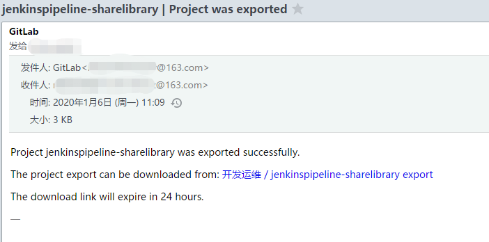
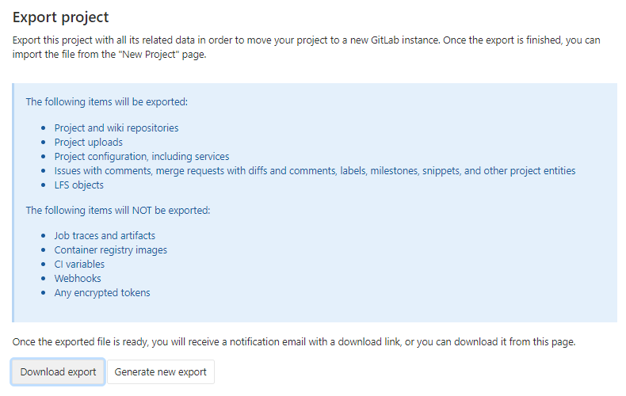

## Gitlab代码仓库的备份与恢复

# 一、Preface

GItlab上的代码仓库需要进行定期的导出备份，并且可以随时进行恢复

# 二、API接口备份代码仓库数据

gitlab提供导出代码仓库指定资源的API接口

| 支持代码仓库导出的gitlab资源                                 | 不支持代码仓库导出的gitlab资源 |
| ------------------------------------------------------------ | ------------------------------ |
| Project and wiki repositories                                | Build traces and artifacts     |
| Project uploads                                              | Container registry images      |
| Project configuration, including services                    | CI variables                   |
| Issues with comments, merge requests with diffs <br>and comments, labels, milestones, snippets, <br/>and other project entities | Webhooks                       |
| Design Management files and data                             | Any encrypted tokens           |
| LFS objects                                                  | Merge Request Approvers        |
| Issue boards                                                 | Push Rules                     |
|                                                              | Awards                         |

## 1、通过API接口

### ① 调用生成Export的接口

**接口及参数**

```
POST /projects/:id/export
```

| Attribute             | Type           | Required | Description                                                  |
| :-------------------- | :------------- | :------- | :----------------------------------------------------------- |
| `id`                  | integer/string | yes      | The ID or [URL-encoded path of the project](https://docs.gitlab.com/ee/api/README.html#namespaced-path-encoding) owned by the authenticated user |
| `description`         | string         | no       | Overrides the project description                            |
| `upload`              | hash           | no       | Hash that contains the information to upload the exported project to a web server |
| `upload[url]`         | string         | yes      | The URL to upload the project                                |
| `upload[http_method]` | string         | no       | The HTTP method to upload the exported project. Only `PUT` and `POST` methods allowed. Default is `PUT` |

```bash
curl --request POST --header "PRIVATE-TOKEN: <your_access_token>" https://gitlab.example.com/api/v4/projects/1/export 
```

### ②调用获取Export生成状态的接口

**接口及参数**

| Attribute | Type           | Required | Description                                                  |
| :-------- | :------------- | :------- | :----------------------------------------------------------- |
| `id`      | integer/string | yes      | The ID or [URL-encoded path of the project](https://docs.gitlab.com/ee/api/README.html#namespaced-path-encoding) owned by the authenticated user |

```bash
curl --header "PRIVATE-TOKEN: <your_access_token>" https://gitlab.example.com/api/v4/projects/1/export
```

### ③下载Export 

**接口及参数**

```bash
GET /projects/:id/export/download
```

| Attribute | Type           | Required | Description                                                  |
| :-------- | :------------- | :------- | :----------------------------------------------------------- |
| `id`      | integer/string | yes      | The ID or [URL-encoded path of the project](https://docs.gitlab.com/ee/api/README.html#namespaced-path-encoding) owned by the authenticated user |

```bash
curl --header "PRIVATE-TOKEN: <your_access_token>" --remote-header-name --remote-name https://gitlab.example.com/api/v4/projects/5/export/download
```

### ④执行脚本

```bash
#/bin/bash

gitlab_url=http://gitlab.apps.okd311.curiouser.com/
gitlab_access_token=*****
gitlab_api_version="api/v4"

for project_id in $(curl -s -XGET ''"$gitlab_url"''"$gitlab_api_version"'/projects?simple=true&order_by=id&sort=asc' -H 'private-token: '"$gitlab_access_token"'' | jq '.[].id')
do
  curl -s -XPOST ''"$gitlab_url"''"$gitlab_api_version"'/projects/'"$project_id"'/export' -H 'private-token: '"$gitlab_access_token"'' > /dev/null
  if [[ `curl -s -XGET ''"$gitlab_url"''"$gitlab_api_version"'/projects/'"$project_id"'/export' -H 'private-token: '"$gitlab_access_token"'' | jq '.export_status' ` =~ "finished" ]];then 
        curl -s -O -XGET ''"$gitlab_url"'/'"$gitlab_api_version"'/projects/'"$project_id"'/export/download' -H 'private-token: '"$gitlab_access_token"''  ;
        echo hahah ; 
  else 
        echo test; 
  fi
done
```


## 2、通过UI界面

### ①UI路径

仓库页面-->Settings-->General-->Advanced-->Export project按钮

### ②点击Export


### ③当Export生成后会发送带有Export下载链接的邮件给代码仓库的维护者



### ④(可选)后续还可以在UI界面上点击下载Export



# 三、命令行备份gitlab实例数据

gitlab提供了相应的命令可以进行备份与恢复。

## 1、备份

### ①命令

#### 二进制方式或docker方式部署的

- 版本\>= GitLab 12.2

  ```bash
  sudo gitlab-backup create
  # 或者
  docker exec -t <container name> gitlab-backup create
  ```

- 版本 < GitLab 12.1 

  ```bash
  gitlab-rake gitlab:backup:create
  # 或者
  docker exec -t <container name> gitlab-rake gitlab:backup:create
  ```

#### **源代码方式部署的**

```bash
sudo -u git -H bundle exec rake gitlab:backup:create RAILS_ENV=production
```

#### **使用helm部署在k8s中的**

使用helm部署的，`GitLab task runner`容器中有个一个工具脚本可进行备份

```bash
kubectl exec -it <gitlab task-runner pod> backup-utility
```

#### 生成的备份文件的信息

- 备份文件的路径：默认`/var/opt/gitlab/backups`，可在`config/gitlab.yml`配置文件设置`backup_path`进行控制
- 备份文件名规则：默认`[TIMESTAMP]-版本_gitlab_backup.tar`


### ②支持备份的gitlab实例数据

- Database
- Attachments
- Git repositories data
- CI/CD job output logs
- CI/CD job artifacts
- LFS objects
- Container Registry images
- GitLab Pages content
- Snippets
- Group wikis

### ③命令行的备份策略参数

默认的备份策略实际上是使用Linux命令tar和gzip将数据从相应的数据位置流式传输到备份。在大多数情况下，这可以正常工作，但是在数据快速变化时可能会导致问题。例如：

- 当tar正在读取数据时更改数据时，错误文件可能会随着我们读取数据而发生更改，并导致备份过程失败。为了解决这个问题，8.17引入了一种称为副本的新备份策略。该策略在调用tar和gzip之前将数据文件复制到一个临时位置，从而避免了错误。副作用是备份过程最多占用额外的1X磁盘空间。该过程尽力在每个阶段清理临时文件，这样问题就不会复杂化，但是对于大型安装而言，这可能是一个相当大的变化。这就是为什么复制策略不是8.17中的默认策略

**`BACKUP`**：设置备份文件名，代替默认备份文件名规则中的时间戳字段，例如：`[BACKUP的值]-版本_gitlab_backup.tar`

```bash
sudo gitlab-backup create BACKUP=dump
# 版本 < GitLab 12.1 时
gitlab-rake gitlab:backup:create BACKUP=dump
```

**`GZIP_RSYNCABLE`**：设置备份文件可被`rsync`传输

```bash
sudo gitlab-backup create BACKUP=dump GZIP_RSYNCABLE=yes
# 版本 < GitLab 12.1 时
gitlab-rake gitlab:backup:create BACKUP=dump GZIP_RSYNCABLE=yes
```

**`SKIP`**：设置备份时排除哪些gitlab资源，可选项有`db(database)、uploads(attachments)、builds(CI job output logs)、artifacts(CI job artifacts)、lfs(LFS objects)、registry(Container Registry images)、pages(Pages content)、repositories(Git repositories data)`

```bash
sudo gitlab-backup create BACKUP=dump GZIP_RSYNCABLE=yes  SKIP=builds,lfs
# 版本 < GitLab 12.1 时
gitlab-rake gitlab:backup:create BACKUP=dump GZIP_RSYNCABLE=yes SKIP=builds,lfs
# 源码安装时
sudo -u git -H bundle exec rake gitlab:backup:create SKIP=db,uploads RAILS_ENV=production
```

**`SKIP=tar`**：创建备份的最后一部分是生成包含所有部分的.tar文件。在某些情况下（例如，如果备份是由其他备份软件获取的），创建.tar文件可能会浪费精力，甚至直接有害，因此可以通过将tar添加到SKIP环境变量中来跳过此步骤。将tar添加到SKIP变量会将包含备份的文件和目录保留在用于中间文件的目录中。创建新备份时，这些文件将被覆盖，因此，应确保将它们复制到其他位置，因为系统上只能有一个备份。

**`GITLAB_BACKUP_MAX_STORAGE_CONCURRENCY`**与**`GITLAB_BACKUP_MAX_STORAGE_CONCURRENCY`** ：

设置导出代码仓库数据时使用多线程，`GITLAB_BACKUP_MAX_STORAGE_CONCURRENCY`是设置同时最多可导出多少个代码仓库数据，默认为1。`GITLAB_BACKUP_MAX_STORAGE_CONCURRENCY` 设置每个存储上同时备份的最大项目数。这样可以将存储库备份分散到各个存储中

```bash
sudo gitlab-backup create GITLAB_BACKUP_MAX_CONCURRENCY=4 GITLAB_BACKUP_MAX_STORAGE_CONCURRENCY=1
# 源码安装时
sudo -u git -H bundle exec rake gitlab:backup:create GITLAB_BACKUP_MAX_CONCURRENCY=4 GITLAB_BACKUP_MAX_STORAGE_CONCURRENCY=1
```

**`CRON`**：在使用crontab进定时备份时，设置为1是为了不显示备份进度信息，减少备份期间相关输出

```bash
0 2 * * * /opt/gitlab/bin/gitlab-backup create CRON=1
# 版本 < GitLab 12.1 时
0 2 * * * gitlab-rake gitlab:backup:create CRON=1
# 源码安装时
0 2 * * * cd /home/git/gitlab && PATH=/usr/local/bin:/usr/bin:/bin bundle exec rake gitlab:backup:create RAILS_ENV=production CRON=1
```


### ④备份相关的配置

备份时的一些配置除了在命令行中通过参数进行配置，还可以在配置文件`/etc/gitlab/gitlab.rb`或`/home/git/gitlab/config/gitlab.yml`中进行配置

#### **设置备份文件的权限**

```bash
gitlab_rails['backup_archive_permissions'] = 0644 
# 源码安装时
backup:
  archive_permissions: 0644 # Makes the backup archives world-readable
```

#### 设置备份文件的保存期限

如果特意指定备份文件名前缀，使用默认时间戳为前缀的。在执行备份时，可将比早于`backup_keep_time`时间的备份文件进行自动清除

```bash
## Limit backup lifetime to 7 days - 604800 seconds
gitlab_rails['backup_keep_time'] = 604800
# 源码安装时
backup:
  ## Limit backup lifetime to 7 days - 604800 seconds
  keep_time: 604800
```


### ⑤配置文件的备份

GitLab提供的备份Rake任务是不会备份配置文件的

#### 手动备份

直接手动备份整个`/etc/gitlab`目录。如果不想备份整个目录的话，至少也要备份以下文件

- `/etc/gitlab/gitlab-secrets.json`
- `/etc/gitlab/gitlab.rb`

源代码安装时

- `/home/git/gitlab/config/secrets.yml`
- `/home/git/gitlab/config/gitlab.yml`

#### 命令行备份

- 当版本 >= 12.3时，可以使用命令`sudo gitlab-ctl backup-etc`命令备份配置文件。备份文件路径在`/etc/gitlab/config_backup/`,备份文件及目录都是只有root可读写。

- 同时可以设置配置备份文件的路径`sudo gitlab-ctl backup-etc <DIRECTORY>`
- 配置文件的备份文件名默认规则：`gitlab_config_时间戳_日期.tar`
- 会备份以下配置文件

```bash
/etc/gitlab/
/etc/gitlab/ssh_host_rsa_key.pub
/etc/gitlab/ssh_host_ecdsa_key.pub
/etc/gitlab/trusted-certs/
/etc/gitlab/ssh_host_rsa_key
/etc/gitlab/ssh_host_ecdsa_key
/etc/gitlab/ssh_host_ed25519_key.pub
/etc/gitlab/ssh_host_ed25519_key
/etc/gitlab/gitlab.rb
/etc/gitlab/gitlab-secrets.json
```

- 可设置定时任务，`15 04 * * 2-6  gitlab-ctl backup-etc && cd /etc/gitlab/config_backup && cp $(ls -t | head -n1) /data/gitlab/config-backups/`

### ⑥上传备份到外部云存储

可在`/etc/gitlab/gitlab.rb`中设置参数，让命令行执行的脚本将备份文件上传到外部云存储中，支持的云存储：`AWS S3`, `Google Cloud Storage`, `Azure Blob storage`, `其他S3类型供应商`

> 设置参数将备份上传至云存储时，可在执行命令后添加`DIRECTORY`参数，将上传文件路径前添加路径，便于备份
> ```bash
> sudo gitlab-backup create DIRECTORY=daily
> sudo gitlab-backup create DIRECTORY=weekly
> ```

#### Amazon S3

```bash
gitlab_rails['backup_upload_connection'] = {
  'provider' => 'AWS',
  'region' => 'eu-west-1',
  'aws_access_key_id' => 'AKIAKIAKI',
  'aws_secret_access_key' => 'secret123'
  # If using an IAM Profile, don't configure aws_access_key_id & aws_secret_access_key
  # 'use_iam_profile' => true
}
gitlab_rails['backup_upload_remote_directory'] = 'my.s3.bucket'
```

#### Digital Ocean Spaces

```bash
gitlab_rails['backup_upload_connection'] = {
  'provider' => 'AWS',
  'region' => 'ams3',
  'aws_access_key_id' => 'AKIAKIAKI',
  'aws_secret_access_key' => 'secret123',
  'endpoint'              => 'https://ams3.digitaloceanspaces.com'
}
gitlab_rails['backup_upload_remote_directory'] = 'my.s3.bucket'
```

如果上传时出现`400 Bad Request`，是因为默认备份文件时加密的，而`Digital Ocean Spaces`不支持上传加密文件，注释或删除掉`['gitlab_rails['backup_encryption']`

#### Google Cloud Storage

```bash
gitlab_rails['backup_upload_connection'] = {
  'provider' => 'Google',
  'google_storage_access_key_id' => 'Access Key',
  'google_storage_secret_access_key' => 'Secret',

  ## If you have CNAME buckets (foo.example.com), you might run into SSL issues
  ## when uploading backups ("hostname foo.example.com.storage.googleapis.com
  ## does not match the server certificate"). In that case, uncomnent the following
  ## setting. See: https://github.com/fog/fog/issues/2834
  #'path_style' => true
}
gitlab_rails['backup_upload_remote_directory'] = 'my.google.bucket'
```

源码安装时

```bash
  backup:
    upload:
      connection:
        provider: 'Google'
        google_storage_access_key_id: 'Access Key'
        google_storage_secret_access_key: 'Secret'
      remote_directory: 'my.google.bucket'
```

#### Azure Blob storage

```bash
gitlab_rails['backup_upload_connection'] = {
 'provider' => 'AzureRM',
 'azure_storage_account_name' => '<AZURE STORAGE ACCOUNT NAME>',
 'azure_storage_access_key' => '<AZURE STORAGE ACCESS KEY>',
 'azure_storage_domain' => 'blob.core.windows.net', # Optional
}
gitlab_rails['backup_upload_remote_directory'] = '<AZURE BLOB CONTAINER>'
```

源码安装时

```bash
  backup:
    upload:
      connection:
        provider: 'AzureRM'
        azure_storage_account_name: '<AZURE STORAGE ACCOUNT NAME>'
        azure_storage_access_key: '<AZURE STORAGE ACCESS KEY>'
      remote_directory: '<AZURE BLOB CONTAINER>'
```

## 2、恢复备份

### ①确定要恢复的备份文件在指定的目录下，git用户并拥有相应读写权限

备份文件要放到配置文件`/etc/gitlab/gitlab.rb` 中，配置项`gitlab_rails['backup_path’] (默认是/var/opt/gitlab/backups)`或者`backup:  path: "tmp/backups"(默认是/home/git/gitlab/tmp/backups)`指定的路径下

```bash
sudo cp /data/gitlab-backups/11493107454_2018_04_25_10.6.4-ce_gitlab_backup.tar /var/opt/gitlab/backups/
sudo chown git.git /var/opt/gitlab/backups/11493107454_2018_04_25_10.6.4-ce_gitlab_backup.tar
```

### ②停掉连接数据库的进程

```bash
sudo gitlab-ctl stop unicorn
sudo gitlab-ctl stop puma
sudo gitlab-ctl stop sidekiq
# 源码安装时
sudo service gitlab stop

# 验证gitlab状态
sudo gitlab-ctl status
```

### ③开始恢复指定的备份

```bash
sudo gitlab-backup restore BACKUP=11493107454_2018_04_25_10.6.4-ce
# 版本 < GitLab 12.1 时
gitlab-rake gitlab:backup:restore BACKUP=11493107454_2018_04_25_10.6.4-ce
# 源码安装时
sudo -u git -H bundle exec rake gitlab:backup:restore RAILS_ENV=production
```

**恢复备份时的一些参数**

- `GITLAB_ASSUME_YES=1`：恢复备份时，恢复脚本可能跳出一些提示，设置这个环境变量可以跳过这些提示

  ```bash
  sudo GITLAB_ASSUME_YES=1 gitlab-backup restore
  # 源码安装时
  sudo -u git -H GITLAB_ASSUME_YES=1 bundle exec rake gitlab:backup:restore RAILS_ENV=production
  ```

### ④恢复数据加密用的秘钥文件

恢复`/etc/gitlab/gitlab-secrets.json`或`/home/git/gitlab/.secret(源码安装时)`文件。该文件包含数据库加密密钥，CI / CD变量以及用于两重身份验证的变量。如果您无法连同应用程序数据备份一起还原此加密密钥文件，则启用了双重身份验证的用户以及GitLab Runner都将失去对GitLab服务器的访问权限。

### ⑤启动

```bash
sudo gitlab-ctl reconfigure
sudo gitlab-ctl restart
# 源码安装时
sudo service gitlab restart
```

### ⑥验证

```bash
sudo gitlab-rake gitlab:check SANITIZE=true
sudo gitlab-ctl status
```

当版本 >= 13.1,可执行`sudo gitlab-rake gitlab:doctor:secrets`检查数据数据库中的数据是否解密啦

## 3、问题

### ①压缩备份文件时报错

```bash
sudo /opt/gitlab/bin/gitlab-backup create
...
Dumping ...
...
gzip: stdout: Input/output error

Backup failed
```

解决方案：

- 检查磁盘空间是否够用
- 如果存储的路径是NFS挂载点，检查挂载选项的`timeout`是否始终，默认是600，可设置大一点


# 四、通过git clone代码导出代码仓库

## shell脚本

```bash
#!/bin/bash
# A script to backup GitLab repositories.

GLAB_BACKUP_DIR=${GLAB_BACKUP_DIR-"gitlab_backup"}                   # where to place the backup files
GLAB_TOKEN=${GLAB_TOKEN-"YOUR_TOKEN"}                                # the access token of the account
GLAB_GITHOST=${GLAB_GITHOST-"gitlab.com"}                            # the GitLab hostname
GLAB_PRUNE_OLD=${GLAB_PRUNE_OLD-true}                                # when `true`, old backups will be deleted
GLAB_PRUNE_AFTER_N_DAYS=${GLAB_PRUNE_AFTER_N_DAYS-7}                 # the min age (in days) of backup files to delete
GLAB_SILENT=${GLAB_SILENT-false}                                     # when `true`, only show error messages
GLAB_API=${GLAB_API-"https://gitlab.com/api/v3"}                     # base URI for the GitLab API
GLAB_GIT_CLONE_CMD="git clone --quiet --mirror git@${GLAB_GITHOST}:" # base command to use to clone GitLab repos

TSTAMP=`date "+%Y%m%d"`

# The function `check` will exit the script if the given command fails.
function check {
  "$@"
  status=$?
  if [ $status -ne 0 ]; then
    echo "ERROR: Encountered error (${status}) while running the following:" >&2
    echo "           $@"  >&2
    echo "       (at line ${BASH_LINENO[0]} of file $0.)"  >&2
    echo "       Aborting." >&2
    exit $status
  fi
}

# The function `tgz` will create a gzipped tar archive of the specified file ($1) and then remove the original
function tgz {
   check tar zcf $1.tar.gz $1 && check rm -rf $1
}

$GLAB_SILENT || (echo "" && echo "=== INITIALIZING ===" && echo "")

$GLAB_SILENT || echo "Using backup directory $GLAB_BACKUP_DIR"
check mkdir -p $GLAB_BACKUP_DIR

$GLAB_SILENT || echo -n "Fetching list of repositories ..."
GLAB_PROJ_API="${GLAB_API}/projects?private_token=${GLAB_TOKEN}&per_page=100&simple=true"
echo ${GLAB_PROJ_API}

REPOLIST=`check curl --silent ${GLAB_PROJ_API} | check perl -p -e "s/,/\n/g" | check grep "\"path_with_namespace\"" | check awk -F':"' '{print $2}' | check sed -e 's/"}//g'`

$GLAB_SILENT || echo "found `echo $REPOLIST | wc -w` repositories."

$GLAB_SILENT || (echo "" && echo "=== BACKING UP ===" && echo "")

for REPO in $REPOLIST; do
   $GLAB_SILENT || echo "Backing up ${REPO}"
   check ${GLAB_GIT_CLONE_CMD}${REPO}.git ${GLAB_BACKUP_DIR}/${GLAB_ORG}-${REPO}-${TSTAMP}.git && tgz ${GLAB_BACKUP_DIR}/${GLAB_ORG}-${REPO}-${TSTAMP}.git
done

if $GLAB_PRUNE_OLD; then
  $GLAB_SILENT || (echo "" && echo "=== PRUNING ===" && echo "")
  $GLAB_SILENT || echo "Pruning backup files ${GLAB_PRUNE_AFTER_N_DAYS} days old or older."
  $GLAB_SILENT || echo "Found `find $GLAB_BACKUP_DIR -name '*.tar.gz' -mtime +$GLAB_PRUNE_AFTER_N_DAYS | wc -l` files to prune."
  find $GLAB_BACKUP_DIR -name '*.tar.gz' -mtime +$GLAB_PRUNE_AFTER_N_DAYS -exec rm -fv {} > /dev/null \;
fi

$GLAB_SILENT || (echo "" && echo "=== DONE ===" && echo "")
$GLAB_SILENT || (echo "GitLab backup completed." && echo "")
```


# 参考

1. https://docs.gitlab.com/omnibus/settings/backups.html
2. https://docs.gitlab.com/ee/api/project_import_export.html
3. https://docs.gitlab.com/ee/user/project/settings/import_export.html
4. https://gist.github.com/devopstaku/7b1b2594ce657957206f3ec5f262eadb