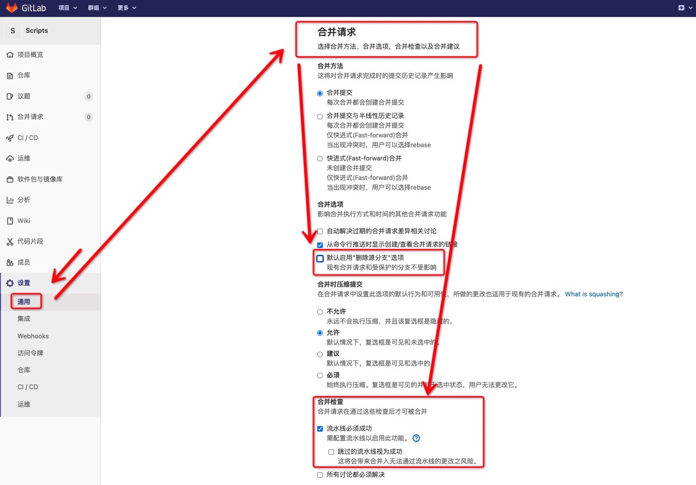
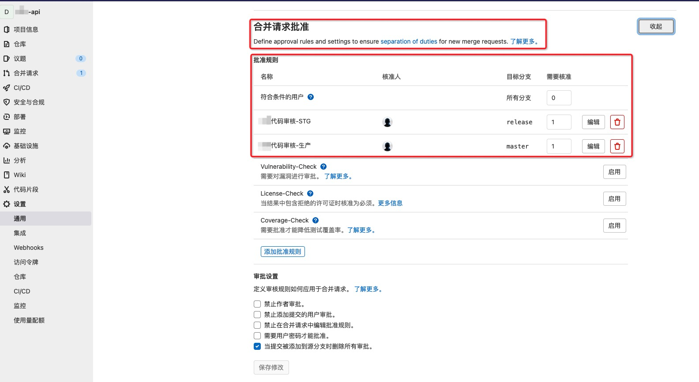

# Gitlab CICD：自动扫描MR代码+MR CodeReview审批

# 一、简介

​    	代码静态扫描能避免代码技术层面大部分的问题，而人为codereview能从业务层面避免部分的代码业务逻辑问题。两者结合起来，代码质量能得到有效提升。那在以gitlab pipeline为基础的CICD中如何实现？

​		集成代码自动化扫描，只要在Gitlab Pipeline中添加一个stage阶段任务即可实现。但在实际使用过程中，遇到了扫描频繁导致SonarQube服务器后台扫描任务崩溃的问题。那该如何控制扫描频率和开发流程相得益彰呢？同时，扫描完后的结果如何在gitlab中呈现，而不用反复在SonarQube服务端切换页面？

​		自动化静态代码扫描之后，人为再介入codereview，会节省人工成本。但在什么时候介入会比较合适呢？同时，在Gitlab Pipeline CICD过程中，合并代码往往是运维人员。而codereview任务是技术负责人处理的，那如何实现两者之间的审批流呢？对于公共项目，多个项目负责人该如何实现审批流？

# 二、CICD流水线详解


- `master、release、dev`分支分别对应部署`生产环境、stg环境、测试环境`
- 个人从master分支创建feature分支或hotfix分支，开发完成后，创建MR合并feature分支到dev、release分支，对应开发流程到集成测试、stg测试等阶段
- stg测试环境相对于集成测试环境，代码变更没有那么频繁。如果代码扫描放在集成测试环境的MR触发流水线中，会造成频繁扫描，SonarQube服务会吃不消。所以放在stg测试环境对应release分支合并触发的流水线中会比较合适。
- 直推`master、release、dev`分支：直接触发构建部署流水线
- 再次推送MR源分支：依旧会触发代码扫描流水线

# 三、相关配置

## 1、Gitlab设置

- 设置合并必须要等到流水线成功

  

- 设置`合并请求批准`

  

## 2、文件结构

```bash
.....项目文件....
└── docker
    ├── Dockerfile
    ├── config.sh
    └── k8s-application.tpl.yaml
└── .gitlab-ci.yml
└── .dockerignore
└── .gitignore
```

## 3、.gitlab-ci.yml

```yaml
image: golang-builder:alpine-with-dockerctl

variables:
  DOCKER_HOST: tcp://localhost:2375
  DOCKER_DAEMON: |
    {
      "registry-mirrors": ["https://1231.mirror.aliyuncs.com"],
      "insecure-registries":["hub.curiouser.com"]
    }

services:
  - name: docker:20.04-dind
    command:
      - /bin/sh
      - -c
      - |
        mkdir -p /etc/docker || exit
        echo "$DOCKER_DAEMON" > /etc/docker/daemon.json || exit
        dockerd-entrypoint.sh || exit

stages:
  - scan-code
  - build
  - deploy

##############################################################################
#                 sonarscanner-cli scan code                                 #
##############################################################################
scan-code:
  stage: scan-code
  image:
    name: sonarscanner-cli:4.3.0.2102
    entrypoint: [""]
  variables:
    GIT_DEPTH: 0
  script:
    - sonar-scanner
        -Dsonar.host.url=http://sonarqube.curiouser.com
        -Dsonar.login=$SONARQUBE_SERVER_TOKEN
        -Dsonar.qualitygate.wait=true
        -Dsonar.qualitygate.timeout=600
        -Dsonar.projectName=$CI_PROJECT_NAME
        -Dsonar.projectKey=$CI_PROJECT_NAME
        -Dsonar.projectVersion=$CI_COMMIT_SHA
        -Dsonar.gitlab.project_id=$CI_PROJECT_ID
        -Dsonar.gitlab.commit_sha=$CI_COMMIT_SHA
        -Dsonar.gitlab.ref_name=$CI_COMMIT_REF_NAME
        -Dsonar.links.scm=$CI_PROJECT_URL
        -Dsonar.links.ci=$CI_PIPELINE_URL
  rules:
    - if: $CI_PIPELINE_SOURCE == 'merge_request_event' && $CI_MERGE_REQUEST_TARGET_BRANCH_NAME == 'release'
  tags:
    - k8s-offline-runner

#####################################################################
#                      Kubernetes build scripts                     #
#####################################################################
.k8s_build: &k8s_build
  - export RELEASE_NUM="$(date +%Y%m%d)-$(echo $CI_COMMIT_SHA | cut -c1-8)"
  - export IMAGE_NAME="hub.curiouser.com/$CI_PROJECT_NAME/$APPENV:$RELEASE_NUM"
  - docker login hub.curiouser.com -u ci -p $HARBOR_TOKEN
  - docker build -t "hub.curiouser.com/$CI_PROJECT_NAME/$APPENV:$RELEASE_NUM" . -f docker/Dockerfile
  - docker push "hub.curiouser.com/$CI_PROJECT_NAME/$APPENV:$RELEASE_NUM"

######################################################################
#                      Kubernetes deploy scripts                     #
######################################################################
.k8s_deploy: &k8s_deploy
  - export RELEASE_NUM="$(date +%Y%m%d)-$(echo $CI_COMMIT_SHA | cut -c1-8)"
  - export IMAGE_NAME="hub.curiouser.com/$CI_PROJECT_NAME/$APPENV:$RELEASE_NUM"
  - ./docker/config.sh docker/k8s-application.tpl.yaml > k8s-application.yaml
  - cat k8s-application.yaml
  - kubectl apply -f k8s-application.yaml
  - kubectl -n $NAMESPACE rollout status --timeout=260s deployment/$CI_PROJECT_NAME || exit_code=$?
  - |
    if [ $exit_code -ne 0 ];then
      ROLLBACK_ID=$(kubectl -n $NAMESPACE rollout undo deployment/$CI_PROJECT_NAME -ojson | jq -r '.status.observedGeneration') ;
      curl -s https://oapi.dingtalk.com/robot/send?access_token="$PIPELINE_DINGDING_ROBOT_TOKEN" -H 'Content-Type: application/json' -d '{"msgtype": "markdown","markdown": {"title": "Gitlab流水线部署失败","text": "['$CI_PROJECT_NAME']('$CI_PROJECT_URL'/-/tree/'$CI_BUILD_REF_NAME')的'$APPENV'环境第['$CI_PIPELINE_ID']('$CI_PIPELINE_URL')号流水线'$CI_JOB_STAGE'阶段失败，已回滚至最近一个稳定版本'$ROLLBACK_ID'，请检查相关错误！"},"at": {"isAtAll": true}}' > /dev/null;
      exit 1;
    fi

##############################################################################
#       Test environment build and deploy CI/CD stage scripts                #
##############################################################################
build-test:
  stage: build
  variables:
    APPENV: test
  script: *k8s_build
  only:
    - develop
  tags:
    - k8s-offline-runner

deploy-test:
  stage: deploy
  image: kubeconfig-offline:1.17.0
  variables:
    NAMESPACE: app-test
    APPENV: test
    POD_NUM: 1
  script: *k8s_deploy
  only:
    - develop
  tags:
    - k8s-offline-runner

##############################################################################
#       Stg environment build and deploy CI/CD   stage scripts               #
##############################################################################
build-stg:
  stage: build
  variables:
    APPENV: stg
  script: *k8s_build
  only:
    - release
  tags:
    - k8s-offline-runner

deploy-stg:
  stage: deploy
  image: kubeconfig-offline:1.17.0
  variables:
    NAMESPACE: app-stg
    APPENV: stg
    POD_NUM: 1
  script: *k8s_deploy
  only:
    - release
  tags:
    - k8s-offline-runner
##############################################################################
#     Production environment build and deploy CI/CD stage scripts            #
##############################################################################
build-prd:
  stage: build
  variables:
    APPENV: prod
  script: *k8s_build
  only:
    - tags
  except:
    - release
    - develop
  tags:
    - k8s-online-runner

deploy-prd:
  stage: deploy
  image: kubeconfig-online:1.17.0
  variables:
    NAMESPACE: app-prod
    APPENV: prod
    POD_NUM: 2
  script: *k8s_deploy
  only:
    - tags
  except:
    - release
    - develop
  when: manual
  tags:
    - k8s-online-runner
```

