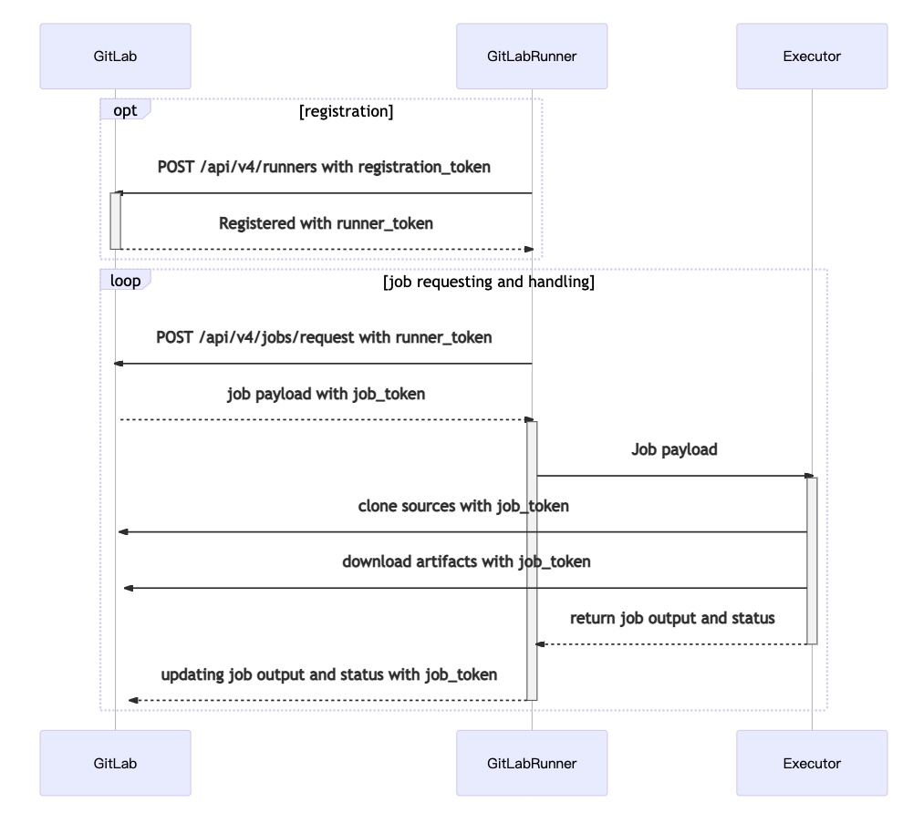
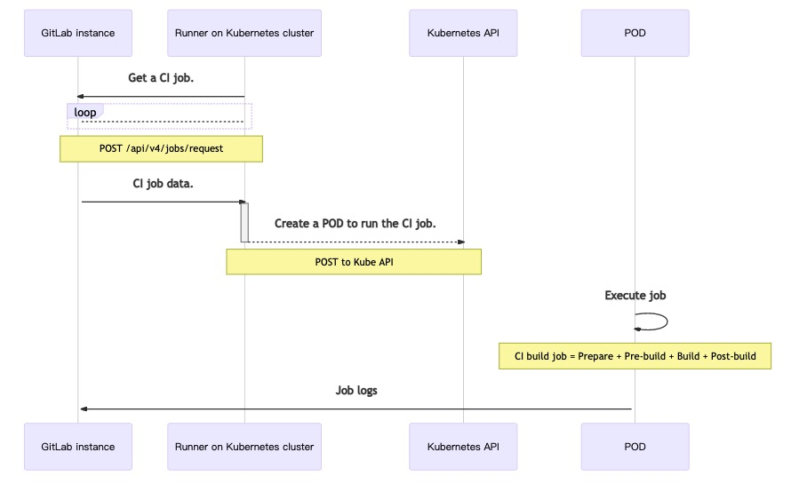
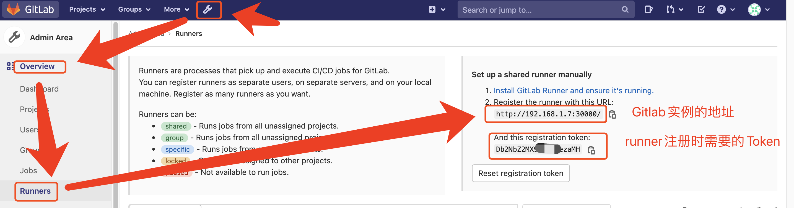
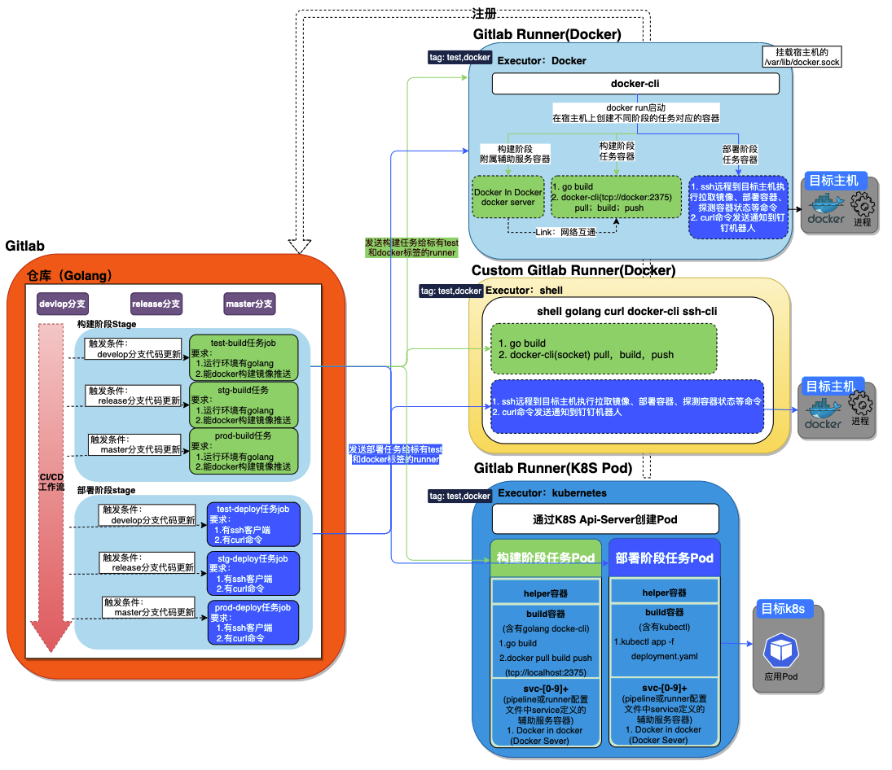

# Gitlab Runner

# 一、简介

Gitlab Runner是Gitlab Pipeline中各阶段Job任务中脚本执行的承载者。

# 二、原理

## 1、Runner说明

- 所有runner注册到gitlab时都要选择一个执行器，而执行器决定了pipeline中job任务的运行环境
- 支持的runner执行器：
  - [SSH](https://docs.gitlab.com/runner/executors/ssh.html)
  - [Shell](https://docs.gitlab.com/runner/executors/shell.html)
  - [Parallels](https://docs.gitlab.com/runner/executors/parallels.html)
  - [VirtualBox](https://docs.gitlab.com/runner/executors/virtualbox.html)
  - [Docker](https://docs.gitlab.com/runner/executors/docker.html)
  - [Docker Machine (auto-scaling)](https://docs.gitlab.com/runner/executors/docker_machine.html)
  - [Kubernetes](https://docs.gitlab.com/runner/executors/kubernetes.html)
  - [Custom](https://docs.gitlab.com/runner/executors/custom.html)
- runner类型
  - [Shared runners](https://docs.gitlab.com/ee/ci/runners/README.html#shared-runners) 共享runner：所有仓库可以使用
  - [Group runners](https://docs.gitlab.com/ee/ci/runners/README.html#group-runners) 组runner：所有仓库可以使用
  - [Specific runners](https://docs.gitlab.com/ee/ci/runners/README.html#specific-runners) 特殊runner：个别指定的仓库可以使用

## 2、Runner执行器工作流



**执行器为kubernetes的runner的工作流**



# 三、注册Runner

## 1、在Gitlab中获取Runner的注册信息



## 2、Runner注册流程

```bash
Runtime platform         arch=amd64 os=linux pid=48 revision=2ebc4dc4 version=13.9.0
Running in system-mode.

Enter the GitLab instance URL (for example, https://gitlab.com/):
# 输入gitlab实例的地址

Enter the registration token:
# 输入向gitlab实例注册的Token

Enter a description for the runner:
[759510becaba]: # 输入对当前gitlab runner的描述信息

Enter tags for the runner (comma-separated):
# 输入当前gitlab runner的标签
Registering runner... succeeded                     runner=Db2NbZ2M

Enter an executor: docker-ssh+machine, kubernetes, custom, docker, parallels, virtualbox, docker+machine, docker-ssh, shell, ssh:
# 输入当前gitlab runner的执行器类型  docker

Enter the default Docker image (for example, ruby:2.6):
# 输入当前gitlab runner的执行器默认使用的docker镜像  alpine:latest

Runner registered successfully. Feel free to start it, but if it's running already the config should be automatically reloaded!
```

# 四、Runner部署及配置

## 1、Docker

部署runner

```bash
docker run -d \
	--name gitlab-runner \
	--restart always \
	-v /srv/gitlab-runner/config:/etc/gitlab-runner \
	-v /var/run/docker.sock:/var/run/docker.sock \
	gitlab/gitlab-runner:latest 
```

注册runner 

```bash
docker exec -it gitlab-runner gitlab-runner register \
	--non-interactive \
  --url # gitlab地址 \
  --registration-token # gitlab的runner注册Token \
  --executor # 执行器 \
  --description # "runner的详细描述" \
  --docker-image # 默认镜像 \
  --docker-privileged \
  --docker-pull-policy # "镜像拉取策略" \
  --tag-list # "runner 标签"
```

## 2、二进制

部署runner

```bash
# Linux x86-64 / Linux x86 / Linux arm / Linux arm64 / Linux s390x
arch=[ amd64,386,arm,arm64,s390x ]
curl -L -o /usr/local/bin/gitlab-runner "https://gitlab-runner-downloads.s3.amazonaws.com/latest/binaries/gitlab-runner-linux-$arch" && \
chmod +x /usr/local/bin/gitlab-runner && \
useradd --comment 'GitLab Runner' --create-home gitlab-runner --shell /bin/bash && \
gitlab-runner install --user=gitlab-runner --working-directory=/home/gitlab-runner && \
gitlab-runner start 
```

注册 runner

```bash
gitlab-runner register \
	--non-interactive \
  --url # gitlab地址 \
  --registration-token # gitlab的runner注册Token \
  --executor # 执行器 \
  --description # "runner的详细描述" \
  --docker-image # 默认镜像 \
  --docker-privileged \
  --docker-pull-policy # "镜像拉取策略" \
  --tag-list # "runner 标签"
```

## 3、Kubernetes

```bash
helm repo add gitlab https://charts.gitlab.io
helm update
```

编写`helm charts values.yaml`配置文件

```bash
helm install gitab-runner --namespace gitlab -f values.yaml gitlab/gitlab-runner
```

# 五、Runner与Pipeline的流程图

