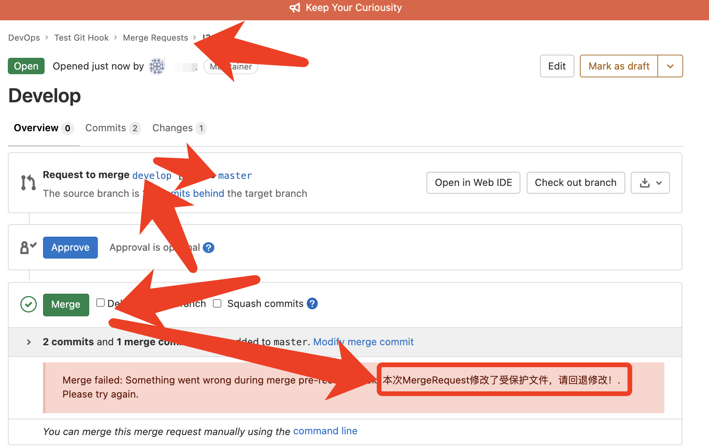

# Gitlab的服务端git钩子

# 一、简介

官方文档：https://docs.gitlab.com/ee/administration/server_hooks.html

Git除了客户端有各种钩子进行配置使用，远程存储库，例如gitlab也支持服务端的钩子。本地git客户端推送代码到远程仓库时，可以触发执行钩子脚本。

## **服务端git钩子类型**

- **pre-receive**：`git push`向仓库推送代码时被执行
- **post-receive**：在成功推送后被调用，适合用于发送通知。这个脚本没有参数，但和pre-receive一样通过标准输入读取
- **update**：在pre-receive之后被调用。它也是在实际更新前被调用的，但它可以分别被每个推送上来的引用分别调用。也就是说如果用户尝试推送到4个分支，update会被执行4次。不需要读取标准输入。事实上，它接受三个参数：
  - 更新的引用名称
  - 引用中存放的旧的对象名称
  - 引用中存放的新的对象名称

## **支持配置的范围**

- **单个仓库**
- **全局所有的仓库**

## 应用场景

- 保护仓库CICD脚本(例如：`.gitlab-ci.yaml`，`Dockerfile`)等非业务代码不被开发人员修改
- 检查MergeRequest的变更，或者触发其他动作
- 检查commit的提交者信息是否是gitlab中设置的用户名，便于溯源代码提交者信息


# 二、配置

## 1、创建钩子脚本

- **单个仓库钩子脚本**

  根据钩子类型需要在仓库存储路径下的custom_hooks(不存在就自行创建)文件下创建对应钩子类型名称的脚本文件

  > 在项目经过Hashed过的项目路径下创建钩子脚本文件（项目hashed的路径参考[附录一](#附录)）

  ```bash
  mkdir /var/opt/gitlab/git-data/repositories/@hashed/项目hashed路径/custom_hooks
  touch /var/opt/gitlab/git-data/repositories/@hashed/项目hashed路径.git/custom_hooks/pre-receive
  chmod +x /var/opt/gitlab/git-data/repositories/@hashed/项目hashed路径.git/custom_hooks/pre-receive
  ```

- **全局仓库钩子脚本**

  - 全局构建脚本默认配置路径：Omnibus安装模式下是在 `/opt/gitlab/embedded/service/gitlab-shell/hooks`，源码安装模式下是在`/home/git/gitlab-shell/hooks`

  - 根据钩子类型需要在钩子默认配置路径下创建对应钩子类型名称的文件夹(其他名字的会被忽略)。例如：`pre-receive.d,post-receive.d,update.d`

  ```bash
  mkdir -p /opt/gitlab/embedded/service/gitlab-shell/hooks/{pre-receive.d,post-receive.d,update.d}
  touch detect-modify-cicd-scripts-files.sh
  chmod +x detect-modify-cicd-scripts-files.sh
  ```

  

# 三、编写钩子脚本

**脚本生效顺序：**

- 内置的钩子脚本
- `单个仓库.git/custom_hooks/以钩子类型名称命名的脚本文件`
- `单个仓库.git/custom_hooks/钩子类型名称.d/*`
- `<custom_hooks_dir>/钩子类型名称.d/*`
- 对于文件夹下的多个脚本则按字母顺序执行，以脚本非零值退出时中断执行。

**脚本语言支持：**

- shell
- ruby

## 1、检查commit是否修改受保护文件

**脚本逻辑：**

- 判断当前推送的分支是否为新分支？如果是新分支，n
- 使用git diff对比commit与当前仓库commit有变更的文件
- 判读变更文件是否是预设受保护的文件？是的话，追加到预置变量中进行记录
- 判断预置变量是否为空？不为空，代表本次commit有修改受保护文件。
- 再次判断当前commit的用户是否为预设允许修改受保护文件的用户？是的话，允许提交。不是的话，

  - git push显示警告，然后发送钉钉通知
  - 判断提交协议是否是web？是的话，则表示触发执行当前脚本的是Web界面上创建的MergeRequest请求，然后显示告警信息。
  - 最后脚本返回状态1，然后gitlab就会拒绝当前commit的推送


```bash
#!/bin/bash
new_branch_commitid_zero40=0000000000000000000000000000000000000000

protected_files=".gitlab-ci.yml docker/Dockerfile docker/config.sh docker/k8s-application.tpl.yaml docker/k8s-cronjob.tpl.yaml"
approval_users="root curiouser"
DINGDING_ROBOT_TOKEN="钉钉机器人的Token"
changed_file=""

while read oldrev newrev refname; do
    if [ $oldrev -eq $new_branch_commitid_zero40 ] ; then
      commit_changed_file_name=$(git diff --name-only ${newrev}^!)
    else
      commit_changed_file_name=$(git diff --name-only $oldrev $newrev)
    fi
    for i in $commit_changed_file_name; do
        if $(echo $protected_files | grep -q $i); then
            changed_file+="   $i\n"
        fi
    done
    if [[ ! $changed_file == "" ]] && [[ ${approval_users/$GL_USERNAME//} == $approval_users ]]; then
        echo -e "\033[31m########################################\033[0m"
        if [[ $GL_PROTOCOL == 'web' ]] ;then
            echo "GL-HOOK-ERR: 本次MergeRequest修改了受保护文件:"
            echo -e "GL-HOOK-ERR: ${changed_file//\\n/  }"
            echo "GL-HOOK-ERR: 无法完成合并，请检查修改！"
        fi
        echo -n -e "\033[31m${GL_USERNAME}, 请不要修改以下仓库保护文件: \n${changed_file}本次推送${newrev:0:8}将被拒绝推送至远程仓库\n########################################\033[0m"
        curl -s -H 'Content-Type: application/json' -d '{"msgtype": "markdown","markdown": {"title": "Gitlab","text": "# Gitlab仓库保护文件修改通知\n'$GL_USERNAME'正在尝试将以下保护文件修改推送至'$GL_PROJECT_PATH'仓库中: \n >  '"$changed_file"'\n#### 推送'"${newrev:0:8}"'已拒绝 "},"at": {"isAtAll": true}}' https://oapi.dingtalk.com/robot/send?access_token=$DINGDING_ROBOT_TOKEN >/dev/null
        exit 1
    fi
done
```

**验证测试**

①当在git本地修改了受保护文件推送至远程仓库时，会显示提示信息，并拒绝推送


②当Web界面创建MergeRequest合并某个分支到目标分支时，修改了目标分支，会显示提示信息，并拒绝合并



## 2、检查commit用户名及邮箱的设置

```bash
#!/usr/bin/env bash

# 访问 GitLab API 所需的 token, 需使用 admin 用户生成, scope 选择 read_user 即可
# https://docs.gitlab.com/ee/user/profile/personal_access_tokens.html
TOKEN="GitLab admin user read_user TOKEN"

# GitLab 服务的访问地址, 因为该脚本是放置在 GitLab 服务中, 所以使用本机地址即可
GITLAB_URL=http://127.0.0.1:30000

# 使用 python 提取 json 中的 name 和 email 代码
get_name_and_email="import sys, json;
try:
  obj=json.load(sys.stdin);
  print(obj[0]['name']+':'+obj[0]['email'])
except:
    print('error')"

# 访问 GitLab Users API 获取用户显示名称与 email
# GL_USERNAME 为 GitLab 的 username, 一般为英文, 而 commit 中的 username 我们一般设置为中文
# API 返回的数据为 json 格式, 通过 python 代码进行提取显示名称与 email
# 因为显示名称为中文, 为了解决乱码问题, 配置 PYTHONIOENCODING='UTF-8'
# python 返回的格式为 name:email
# https://docs.gitlab.com/ee/api/users.html#list-users
GITLAB_NAME_EMAIL=`curl -s --header "Private-Token: ${TOKEN}" "${GITLAB_URL}/api/v4/users?username=${GL_USERNAME}" | PYTHONIOENCODING='UTF-8' python3 -c "${get_name_and_email}"`

if [ "${GITLAB_NAME_EMAIL}" == "error" ]; then
    echo "Push 异常: GitLab 获取用户信息异常, 请通知管理员进行排查"
    exit 1
fi

echo $GL_USERNAME $GITLAB_NAME_EMAIL
# 截取显示名称
GITLAB_USER_NAME=${GITLAB_NAME_EMAIL%:*}
# 截取 email
GITLAB_USER_EMAIL=${GITLAB_NAME_EMAIL#*:}

zero_commit="0000000000000000000000000000000000000000"

excludeExisting="--not --all"

while read oldrev newrev refname; do
  # branch or tag get deleted
  if [ "$newrev" = "$zero_commit" ]; then
    continue
  fi

  # Check for new branch or tag
  if [ "$oldrev" = "$zero_commit" ]; then
    span=`git rev-list $newrev $excludeExisting`
  else
    span=`git rev-list $oldrev..$newrev $excludeExisting`
  fi

  for COMMIT in $span;
   do
        AUTHOR_USER=`git log --format=%an -n 1 ${COMMIT}`
        AUTHOR_EMAIL=`git log --format=%ae -n 1 ${COMMIT}`
        # COMMIT_USER=`git log --format=%cn -n 1 ${COMMIT}`
        # COMMIT_EMAIL=`git log --format=%ce -n 1 ${COMMIT}`

        # 进行 username 与 email 校验
        # 在 GitHub 的示例脚本中启用了 AUTHOR_USER 与 AUTHOR_EMAIL 校验, 但是使用时可能存在 author 与 committer 不是同一个人的情况, 故注释校验 AUTHOR_USER 与 AUTHOR_EMAIL 的代码
        # 如果自己公司实际使用时不存在这种情况, 可以取消注释
        # author 与 committer 区别 https://stackoverflow.com/q/6755824

       if [[ ${AUTHOR_USER} != ${GITLAB_USER_NAME} ]]; then
           echo -e "\033[31mPush 异常: ${COMMIT:0:8} 的 author (${AUTHOR_USER}) 不是 GitLab 中的中文名 (${GITLAB_USER_NAME})\033[0m"
           exit 20
       fi

        # if [[ ${COMMIT_USER} != ${GITLAB_USER_NAME} ]]; then
        #     echo -e "\033[31mPush 异常: ${COMMIT:0:8} 的 committer (${COMMIT_USER}) 不是 GitLab 中的中文名 (${GITLAB_USER_NAME})\033[0m"
        #     exit 30
        # fi

       if [[ ${AUTHOR_EMAIL} != ${GITLAB_USER_EMAIL} ]]; then
           echo -e "\033[31mPush 异常: ${COMMIT:0:8} 的 author 的邮箱 (${AUTHOR_EMAIL}) 不是 GitLab 中的邮箱 (${GITLAB_USER_EMAIL})\033[0m"
           exit 40
       fi

        # if [[ ${COMMIT_EMAIL} != ${GITLAB_USER_EMAIL} ]]; then
        #     echo -e "\033[31mPush 异常: ${COMMIT:0:8} 的 committer 的邮箱 (${COMMIT_EMAIL}) 不是 GitLab 中的邮箱 (${GITLAB_USER_EMAIL})\033[0m"
        #     exit 50
        # fi
    done
done

exit 0
```


# 四、脚本可引用的环境变量

| 环境变量          | 描述                                         |
| :---------------- | :------------------------------------------- |
| `GL_ID`           | 用户ID。格式：key-ID                         |
| `GL_PROJECT_PATH` | 仓库路径，GitLab版本 >= 13.2                 |
| `GL_PROTOCOL`     | 推送协议（http/ssh/web），GitLab版本 >= 13.2 |
| `GL_REPOSITORY`   | 仓库ID，`project-<id>`                       |
| `GL_USERNAME`     | 用户名称                                     |

`pre-receive` 和 `post-receive server` 钩子脚本可引用的变量

| 环境变量                           | 描述                                                         |
| :--------------------------------- | :----------------------------------------------------------- |
| `GIT_ALTERNATE_OBJECT_DIRECTORIES` | 仓库底层存储文件路径。（可选，路径包含Hash过的路径）         |
| `GIT_OBJECT_DIRECTORY`             | 仓库底层存储文件路径。（路径包含Hash过的路径）               |
| `GIT_PUSH_OPTION_COUNT`            | Number of push options. See [Git `pre-receive` documentation](https://git-scm.com/docs/githooks#pre-receive). |
| `GIT_PUSH_OPTION_<i>`              | Value of push options where `i` is from `0` to `GIT_PUSH_OPTION_COUNT - 1`. See [Git `pre-receive` documentation](https://git-scm.com/docs/githooks#pre-receive). |


# 附录

## 1、显示仓库文件Hash之后的存储路径

- 在gitlab-rails控制台中使用命令显示

  `/var/opt/gitlab/git-data/repositories/`

  ```bash
  # 进入gitlab-rails控制台
  gitlab-rails console
  
  => Project.find(项目ID).disk_path
  "@hashed/6f/4b/6f4b6612125fb3a0daecd2799dfd6c9c299424fd920f9b308110a2c1fbd8f443"
  => Project.find_by_full_path('组/仓库').disk_path
  "@hashed/6f/4b/6f4b6612125fb3a0daecd2799dfd6c9c299424fd920f9b308110a2c1fbd8f443"
  ```

- 拼凑

  项目仓库文件Hash之后的存储路径是Project_ID进行SHA256加密过的字符串构成。例如

  ```bash
  /var/opt/gitlab/git-data/repositories/@hashed/
  		|--Project_ID的SHA256加密字符串前两位/
  					|--Project_ID的SHA256加密字符串第三位和第四位
  					      |--Project_ID的SHA256加密字符串.git
  					      |--Project_ID的SHA256加密字符串.wiki.git
  ```

  


# 参考

1. https://docs.gitlab.com/ee/administration/server_hooks.html
2. https://blog.csdn.net/ygdlx521/article/details/115751703
3. https://git-scm.com/book/tr/v2/Customizing-Git-An-Example-Git-Enforced-Policy
4. https://ghthou.github.io/2020/11/07/GitLab-%E4%BD%BF%E7%94%A8-Server-Hooks-%E6%A0%A1%E9%AA%8C-Commit-%E7%94%A8%E6%88%B7%E5%90%8D%E4%B8%8E%E9%82%AE%E7%AE%B1/