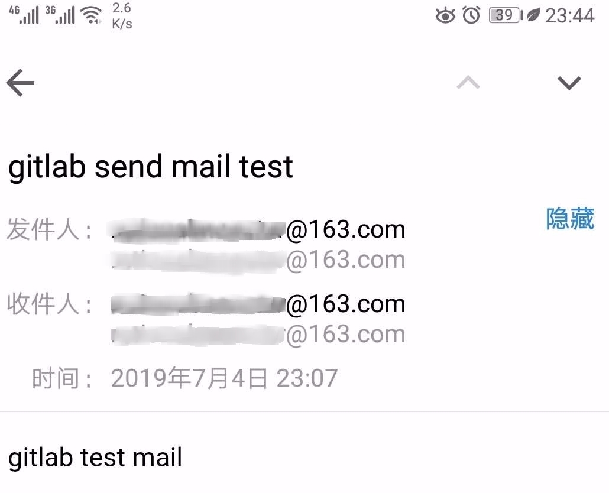

# 1. 修改/etc/gitlab/gitlab.rb

```ruby
### Email Settings
gitlab_rails['gitlab_email_enabled'] = true
gitlab_rails['gitlab_email_from'] = '******@163.com'
gitlab_rails['gitlab_email_display_name'] = 'Curiouser163SMTPServer'
gitlab_rails['gitlab_email_reply_to'] = '*****@163.com'
gitlab_rails['gitlab_email_subject_suffix'] = 'Gitlab'
```

```ruby
gitlab_rails['smtp_enable'] = true
gitlab_rails['smtp_address'] = "smtp.163.com"
gitlab_rails['smtp_port'] = 25
gitlab_rails['smtp_user_name'] = "******@163.com"
gitlab_rails['smtp_password'] = "******"
gitlab_rails['smtp_domain'] = "163.com"
gitlab_rails['smtp_authentication'] = "login"
gitlab_rails['smtp_enable_starttls_auto'] = false
gitlab_rails['smtp_tls'] = false
```

**注意**：

1. 当使用Docker镜像部署时，相关Gitlab参数可追加在环境变量“GITLAB_OMNIBUS_CONFIG”的值中进行配置。详见：https://docs.gitlab.com/omnibus/docker/ 及 [gitlab的安装与配置](gitlab-install.md)

2. 测试发送邮件

```bash
$ gitlab-rails console
Loading production environment (Rails 4.2.10)
$ irb(main):001:0> Notify.test_email('******@163.com','gitlab send mail test','gitlab test mail').deliver_now

Notify#test_email: processed outbound mail in 539.6ms

Sent mail to ******@163.com (397.8ms)
Date: Thu, 04 Jul 2019 15:07:33 +0000
From: Curiouser163SMTPServer<******@163.com>
Reply-To: Curiouser163SMTPServer<******@163.com>
To:******@163.com
Message-ID: <5d1e1635e507c_5c13fa113ac91001075d@gitlab-ce-18-9cj5x.mail>
Subject: gitlab send mail test
Mime-Version: 1.0
Content-Type: text/html;
 charset=UTF-8
Content-Transfer-Encoding: 7bit
Auto-Submitted: auto-generated
X-Auto-Response-Suppress: All

<!DOCTYPE html PUBLIC "-//W3C//DTD HTML 4.0 Transitional//EN" "http://www.w3.org/TR/REC-html40/loose.dtd">
<html><body><p>gitlab test mail</p></body></html>=> #<Mail::Message:69960855039000, Multipart: false, Headers: <Date: Thu, 04 Jul 2019 15:07:33 +0000>, <From: Curiouser163SMTPServer<******@163.com>>, <Reply-To: Curiouser163SMTPServer<******@163.com>>, <To: rationalmonster@16
3.com>, <Message-ID: <5d1e1635e507c_5c13fa113ac91001075d@gitlab-ce-18-9cj5x.mail>>, <Subject: gitlab send mail test>, <Mime-Version: 1.0>, <Content-Type: text/html; charset=UTF-8>, <Content-Transfer-Encoding: 7bit>, <Auto-Submitted: a
uto-generated>, <X-Auto-Response-Suppress: All>>
irb(main):002:0>
```




# 参考

1. https://docs.gitlab.com/omnibus/settings/smtp.html#smtp-settings