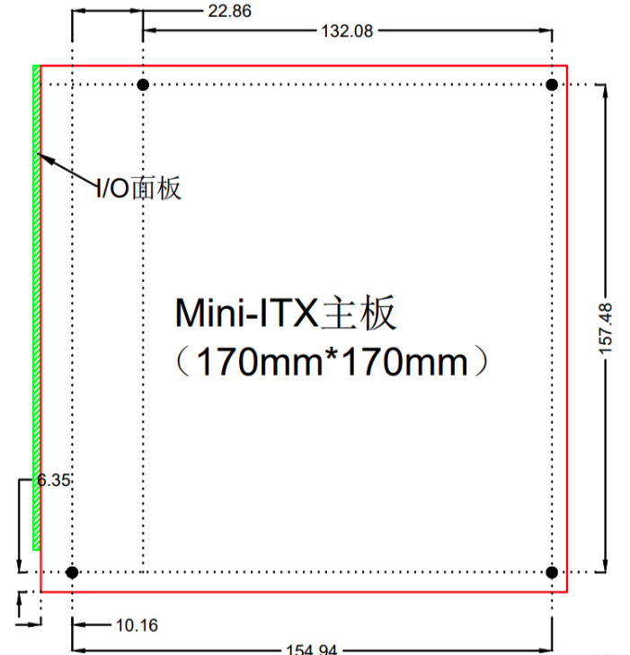

# 一、主板规格尺寸

## Mini-ITX (170\*170mm)

## ATX (305*244mm)

## Micro-ATX (244\*244mm)

## FlexATX (229\*191mm)
## XL-ATX (343\*262mm)
## E-ATX (305\*330mm)

## EE-ATX  (347\*330mm)
## HPTX (345\*381mm)
## WTX (356\*425mm)
## μATX (244\*185mm)

# 二 、硬盘规格尺寸

## 2.5寸硬盘

2.5寸硬盘的相关规范主要由SFF（Small Form Factor Special Interest Group）制定，常见的规范号包括以下几个：

1. **SFF-8201**: Specification for 2.5" Drives - General.
2. **SFF-8223**: Specification for 2.5" Drive Form Factor with Serial Attachment (SAS/SATA).
3. **SFF-8228**: Specification for 2.5" Drive Form Factor with Fibre Channel Attachment.

## 3.5寸硬盘

3.5寸硬盘的规范由SFF（Small Form Factor Special Interest Group）制定，常见的规范号包括以下几个：

1. **SFF-8300**: Specification for 3.5" Drives - General.
2. **SFF-8323**: Specification for 3.5" Drive Form Factor with Serial Attachment (SAS/SATA).
3. **SFF-8328**: Specification for 3.5" Drive Form Factor with Fibre Channel Attachment.

参考：

- https://members.snia.org/document/dl/25862

# 三、SATA接口尺寸

## 2.5寸硬盘SATA接口尺寸

## 3.5寸硬盘SATA接口尺寸

# 参考

- https://zh.wikipedia.org/wiki/%E4%B8%BB%E6%A9%9F%E6%9D%BF%E8%A6%8F%E6%A0%BC%E6%AF%94%E8%BC%83
