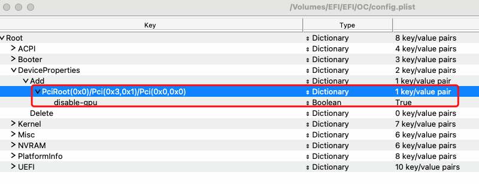

# 一、OpenCore简介

GitHub 地址：https://github.com/acidanthera/OpenCorePkg

下载地址：https://github.com/acidanthera/OpenCorePkg/releases

文档：

- https://dortania.github.io/OpenCore-Post-Install/

中文文档

- https://blog.daliansky.net/OpenCore-BootLoader.html
- https://oc.skk.moe/
- https://apple.sqlsec.com/#reloaded

# 二、编辑工具

- **[OpenCore Configurator](https://mackie100projects.altervista.org/opencore-configurator/)**

- **[ProperTree](https://github.com/corpnewt/ProperTree)**

  - 安装部署

    ```bash
    git clone https://github.com/corpnewt/ProperTree
    python ./ProperTree/ProperTree.py 
    # 或者
    python3 ./ProperTree/ProperTree.py
    
    # 或者
    MacOS下直接双击ProperTree.command
    ```

其他工具

- **[Hackintool](https://github.com/headkaze/Hackintool)**

# 三、目录文件详解

## Kexts

- [Lilu.kext](https://github.com/acidanthera/Lilu/releases)：Acidanthera驱动全家桶的SDK
- [Applealc.kext](https://github.com/acidanthera/AppleALC/releases)：声卡驱动
- [VirtualSMC.kext](https://github.com/acidanthera/virtualsmc/releases)：传感器驱动依赖
- SMCProcessor.kext：CPU核传感器
- SMCSuperIO.kext：IO传感器     
- [WhateverGreen.kext](https://github.com/acidanthera/whatevergreen/releases)：显卡驱动
- [IntelMausi.kext](https://github.com/acidanthera/IntelMausi/releases)：Intel类千兆网卡驱动
- [Usbinjectall.kext](https://github.com/Sniki/OS-X-USB-Inject-All/releases)：USB驱动 （你也可以定制自己的USB补丁）  

## Drivers

- **AudioDxe.efi：**开机UEFI界面若需要声音效果需要加载。
- **CrScreenshotDxe.efi：**开机UEFI的截图工具。
- **HiiDatabase.efi：**用于给 Ivy Bridge (3 代酷睿) 或更老代主板上支持 UEFI 字体渲染, UEFI Shell 中文字渲染异常时使用, 新主板不需要。
- **NvmExpressDxe.efi：**用于在 Haswell (4 代酷睿) 或更老的主板上支持 NVMe 硬盘, 新主板不需要。
- **OpenCanopy.efi：**加载第三方开机主题。
- **OpenRuntime.efi：** 内存运用等必要的插件，必须加载。
- **OpenUsbKbDxe.efi：** 给使用模拟 UEFI 的老主板在 OpenCore 界面正常输入用的, 请勿在 Ivy Bridge (3 代酷睿)及以上的主板上使用。
- **Ps2KeyboardDxe.efi：** PS2键盘所需插件。
- **Ps2MouseDxe.efi：** PS2鼠标所需插件。
- **UsbMouseDxe.efi：** 当MacOS被安装在虚拟机上所需要的鼠标插件。
- **XhciDxe.efi：** 用于在 Sandy Bridge（2代）及之前或更老的主板上加载XHCI控制器。
- **[HfsPlus.efi](https://blog.xjn819.com/tools/HfsPlus.efi.zip)：** 用于HFS格式文件系统，这是必须加载的。

## Tools

OC 小工具文件夹，像下面的 CleanNvram.efi 和 ResetSystem.efi 就是其中的一些小工具。OC 官方自带的工具文件以及说明如下：

- **BootKicker.efi**：调用苹果原生的引导切换 GUI, 给白苹果使用的，黑苹果不支持
- **ChipTune.efi**：测试 BeepGen 协议并生成不同风格和长度的音频信号。
- **CleanNvram.efi**：NVRAM 清理工具，实际上 OC 自带的 NVRAM 清理功能已经足够了
- **ControlMsrE2.efi**：检查所有内核的CFG 锁定（MSR 0xE2写保护）一致性，并在更改此类隐藏选项
- **CsrUtil.efi**：简单实现苹果csrutil的 SIP 相关功能
- **GopStop.efi**：停止显卡 GOP，排错时使用用一个简单的场景测试 GraphicsOutput 协议
- **KeyTester.efi**：在 SimpleText 模式下测试键盘输入。
- **MmapDump.efi**：ProvideCustomSlide 选项的必要性
- **OpenControl.efi**：为其他工具提供 NVRAM 保护，以便在从 OC 启动时能够获得完整的 NVRAM 访问权限。
- **OpenShell.efi**：OpenCore 配置的 UEFI Shell
- **ResetSystem.efi**：用于执行系统重置的实用程序
- **RtcRw.efi**：用于读取和写入 RTC (CMOS) 存储器的实用程序。
- **TpmInfo.efi**：检查平台上的英特尔 PTT（平台信任技术）功能，如果启用，则允许使用 fTPM 2.0

# 四、重要配置

## 1、个性定制启动菜单主题

①下载跟OpenCore版本一致的[OpenCanopy.efi](https://github.com/acidanthera/OpenCorePkg/releases)放在`EFI/OC/Drivers`文件夹中（OpenCanopy.efi是在OpenCorePkg压缩包中的，只提取这个文件即可）。

②配置

- 使用OpenCore Configurator进行配置，可进行预览，点击下载，自动校验相关文件是否存在合法。

  

- 手动配置

  - 在主题仓库：https://github.com/chris1111/My-Simple-OC-Themes下载文件到`EFI/OC/Resources/Image`

  - 配置`EFI/OC/config.plist`中的

    - `Misc --> Boot --> PickerAttributes（Number）= 17`
    - `Misc --> Boot --> PickerVariant（String）= 主题名字` 

    

参考：https://dortania.github.io/OpenCore-Post-Install/cosmetic/gui.html#setting-up-boot-chime-with-audiodxe

## 2、关闭启动菜单中的“Reset NvmRAM”选项

配置`EFI/OC/config.plist`中的**Misc** > **Security** > **AllowNvramReset = False** 

参考：https://www.tonymacx86.com/threads/how-to-remove-reset-nvram-boot-entry-in-opencore-0-7-2.315495/

## 3、不显示启动日志

配置`EFI/OC/config.plist`中的

- **Misc --> Debug --> AppleDebug = NO**
- **Misc --> Debug --> ApplePanic = NO** 
- **Misc --> Debug --> Target = 0**
- 特别注意：OpenCore如果是0.7.9，删除**Misc --> Debug --> LogModules**

参考：https://dortania.github.io/OpenCore-Install-Guide/troubleshooting/debug.html#config-changes

## 4、在启动菜单中启用内置工具

使用**OpenCore Configurator**打开config.plist

① **`Misc -> Boot -> LauncherOption = Full`**

② 使用**OpenCore Configurator**自动检测内置工具，并勾选启用


## 5、禁用单个显卡

⓪为什么要禁用显卡

​		双系统，Windows+Hackinsh MacOS；有两张显卡，一张RTX 2060S，Windows下游戏用，hackinsh下没有驱动，无法使用；一张RTX 765，MacOS下免驱动亮机卡。在Hackinsh MacOS启动过程中要禁用掉不支持的RTX 2060S才能正常启动。

①查询设备的ACPI路径


②方法选择

- **Boot Flag：**禁用除核显之外的所有独显
- **DeviceProperties（首选）：**基于单个PCIE插槽禁用 GPU
- **SSDT：**基于单个PCIE插槽禁用 GPU

③DeviceProperties方法

**`DeviceProperties --> Add`**



参考：

- https://dortania.github.io/OpenCore-Install-Guide/extras/spoof.html
- https://dortania.github.io/Getting-Started-With-ACPI/Desktops/desktop-disable.html#finding-the-acpi-path-of-the-gpu

## 6、Windoows双系统下时区同步

- 使用Hackintool生成在windows下修改注册表的脚本。会自动生成 Windows 可用的注册表文件，一个结尾是On，一个是Off，分别对应开启和关闭。

  **[WinUTCOff.reg](../assets/Windows-hackinsh-sync-time-WinUTCOff.reg)**     **[WinUTCOn.reg](../assets/Windows-hackinsh-sync-time-WinUTCOn.reg)**

  

- 在Windows下执行注册表脚本，重启即可。

参考：https://heipg.cn/tutorial/solving-time-sync-problem.html

## 7、开启启动菜单密码保护

- 使用[OpenCore核心安装包](https://github.com/acidanthera/OpenCorePkg/releases)中的工具`OpenCore-0.7.9-RELEASE/Utilities/ocpasswordgen/ocpasswordgen`生成密码的盐值和Hash值

  **`注意点：macOS双击ocpasswordgen运行。复制密码Hash值时，<>也要复制`**

  

- 使用OpenCore Configurator设置启用密码

  

参考：

- https://www.youtube.com/watch?v=aGDeRLimNzY
- https://dortania.github.io/OpenCore-Post-Install/universal/security/password.html

## 8、挂载EFI分区

```bash
sudo mkdir /Volumes/EFI && sudo  mount -t msdos /dev/disk0s1 /Volumes/EFI
```

## 9、EFI分区被覆盖如何处理

双系统情况下，如果想重装Windows，在装完以后，磁盘的EFI分区会被覆盖，引导程序会变成Windows Boot Manager。此时该如何重新使用OpenCore进行引导。步骤如下：

**前提：原先的双系统的EFI文件有做备份**

① 使用U盘内置的OpenCore启动，进入装好的MacOS

② 挂载当前磁盘的EFI分区（一般是磁盘的第一个分区），备份现有的EFI分区，并清空文件夹

- 方式一：使用工具挂载

- 方式二(推荐)： 使用命令行挂载

  ```bash
  sudo mkdir /Volumes/EFI && sudo  mount -t msdos /dev/disk0s1 /Volumes/EFI
  ```

③ 将原先备份的EFI分区文件复制到现有EFI分区文件夹中

④删除复制到EFI分区中的MicroSoft文件夹，将第二步备份的WIndows Boot Manager中的MicroSoft文件复制过来

⑤启动后，首先默认进入的Windows，开机以后，安装EasyUEFI。

⑥使用EasyUEFI创建新的启动项，指定启动boot文件


⑦此时重启，进入BIOS。设置好启动项，选择OpenCore。再次启动就可以使用之前的OpenCore启动程序啦。

# 五、EFI Shell命令详解

## 1、bcfg

```bash
# 帮助文档
help bcfg -v -b  # 或者 bcfg -? -v -b
#
bcfg boot dump -v
# 删除第4个启动选项:
bcfg boot rm 3
# 把第3个启动选项移动到第0
bcfg boot mv 3 0
# 
bcfg boot add N fsV:\vmlinuz-linux "Arch Linux"	
```

## 2、map

文件系统：`fs0`

存储设备：`blk0`


参考：

- https://linuxhint.com/use-uefi-interactive-shell-and-its-common-commands/#9
- https://wiki.archlinux.org/title/Unified_Extensible_Firmware_Interface_(%E7%AE%80%E4%BD%93%E4%B8%AD%E6%96%87)

# 参考

- https://blog.daliansky.net/OpenCore-BootLoader.html

