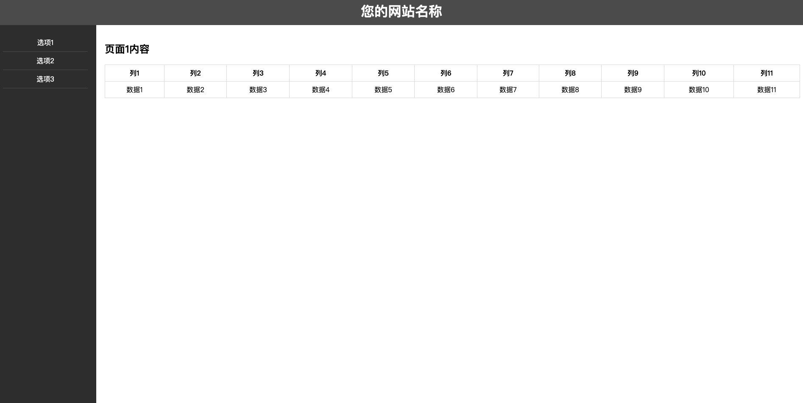

# HTML/CSS学习总结

# 一、模态框modal

## 1、简介

模态框（Modal）是一种用户界面元素，通常用于显示弹出式对话框或窗口，覆盖在应用程序的主界面之上。它在显示内容的同时阻止用户与应用程序的其他部分进行交互，直到用户关闭模态框为止。

## 2、用途

- **用户提示和通知：** 模态框可用于显示警告、成功消息、错误信息等。
- **表单交互：** 在模态框中显示表单，让用户填写或编辑信息。
- **确认对话框：** 用于确认某个操作，例如删除确认框。
- **图像或媒体展示：** 展示大图、视频或其他媒体内容。
- **登录/注册窗口：** 提供用户登录或注册的界面。

## 3、功能

- **阻止交互：** 模态框弹出时，通常会阻止用户与主应用程序的其他部分进行交互，使用户专注于模态框的内容。
- **动画效果：** 可以通过CSS或JavaScript添加动画效果，使模态框的显示和隐藏更加平滑。
- **关闭按钮：** 通常模态框内有关闭按钮，以便用户手动关闭模态框。
- **事件触发：** 模态框的显示和隐藏通常是由特定事件触发的，例如点击按钮、链接或定时器。
- **响应式设计：** 可以通过CSS媒体查询等技术，使模态框适应不同屏幕大小。

## 4、结构

一个简单的模态框通常包括以下几个部分：

- **触发按钮：** 启动模态框的按钮，可以是一个按钮、链接或其他可点击的元素。
- **模态框容器：** 包含模态框内容的容器，通常位于页面的中心。
- **内容区域：** 显示具体内容的区域，可以是文本、表单、图像等。
- **关闭按钮：** 允许用户手动关闭模态框的按钮，通常位于模态框的右上角。

## 5、属性

- **display：** 控制模态框的显示和隐藏状态，通常使用CSS的`display`属性。
- **position：** 设置模态框的定位方式，通常使用CSS的`position`属性。
- **z-index：** 控制模态框在层叠上下文中的堆叠顺序，确保模态框位于其他元素之上。
- **动画效果：** 可以通过CSS的过渡或动画效果实现模态框的平滑显示和隐藏。
- **事件监听器：** 使用JavaScript添加事件监听器，例如点击按钮触发显示模态框，点击关闭按钮或覆盖层触发隐藏模态框等。

## 6、示例

- https://code.z01.com/v4/components/modal.html

# 二、常用界面



```html
<!DOCTYPE html>
<html lang="en">

<head>
        <meta charset="UTF-8">
        <meta name="viewport" content="width=device-width, initial-scale=1.0">
        <style>
                body,
                h1,
                ul,
                li {
                        margin: 0;
                        padding: 0;
                }

                /* 整体容器样式 */
                .container {
                        display: flex;
                        flex-direction: column;
                        min-height: 100vh;
                        /* 设置容器至少铺满整个视口高度 */
                }

                /* 顶部 Banner 样式 */
                header {
                        background-color: #555;
                        color: #fff;
                        padding: 10px;
                        text-align: center;
                }

                /* 导航栏和内容区域容器样式 */
                .content-container {
                        display: flex;
                        flex: 1;
                        /* 填充剩余空间 */
                }

                /* 导航栏样式 */
                nav {
                        background-color: #333;
                        color: #fff;
                        text-align: center;
                        width: 200px;
                        /* 左侧导航栏宽度 */
                        display: flex;
                        flex-direction: column;
                        /* 将导航栏内元素垂直排列 */
                        align-items: stretch;
                        /* 让导航栏高度延伸至底部 */
                        padding: 20px;
                }

                ul {
                        list-style: none;
                }

                a {
                        text-decoration: none;
                        color: #fff;
                        display: block;
                        padding: 10px;
                        border-bottom: 1px solid #555;
                        /* 添加底边框，提高可读性 */
                }

                /* 右侧内容区域样式 */
                .content {
                        flex: 1;
                        /* 填充剩余空间 */
                        padding: 20px;
                }

                .page {
                        display: none;
                        /* 默认隐藏所有 div 元素 */
                }

                .page.active {
                        display: block;
                }

                /* 添加表格样式 */
                table {
                width: 100%;
                border-collapse: collapse;
                margin-top: 20px;
                }

                th, td {
                border: 1px solid #ddd;
                padding: 8px;
                text-align: center;
                }
        </style>
</head>

<body>
        <!-- 整体容器 -->
        <div class="container">
                <!-- 顶部 Banner -->
                <header>
                        <h1>您的网站名称</h1>
                </header>

                <!-- 导航栏和内容区域容器 -->
                <div class="content-container">
                        <!-- 左侧导航栏 -->
                        <nav>
                                <ul>
                                        <li><a href="#" onclick="showPage('page1')">选项1</a></li>
                                        <li><a href="#" onclick="showPage('page2')">选项2</a></li>
                                        <li><a href="#" onclick="showPage('page3')">选项3</a></li>
                                </ul>
                        </nav>

                        <!-- 右侧内容区域 -->
                        <div class="content">
                                <!-- 页面内容 -->
                                <div id="page1" class="page active">
                                        <h2>页面1内容</h2>
                                        <!-- 表格 -->
                                        <table>
                                                <thead>
                                                        <tr>
                                                                <th>列1</th>
                                                                <th>列2</th>
                                                                <th>列3</th>
                                                                <th>列4</th>
                                                                <th>列5</th>
                                                                <th>列6</th>
                                                                <th>列7</th>
                                                                <th>列8</th>
                                                                <th>列9</th>
                                                                <th>列10</th>
                                                                <th>列11</th>
                                                        </tr>
                                                </thead>
                                                <tbody>
                                                        <!-- 表格内容 -->
                                                        <tr>
                                                                <td>数据1</td>
                                                                <td>数据2</td>
                                                                <td>数据3</td>
                                                                <td>数据4</td>
                                                                <td>数据5</td>
                                                                <td>数据6</td>
                                                                <td>数据7</td>
                                                                <td>数据8</td>
                                                                <td>数据9</td>
                                                                <td>数据10</td>
                                                                <td>数据11</td>
                                                        </tr>
                                                        <!-- 添加更多行和数据 -->
                                                </tbody>
                                        </table>
                                </div>

                                <div id="page2" class="page">
                                        <h2>页面2内容</h2>
                                </div>

                                <div id="page3" class="page">
                                        <h2>页面3内容</h2>
                                </div>
                        </div>
                </div>
        </div>

        <script>
                // JavaScript 函数，根据传入的页面 ID 显示对应的 div 元素
                function showPage(pageId) {
                        // 隐藏所有页面
                        var pages = document.querySelectorAll('.page');
                        pages.forEach(page => page.classList.remove('active'));

                        // 显示选中的页面
                        var selectedPage = document.getElementById(pageId);
                        if (selectedPage) {
                                selectedPage.classList.add('active');
                        }
                }
        </script>
</body>

</html>
```

