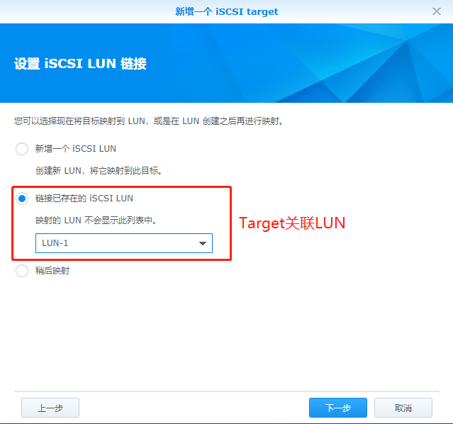

# iSCSI的简介配置使用

# 一、iSCSI简介

iSCSI（Internet Small Computer System Interface），Internet小型计算机系统接口，又称为IP-SAN，是由IBM 下属的两大研发机构一一加利福尼亚AImaden和以色列Haifa研究中心共同开发的，是一个供硬件设备使用的、可在IP协议上层运行的SCSI指令集，是一种开放的基于IP协议的工业技术标准。一种基于因特网及SCSI-3协议下的存储技术，于2003年2月11日成为正式的标准

iSCSI使用 TCP/IP 协议（一般使用TCP端口860和3260）。 本质上，iSCSI 让两个主机通过 IP 网络相互协商然后交换SCSI命令。这样一来，iSCSI 就是用广域网仿真了一个常用的高性能本地存储总线，从而创建了一个存储局域网（SAN）。不像某些 SAN 协议，iSCSI 不需要专用的电缆；它可以在已有的交换和 IP 基础架构上运行。然而，如果不使用专用的网络或者子网（ LAN 或者 VLAN ），iSCSI SAN 的部署性能可能会严重下降

两部计算机之间利用iSCSI的协议来交换SCSI命令，让计算机可以透过高速的局域网集线来把SAN模拟成为本地的储存装置

- **`iSCSI target`**：就是iSCSI的server，可以是一个物理磁阵；也可以是软件实现的iSCSI server。有硬件方式实现的iSCSI target，例如iSCSI的hba卡和带isoe（iSCSI offload engine）网卡（硬件上将iSCSI 包接包和封包）
- **`iSCSI initiator`**：就是iSCSI的客户端，它可以是一个软件，也可以是一个硬件。如果是软件在linux上，用户态实现的是tgt框架（linux scsi target frame）；还有一种内核太实现的架构是iet（iSCSI enterprise target）。在centos上目前已经默认安装了tgt了。
- **`iqn`**（iSCSI qualified name）：initiator和target通过iqn号来逻辑寻址。一个iqn号由四部分组成：
  
    `iqn.日期.域名:域名组织分配的名字`
    
    例如：iqn.2000-01.com.synology:Synology.Target-1.826d6a066b
- **`LUN`**：全称是Logical Unit Number，中文名是逻辑单元号。LUN是在存储设备上可以被应用服务器识别的独立存储单元。一个LUN的空间来源于存储池Pool，Pool的空间来源于组成磁盘阵列的若干块硬盘。从应用服务器的角度来看，一个LUN可以被视为一块可以使用的硬盘。例如，在Linux系统中，它在/dev/rdsk、/dev/dsk目录下有相应的设备名称；在Windows系统中，格式化后的新LUN会对应一个类似于D E F的盘符。
- **`Thick LUN`**：中文名是传统非精简LUN，是LUN类型的一种，支持虚拟资源分配，能以较为简便的方式进行创建、扩容和压缩操作。Thick LUN在创建完成后就会从存储池Pool中分配满额的存储空间，即LUN的大小完全等于分配的空间。因此，它拥有较高的可预测性。
- **`Thin LUN`**：中文名是精简LUN，也是LUN类型的一种，支持虚拟资源分配，能够以较简便的方式进行创建、扩容和压缩操作。Thin LUN在创建的时候，可以设置一个初始分配容量。创建完成后，存储池Pool只会分配这个初始容量大小的空间剩余的空间仍然放在存储池中。当Thin LUN已分配的存储空间的使用率达到阈值时，存储系统才会再从Pool中划分一定的配额给Thin LUN。如此反复，直到达到Thin LUN最初设定的全部容量。因此，它拥有较高的存储空间利用率。

# 二、群晖Synology的iSCSI存储

**`创建LUN`**

**`创建Target`**

**`Target关联LUN`**

# 三、Windows挂载

# 参考链接

1. https://jingyan.baidu.com/article/e4511cf37feade2b845eaff8.html
2. https://blog.csdn.net/M_joy666/article/details/80566705

# 附录：Thick LUN与Thin LUN的区别

## 1、空间分配上的区别

Thick LUN在创建时会分配所有需要的空间
Thin LUN是一种按需分配的空间组织方法，它在创建时存储池不会分配所有需要的空间，而是根据使用情况动态分配。二者的空间分配区别如下图所示：

## 2、空间回收的区别

  注：这里的空间回收指的是释放存储池Pool中的资源，并且这些资源可以被其他LUN使用。

Thick LUN没有空间回收的概念，因为它在创建时就占用存储池中所有分配给它的空间，即使Thick LUN中的数据被删除，存储池中分配给它的空间还是被占用，不能被其他的LUN使用。但是如果手动删除不再使用的Thick LUN，则对应的空间会被回收。
Thin LUN不仅能够做到空间占用率增大时自动分配新的存储空间，而且当Thin LUN中的文件删除时也可以实现空间的释放，从而实现存储空间的反复利用，大大提高存储空间的利用率。Thin LUN的空间回收如下图所示：

## 3、性能的区别

Thick LUN由于在一开始就会拥有所分配的空间，所以Thick LUN在顺序读写的时候拥有较高的性能，但是会造成空间资源的浪费。
Thin LUN由于是实时分配空间，每次扩容时，需要重新增加容量，后台重新格式化，这个时候性能会受到一定影响，而且每次分配空间可能会导致硬盘中存储空间不连续，这样硬盘读写数据时在寻找存放位置上花费的时间会较多，会在顺序读写时对性能有一定影响。

## 4、使用场景的区别

Thick LUN：

- ①对性能要求较高的场景
- ②对存储空间利用率不太敏感的场景
- ③对成本要求不太高的场景

Thin LUN：

- ①对性能要求一般的场景；
- ②对存储空间利用率比较敏感的场景；
- ③对成本比较敏感的场景；
- ④应用环境很难预 估存储空间的场景
