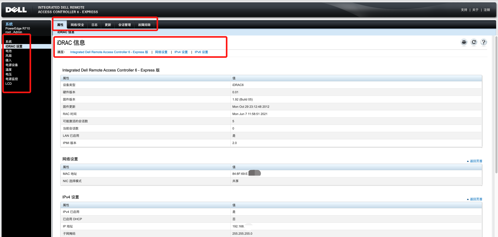

# Dell服务器远程管理卡iDRAC

# 一、简介

- iDRAC又称为Integrated Dell Remote Access Controller，也就是集成戴尔远程控制卡，这是戴尔服务器的独有功能
- iDRAC卡相当于是附加在服务器上的一台独立运行的小型pc，通过与服务器主板上的管理芯片BMC进行通信，监控与管理服务器的硬件状态信息。它拥有自己的系统和IP地址，与服务器上的OS无关，是服务器管理员进行远程访问和管理的便利工具。
- iDRAC分为 Express和Enterprise 两种版本，iDRAC Express 默认是用服务器1号网口来连接， iDRAC Enterprise默认使用专用网口连接。

# 二、Web页面

在Dell 的板载iDRAC控制



- 默认用户名密码：`root / calvin` （登录后最好修改密码）

# 三、命令行CLI

```bash
show   [<options>] [<target>] [<properties>]
       [<propertyname>== <propertyvalue>]
set    [<options>] [<target>] <propertyname>=<value>
cd     [<options>] [<target>]
create [<options>] <target> [<property of new target>=<value>]
       [<property of new target>=<value>]
delete [<options>] <target>
exit   [<options>]
reset  [<options>] [<target>]
start  [<options>] [<target>]
stop   [<options>] [<target>]
version [<options>]
help   [<options>] [<help topics>]
load -source <URI> [<options>] [<target>]
dump -destination <URI> [<options>] [<target>]
```


## Racadm

```bash
 help [subcommand]         -- display usage summary for a subcommand
 arp                       -- display the networking ARP table
 clearasrscreen            -- clear the last ASR (crash) screen
 closessn                  -- close a session
 clrraclog                 -- clear the RAC log
 clrsel                    -- clear the System Event Log (SEL)
 config                    -- modify RAC configuration properties
 coredump                  -- display the last RAC coredump
 coredumpdelete            -- delete the last RAC coredump
 fwupdate                  -- update the RAC firmware
 getconfig                 -- display RAC configuration properties
 getled                    -- Get the state of the LED on a module.
 getniccfg                 -- display current network settings
 getraclog                 -- display the RAC log
 getractime                -- display the current RAC time
 getsel                    -- display records from the System Event Log (SEL)
 getssninfo                -- display session information
 getsvctag                 -- display service tag information
 getsysinfo                -- display general RAC and system information
 gettracelog               -- display the RAC diagnostic trace log
 getversion                -- Display the current version details
 getuscversion             -- display the current USC version details
 ifconfig                  -- display network interface information
 netstat                   -- display routing table and network statistics
 ping                      -- send ICMP echo packets on the network
 ping6                     -- send ICMP echo packets on the network
 racdump                   -- display RAC diagnostic information
 racreset                  -- perform a RAC reset operation
 racresetcfg               -- restore the RAC configuration to factory defaults
 remoteimage               -- make a remote ISO image available to the server
 serveraction              -- perform system power management operations
 setniccfg                 -- modify network configuration properties
 setled                    -- Set the state of the LED on a module.
 sshpkauth                 -- manage SSH PK authentication keys on the RAC
 sslcertview               -- view SSL certificate information
 sslcsrgen                 -- generate a certificate CSR from the RAC
 sslEncryptionStrength     -- Display or modify the SSL Encryption strength.
 sslresetcfg               -- resets the web certificate to default and restarts the web server.
 testemail                 -- test RAC e-mail notifications
 testkmsconnectivity       -- test KMSConnectivity
 testtrap                  -- test RAC SNMP trap notifications
 usercertview              -- view user certificate information
```


## 1、服务管理

```bash
racadm getconfig -g cfgracTuning
# （cfgRacTuneWebserverEnable 卡的WEB 服务未启动，0：表示未启动；1： 表示启动）
racadm config -g cfgRacTuning -o cfgRacTuneWebServerEnable 1 服务开启成功
```

## 2、会话管理

```bash
# 获取当前活动的会话
racadm getssninfo 

# 关闭所有会话。
racadm closessn -a

# 关闭特定用户的所有会话
racadm closessn -u <username>

# 或者在Web的"iDRAC设置" ---> "会话管理"中进行管理
```


# 四、客户端racadm


Docker客户端：

https://hub.docker.com/r/prabhakarpujeri/racadm-docker/tags?page=1&ordering=last_updated

https://github.com/prabhakarpujeri/racadm-docker/blob/master/Dockerfile


# 参考

1. https://thornelabs.net/posts/dell-idrac-racadm-commands-and-scripts.html
2. 


