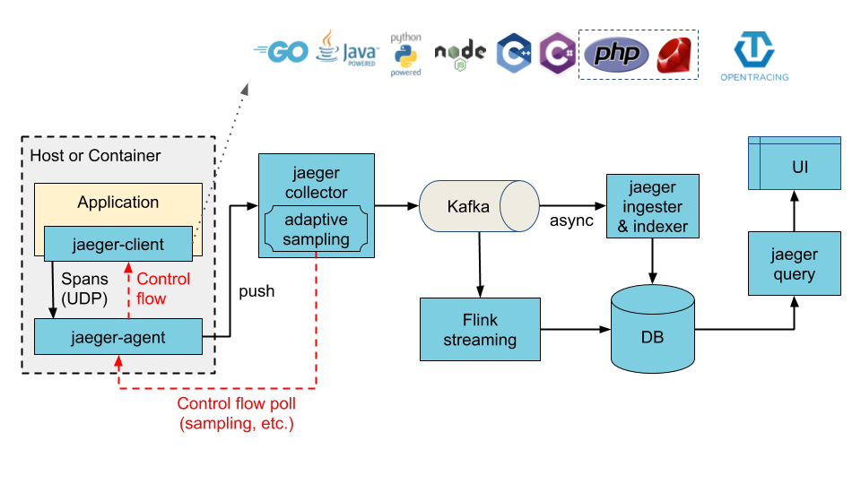
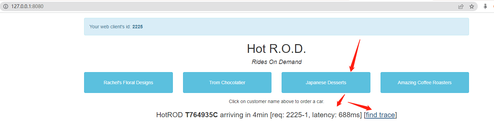
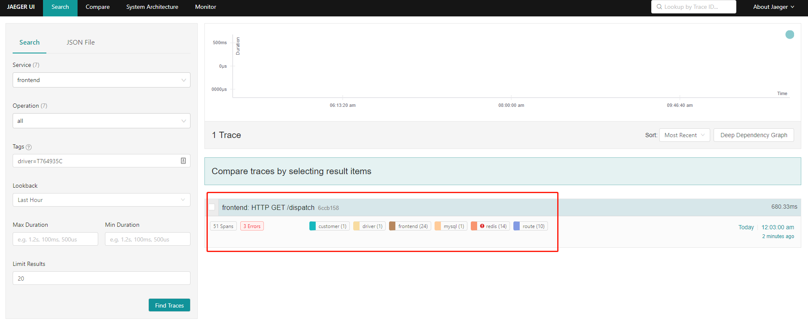
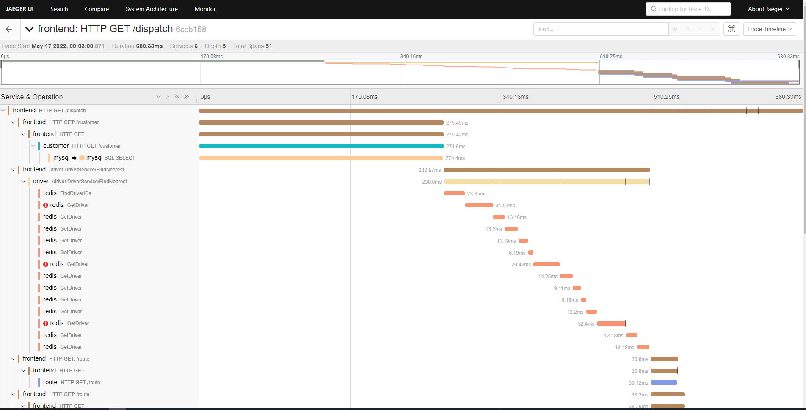
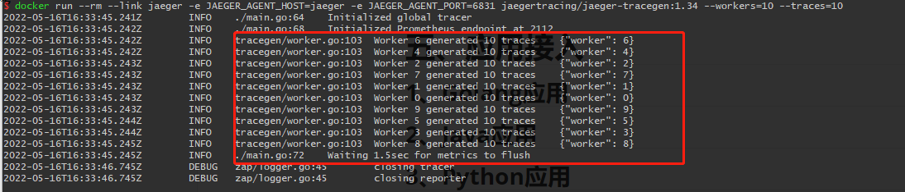
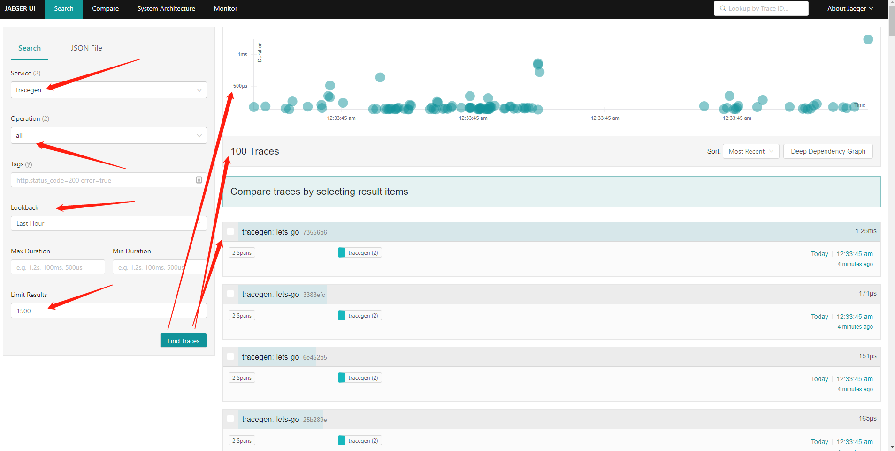

# Jaeger

# 一、简介

Jaeger是一个基于opentracing规范的链路追踪工具平台

## 1、架构及组件


**带有Kafka缓存同时可以进行ETL的架构**



- **jaeger-client**

  Jaeger 的客户端，实现了 OpenTracing 的 API，支持主流编程语言。客户端直接集成在目标 Application 中，其作用是记录和发送 Span 到 Jaeger Agent。在 Application 中调用 Jaeger Client Library 记录 Span 的过程通常被称为埋点。

- **jaeger-agent**

  暂存 Jaeger Client 发来的 Span，并批量向 Jaeger Collector 发送 Span，一般每台机器上都会部署一个 Jaeger Agent。官方的介绍中还强调了 Jaeger Agent 可以将服务发现的功能从 Client 中抽离出来，不过从架构角度讲，如果是部署在 Kubernetes 或者是 Nomad 中，Jaeger Agent 存在的意义并不大。

- **jaeger-collector**

  接受 Jaeger Agent 发来的数据，并将其写入存储后端，目前支持采用 Cassandra 和 Elasticsearch 作为存储后端。个人还是比较推荐用 Elasticsearch，既可以和日志服务共用同一个 ES，又可以使用 Kibana 对 Trace 数据进行额外的分析。架构图中的存储后端是 Cassandra，旁边还有一个 Spark，讲的就是可以用 Spark 等其他工具对存储后端中的 Span 进行直接分析。


- **jaeger-query & jaeger-ui**

  读取存储后端中的数据，以直观的形式呈现

- **jaeger-ingester**

  ingester从名字就可以看出是从kafka里面取数据然后做持久化的，关于这个持久化的对象，jaeger原生是选择了elasticsearch（简称es），之索引选择es是因为查询非常方便（反向索引），性能也不错。

## 2、概念

- **Trace**：一条调用链。

- **Span**：可以理解成一条调用链的一个环节。一条 Trace可以被认为是一个由多个 Span 组成的DAG图。

- **Tag**：标签集

- **Log**：日志集

- **References**：Span与Span之间的关系。OpenTracing目前定义了两种关系：ChildOf（父子） 和 FollowsFrom（跟随）

- **SpanContext**：Span上下文对象，主要保存了traceId spanId等，用来跨进程边界传输。不同进程间可以利用SpanContext建立References关系。
  （下个服务拿到traceId就可以知道自己改归属于哪个调用链， 拿到spanId就知道自己的父span是谁 ）

## 3、采样速率

支持设置采样率是 Jaeger 的一个亮点，生产环境系统性能很重要，所以对于所有的请求都开启 Trace 显然会带来比较大的压力，另外，大量的数据也会带来很大存储压力。为了尽量消除分布式追踪采样对系统带来的影响，设置采样率是一个很好的办法。Jaeger官方 支持四种采样类别，分别是 

- **Constant**：全量采集，采样率设置0,1 分别对应打开和关闭 
- **Probabilistic**：概率采集，默认万份之一，取值可在 0至1之间，单位为百分比。0.5代表50%
- **Rate Limiting**：限速采集，每秒只能采集一定量的数据，如设置2的话，就是每秒采集2个链路数据
- **Remote** ：是遵循远程设置，取值的含义和 probabilistic 相同，都意为采样的概率，只不过设置为 remote 后，Client 会从 Jaeger Agent 中动态获取采样率设置。 
- **guaranteedThroughput:** 复合采样，至少每秒采样lowerBound次（rateLimiting），超过lowerBound次的话，按照samplingRate概率来采样

## 4、组件端口作用

| 组件      | 端口  | 协议 | 描述                                                         |
| :-------- | :---- | :--- | :----------------------------------------------------------- |
| Agent     | 6831  | UDP  | 应用程序向代理发送跟踪的端口，接受 Jaeger.thrift而不是 Compact thrift协议<br>通过兼容性Thrift协议，接收Jaeger thrift类型数据 |
| Agent     | 6832  | UDP  | 通过二进制Thrift协议，接收Jaeger thrift类型数据 ，需要某些不支持压缩的客户端库 |
| Agent     | 5775  | UDP  | 通过兼容性Thrift协议，接收Zipkin thrift类型数据              |
| Agent     | 5778  | HTTP | 配置控制服务接口                                             |
| Agent     | 14271 | HTTP | 监控信息端口                                                 |
| Collector | 14250 | TCP  | Agent 发送 Proto 格式数据                                    |
| Collector | 14267 | TCP  | 接收客户端Jaeger thrift类型的数据                            |
| Collector | 14268 | HTTP | 接收客户端Zipkin thrift类型的数据                            |
| Collector | 14269 | HTTP | 监控信息端口                                                 |
| Query     | 16686 | HTTP | Jaeger UI页面端口                                            |
| Query     | 16687 | HTTP | 监控信息端口                                                 |
| ingester  | 14270 | HTTP | 监控信息端口                                                 |

# 二、安装

| docker镜像                                                   | 描述                                                         |
| :----------------------------------------------------------- | :----------------------------------------------------------- |
| [all-in-one](https://hub.docker.com/r/jaegertracing/all-in-one) | 专为快速本地测试而设计。它使用内存存储组件启动 Jaeger UI、收集器、查询和代理。<br>`$ docker pull jaegertracing/all-in-one:1.34` |
| [example-hotrod](https://hub.docker.com/r/jaegertracing/example-hotrod) | 演示分布式跟踪功能的示例应用程序“HotROD”.<br>`$ docker pull jaegertracing/example-hotrod:1.34` |
| [jaeger-agent](https://hub.docker.com/r/jaegertracing/jaeger-agent) | 从 Jaeger 客户端接收 span 并转发给收集器。设计为作为 sidecar 或主机agents运行<br/>`$ docker pull jaegertracing/jaeger-agent:1.34` |
| [jaeger-collector](https://hub.docker.com/r/jaegertracing/jaeger-collector) | 从agents或直接从客户端接收 spans并将它们保存在持久存储中<br/>`$ docker pull jaegertracing/jaeger-collector:1.34` |
| [jaeger-query](https://hub.docker.com/r/jaegertracing/jaeger-query) | 提供 Jaeger UI 和从存储中检索跟踪的 API.<br/>`$ docker pull jaegertracing/jaeger-query:1.34` |
| [jaeger-ingester](https://hub.docker.com/r/jaegertracing/jaeger-ingester) | 收集器的替代品；从 Kafka topic读取spans并将它们保存到存储中<br/>`$ docker pull jaegertracing/jaeger-ingester:1.34` |
| [spark-dependencies](https://hub.docker.com/r/jaegertracing/spark-dependencies) | 一个 Apache Spark 作业，它从存储中收集 Jaeger spans ，分析服务之间的关联，并将它们存储起来以供以后在 Jaeger UI 中展示<br/>`$ docker pull jaegertracing/spark-dependencies:latest` |
| [jaeger-operator](https://hub.docker.com/r/jaegertracing/jaeger-operator) | 用于打包、部署和管理 Jaeger 的 Kubernetes Operator.<br/>`$ docker pull jaegertracing/jaeger-operator:1.34` |
| [jaeger-cassandra-schema](https://hub.docker.com/r/jaegertracing/jaeger-cassandra-schema) | 用于初始化 Cassandra 键空间和模式的实用程序脚本。<br/>`$ docker pull jaegertracing/jaeger-cassandra-schema:1.34` |
| [jaeger-es-index-cleaner](https://hub.docker.com/r/jaegertracing/jaeger-es-index-cleaner) | 用于从 Elasticsearch 中清除旧索引的实用程序脚本，因为 ES 不支持数据 TTL。.<br/>`$ docker pull jaegertracing/jaeger-es-index-cleaner:1.34` |

## 1. Docker

### 1.1 Allinone

```bash
docker run -d --name jaeger \
	-p 16686:16686 \
	jaegertracing/all-in-one:1.34
```

或者在Windows或MacOS或Linux中使用二进制文件进行部署

https://github.com/jaegertracing/jaeger/releases/

## 2. Kubernetes

### 2.1 helm

```bash
helm repo ad jaegertracing https://jaegertracing.github.io/helm-charts
helm repo update
helm install --namespace jaeger jaeger jaegertracing/jaeger \
  --set tag="1.34" \
  --set provisionDataStore.cassandra=false \
  --set storage.type=elasticsearch \
  --set storage.elasticsearch.host=elasticsearch的IP地址(不用带协议，直接IP地址即可) \
  --set storage.elasticsearch.user=elasticsearch用户名(如果使用自定义创建的es用户,权限要求:
集群权限：monitor、manage_index_templates；运行身份权限：apm_system;索引权限:对索引模式jaeger*拥有all权限) \
  --set storage.elasticsearch.password=elasticsearch用户密码 \
  --set agent.serviceMonitor.enabled=true \
  --set collector.serviceMonitor.enabled=true \
  --set collector.service.zipkin.port=9411
  --set query.ingress.enabled=true \
  --set "query.ingress.hosts={jaeger的ingress域名1(例如：jaeger1.curiouser.com),域名2(例如：jaeger2.curiouser.com)}" \
  --set query.serviceMonitor.enabled=true

  
# 如果要部署HotROD容器，需要添加设置以下参数
  --set hotrod.enabled=true \
  --set hotrod.ingress.enabled=true \
  --set hotrod.ingress.hosts={HotROD的ingress域名1(例如：jaeger-hotrod1.curiouser.com)} 
```

### 2.2 k8s operator

暂无

# 三、HotROD演示数据

HotROD（Rides on Demand）是一个演示应用程序，由几个微服务组成，说明了OpenTracing API的使用。

相关文档：

- https://medium.com/opentracing/take-opentracing-for-a-hotrod-ride-f6e3141f7941
- https://www.jaegertracing.io/docs/1.34/getting-started/#all-in-one

```bash
docker run -d --name jaeger-hotrod \
  --link jaeger \
  -p 8080-8083:8080-8083 \
  -e JAEGER_AGENT_HOST="jaeger" \
  jaegertracing/example-hotrod:1.34 all
```

访问：[http://127.0.0.1:8080](http://127.0.0.1:8080/) 点击进行导入数据，之后相关的请求HotROD容器日志中







# 四、tracegen压力测试

jaeger-tracegen可用于生成简单跨度的连续流。主要用于压力测试。可以控制worker的数量和在每个worker中生成的span。同时，它还可以在 firehose 模式下生成 span（在 span 上设置一个标志以跳过索引）

```bash
docker run --rm --link jaeger \
  -e JAEGER_AGENT_HOST=jaeger \
  -e JAEGER_AGENT_PORT=6831 \
  jaegertracing/jaeger-tracegen:1.34 --workers=10 --traces=10
```

**jaeger-tracegen参数**

```bash
-debug
      Whether to set DEBUG flag on the spans to force sampling
-duration duration
      For how long to run the test
-firehose
      Whether to set FIREHOSE flag on the spans to skip indexing
-marshal
      Whether to marshal trace context via HTTP headers
-pause duration
      How long to pause before finishing trace (default 1µs)
-service string
      Service name to use (default "tracegen")
-traces int
      Number of traces to generate in each worker (ignored if duration is provided (default 1)
-workers int
      Number of workers (goroutines) to run (default 1)
```






参考：https://www.jaegertracing.io/docs/1.34/tools/


# 参考

- https://www.cnblogs.com/whuanle/p/14598049.html
- https://www.csdn.net/tags/MtjaEgzsMTM5OTgtYmxvZwO0O0OO0O0O.html
- https://mp.weixin.qq.com/s?__biz=MzU3NTY3MTQzMg==&mid=2247485019&idx=1&sn=d86a00a4ba9ce5e80f1f4f34db3faf7c
- http://t.zoukankan.com/ChangAn223-p-11458226.html
- https://cloud.tencent.com/developer/article/1903277

