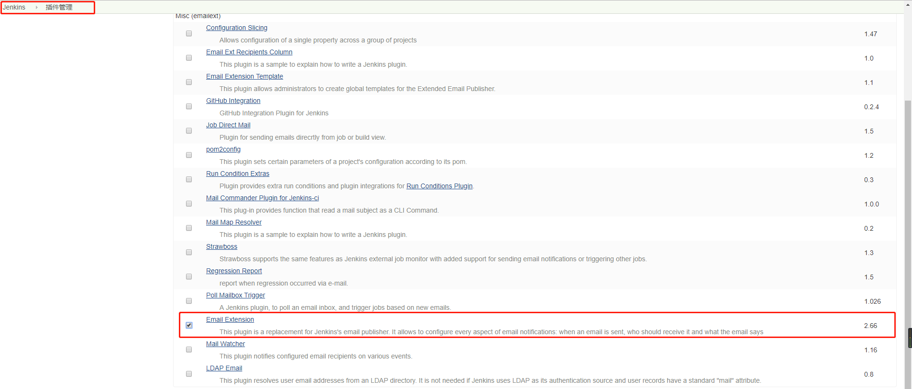
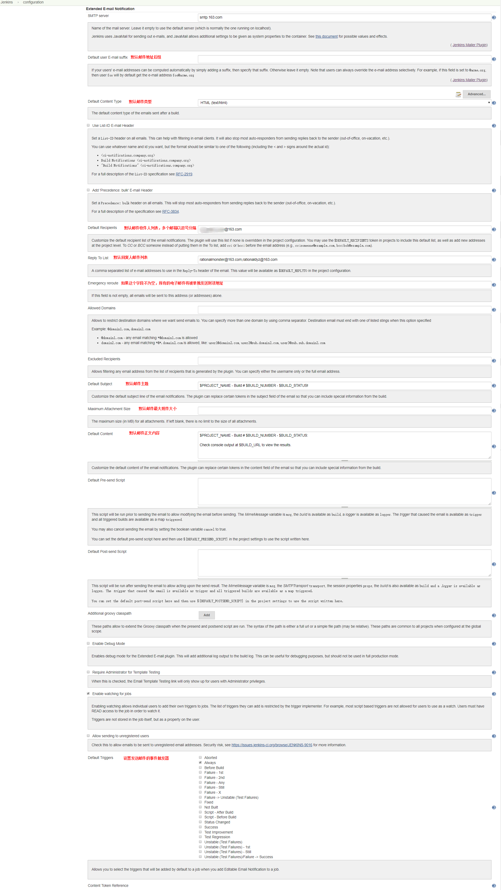
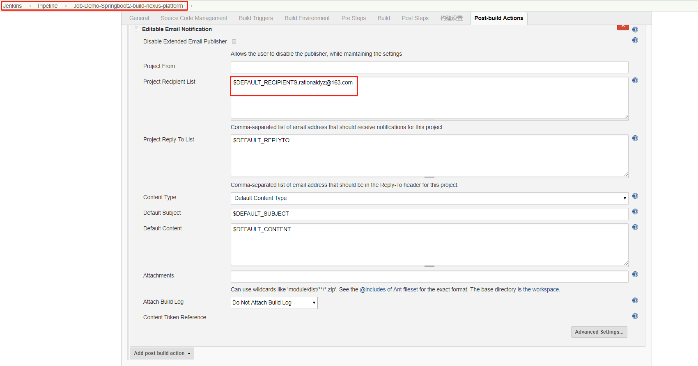
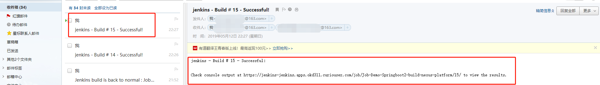
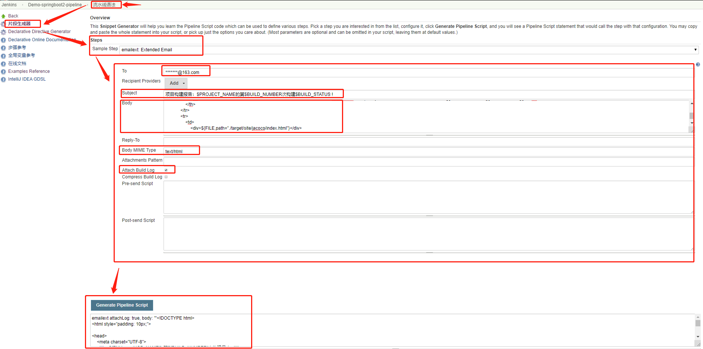
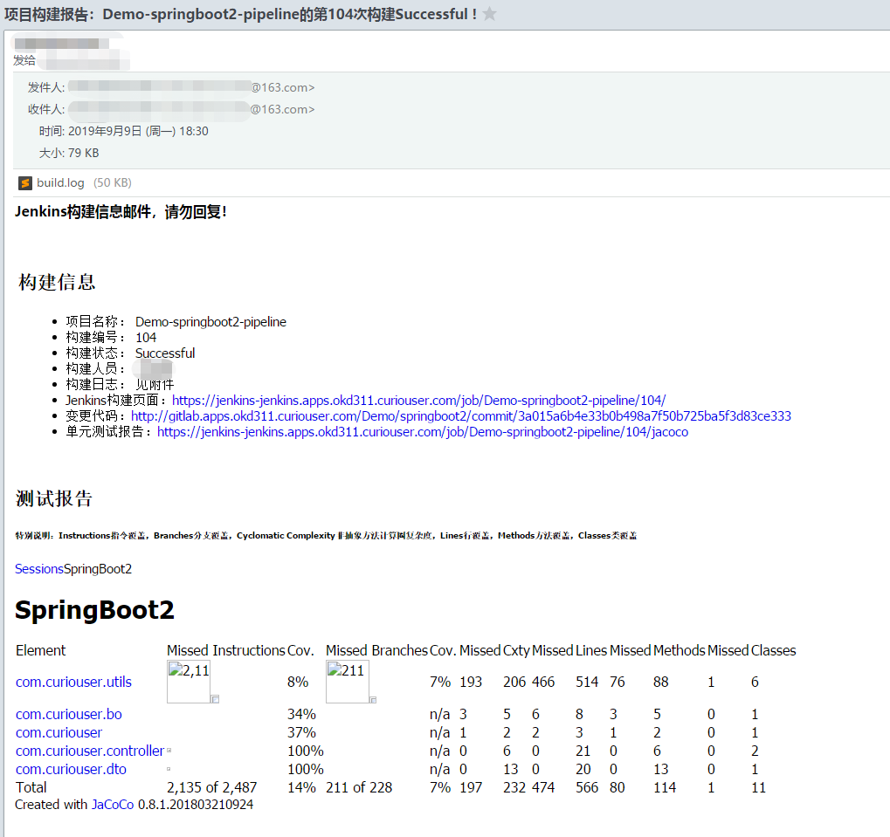

# Jenkins Mailer邮箱功能扩展插件Email-Extension
# 一、Context

Jenkins自带的邮件插件功能太弱，有个邮箱扩展插件。

官方文档WIKI：https://wiki.jenkins.io/display/JENKINS/Email-ext+plugin

优势：

* 邮件格式改为HTML，更美观
* 使用模板来配置邮件内容
* 为不同的Job配置不一样的收件人
* 为不同的事件配置不一样的trigger
* 在Jenkins pipeline中集成发送邮件通知功能

# 二、插件安装配置

## 1、安装



## 2、配置



# 三、使用

## 1、Jobs中




## 2、Pipeline中

```bash
pipeline{
    ...上文省略...
    post {
        always {
            emailext attachLog: true, body: '''
                构建任务的完整日志详见见附件,Jenkins查看链接: $BUILD_URL''', subject: '$PROJECT_NAME的第$BUILD_NUMBER次构建$BUILD_STATUS !', to: '*******@163.com'
        }
    }
}
```

# 四、发送HTML格式的邮件

## 1、Pipeline中

**Prerequisite**

- 准备格式化好的HTML

  ```html
  <!DOCTYPE html>
  <html style="padding: 10px;">
  <head>
      <meta charset="UTF-8">
      <title>${ENV, var="JOB_NAME"}-第${BUILD_NUMBER}次构建日志</title>
  </head>

  <body leftmargin="8" marginwidth="0" topmargin="8" marginheight="4"offset="0" style="border: 1px solid #eaeaea;padding: 10px;">
      <h3 style="margin: 0;font-size: 16px;">Jenkins构建信息邮件，请勿回复！</h3><br />
      <div style="width: 100%">
          <table width="100%" style="font-size: 11pt; font-family: Tahoma, Arial, Helvetica, sans-serif">
              <tr>
                  <th><br />
                      <h2 align="left">构建信息</h2>
                  </th>
              </tr>
              <tr>
                  <td>
                      <ul>
                          <li>项目名称： ${PROJECT_NAME}</li>
                          <li>构建编号： ${BUILD_NUMBER}</li>
                          <li>构建状态： ${BUILD_STATUS}</li>
                          <li>构建人员： ${GITLABUSERNAME}</li>
                          <li>构建日志： 见附件
                          <li>Jenkins构建页面： <a href="${BUILD_URL}">${BUILD_URL}</a></li>
                          <li>变更代码： <a href="${GITLABSOURCEREPOHOMEPAGE}/commit/${gitlabMergeRequestLastCommit}">${GITLABSOURCEREPOHOMEPAGE}/commit/${gitlabMergeRequestLastCommit}</a></li>
                          <li>单元测试报告： <a href="${BUILD_URL}jacoco">${BUILD_URL}jacoco</a></li>
                      </ul>
                  </td>
              </tr>
          </table>
      </div>
      <div>
          <table width="100%" cellpadding="0" cellspacing="0" style="font-size: 11pt; font-family: Tahoma, Arial, Helvetica, sans-serif">
              <tr>
                  <th><br />
                      <h2 align="left">测试报告</h2>
                      <h6 align="left">特别说明：Instructions指令覆盖，Branches分支覆盖，Cyclomatic Complexity非抽象方法计算圈复杂度，Lines行覆盖，Methods方法覆盖，Classes类覆盖</h6>
                  </th>
              </tr>
              <tr>
                  <td>
                      <div>${FILE,path="./target/site/jacoco/index.html"}</div>
                  </td>
              </tr>
          </table>
      </div>
  </body>
  ```

- 使用pipeline语法生成器生成pipeline
   
- 压缩pipeline. (压缩HTML源代码的工具网站：http://tool.oschina.net/jscompress?type=2)

```bash
pipeline{
    ...上文省略...
    post {
        always {
            emailext attachLog: true, body: '''<!DOCTYPE html><html style="padding: 10px;"><head><meta charset="UTF-8"><title>${ENV, var="JOB_NAME"}-第${BUILD_NUMBER}次构建日志</title></head><body leftmargin="8" marginwidth="0" topmargin="8" marginheight="4" offset="0" style="border: 1px solid #eaeaea;padding: 10px;"><h3 style="margin: 0;font-size: 16px;">Jenkins构建信息邮件，请勿回复！</h3><br /><div style="width: 100%"><table width="100%" style="font-size: 11pt; font-family: Tahoma, Arial, Helvetica, sans-serif"><tr><th><br /><h2 align="left">构建信息</h2></th></tr><tr><td><ul><li>项目名称： ${PROJECT_NAME}</li><li>构建编号： ${BUILD_NUMBER}</li><li>构建状态： ${BUILD_STATUS}</li><li>构建人员： ${GITLABUSERNAME}</li><li>构建日志： 见附件<li>Jenkins构建页面：<a href="${BUILD_URL}">${BUILD_URL}</a></li><li>变更代码：<a href="${GITLABSOURCEREPOHOMEPAGE}/commit/${gitlabMergeRequestLastCommit}">${GITLABSOURCEREPOHOMEPAGE}/commit/${gitlabMergeRequestLastCommit}</a></li><li>单元测试报告：<a href="${BUILD_URL}jacoco">${BUILD_URL}jacoco</a></li></ul></td></tr></table></div><div><table width="100%" cellpadding="0" cellspacing="0" style="font-size: 11pt; font-family: Tahoma, Arial, Helvetica, sans-serif"><tr><th><br /><h2 align="left">测试报告</h2><h6 align="left">特别说明：Instructions指令覆盖，Branches分支覆盖，Cyclomatic Complexity非抽象方法计算圈复杂度，Lines行覆盖，Methods方法覆盖，Classes类覆盖</h6></th></tr><tr><td><div>${FILE,path="./target/site/jacoco/index.html"}</div></td></tr></table></div></body>''', mimeType: 'text/html', subject: '项目构建报告：$PROJECT_NAME的第$BUILD_NUMBER次构建$BUILD_STATUS !', to: '*******@163.com'
        }
    }
}
```


