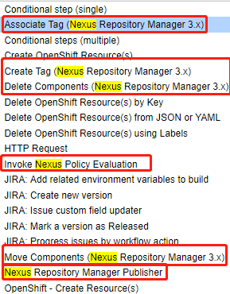
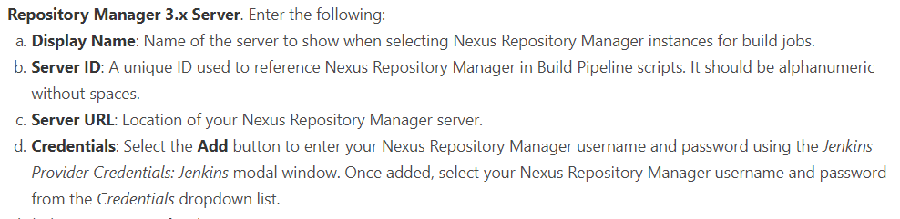

# Preflight
* 官方插件文档：https://help.sonatype.com/integrations/nexus-and-continuous-integration/nexus-platform-plugin-for-jenkins
* 安装插件：Pipeline Utility Steps


**功能**：





## 一、安装


## 二、配置

系统管理--> 系统设置--> Sonatype Nexus




## 三、使用

上传构建后的制品到Nexus的Hosted类型仓库中

**Job**


**Declarative Pipeline**

    ```bash
    stage ('上传制品') {
    steps {
        script{
        //读取源代码中的POM文件，获取生成制品的maven坐标信息（Jenkins需要安装pipeline-utility-steps插件）
        def pomfile = readMavenPom file: 'pom.xml'
        //使用Nexus Platform插件上传maven制品到Nexus的maven格式release仓库
        nexusPublisher nexusInstanceId: 'curiouser-okd-nexus', \
                        nexusRepositoryId: 'Maven-Releases', \
                        packages: [[$class: 'MavenPackage', \
                                    mavenAssetList: [[classifier: '', extension: '', \
                                    filePath: "target/${pomfile.artifactId}-${pomfile.version}.${pomfile.packaging}"]], \
                                    mavenCoordinate: [artifactId: "${pomfile.artifactId}", \
                                                    groupId: "${pomfile.groupId}", \
                                                    packaging: "${pomfile.packaging}", \
                                                    version: "${pomfile.version}"]]]
        //拼接maven制品的搜索链接,该链接是以源代码POM文件中的maven制品坐标信息参数对nexus api进行搜索，返回的response会重定向到制品的下载链接
        echo "The Jar Format Asset of Maven have been pushed to Hosted Repository: Maven-Release. The Download URL of the Asset: http://nexus-nexus.apps.okd311.curiouser.com/service/rest/v1/search../assets/download?maven.groupId=${pomfile.groupId}&maven.artifactId=${pomfile.artifactId}&maven.baseVersion=${pomfile.version}&maven.extension=jar&maven.classifier"
        }
    }
    }
    ```
## 四、注意

如果Job再次构建，产生相同的Jar，上传信息还是一样的，Nexus的Release仓库需要设置为"允许Redeploy"。不然，仓库中已经相同版本信息的制品，会造成上传失败


## 参考链接

1. https://support.sonatype.com/hc/en-us/articles/115009108987-Jenkins-Publish-Using-Maven-Coordinates-from-the-pom-xml
2. https://www.jianshu.com/p/29403ecf7fc2
3. https://stackoverflow.com/questions/37603619/extract-version-id-from-pom-in-a-jenkins-pipeline