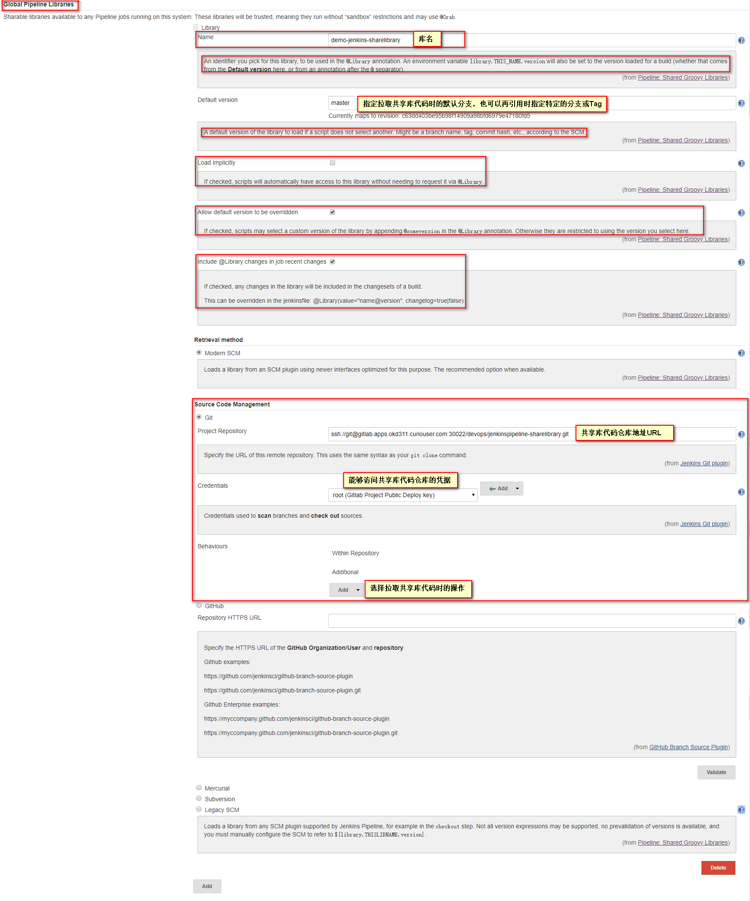
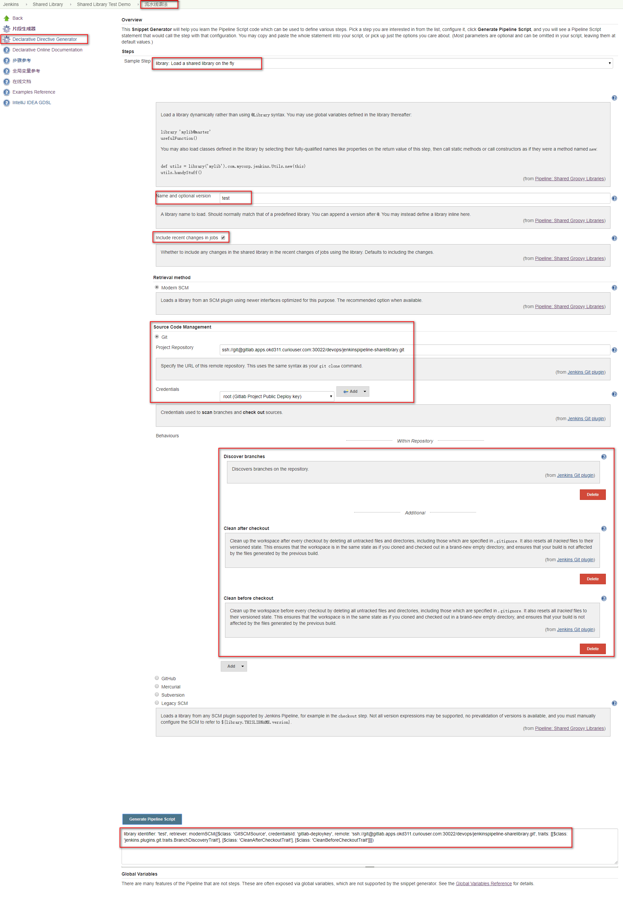

# Jenkins Pipeline共享库Shared Libraries

# 一、简介

随着Job的增多和pipeline的功能越来越复杂，Pipeline代码冗余度高。所以可以将一些公共的pipeline抽象做成模块代码，在各种项目pipeline之间共享核心实现，同时可以放到SVM中进行版本控制。以减少冗余并保证所有job在构建的时候会调用最新的共享库代码。这时就可以用到pipline的共享库Shared Libraries功能。

- 模块化
- 可重用性


# 二、共享库的目录结构

```json
共享库根目录
|-- vars
    |-- test1.groovy
|-- src
    |-- test2.groovy
|-- resources				
```

- **`vars`**: 依赖于Jenkins运行环境的Groovy脚本。其中的Groovy脚本被称之为**`全局变量`**。

- **`src`**:  标准的Java源码目录结构,其中的Groovy脚本被称为**`类库(Library class)`**。该目录所有下的所有类都一次性静态被添加到类路径classpath下

- **`resources`**: 目录允许从外部库中使用 `libraryResource` 步骤来加载有关的非 Groovy 文件。 目前，内部库不支持该特性

# 三、配置全局共享库

可在Jenkins中的**`Manage Jenkins`**  –>  **`Configure System`**　–> **`Global Pipeline Libraries`** 添加一个或多个全局的共享库，同时也可以在构建过程中的任何位置使用`library` step动作动态地配置引用共享库，详见[动态引用共享库](# 2. 动态引用共享库 )




# 四、引用共享库

## 1. 引用全局共享库

格式：`@Library('my-shared-library-1@$Branch/Tag','my-shared-library-1@$Branch/Tag') _`

```groovy
#!groovy
// 引用默认配置的共享库
@Library('demo-shared-library') _

// 引用指定分支、tag的共享库代码
@Library('demo-shared-library@1.0') _

// 引用多个指定分支tag的共享库
@Library('demo-shared-library@$Branch/Tag','demo-shared-library-test@$Branch/Tag') _

@Library('utils') import org.foo.Utilities

@Library('utils') import static org.foo.Utilities.*
```

## 2. 动态引用共享库

2.7版本后的`Shared Groovy Libraries`插件，增加了一个`library`的`setp`,可以随时在构建过程中引用共享库

```groovy
#!groovy

library 'demo-shared-library@$BRANCH_NAME'

library "demo-shared-library@${params.LIB_VERSION}"

library('demo-shared-library').com.mycorp.pipeline.Utils.someStaticMethod()

// 此时共享库的版本必须指定
library identifier: 'custom-lib@master', retriever: modernSCM(
  [$class: 'GitSCMSource',
   remote: 'git@git.mycorp.com:my-jenkins-utils.git',
   credentialsId: 'my-private-key'])
```

## 3. 调用第三方Java库

```groovy
@Grab('org.apache.commons:commons-math3:3.4.1')
import org.apache.commons.math3.primes.Primes
```

引用完的第三方Java库后会缓存在Jenkins Master节点的`~/.groovy/grapes/` 目录下

# 五、全局变量和类库的编写规则和调用方法

## 1. /var下定义的全局变量

- **全局变量必须以全小写或驼峰（camelCased）命名以便于能够在流水线中正确的加载**
- **/vars`目录中的脚本根据需求以单例的方式实例化，这允许在单个`.groovy` 文件中定义多个方法** 

- **/vars/*.groovy若实现call()方法，直接引用时默认执行其中的方法，该方法可以让全局变量以一种以类似于step的方式被调用**

  `/vars/log.groovy`

  ```groovy
  #!groovy
  def call(String name = 'human') {
      echo "Hello, ${name}."
  }
  def info(message) {
      echo "INFO: ${message}"
  }
  def warning(message) {
      echo "WARNING: ${message}"
  }
  ```

  `Jenkinsfile`

  ```groovy
  #!groovy
  @Library('demo-shared-library@1.0') _
  
  log()							// 输出"Hello, human."
  log.info 'Starting'				// 输出"INFO: Starting"
  log.warning 'Nothing to do!'    // 输出"WARNING: Nothing to do!"
  ```

- **从2017年9月下旬发布的声明式 1.2开始，可以在全局变量中直接定义声明式流水线**

  `/vars/evenOrOdd.groovy`

  ```groovy
  #!groovy
  def call(int buildNumber) {
    if (buildNumber % 2 == 0) {
      pipeline {
        agent any
        stages {
          stage('Even Stage') {
            steps {
              echo "The build number is even"
            }
          }
        }
      }
    } else {
      pipeline {
        agent any
        stages {
          stage('Odd Stage') {
            steps {
              echo "The build number is odd"
            }
          }
        }
      }
    }
  }
  ```

  `Jenkinsfile`

  ```groovy
  #!groovy
  @Library('demo-shared-library@1.0') _
  
  evenOrOdd(currentBuild.getNumber())
  ```

- **全局变量的传参**

  `/vars/buildPlugin.groovy`

  ```groovy
  #!groovy
  def call(Map config) {
      node {
          git url: "https://github.com/jenkinsci/${config.name}-plugin.git"
          sh 'mvn install'
          mail to: '...', subject: "${config.name} plugin build", body: '...'
      }
  }
  ```

  `Jenkinsfile`

  ```groovy
  #!groovy
  @Library('demo-shared-library@1.0') _
  
  buildPlugin name: 'git'
  ```

- **声明式流水线不允许在`script`指令之外使用全局变量**

  `Jenkinsfile`

  ```groovy
  #!groovy
  @Library('demo-shared-library@1.0') _
  
  pipeline {
      agent none
      stage ('Example') {
          steps {
               script { 
                   log.info 'Starting'
                   log.warning 'Nothing to do!'
               }
          }
      }
  }
  ```

## 2. /src下定义的类库

- **类库不能直接调用 `sh`或 `git`这样的步骤。 但是他们可以在封闭的类的范围之外实现方法，从而调用流水线步骤**

  `/src/org/foo/Zot.groovy`

  ```groovy
  #!groovy
  package org.foo;
  
  def checkOutFrom(repo) {
    git url: "git@github.com:jenkinsci/${repo}"
  }
  
  return this
  ```

  `Jenkinsfile`

  ```groovy
  #!groovy
  @Library('demo-shared-library@1.0') _
  
  def z = new org.foo.Zot()
  z.checkOutFrom(repo)
  ```

- **类库中使用”class“声明父类**

  /src/org/foo/Utilities.groovy

  ```groovy
  package org.foo
  class Utilities implements Serializable {
    def steps
    Utilities(steps) {this.steps = steps}
      
    def mvn(args) {
      steps.sh "${steps.tool 'Maven'}/bin/mvn -o ${args}"
    }
  }
  ```

  Jenkinsfile

  ```groovy
  @Library('utils') import org.foo.Utilities
  def utils = new Utilities(this)
  node {
    utils.mvn 'clean package'
  }
  ```

- **类库中的方法访问流水线中的变量**

  `/src/org/foo/Utilities.groovy`

  ```groovy
  package org.foo
  class Utilities {
    static def mvn(script, args) {
      script.sh "${script.tool 'Maven'}/bin/mvn -s ${script.env.HOME}/jenkins.xml -o ${args}"
    }
  }
  ```

  `Jenkinsfile`

  ```groovy
  @Library('utils') import static org.foo.Utilities.*
  
  node {
    mvn this, 'clean package'
  }
  ```

  


# 六、Jenkins Pipeline生成器生成动态引用共享库的代码

