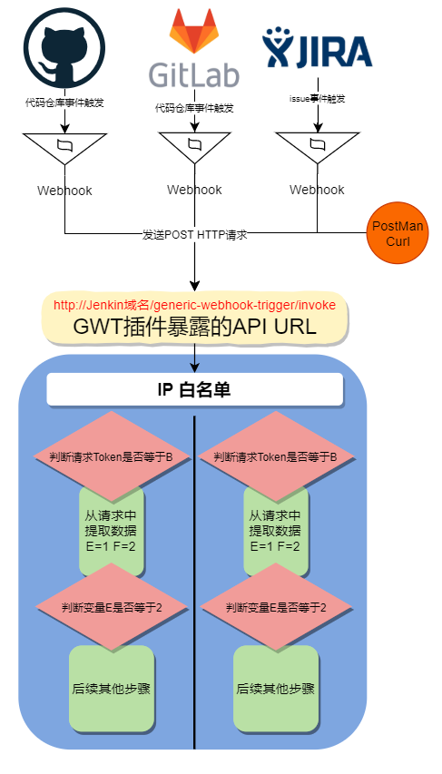
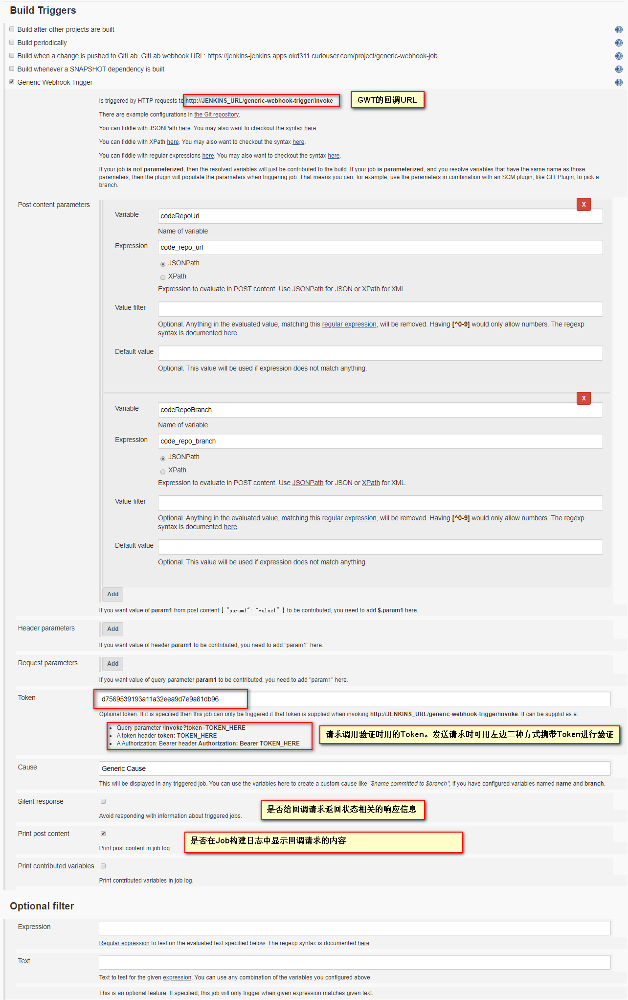
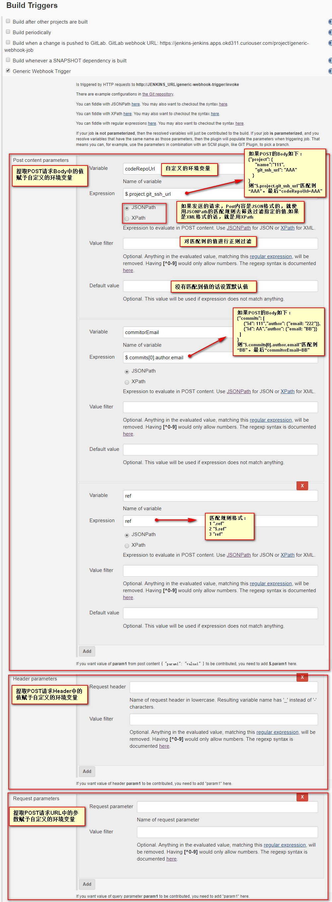
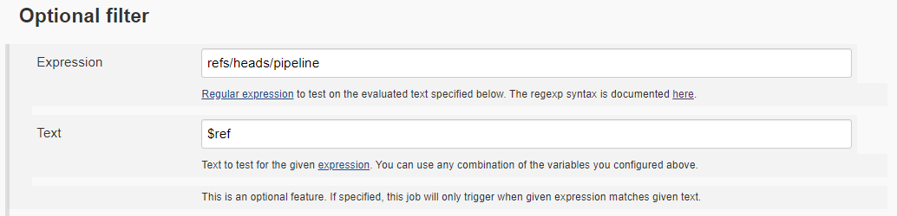
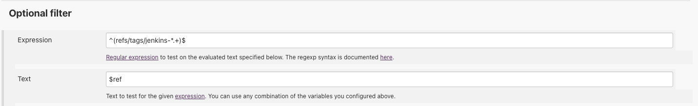
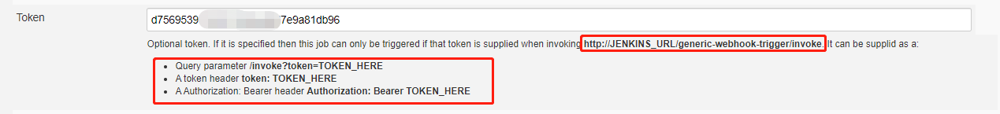
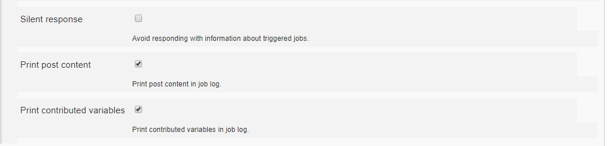
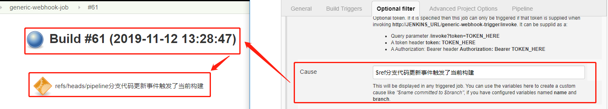
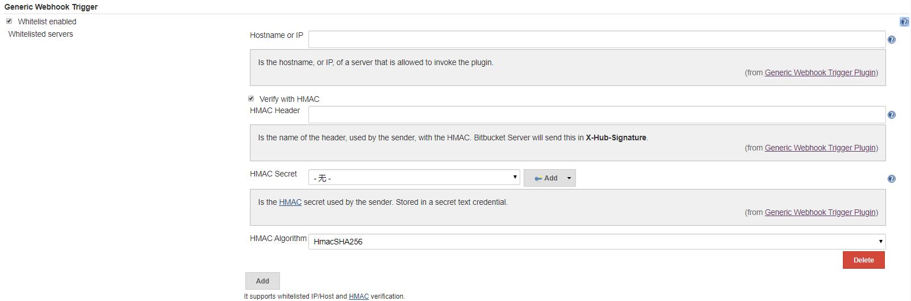

# Jenkins Generic Webhook Trigger插件

之前写过在Jenkins中使用Gitlab插件接收gitlab仓库代码指定事件触发的webhook来触发Job或Pipeline的执行构建,详见:[Jenkins的Gitlab插件](jenkins-gitlab插件的使用.md)。这种方式在某种场景下有些限制，无法满足一些功能性复杂的webhook触发`（例如只接受特定tag,分支或Merge的webhook触发，例如创建通配的pipeline，gitlab各个仓库配置固定的Webhook请求地址等等场景）`。所以可以使用`Jenkins Generic Webhook Trigger`插件监听包含自定义设置的HTTP请求来触发job/pipeline的构建！对比Gitlab插件，有以下可自定义的特性：

- 暴露出来的回调API URL统一，
- 不同的job/pipeline使用不同的Token或者指定特殊的请求参数进行区分
- 可使用不同的方式提取HTTP请求中的各种信息，然后通过环境变量的形式传递给job/pipeline使用
- 可设置白名单，只允许接收指定IP地址的Webhook请求

# 一、简介

- `Generic Webhook Trigger `是一款Jenkins插件，简称GWT，安装后会暴露出来一个公共API，GWT插件接收到 JSON 或 XML 的 HTTP POST 请求后，根据我们配置的规则决定触发哪个Jenkins项目
- 安装的话在Jenkins的插件管理中心直接搜索安装即可，下载HPI文件手动安装, [插件下载地址](https://updates.jenkins.io/download/plugins/generic-webhook-trigger) 
- 插件Github地址：https://github.com/jenkinsci/generic-webhook-trigger-plugin
- 支持以下系统发送的Webhook:
  - Bitbucket Cloud
  - Bitbucket Server
  - GitHub
  - GitLab
  - Gogs and Gitea
  - Assembla
  - Jira



# 二、GenericTrigger 触发器设置

GenericTrigger 触发条件分为5部分：

1. **从 HTTP POST 请求中提取数据**
2. **Token, GWT 插件用于标识Jenkins项目的唯一性**
3. **根据请求参数值判断是否触发Jenkins项目的执行**
4. **日志打印控制**
5. **Webhook 响应控制**



## 1. 从 HTTP POST 请求中匹配数据到环境变量中

GWT 插件可以从一个HTTP POST请求的**`Body`**、**`URL参数`**、**`header`**中提取数据并赋予指定的环境变量，后续任务可以直接引用。

### 在Job中设置数据的匹配



### 在Pipeline中设置数据的匹配

- **genericRequestVariables**：从URL参数中提取值
- **genericVariables**： 从HTTP POST的body 中提取值
- **genericHeaderVariables**：从HTTP header 中提取值（用法和genericRequestVariables一样）

```json
genericVariables: [
  [key: 'ref', value: '$.ref'],
  [key: 'before',value: '$.before',
   expressionType: 'JSONPath', //Optional, defaults to JSONPath
   regexpFilter: '', //Optional, defaults to empty string
   defaultValue: '' //Optional, defaults to empty string
  ]
],
genericRequestVariables: [
  [key: 'requestWithNumber', regexpFilter: '[^0-9]'],
  [key: 'requestWithString', regexpFilter: '']
],
genericHeaderVariables: [
  [key: 'headerWithNumber', regexpFilter: '[^0-9]'],
  [key: 'headerWithString', regexpFilter: '']
]
```

## 2.过滤符合条件的Webhook参数才能触发构建

例如只允许gitlab仓库Pipeline分支commit事件、带有特殊前缀的tag才能触发的Webhook才能触发构建，此时就可以先从webhook请求体中获取对应的值，放到指定的环境变量中，在插件的`Option filter`中设置正则表达式进行过滤，符合的才能触发pipeline，不符合的不触发。





## 3.Token 参数

当多个Jenkins Jobs中使用该插件时，Webhook Trigger都是同一个相同的URL。如果你只想触发一个特定的工作，可以

- 使用令牌参数为不同的作业提供不同的令牌。

- 可以再header或post中添加一些请求参数，并仅在该参数具有特定值时使用regexp筛选器触发。



发送Webhook请求时可使用以下方式在HTTP POST请求中携带Token：

- 请求URL参数: 

  **`curl -vs http://localhost:8080/jenkins/generic-webhook-trigger/invoke?token=abc123 `**

- token的请求header: 

  **`curl -vs -H "token: abc123" http://localhost:8080/jenkins/generic-webhook-trigger/invoke `**

- Bearer类型Authorization的请求header:

  **`curl -vs -H "Authorization: Bearer abc123" http://localhost:8080/jenkins/generic-webhook-trigger/invoke `**

## 4. 日志打印控制



- **Silent response：** 当为true，只返回http 200 状态码，不返回触发状态等信息。

- **Print post content：** 是否在构建日志中打印webhook 请求的内容

- **Print contributed variables：** 是否在构建日志中打印提取后的变量

## 5.  显示触发信息



# 三、设置白名单

可在Jenkins Generic Webhook Trigger的全局配置中，配置IP地址白名单，指定、验证请求的来源IP地址，IP地址格式可为**CIDR** 或 **ranges**。

- ***1.2.3.4***
- ***2.2.3.0/24***
- ***3.2.1.1-3.2.1.10***
- ***2001:0db8:85a3:0000:0000:8a2e:0370:7334***
- ***2002:0db8:85a3:0000:0000:8a2e:0370:7334/127***

同时还支持HMAC验证([HMAC百度百科](https://baike.baidu.com/item/hmac/7307543?fr=aladdin))。

`Jenkins -->  Manage Jenkins --> Configure System` 

