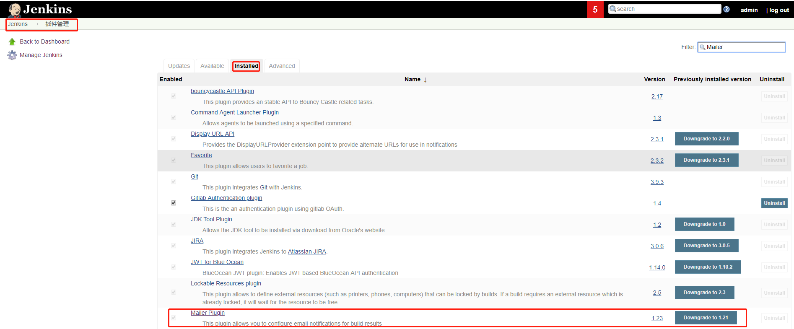
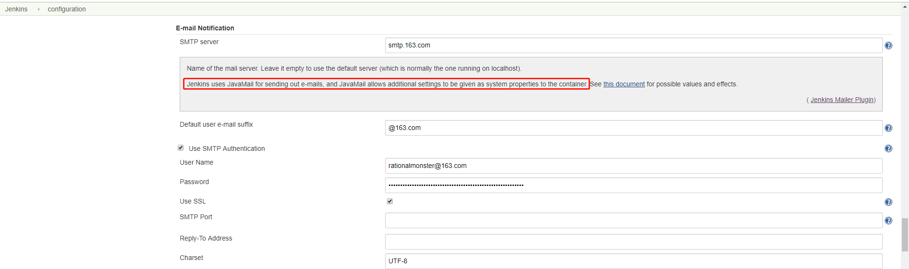
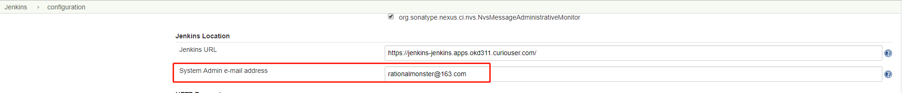
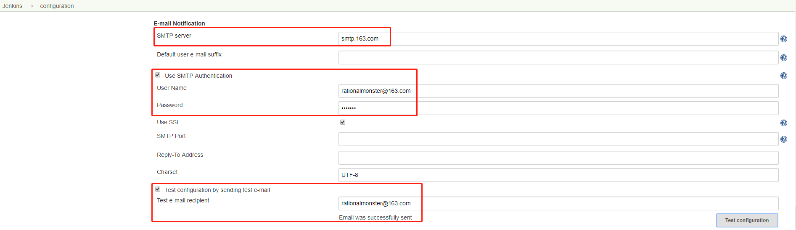
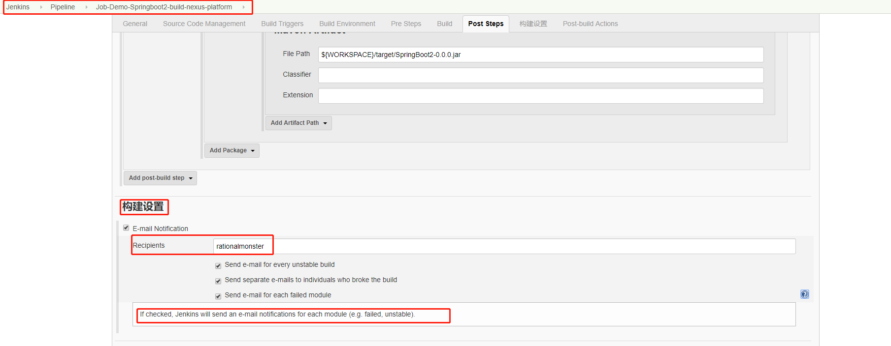
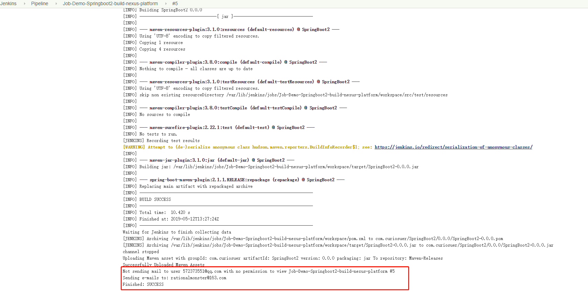
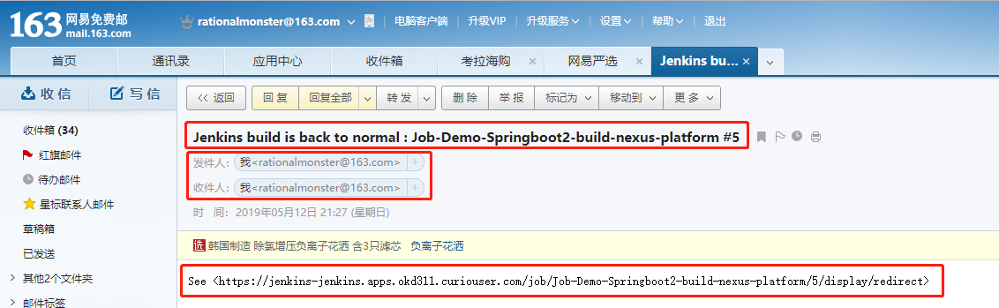
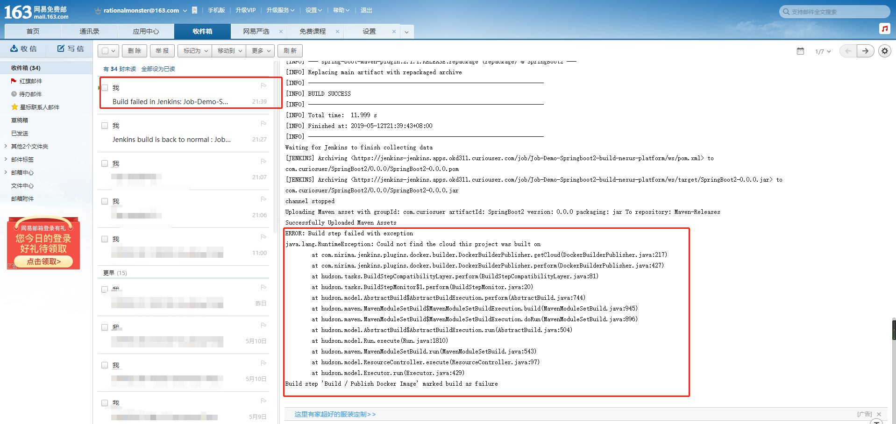
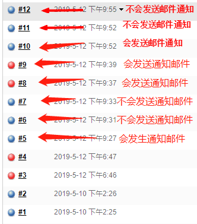

# Jenkins配置SMTP邮箱服务

## Prerequisite

* 自己邮箱运营商设置了开通SMTP服务
* Jenkins 安装了Jenkins Mailers Plugin
    

## 一、Context
Jenkins默认有个插件叫"Mailer Plugin"用来发送通知邮件。该插件使用的"JavaMail "来进行配置自定义个邮箱服务器 

## 二、配置
系统管理-->系统设置
1. 配置Jenkins的系统管理员邮箱地址
    
2. 配置SMTP邮件服务器地址
    
## 三、使用
### Job中

## 四、问题

1. 当构建不成功时发送的邮件，内容包含构建的日志。
   
2. 当初次构建成功时会发送邮件通知，当再次重复构建成功时，则不会发送邮件通知，得等到构建失败时才会再次发送通知邮件
   
    

   功能太弱，可使用"Mail Extension"插件进行功能扩展。详见：[jenkins-Mailer邮箱功能扩展插件Email-Extension](origin/jenkins-Mailer邮箱功能扩展插件Email-Extension.md)
3. 不知Jenkins的系统管理员邮箱时，发送会报错