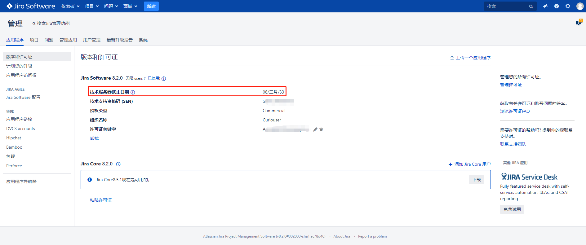

# Jira的安装与部署

# 一、简介

镜像：https://hub.docker.com/r/atlassian/jira-software

第三方镜像：https://hub.docker.com/r/blacklabelops/jira

破解文件：[atlassian-extras-3.2.jar](../assets/atlassian-extras-3.2.jar)

### 什么是JIRA?

JIRA 是目前比较流行的基于Java架构的管理系统，由于Atlassian公司对很多开源项目实行免费提供缺陷跟踪服务，因此在开源领域，其认知度比其他的产品要高得多，而且易用性也好一些。同时，开源则是其另一特色，在用户购买其软件的同时，也就将源代码也购置进来，方便做二次开发。JIRA功能全面，界面友好，安装简单，配置灵活，权限管理以及可扩展性方面都十分出色。

## JIRA的主要功能

问题追踪和管理：用它管理项目，跟踪任务、bug、需求，通过jira的邮件通知功能进行协作通知，在实际工作中使工作效率提高很多

问题跟进情况的分析报告：可以随时了解问题和项目的进展情况

项目类别管理功能：可以将相关的项目分组管理

组件/模块负责人功能：可以将项目的不同组件/模块指派相应的负责人，来处理所负责的组件的Issues

项目email地址功能：每个项目可以有不同的email（该项目的通知邮件从该地址发出）

无限制的工作流：可以创建多个工作流为不同的项目使用

## JIRA的主要特点

**JIRA的优点**

用它管理项目，跟踪任务、bug，通过JIRA的邮件通知功能进行协作通知，在实际工作中使工作效率提高很多，效果非常不错！安全性、可扩展性方面发挥到了极致！

JIRA不仅仅是一个缺陷跟踪系统，通过Jira，可以整合客户、开发人员、测试人员，各人各司其职，信息很快得到交流和反馈，让大家感到软件开发在顺利快速的进行，朝意想的目标迈进。eclipse和IDEA下的Jira插件，主要为开发人员服务，实时将信息反馈给开发人员，开发人员同时迅速地将修复的结果信息反馈到跟踪系统中，最后通过持续集成，软件迅速地完成了更新，这些方便便捷的操作会极大地鼓舞软件开发中的各方人员，甚至包括客户，及时响应，相信是每一个客户都会欣赏的。

跟同类软件产品TestTracker、ClearQuest、TestDirector相比，JIRA的性价比最好！

**JIRA的缺点**

对于测试需求、测试用例等都没有提供直接的方式进行管理。不过可以利用JIRA的Issue Type的可定制性,来进行需求和测试用例方面的管理,也可以与Testlink集成。

**相关版本**

JIRA 4.0版本之后，不再按照功能区分版本。取消了以前的**标准版，专业版，企业版**之分；取而代之的是按照用户数量来划分：25、50、100、无限制用户。 所有的版本都具有之前企业版的功能！JIRA不限制创建项目数和Issue的数量，购买之后可以永久使用；并且一年内免费更新版本。

# 二、安装

## 0. 拉去镜像

```bash
docker pull docker.io/atlassian/jira-software:8.2.0
```

## 1. 部署PostgreSQL

**省略**

## 2. 创建破解文件的ConfigMap

```bash
oc create configmap crack-jar --from-file=atlassian-extras-3.2.jar --from-literal=text=./atlassian-extras-3.2.jar
```

## 3. 创建其他资源

**创建PVC**

```yaml
apiVersion: v1
kind: PersistentVolumeClaim
metadata:
  name: jira-data
  namespace: jira
spec:
  accessModes:
  - ReadWriteOnce
  resources:
    requests:
      storage: 10Gi
```

**创建ServiceAccount**

```bash
oc create serviceaccount jira
```

**创建RBAC相关资源**

## 4. OKD部署Deployment声明文件

```yaml
apiVersion: apps.openshift.io/v1
kind: DeploymentConfig
metadata:
  labels:
    app: jira
  name: jira
  namespace: jira
spec:
  replicas: 1
  selector:
    app: jira
    deploymentconfig: jira
  strategy:
    type: Recreate
  template:
    metadata:
      labels:
        app: jira
        deploymentconfig: jira
    spec:
      containers:
      - env:
        - name: JVM_MINIMUM_MEMORY
          value: 800m
        - name: JVM_MAXIMUM_MEMORY
          value: 1024m
        - name: TZ
          value: Asia/Shanghai         
        image: docker.io/atlassian/jira-software:8.2.0
        imagePullPolicy: IfNotPresent
        name: jira
        ports:
        - containerPort: 8080
          protocol: TCP
        resources:
          limits:
            cpu: '1'
            memory: 1500Mi
          requests:
            cpu: 500m
            memory: 500Mi            
        readinessProbe:
          failureThreshold: 3
          initialDelaySeconds: 40
          periodSeconds: 30
          successThreshold: 1
          tcpSocket:
            port: 8080
          timeoutSeconds: 2
        livenessProbe:
          failureThreshold: 3
          initialDelaySeconds: 40
          periodSeconds: 30
          successThreshold: 1
          tcpSocket:
            port: 8080
          timeoutSeconds: 1
        volumeMounts:
        - mountPath: /var/atlassian/application-data/jira
          name: jira-data
        - mountPath: /opt/atlassian/jira/atlassian-jira/WEB-INF/lib/atlassian-extras-3.2.jar
          name: crack-jar
          readOnly: true
          subPath: atlassian-extras-3.2.jar
      dnsPolicy: ClusterFirst
      restartPolicy: Always
      schedulerName: default-scheduler
      securityContext: {}
      serviceAccount: jira
      serviceAccountName: jira
      terminationGracePeriodSeconds: 30
      volumes:
      - name: jira-data
        persistentVolumeClaim:
          claimName: jira-data
      - configMap:
          defaultMode: 420
          name: crack-jar
        name: crack-jar

```

## 5. 创建Service并创建HTTP访问Route

```bash
oc expose dc jira  --port=8080
```

```bash
oc expose service jira --name=jira --port=8080 --hostname=jira.apps.okd311.curiouser.com
```

## 6. 页面配置

### **配置页面语言**-->**选择手动配置**


### **配置数据库**


### **设置应用程序的属性**


### **申请试用License**


## 7. 配置管理员用户


## 8. 配置SMTP邮箱通知


## 9. 查看许可证



# 三、配置LDAP

见链接: [Jira接LDAP](ldap-jira接LDAP.md)

# 四、项目示例


## 项目类型


## 创建示例Scrum敏捷项目


## 项目的发布


# 五、问题

## 1.

> Unable to create and acquire lock file for jira.home directory '/var/atlassian/application-data/jira

**解决**：删除jira_home目录下的lock文件（.jira-home.lock），是一个隐藏文件，然后重启jira服务即可。

## 2.

> Unable to clean the cache directory: /var/atlassian/application-data/jira/plugins/.osgi-plugins/feli

**解决：**先停止jira服务，然后删除$JIRA_HOME/plugins/.osgi-plugins/felix/，然后启动jira服务即可

## 3.

> There is/are [1] thread(s) in total that are monitored by this Valve and may be stuck.

**解决方案：**等等就好了