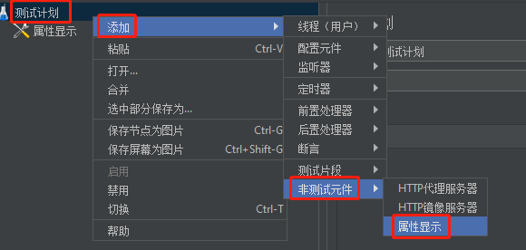

# Jmeter

# 一、简介

jmeter 是一款专门用于功能测试和[压力测试](https://so.csdn.net/so/search?q=压力测试&spm=1001.2101.3001.7020)的轻量级测试开发平台。多数情况下是用作压力测试。

- 接口测试
- 压力测试
- 数据库测试

# 二、安装

## 1、二进制

## 2、Docker

# 三、配置

## 1、设置中文

设置安装目录的`bin/jmeter.properties`文件的`language=zh_CN`，重启即可

## 2、安装插件管理插件

下载[plugins-manager.jar](https://jmeter-plugins.org/get)到安装目录的`lib/ext`中重启，在

## 3、页面显示设置Jmeter参数

# 四、测试场景

## 1、Jmeter抓包录制

抓包方式：

- **`badboy：`**
- **`httpL：`**
- 