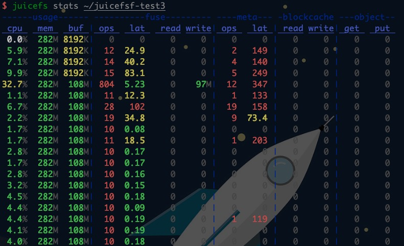
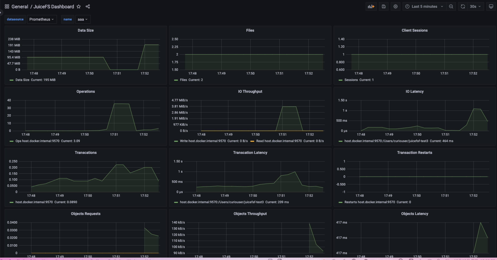
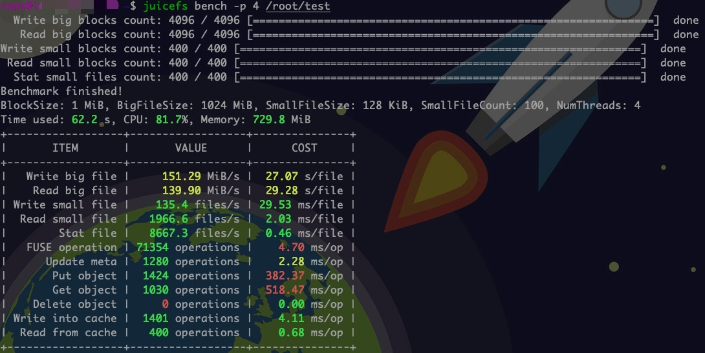
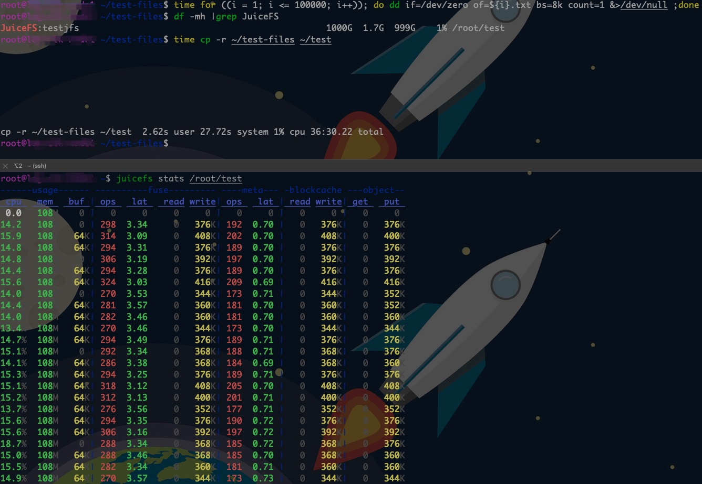
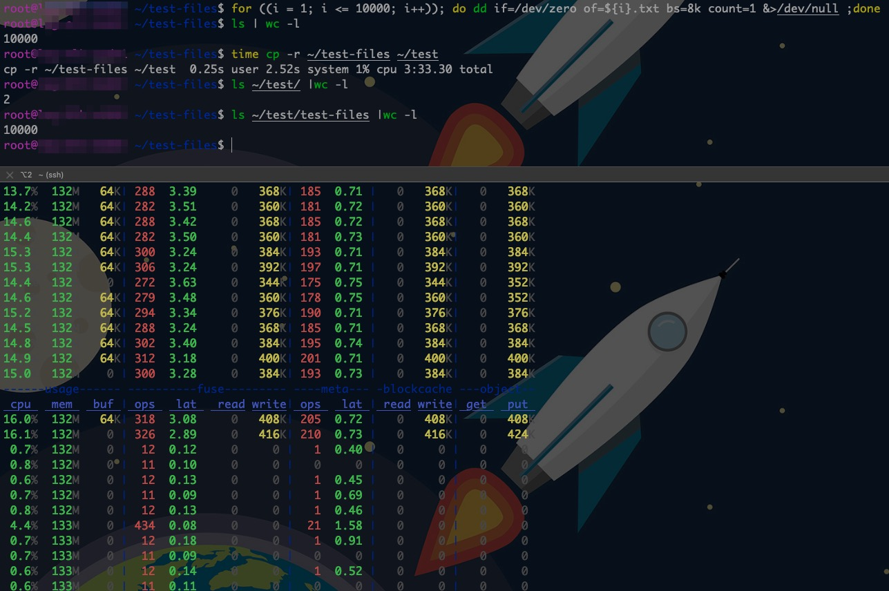

# JucisFS

# 一、简介

Github：https://github.com/juicedata/juicefs

中文文档：https://juicefs.com/docs/zh/community/introduction/#

JuiceFS 采用「数据」与「元数据」分离存储的架构，从而实现文件系统的分布式设计。使用 JuiceFS 存储数据，数据本身会被持久化在[对象存储](https://juicefs.com/docs/zh/community/how_to_setup_object_storage#支持的存储服务)（例如，Amazon S3），相对应的元数据可以按需持久化在 Redis、MySQL、TiKV、SQLite 等多种[数据库](https://juicefs.com/docs/zh/community/databases_for_metadata)中。

## 核心特性

1. **POSIX 兼容**：像本地文件系统一样使用，无缝对接已有应用，无业务侵入性；
2. **HDFS 兼容**：完整兼容 [HDFS API](https://juicefs.com/docs/zh/community/hadoop_java_sdk)，提供更强的元数据性能；
3. **S3 兼容**：提供 [S3 网关](https://juicefs.com/docs/zh/community/s3_gateway) 实现 S3 协议兼容的访问接口；
4. **云原生**：通过 [Kubernetes CSI 驱动](https://juicefs.com/docs/zh/community/how_to_use_on_kubernetes) 轻松地在 Kubernetes 中使用 JuiceFS；
5. **分布式设计**：同一文件系统可在上千台服务器同时挂载，高性能并发读写，共享数据；
6. **强一致性**：确认的文件修改会在所有服务器上立即可见，保证强一致性；
7. **强悍性能**：毫秒级延迟，近乎无限的吞吐量（取决于对象存储规模），查看[性能测试结果](https://juicefs.com/docs/zh/community/benchmark/)；
8. **数据安全**：支持传输中加密（encryption in transit）和静态加密（encryption at rest），[查看详情](https://juicefs.com/docs/zh/community/security/encrypt)；
9. **文件锁**：支持 BSD 锁（flock）和 POSIX 锁（fcntl）；
10. **数据压缩**：支持 [LZ4](https://lz4.github.io/lz4) 和 [Zstandard](https://facebook.github.io/zstd) 压缩算法，节省存储空间。

## 应用场景

JuiceFS 为海量数据存储设计，可以作为很多分布式文件系统和网络文件系统的替代，特别是以下场景：

- **大数据分析**：HDFS 兼容，没有任何特殊 API 侵入业务；与主流计算引擎（Spark、Presto、Hive 等）无缝衔接；无限扩展的存储空间；运维成本几乎为 0；完善的缓存机制，高于对象存储性能数倍。
- **机器学习**：POSIX 兼容，可以支持所有机器学习、深度学习框架；共享能力提升团队管理、使用数据效率。
- **容器集群中的持久卷**：Kubernetes CSI 支持；持久存储并与容器生存期独立；强一致性保证数据正确；接管数据存储需求，保证服务的无状态化。
- **共享工作区**：可以在任意主机挂载；没有客户端并发读写限制；POSIX 兼容已有的数据流和脚本操作。
- **数据备份**：在无限平滑扩展的存储空间备份各种数据，结合共享挂载功能，可以将多主机数据汇总至一处，做统一备份。

## 文件存储原理


## 元数据存储Redis内存使用量与文件系统的关系

JuiceFS 元数据引擎的使用空间主要与文件系统中的文件数量有关。每一个文件的元数据会大约占用 300 字节内存

```bash
# 如果最大1GB内存的Redis，减去124M的系统消耗，可用900M，可存储3145728个JuiceFS文件元数据
1024M-124M=900M=943718400 Bytes
  943718400 Bytes / 300 Bytes = 314,5728
# 如果最大1GB内存的Redis，减去88M的系统消耗，可用944M，可存储3299519个JuiceFS文件元数据
1024M-88M=944 M=989855744 Bytes
   989855744 Bytes / 300 Bytes = 329,9519
# 如要存储1亿个文件，大约需要 30GiB 内存
300Bytes * 1,0000,0000 =300,0000,0000 Bytes ~= 28610.3Mb ~= 27.94GB
```

通过 Redis 的 `INFO memory` 命令查看具体的内存使用量

```bash
> INFO memory
used_memory: 19167628056
used_memory_human: 17.85G
used_memory_rss: 20684886016
used_memory_rss_human: 19.26G
...
used_memory_overhead: 5727954464
...
used_memory_dataset: 13439673592
used_memory_dataset_perc: 70.12%
```

其中 `used_memory_rss` 是 Redis 实际使用的总内存大小，这里既包含了存储在 Redis 中的数据大小（也就是上面的 `used_memory_dataset`），也包含了一些 Redis 的系统开销（也就是上面的 `used_memory_overhead`）。前面提到每个文件的元数据大约占用 300 字节是通过 `used_memory_dataset` 来计算的，如果你发现你的 JuiceFS 文件系统中单个文件元数据占用空间远大于 300 字节，可以尝试运行 `juicefs gc`命令来清理可能存在的冗余数据。

## JuiceFS安全问题

- 元数据存储安全

- 客户端挂载安全

# 二、安装

## Linux

```bash
JFS_LATEST_TAG=$(curl -s https://api.github.com/repos/juicedata/juicefs/releases/latest | grep 'tag_name' | cut -d '"' -f 4 | tr -d 'v')

wget "https://github.com/juicedata/juicefs/releases/download/v${JFS_LATEST_TAG}/juicefs-${JFS_LATEST_TAG}-linux-amd64.tar.gz"
tar -zxf "juicefs-${JFS_LATEST_TAG}-linux-amd64.tar.gz"
mv juicefs /usr/local/bin
```

## MacOS

```bash
brew tap juicedata/homebrew-tap
brew install juicefs
```

## Windows

参考：https://juicefs.com/docs/zh/community/installation#windows-%E7%B3%BB%E7%BB%9F

## Docker

```bash
FROM ubuntu:20.04

RUN apt update && apt install -y curl fuse && \
    apt-get autoremove && \
    apt-get clean && \
    rm -rf \
    /tmp/* \
    /var/lib/apt/lists/* \
    /var/tmp/*

RUN set -x && \
    mkdir /juicefs && \
    cd /juicefs && \
    JFS_LATEST_TAG=$(curl -s https://api.github.com/repos/juicedata/juicefs/releases/latest | grep 'tag_name' | cut -d '"' -f 4 | tr -d 'v') && \
    curl -s -L "https://github.com/juicedata/juicefs/releases/download/v${JFS_LATEST_TAG}/juicefs-${JFS_LATEST_TAG}-linux-amd64.tar.gz" \
    | tar -zx && \
    install juicefs /usr/bin && \
    cd .. && \
    rm -rf /juicefs

CMD [ "juicefs" ]
```

## 客户端更新

JuiceFS 客户端只有一个二进制程序，升级新版只需用新版程序替换旧版程序即可。

- **使用预编译客户端**：可以参照[「安装」](https://juicefs.com/docs/zh/community/installation#安装预编译客户端)文档中相应系统的安装方法，下载最新的客户端，覆盖旧版客户端即可。
- **手动编译客户端**：可以拉取最新的源代码重新编译，覆盖旧版客户端即可，具体请参考[「安装」](https://juicefs.com/docs/zh/community/installation#手动编译客户端)文档。

<font color=red>**注意**</font>

>  <font color=red>对于已经使用旧版 JuiceFS 客户端挂载好的文件系统，需要先[卸载文件系统](https://juicefs.com/docs/zh/community/getting-started/for_distributed#7-卸载文件系统)，然后用新版 JuiceFS 客户端重新挂载。</font>
>
> <font color=red>卸载文件系统时需确保没有任何应用正在访问，否则将会卸载失败。不可强行卸载文件系统，有可能造成应用无法继续正常访问。</font>

# 三、部署

## 1、元数据存储Redis配置要求

- `<username>` 是 Redis 6.0 之后引入的，如果没有用户名可以忽略，但密码前面的 `:` 冒号需要保留，如 `redis://:<password>@<host>:6379/1`
- 如果没有改变Redis默认端口号6379，可以不用填写，如 `redis://:<password>@<host>/1`，否则需要显式指定端口号
- 对于Redis哨兵模式，`META-URL` 可以指定为`redis[s]://[[USER]:PASSWORD@]MASTER_NAME,SENTINEL_ADDR[,SENTINEL_ADDR]:SENTINEL_PORT[/DB]`

## 2、对象存储OSS配置

### ①**创建RAM子用户**

- 禁止控制台访问
- 获取Access Key和Access Secret

### ②创建自定义策略

```bash
{
    "Version": "1",
    "Statement": [
        {
            "Effect": "Allow",
            "Action": [
                "oss:DeleteObject",
                "oss:GetObject",
                "oss:HeadObject",
                "oss:PutObject"
            ],
            "Resource": "acs:oss:*:<阿里云主账号的UID>:<OSS Bucket名字>/*"
        }
    ]
}
```

### ③RAM用户绑定自定义策略

## 3、创建文件系统

### ①Redis+OSS

```bash
set +o history
export ACCESS_KEY=对象存储引擎OSS的用户名
export SECRET_KEY=对象存储引擎OSS的用户密码
export META_PASSWORD=元数据存储引擎redis密码
juicefs format \
    --storage oss \
    --bucket https://OSS Bucket内网访问URL \
    --capacity 100 \
    --inodes 100 \
    "redis://127.0.0.1:6379/1" \
    testjfs
```

### ②Redis+Minio

MinIO是开源的轻量级对象存储，兼容 Amazon S3 API。

>  JuiceFS 仅支持路径风格的 MinIO URI 地址，例如：`http://127.0.0.1:9000/myjfs`。
>
> `MINIO_REGION` 环境变量可以用于设置 MinIO 的 region，如果不设置，默认为 `us-east-1`。

```bash
set +o history
export ACCESS_KEY=对象存储引擎Minio的用户名
export SECRET_KEY=对象存储引擎Minio的用户密码
export META_PASSWORD=元数据存储引擎redis密码
juicefs format \
    --storage minio \
    --bucket http://127.0.0.1:9000/juicefs \
    "redis://127.0.0.1:6379/1" \
    testjfs
```

### ③Redis+WebDAV

WebDAV 是 HTTP 的扩展协议，有利于用户间协同编辑和管理存储在万维网服务器的文档

```bash
set +o history
export ACCESS_KEY=对象存储引擎WebDAV的用户名
export SECRET_KEY=对象存储引擎WebDAV的用户密码
export META_PASSWORD=元数据存储引擎redis密码
juicefs format \
    --storage webdav \
    --bucket http://<webdav的endpoint>/ \
    --capacity 100 \
    --inodes 100 \
    "redis://127.0.0.1:6379/1" \
    testjfs
```

# 三、挂载

## 0 、挂载参数

| 参数               | 含义                       | 默认值                                                    |
| ------------------ | -------------------------- | --------------------------------------------------------- |
| **--metrics value**    | 监控数据导出地址           | 127.0.0.1:9567                                            |
| **--consul value**     | consul 注册中心地址        | 127.0.0.1:8500                                            |
| **--no-usage-report**  | 不发送使用量信息           | false                                                     |
| **-d, --background**   | 后台运行                   | false                                                     |
| **--no-syslog**        | 禁用系统日志               | false                                                     |
| **--log value**        | 后台运行时日志文件的位置   | `$HOME/.juicefs/juicefs.log`<br /> `/var/log/juicefs.log` |
| **-o value**           | 其他 FUSE 选项             |                                                           |
| **--attr-cache value** | 属性缓存过期时间；单位为秒 | 1                                                         |
| **--entry-cache value** | 文件项缓存过期时间；单位为秒 | 1 |
| **--dir-entry-cache value** | 目录项缓存过期时间；单位为秒 | 1 |
| **--enable-xattr** | 启用扩展属性 (xattr) 功能 | false |
| **--bucket value** | 为当前挂载点指定访问访对象存储的 endpoint | |
| **--get-timeout value** | 下载一个对象的超时时间；单位为秒 | 60 |
| **--put-timeout value** | 上传一个对象的超时时间；单位为秒 | 60 |
| **--io-retries value** | 网络异常时的重试次数 | 10 |
| **--max-uploads value** | 上传对象的连接数 | 20 |
| **--max-deletes value** | 删除对象的连接数 | 2 |
| **--buffer-size value** | 读写缓存的总大小；单位为 MiB | 300 |
| **--upload-limit value** | 上传带宽限制，单位为 Mbps | 0 |
| **--download-limit value** | 下载带宽限制，单位为 Mbps | 0 |
| **--prefetch value** | 并发预读 N 个块 | 1 |
| **--writeback** | 后台异步上传对象 | false |
| **--cache-dir value** | 本地缓存目录路径；<br />使用 `: (Linux、macOS)`或 `; (Windows)`隔离多个路径 | |
| **--cache-size value** | 缓存对象的总大小；单位为 MiB | 102400 |
| **--free-space-ratio value** | 最小剩余空间比例 | 0.1 |
| **--cache-partial-only** | 仅缓存随机小块读 | false |
| **--read-only** | 只读模式 | false |
| **--open-cache value** | 打开的文件的缓存过期时间(0代表关闭这个特性）<br />单位为秒 | 0 |
| **--subdir value** | 将某个子目录挂载为根 | `"$HOME/.juicefs/cache"` <br /> `"/var/jfsCache"` |
| **--backup-meta value** | 自动备份元数据到对象存储的间隔时间；<br />单位秒 (0 表示不备份) | 3600 |
| **--heartbeat value** | 发送心跳的间隔 (秒);建议所有客户端使用相同的心跳值 | 12 |
| **--upload-delay value** | 数据上传到对象存储的延迟时间，支持秒分时精度，<br />对应格式分别为 ("s", "m", "h") | 0 |
| **--no-bgjob** | 禁用后台作业（清理、备份等） | false |

## 1、Linux挂载

> **juicefs mount 挂载参数 元数据存储引擎访问地址 挂载点**

```bash
set +o history
export META_PASSWORD=元数据存储引擎redis密码
juicefs mount -d --metrics 0.0.0.0:9567 redis://127.0.0.1/1 /root/test
```

## 2、MacOS挂载

- JuiceFS 通过 FUSE 实现 POSIX 接口的兼容，在 macOS 系统上原生并没有提供 FUSE 的支持，需要借助 macFUSE 来实现相应接口的抽象。

- MacFUSE官网：[https://osxfuse.github.io](https://osxfuse.github.io/)

```bash
set +o history
export META_PASSWORD=元数据存储引擎redis密码
juicefs mount -d --metrics 0.0.0.0:9567 redis://127.0.0.1/1 /root/test
```

参考：https://juicefs.com/zh-cn/blog/usage-tips/using-juicefs-on-apple-m1

## 3、自动挂载

拷贝 juicefs 为 `/sbin/mount.juicefs`，然后按照下面的格式添加一行到 `/etc/fstab`：

```bash
<元数据存储引擎URL>    <挂载点>   juicefs     _netdev[,其他挂载参数]     0  0

# 例如：
redis://localhost:6379/1  /jfs  juicefs  _netdev,max-uploads=50,writeback,cache-size=204800   0  0
```

```bash
set +o history
export META_PASSWORD=元数据存储引擎redis密码 && mount -a
```

默认情况下，CentOS 6 在启动后不会自动挂载网络文件系统，你可以使用下面的命令开启它：

```bash
sudo chkconfig --add netfs
```

# 四、管理

## 1、配置文件系统

```bash
juicefs config redis://127.0.0.1:6379/1

juicefs config redis://127.0.0.1:6379/1 --capacity 100
juicefs config redis://127.0.0.1:6379/1 --inodes 100
```

## 2、回收站设置

- **JuiceFS的回收站功能需要使用 1.0.0 及以上版本**
- **回收站本身是一个名为 `.trash` 的目录，会被自动创建在 JuiceFS 的根目录 `/` 下，一般即对应挂载点目录。**
- **回收站内固定只有两级深度。第一级为根据时间以 `年-月-日-小时` 格式命名的目录（如 `2021-11-30-10`），系统会自动创建它，并将在这个小时内删除的所有文件都放在此目录下。第二级即为平铺的用户文件和空目录（通常的 `rm -r <dir>` 命令实际会先逐个删除目标目录下文件，再删除空目录）。第一级目录的命名取自 UTC 时间，与中国北京时间相差 8 个小时。**
- **回收站内不再保留原来的目录树结构，为了能在不影响正常操作性能的前提下，尽可能提供恢复原树型结构的信息，回收站内的文件被自动重命名成 `{父目录 inode}-{文件 inode}-{原始文件名}` 格式。其中 `inode` 是文件系统内部的管理信息，如果用户并不需求文件原始路径，则直接关注最后的原始文件名即可。**
- **JuiceFS 设计并默认开启了回收站功能，会自动将用户删除的文件移动到隐藏的回收站目录内，保留一段时间后才将数据真正清理。**
- **旧版本 JuiceFS 欲使用回收站，需要在升级所有挂载点后通过 `config` 命令手动将 `--trash-days` 改为需要的正整数值。**

```bash
juicefs config META-URL --trash-days 7

#  默认值为 1，意味着回收站内文件会在一天后被自动清理。
#  参数值设为 0 即可禁用回收站功能，系统会在短时间内清空回收站，并使得后续应用删除的文件能被立即清理。
```

## 3、销毁文件系统

销毁文件系统时，需要确认卸载了所有挂载点后再行操作。不然则会出现 `1 sessions are active, please disconnect them first`的报错

> **juicefs destroy  <METADATA URL>   <UUID>**
>
> <METADATA URL>：元数据引擎的 URL 地址；
> <UUID>：文件系统的 UUID。

```bash
# 获取文件系统UUID
juicefs status redis://127.0.0.1:6379/1 
# 销毁文件系统。在销毁文件系统时，客户端会发出确认提示，请务必仔细核对文件系统信息，确认无误后输入 y 确认。
juicefs destroy redis://127.0.0.1:6379/1 文件系统UUID
```

## 4、限制存储限额

JuiceFS v0.14.2 开始支持文件系统级别的存储配额，该功能包括：

- 限制文件系统的总可用容量

  - `--capacity` 设置容量限额，单位 GiB

    ```bash
    set +o history
    export ACCESS_KEY=对象存储引擎WebDAV的用户名
    export SECRET_KEY=对象存储引擎WebDAV的用户密码
    export META_PASSWORD=元数据存储引擎redis密码
    juicefs format \
        --storage oss \
        --bucket https://OSS Bucket内网访问URL \
        --capacity 100 \
        "redis://127.0.0.1:6379/1" \
        testjfs
    
    # 对于已创建的文件系统，可再进行设置
    juicefs config redis://127.0.0.1:6379/1 --capacity 1000
    ```

- 限制文件系统的 inode 总数

  在 Linux 系统中，每个文件（文件夹也是文件的一种）不论大小都有一个 inode，因此限制 inode 数量等同于限制文件数量。

  -  `--inodes` 设置限额

    ```bash
    juicefs format \
        --storage oss \
        --bucket https://OSS Bucket内网访问URL \
        --inodes 100 \
        "redis://127.0.0.1:6379/1" \
        testjfs
        
    # 对于已创建的文件系统，可再进行设置
    juicefs config redis://127.0.0.1:6379/1 --inodes 1000
    ```

> 存储限额设置会保存在元数据引擎中以供所有挂载点读取，每个挂载点的客户端也会缓存自己的已用容量和 inodes 数，每秒向元数据引擎同步一次。与此同时，客户端每 10 秒会从元数据引擎读取最新的用量值，从而实现用量信息在每个挂载点之间同步，但这种信息同步机制并不能保证用量数据被精确统计。

# 五、监控

## 1、命令监控信息

### ①挂载命令

`juicefs stats` 命令，以类似 Linux dstat 工具的形式可以实时打印各个指标的每秒变化情况

```bash
juicefs stats ~/juicefsf-test3
```



### ②监控指标

| 参数           | 指标       | 含义                                                         |
| -------------- | ---------- | ------------------------------------------------------------ |
| **usage**      | cpu        | 进程的 CPU 使用率                                            |
|                | mem        | 进程的物理内存使用量                                         |
|                | buf        | 进程已使用的 Buffer 大小；此值受限于挂载选项 --buffer-size   |
| **fuse**       | ops/lat    | 通过 FUSE 接口处理的每秒请求数及其平均时延（单位为毫秒）     |
|                | read/write | 通过 FUSE 接口处理的读写带宽                                 |
| **meta**       | ops/lat    | 每秒处理的元数据请求数和平均时延（单位为毫秒）<br />注意部分能在缓存中直接处理的元数据请求未列入统计，<br />以更好地体现客户端与元数据引擎交互的耗时 |
| **blockcache** | read/write | 客户端本地数据缓存的每秒读写流量                             |
| **object**     | get/put    | 客户端与对象存储交互的 Get/Put 每秒流量                      |

### ③参考

https://juicefs.com/docs/zh/community/stats_watcher

## 2、Prometheus

### ①挂载配置

挂载时，juicefs命令可使用`--metrics`参数自定义暴露出挂载时Metrics Endpoint

```bash
juicefs mount -d --metrics 0.0.0.0:9567 redis://127.0.0.1/1 /root/test1
juicefs mount -d --metrics 0.0.0.0:9568 redis://127.0.0.1/1 /root/test2
```

### ②Prometheus配置

Prometheus添加刮取juicefs客户端的配置

```bash
 ....省略....
 - job_name: "juicefs-client"
    static_configs:
      - targets:
        - "127.0.0.1:9567"
        - "127.0.0.1:9568"
```

### ③Grafana配置

Grafana导入图表JSON数据，文件地址：https://github.com/juicedata/juicefs/blob/main/docs/en/grafana_template.json



### ④监控指标

- **文件系统**

  | 名称                  | 描述           | 单位 |
  | --------------------- | -------------- | ---- |
  | `juicefs_used_space`  | 总使用空间     | 字节 |
  | `juicefs_used_inodes` | 总 inodes 数量 |      |

- **操作系统**

  | 名称                | 描述       | 单位 |
  | ------------------- | ---------- | ---- |
  | `juicefs_uptime`    | 总运行时间 | 秒   |
  | `juicefs_cpu_usage` | CPU 使用量 | 秒   |
  | `juicefs_memory`    | 内存使用量 | 字节 |

- **元数据引擎**

  | 名称                                              | 描述           | 单位 |
  | ------------------------------------------------- | -------------- | ---- |
  | `juicefs_transaction_durations_histogram_seconds` | 事务的延时分布 | 秒 |
  | `juicefs_transaction_restart`                     | 事务重启的次数 |  |

- **FUSE**

  | 名称                                           | 描述                 | 单位 |
  | ---------------------------------------------- | -------------------- | ---- |
  | `juicefs_fuse_read_size_bytes`                 | 读请求的大小分布     | 字节 |
  | `juicefs_fuse_written_size_bytes`              | 写请求的大小分布     | 字节 |
  | `juicefs_fuse_ops_durations_histogram_seconds` | 所有请求的延时分布   | 秒   |
  | `juicefs_fuse_open_handlers`                   | 打开的文件和目录数量 |      |

- **SDK**

  | 名称                                          | 描述               | 单位 |
  | --------------------------------------------- | ------------------ | ---- |
  | `juicefs_sdk_read_size_bytes`                 | 读请求的大小分布   | 字节 |
  | `juicefs_sdk_written_size_bytes`              | 写请求的大小分布   | 字节 |
  | `juicefs_sdk_ops_durations_histogram_seconds` | 所有请求的延时分布 | 秒   |

- **缓存**

  | 名称                                    | 描述                   | 单位 |
  | --------------------------------------- | ---------------------- | ---- |
  | `juicefs_blockcache_blocks`             | 缓存块的总个数         |      |
  | `juicefs_blockcache_bytes`              | 缓存块的总大小         | 字节 |
  | `juicefs_blockcache_hits`               | 命中缓存块的总次数     |      |
  | `juicefs_blockcache_miss`               | 没有命中缓存块的总次数 |      |
  | `juicefs_blockcache_writes`             | 写入缓存块的总次数     |      |
  | `juicefs_blockcache_drops`              | 丢弃缓存块的总次数     |      |
  | `juicefs_blockcache_evicts`             | 淘汰缓存块的总次数     |      |
  | `juicefs_blockcache_hit_bytes`          | 命中缓存块的总大小     | 字节 |
  | `juicefs_blockcache_miss_bytes`         | 没有命中缓存块的总大小 | 字节 |
  | `juicefs_blockcache_write_bytes`        | 写入缓存块的总大小     | 字节 |
  | `juicefs_blockcache_read_hist_seconds`  | 读缓存块的延时分布     | 秒   |
  | `juicefs_blockcache_write_hist_seconds` | 写缓存块的延时分布     | 秒   |

- **对象存储**

  | 名称     | 描述                                              |
  | -------- | ------------------------------------------------- |
  | `method` | 请求对象存储的方法（例如 GET、PUT、HEAD、DELETE） |

- **指标**

  | 名称                                                 | 描述                     | 单位 |
  | ---------------------------------------------------- | ------------------------ | ---- |
  | `juicefs_object_request_durations_histogram_seconds` | 请求对象存储的延时分布   | 秒   |
  | `juicefs_object_request_errors`                      | 请求失败的总次数         |      |
  | `juicefs_object_request_data_bytes`                  | 请求对象存储的总数据大小 | 字节 |

- **内部特性**

  | 名称                                   | 描述               | 单位 |
  | -------------------------------------- | ------------------ | ---- |
  | `juicefs_compact_size_histogram_bytes` | 合并数据的大小分布 | 字节 |

### ⑤参考

- https://juicefs.com/docs/zh/community/administration/monitoring/
- https://juicefs.com/docs/zh/community/p8s_metrics

# 六、测试

## 1、基础测试

基准性能测试流程

- N 并发各写 1 个 1 GiB 的大文件，IO 大小为 1 MiB

- N 并发各读 1 个之前写的 1 GiB 的大文件，IO 大小为 1 MiB

- N 并发各写 100 个 128 KiB 的小文件，IO 大小为 128 KiB
- N 并发各读 100 个之前写的 128 KiB 的小文件，IO 大小为 128 KiB
- N 并发各 stat 100 个之前写的 128 KiB 的小文件
- 清理测试用的临时目录

并发数 N 的值即由 bench 命令中的 -p 参数指定

```bash
juicefs bench -p 4 /root/test
```



## 2、FIO基准测试

```bash
fio --name=sequential-read --directory=/root/test --rw=read --refill_buffers --bs=4M --size=4G
fio --name=sequential-read --directory=/root/test --rw=read --refill_buffers --bs=4M --size=4G
fio --name=sequential-read --directory=/root/test --rw=read --refill_buffers --bs=4M --size=4G
```

## 3、手动文件读写测试

大量小文件读写测试

```bash
for ((i = 1; i <= 100000; i++)); do dd if=/dev/zero of=${i}.txt bs=8k count=1 &>/dev/null ;done
for ((i = 1; i <= 10000; i++)); do dd if=/dev/zero of=${i}.txt bs=8k count=1 &>/dev/null ;done
```





大文件读写测试

## 5、测试总结对比

| **测试文件**        | **JuiceFS** | **阿里云NAS** |
| ------------------- | ----------- | ------------- |
| Copy 单个900M文件   | 5.232s      | 8.35s         |
| Copy    1W个8K文件  | 3m33s       | 2m01s         |
| Copy    10W个8K文件 | 36m30s      | 18m16s        |
| DELETE 1W个8K文件   | 18.76s      | 54.28s        |
| DELETE 10W个8K文件  |             |               |

# 七、元数据存储备份

- JuiceFS v0.15.2 开始支持元数据手动备份、恢复和引擎间迁移。
- JuiceFS v1.0.0 开始支持元数据自动备份
- JuiceFS 支持[多种元数据存储引擎](https://juicefs.com/docs/zh/community/databases_for_metadata)，且各引擎内部的数据管理格式各有不同。为了便于管理，JuiceFS 提供了 `dump` 命令允许将所有元数据以统一格式写入到 [JSON](https://www.json.org/json-en.html) 文件进行备份。同时，JuiceFS 也提供了 `load` 命令，允许将备份恢复或迁移到任意元数据存储引擎
- JSON 备份只能恢复到 `新创建的数据库` 或 `空数据库` 中。

## 1、手动备份

`juicefs dump` 仅保证单个文件自身的完整性，不提供全局时间点快照的功能，如在 dump 过程中业务仍在写入，最终结果会包含不同时间点的信息。

```bash
juicefs dump redis://127.0.0.1:6379/1 meta.dump
```

该命令默认从根目录 `/` 开始，深度遍历目录树下所有文件，将每个文件的元数据信息按 JSON 格式写入到文件。

## 2、自动备份

- 从 JuiceFS v1.0.0 开始，不论文件系统通过 `mount` 命令挂载，还是通过 JuiceFS S3 网关及 Hadoop Java SDK 访问，客户端每小时都会自动备份元数据并拷贝到对象存储。

- 备份的文件存储在对象存储的 `meta` 目录中，它是一个独立于数据存储的目录，在挂载点中不可见，也不会与数据存储之间产生影响，用对象存储的文件浏览器即可查看和管理。

- 虽然自动备份元数据成为了客户端的默认动作，但在多主机共享挂载同一个文件系统时并不会发生备份冲突。

  JuiceFS 维护了一个全局的时间戳，确保同一时刻只有一个客户端执行备份操作。当客户端之间设置了不同的备份周期，那么就会以周期最短的设置为准进行备份。

- 默认情况下，JuiceFS 客户端每小时备份一次元数据，自动备份的频率可以在挂载文件系统时通过`--backup-meta`选项进行调整

  ```bash
  juicefs mount -d --backup-meta 8h redis://127.0.0.1:6379/1 /mnt
  
  # 备份频率可以精确到秒，支持的单位如下：
  # h：精确到小时，如 1h；
  # m：精确到分钟，如 30m、1h30m；
  # s：精确到秒，如 50s、30m50s、1h30m50s;
  ```

- 自动备份清理策略

  - 保留 2 天以内全部的备份；

  - 超过 2 天不足 2 周的，保留每天中的 1 个备份；

  - 超过 2 周不足 2 月的，保留每周中的 1 个备份；

  - 超过 2 个月的，保留每个月中的 1 个备份。


## 3、恢复

- JSON 备份只能恢复到 `新创建的数据库` 或 `空数据库` 中。
- 为了保证对象存储 SecretKey 与 SessionToken 的安全性，`juicefs dump` 得到的备份文件中的 SecretKey 与 SessionToken 会被改写为“removed”，所以在对其执行 `juicefs load` 恢复到元数据引擎后，需要使用 `juicefs config --secret-key xxxxx META-URL` 来重新设置 SecretKey。

- `juicefs load`会自动处理因包含不同时间点文件而产生的冲突问题，并重新计算文件系统的统计信息（空间使用量，inode 计数器等），最后在数据库中生成一份全局一致的元数据。
- 如果你想自定义某些元数据（请务必小心），可以尝试在 load 前手动修改 JSON 文件。

```bash
juicefs load redis://127.0.0.1:26379/1 meta.dump
```

## 4、迁移

得益于 JSON 格式的通用性，JuiceFS 支持的所有元数据存储引擎都能识别，因此可以将元数据信息从一种引擎中导出为 JSON 备份，然后再导入到另外一种引擎，从而实现元数据在不同类型引擎间的迁移

```bash
juicefs dump redis://127.0.0.1:6379/1 | juicefs load mysql://user:password@(127.0.0.1:3306)/juicefs
```

参考：https://juicefs.com/docs/zh/community/metadata_dump_load

# 八、在 Kubernetes 中使用 JuiceFS

参考：

- https://juicefs.com/docs/zh/cloud/use_juicefs_in_kubernetes

- https://juicefs.com/docs/zh/csi/introduction/

# 参考

- https://juicefs.com/zh-cn/blog/engineering/speed-up-oss/