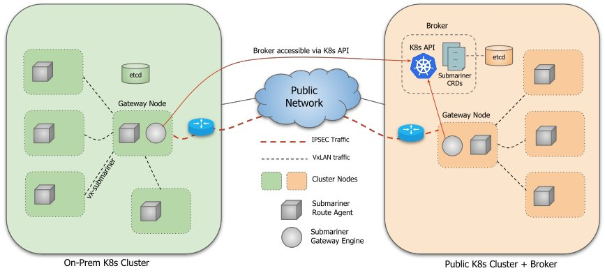

# K8S多集群管理

# 一、Karmada多集群管理方案

**Karmada**：https://github.com/karmada-io/karmada

文档：https://karmada.io/zh/docs/

架构：Karmada 的总体架构如下所示：

Karmada 控制平面包括以下组件：

- Karmada API Server
- Karmada Controller Manager
- Karmada Scheduler

ETCD 存储了 karmada API 对象，API Server 是所有其他组件通讯的 REST 端点，Karmada Controller Manager 根据您通过 API 服务器创建的 API 对象执行操作。

Karmada Controller Manager 在管理面运行各种 Controller，这些 Controller 监视 karmada 对象，然后与成员集群的 API Server 通信以创建常规的 Kubernetes 资源。

1. Cluster Controller：将 Kubernetes 集群连接到 Karmada，通过创建集群对象来管理集群的生命周期。
2. Policy Controller：监视 PropagationPolicy 对象。当添加 PropagationPolicy 对象时，Controller 将选择与 resourceSelector 匹配的一组资源，并为每个单独的资源对象创建 ResourceBinding。
3. Binding Controller：监视 ResourceBinding 对象，并为每个带有单个资源清单的集群创建一个 Work 对象。
4. Execution Controller：监视 Work 对象。当创建 Work 对象时，Controller 将把资源分发到成员集群。

# 二、Submariner多集群网络互联方案

Github：https://github.com/submariner-io/submariner

文档：https://submariner.io/getting-started/

架构：

