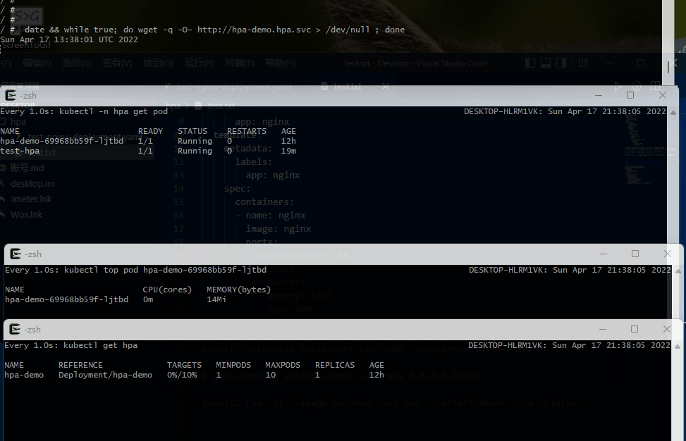
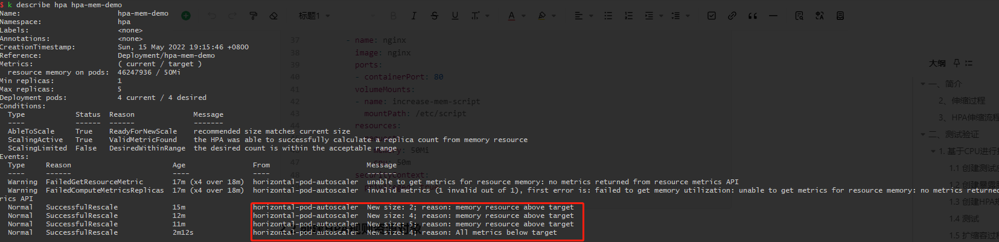
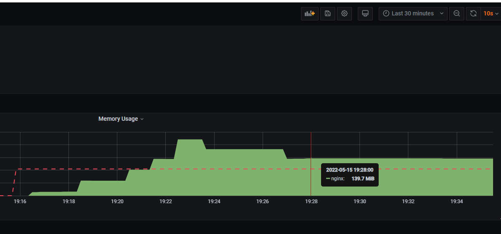

# K8S 容器自动伸缩容

# 一、简介

HPA(Horizontal Pod Autoscaler)是kubernetes的一种资源对象，能够根据某些指标对在statefulset、replicacontroller、replicaset等集合中的pod数量进行动态伸缩，使运行在上面的服务对指标的变化有一定的自适应能力。

HPA目前支持四种类型的指标，分别是**Resource、Object、External、Pods**。其中在稳定版本autoscaling/v1只支持对CPU指标的动态伸缩，在测试版本autoscaling/v2beta2中支持memory和自定义指标的动态伸缩，并以annotation的方式工作在autoscaling/v1版本中。

**k8s API Resource Version：**

- **autoscaling/v1：**只支持基于CPU指标的缩放。
- **autoscaling/v2beta1：**支持Resource Metrics（资源指标，如pod的CPU）和Custom Metrics（自定义指标）的缩放。
- **autoscaling/v2beta2：**支持Resource Metrics（资源指标，如pod的CPU）和Custom Metrics（自定义指标）和ExternalMetrics（额外指标）的缩放。

HPA Controller默认30s轮询一次（可通过 kube-controller-manager 的--horizontal-pod-autoscaler-sync-period 参数进行设置），查询指定的资源中的 Pod 资源使用率，并且与创建时设定的值和指标做对比，从而实现自动伸缩的功能。

## 2、伸缩过程

- 扩容过程
  - 当开始测试**30秒**后，HPA检测到测试容器CPU使用率
  - 扩容POD的个数是根据的倍数进行设置的
- 缩容过程
  - 默认需要等待**5分钟**后才会开始自动缩容。
    - 从 Kubernetes v1.12 版本开始我们可以通过设置 kube-controller-manager 组件的--horizontal-pod-autoscaler-downscale-stabilization 参数来设置一个持续时间，用于指定在当前操作完成后，HPA 必须等待多长时间才能执行另一次缩放操作。
    - 实测在**5~6分钟**后开始自动缩容
  - 自动删除新创建的扩容POD。保留原始deployment创建的POD

## 3、HPA伸缩流程

HPA的主要伸缩流程如下：

- 判断当前Pod数量是否在HPA设定的Pod数量空间中，如果不在，过小返回最小值，过大返回最大值，结束伸缩。
- 判断指标的类型，并向api server发送对应的请求，拿到设定的监控指标。一般来说指标会从下面系列聚合API中获取(metrics.k8s.io，custom.metrics.k8s.io和external.metrics.k8s.io)。其中metrics.k8s.io一般由kubernetes自带的metrics-server来提供，主要是cpu、memory使用率指标。另外两种需要第三方的adapter来提供。custom.metrics.k8s.io提供的自定义指标数据，一般与kubernetes集群有关，比如跟特定的pod相关。external.metrics.k8s.io同样提供自定义指标数据，但一般与kubernetes集群无关，许多知名的第三方监控平台提供了adapter实现上述api(如prometheus)，可以将监控和adapter一同部署在kubenetes集群中提供服务。甚至能够替换原来的metrics-server来提供上述三类api指标，达到深度定制监控数据的目标。
- 根据获取的指标，使用相关的算法计算出一个伸缩系数，并乘以当前pod数量以获得期望的pod数量。这里系数是指标的期望值与目前值的比值，如果大于1表示扩容，小于1表示缩容。指数数值有平均值(AverageValue)、平均使用率(Utilization)、裸值(Value)三种类型* * 每种类型的数值都有对应的算法。注意下面事项：如果系数有小数点，统一进一；系数如果未达到某个容忍值，HPA认为变化太小，会忽略这次变化，容忍值默认为0.1。
  - 这里HPA扩容算法比较保守，如果出现获取不到指标的情况，扩容时算最小值，缩容时算最大值。如果需要计算平均值，出现pod没准备好的情况，我们保守地假设尚未就绪的pods消耗了试题指标的0%，从而进一步降低了伸缩的幅度。
  - 一个HPA支持多个指标的监控，HPA会循环获取所有的指标，并计算期望的pod数量，并从期望结果中获得最大的pod数量作为最终的伸缩的pod数量。一个伸缩对象在k8s中允许对应多个HPA，但是只是k8s不会报错而已，事实上HPA彼此不知道自己监控的是同一个伸缩对象，在这个伸缩对象中的pod会被多个HPA无意义地来回修改pod数量，给系统增加消耗，如果想要指定多个监控指标，可以如上述所说，在一个HPA中添加多个监控指标。
  - 检查最终pod数量是否在HPA设定的pod数量范围的区间，如果超过最大值或不足最小值都会修改为最大值或者最小值。然后会向kubernetes发出请求，修改伸缩对象的子对象scale的pod数量，结束一个HPA的检查，获取下一个HPA，完成一个伸缩流程。

# 二、测试验证

## 1. 基于CPU进行扩缩容

### 1.1 创建测试应用容器

```yaml
apiVersion: apps/v1
kind: Deployment
metadata:
  name: hpa-demo
  namespace: hpa
spec:
  selector:
    matchLabels:
      app: nginx
  template:
    metadata:
      labels:
        app: nginx
    spec:
      containers:
      - name: nginx
        image: nginx
        ports:
        - containerPort: 80
        resources:
          requests:
            memory: 50Mi
            cpu: 50m
```

### 1.2 创建暴露服务访问的SVC

```yaml
kubectl expose deployment hpa-demo --port=80 --target-port=80 
```

### 1.3 创建HPA规则资源对象

```yaml
kubectl autoscale deployment hpa-demo --cpu-percent=10 --min=1 --max=10
# 最小的 Pod 副本数为1，最大为10。HPA 会根据设定的 cpu 使用率（10%）动态的增加或者减少 Pod 数量。
```

或者通过YAML方式创建HPA资源

```yaml
apiVersion: autoscaling/v1
kind: HorizontalPodAutoscaler
metadata:
  name: hpa-demo
  namespace: hpa
spec:
  maxReplicas: 10
  minReplicas: 1
  scaleTargetRef:
    apiVersion: apps/v1
    kind: Deployment
    name: hpa-demo
  targetCPUUtilizationPercentage: 10
```

### 1.4 测试

创建测试容器

```yaml
kubectl run -n hpa -it --image busybox test-hpa --restart=Never --rm /bin/sh

# 测试命令
date && while true; do wget -q -O- http://hpa-demo.hpa.svc > /dev/null ; done
```

### 1.5 扩缩容过程

```bash
# 观察hpa控制器扩缩容动作
kubectl get hpa test-hpa --watch

# 获取负载pod的指标
kubectl top pod -l app=nginx
```




## 2. 基于内存进行扩缩容

### 2.1 创建测试应用容器

```yaml
---
apiVersion: v1
kind: ConfigMap
metadata:
  name: increase-mem-config
  namespace: hpa
data:
  increase-mem.sh: |
    #!/bin/bash  
    mkdir /tmp/memory  
    mount -t tmpfs -o size=40M tmpfs /tmp/memory  
    dd if=/dev/zero of=/tmp/memory/block  
    sleep 60 
    rm /tmp/memory/block  
    umount /tmp/memory  
    rmdir /tmp/memory
---
apiVersion: apps/v1
kind: Deployment
metadata:
  name: hpa-mem-demo
  namespace: hpa
spec:
  selector:
    matchLabels:
      app: nginx
  template:
    metadata:
      labels:
        app: nginx
    spec:
      volumes:
      - name: increase-mem-script
        configMap:
          name: increase-mem-config
      containers:
      - name: nginx
        image: nginx
        ports:
        - containerPort: 80
        volumeMounts:
        - name: increase-mem-script
          mountPath: /etc/script
        resources:
          requests:
            memory: 100Mi
            cpu: 50m
        securityContext:
          privileged: true
```

### 2.2 创建HPA规则资源对象

```yaml
---
apiVersion: autoscaling/v2beta2
kind: HorizontalPodAutoscaler
metadata:
  name: hpa-mem-demo
  namespace: hpa
spec:
  scaleTargetRef:
    apiVersion: apps/v1
    kind: Deployment
    name: hpa-mem-demo
  minReplicas: 1
  maxReplicas: 5
  metrics: 
  - type: Resource
    resource:
      name: memory 
      target:
        type: Utilization 
        averageValue: 50Mi 
```

### 2.3 测试

```bash
kubectl exec -it hpa-mem-demo容器 bash

source /etc/script/increase-mem-script
```

### 2.4 扩缩容测试





# 三、影响扩容响应时间的因素

## 1、POD的监控获取时间

- 默认30s

## 2、扩容POD的启动时间

- POD镜像的拉取时间
  - 按最大的镜像1-2G的大小，最多20~30s
- POD健康检测的时间
  - 1~3分钟


参考：

- https://kubernetes.io/docs/tasks/run-application/horizontal-pod-autoscale/#autoscaling-during-rolling-update
- https://www.sobyte.net/post/2021-11/k8s-hpa-usage/
- https://meixuhong.com/how-to-make-hpa-policy-based-on-basic-metrics-in-kubernetes.html
- https://www.qikqiak.com/post/k8s-hpa-usage
- https://kubernetes.io/zh/docs/tasks/run-application/horizontal-pod-autoscale
- https://kubernetes.io/zh/docs/tasks/run-application/horizontal-pod-autoscale-walkthrough