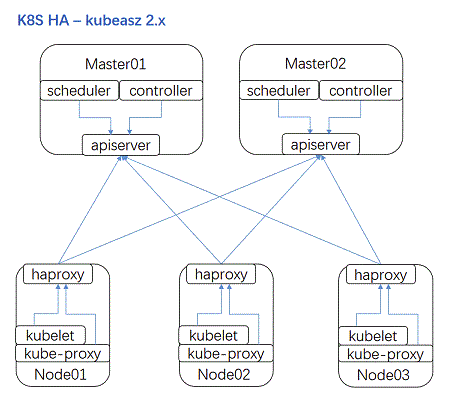

# 使用Kubeasz离线安装二进制Kubernetes集群

# 一、集群规划

- **k8s版本**：1.18
- **CNI**：Caclio
- **kubeproxy模式**：IPVS
- **证书有效期**：100年
- **IngressContoller**：Traefik 2.0
- **Registry**：Habor
- **CSI**：NFS Provisioner、Ceph RBD Provisioner、Ceph Filesystem Provisioner、LocalVolume Provisioner

**主机FQDN Domain**：k8s118.curiouser.com

| 主机名 | 硬件配置            | IP地址       | 服务                                                         |
| ------ | ------------------- | ------------ | ------------------------------------------------------------ |
| tools  | 8C16G100G /data100G | 192.168.1.60 | NFS Server、Ceph、Harbor、Nginx、Chrony                      |
| Node1  | 8C16G100G /data100G | 192.168.1.61 | Ansible<br>K8S Master<br>(etcd、apiserver、controllermanager、scheduler、kubelet、kueb-proxy、docker) |
| Node2  | 8C16G100G /data100G | 192.168.1.62 | K8S Worker(kubelet、kube-proxy、docker)                      |
| Node3  | 8C16G100G /data100G | 192.168.1.63 | K8S Worker(kubelet、kube-proxy、docker)                      |

# 二、Kubeasz ansible脚本简介

Kubeasz Github地址：https://github.com/easzlab/kubeasz



kubeasz 2.0.1 开始支持**完全离线安装**，目前已测试 `Ubuntu1604|1804` `CentOS7` `Debian9|10` 系统。

- **kubeasz 项目代码**   -->   `/etc/ansible`
- **kubernetes 集群组件二进制**   -->   `/etc/ansible/bin`
- **其他集群组件二进制（etcd/CNI等） ** -->    `/etc/ansible/bin`
- **操作系统基础依赖软件包（haproxy/ipvsadm/ipset/socat等） ** -->   `/etc/ansible/down/packages`
- **集群基本插件镜像（coredns/dashboard/metrics-server等**） -->   `/etc/ansible/down`

```bash
# 分步安装
ansible-playbook 01.prepare.yml
ansible-playbook 02.etcd.yml
ansible-playbook 03.docker.yml
ansible-playbook 04.kube-master.yml
ansible-playbook 05.kube-node.yml
ansible-playbook 06.network.yml
ansible-playbook 07.cluster-addon.yml
# 一步安装
ansible-playbook 90.setup.yml
```

`kubeasz`创建集群主要在以下两个地方进行配置：

- ansible hosts 文件（模板在examples目录）：集群主要节点定义和主要参数配置、全局变量
- `roles/xxx/defaults/main.yml `文件：其他参数配置或者部分组件附加参数
  - 配置 lb 节点负载均衡算法：修改` roles/lb/defaults/main.yml` 变量 BALANCE_ALG: "roundrobin"
  - 配置 docker 国内镜像加速站点：修改 `roles/docker/defaults/main.yml `相关变量
  - 配置 apiserver 支持公网域名：修改` roles/kube-master/defaults/main.yml` 相关变量
  - 配置 flannel 使用镜像版本：修改` roles/flannel/defaults/main.yml `相关变量
  - 配置选择不同 addon 组件：修改`roles/cluster-addon/defaults/main.yml`

作为 kubeasz 项目的推荐命令行脚本，easzctl 十分轻量、简单；（后续会不断完善补充）

- 命令集 1：集群层面操作
  - 切换/创建集群 context
  - 删除当前集群
  - 显示所有集群
  - 创建集群
  - 创建单机集群（类似 minikube）
- 命令集 2：集群内部操作
  - 增加工作节点
  - 增加主节点
  - 增加 etcd 节点
  - 删除 etcd 节点
  - 删除任意节点
  - 升级集群
- 命令集3：额外操作
  - 开启/关闭基础认证

集群 context 由 ansible hosts 配置、roles 配置等组成，用以区分不同的 k8s 集群，从而实现多集群的创建和管理；当然 easzctl 命令行不是必须的，你仍旧可以使用之前熟悉的方式安装/管理集群。

## 典型 easzctl 创建管理的集群拓扑如下

```
+----------------+               +-----------------+
|easzctl 1.1.1.1 |               |cluster-aio:     |
+--+---+---+-----+               |                 |
   |   |   |                     |master 4.4.4.4   |
   |   |   +-------------------->+etcd   4.4.4.4   |
   |   |                         |node   4.4.4.4   |
   |   +--------------+          +-----------------+
   |                  |
   v                  v
+--+------------+ +---+----------------------------+
| cluster-1:    | | cluster-2:                     |
|               | |                                |
| master 2.2.2.1| | master 3.3.3.1/3.3.3.2         |
| etcd   2.2.2.2| | etcd   3.3.3.1/3.3.3.2/3.3.3.3 |
| node   2.2.2.3| | node   3.3.3.4/3.3.3.5/3.3.3.6 |
+---------------+ +--------------------------------+
```

## 使用 easzctl 举例

- 随时运行 `easzctl help` 获取命令行提示信息
- 1.创建 context：准备集群名称（例如：test-cluster1），运行 `easzctl checkout test-cluster1`
  - 如果 context: test-cluster1 不存在，那么会根据 default 配置创建它；如果存在则切换当前 context 为 test-cluster1
- 2.准备 context 以后，根据你的需要配置 ansible hosts 文件和其他配置，然后运行 `easzctl setup`
- 3.安装成功后，运行 `easzctl list` 显示当前所有集群信息
- 4.重复步骤 1/2 可以创建多个集群
- 5.切换到某个集群 `easzctl checkout xxxx`，然后执行增加/删除节点操作

# 三、安装k8s 1.18集群

## 0、参考

- https://github.com/easzlab/kubeasz/blob/master/docs/setup/00-planning_and_overall_intro.md
- https://github.com/easzlab/kubeasz/blob/master/docs/setup/config_guide.md

## 1、各节点基础OS配置

```bash
rm -rf anaconda-ks.cfg original-ks.cfg post-install.log
sed -i 's/SELINUX=disabled/SELINUX=enforcing/g' /etc/selinux/config
echo 'export HTTP_PROXY="http://192.168.1.7:8001"' >> ~/.zshrc
echo 'export HTTPS_PROXY="http://192.168.1.7:8001"' >> ~/.zshrc
echo "PREFIX=24\nIPADDR=192.168.1.61\nGATEWAY=192.168.1.1" >> /etc/sysconfig/network-scripts/ifcfg-ens32
sed -i 's/dhcp/static/g' /etc/sysconfig/network-scripts/ifcfg-ens32
source ~/.zshrc
hostnamectl set-hostname --static node1.k8s118.curiouser.com
reboot now

rm -rf anaconda-ks.cfg original-ks.cfg post-install.log
sed -i 's/SELINUX=disabled/SELINUX=enforcing/g' /etc/selinux/config
echo 'export HTTP_PROXY="http://192.168.1.7:8001"' >> ~/.zshrc
echo 'export HTTPS_PROXY="http://192.168.1.7:8001"' >> ~/.zshrc
echo "PREFIX=24\nIPADDR=192.168.1.62\nGATEWAY=192.168.1.1" >> /etc/sysconfig/network-scripts/ifcfg-ens32
sed -i 's/dhcp/static/g' /etc/sysconfig/network-scripts/ifcfg-ens32
source ~/.zshrc
hostnamectl set-hostname --static node2.k8s118.curiouser.com
reboot now


rm -rf anaconda-ks.cfg original-ks.cfg post-install.log
sed -i 's/SELINUX=disabled/SELINUX=enforcing/g' /etc/selinux/config
echo 'export HTTP_PROXY="http://192.168.1.7:8001"' >> ~/.zshrc
echo 'export HTTPS_PROXY="http://192.168.1.7:8001"' >> ~/.zshrc
echo "PREFIX=24\nIPADDR=192.168.1.63\nGATEWAY=192.168.1.1" >> /etc/sysconfig/network-scripts/ifcfg-ens32
sed -i 's/dhcp/static/g' /etc/sysconfig/network-scripts/ifcfg-ens32
source ~/.zshrc
hostnamectl set-hostname --static node3.k8s118.curiouser.com
reboot now
```

## 2、Node1节点安装ansible

```bash
pip install pip --upgrade -i https://mirrors.aliyun.com/pypi/simple/
pip install ansible==2.6.18 netaddr==0.7.19 -i https://mirrors.aliyun.com/pypi/simple/
```

## 3、Node1节点配置节点FQDN与IP的映射并打通SSH免密钥登录

```bash
echo "192.168.1.60 tools.k8s118.curiouser.com tools" >> /etc/hosts
echo "192.168.1.61 node1.k8s118.curiouser.com node1" >> /etc/hosts
echo "192.168.1.62 node2.k8s118.curiouser.com node2" >> /etc/hosts
echo "192.168.1.63 node3.k8s118.curiouser.com node3" >> /etc/hosts

ssh-keygen -t rsa -b 2048 -N '' -f ~/.ssh/id_rsa
ssh-copy-id tools
ssh-copy-id node1
ssh-copy-id node2
ssh-copy-id node3
```

## 4、Node1节点下载kubeasz中的安装准备工具脚本easzup

```bash
export release=2.2.0
curl -C- -fLO --retry 3 https://github.com/easzlab/kubeasz/releases/download/$release/easzup
chmod +x ./easzup
./easzup -D
```

执行成功后，所有文件均已整理好放入目录`/etc/ansible`，只要把该目录整体复制到任何离线的机器上，即可开始安装集群

离线文件不包括：

- 管理端 ansible 安装，但可以使用 kubeasz 容器运行 ansible 脚本
- 其他更多 kubernetes 插件镜像

## 5、配置k8s集群参数的主机清单

模版配置：https://github.com/easzlab/kubeasz/blob/master/example/hosts.multi-node

```bash
cp /etc/ansible/example/hosts.multi-node /etc/ansible/hosts
```

```ini
[etcd]
192.168.1.61 NODE_NAME=etcd1
[kube-master]
192.168.1.61
[kube-node]
192.168.1.62
192.168.1.63
# [optional] loadbalance for accessing k8s from outside
[ex-lb]
192.168.1.60 LB_ROLE=backup EX_APISERVER_VIP=192.168.1.6250 EX_APISERVER_PORT=8443
# [optional] ntp server for the cluster
[chrony]
192.168.1.60

[all:vars]
# Cluster container-runtime supported: docker, containerd
CONTAINER_RUNTIME="docker"
# Network plugins supported: calico, flannel, kube-router, cilium, kube-ovn
CLUSTER_NETWORK="calico"
# Service proxy mode of kube-proxy: 'iptables' or 'ipvs'
PROXY_MODE="ipvs"
# K8S Service CIDR, not overlap with node(host) networking
SERVICE_CIDR="10.68.0.0/16"
# Cluster CIDR (Pod CIDR), not overlap with node(host) networking
CLUSTER_CIDR="172.20.0.0/16"
# NodePort Range
NODE_PORT_RANGE="20000-40000"
# Cluster DNS Domain
CLUSTER_DNS_DOMAIN="cluster.local."
# -------- Additional Variables (don't change the default value right now) ---
# Binaries Directory
bin_dir="/opt/kube/bin"
# CA and other components cert/key Directory
ca_dir="/etc/kubernetes/ssl"
# Deploy Directory (kubeasz workspace)
base_dir="/etc/ansible"
```

## 6、修改Ansible中K8S服务配置

### ⓪设置离线安装

```bash
sed -i 's/^INSTALL_SOURCE.*$/INSTALL_SOURCE: "offline"/g' /etc/ansible/roles/chrony/defaults/main.yml
sed -i 's/^INSTALL_SOURCE.*$/INSTALL_SOURCE: "offline"/g' /etc/ansible/roles/ex-lb/defaults/main.yml
sed -i 's/^INSTALL_SOURCE.*$/INSTALL_SOURCE: "offline"/g' /etc/ansible/roles/kube-node/defaults/main.yml
sed -i 's/^INSTALL_SOURCE.*$/INSTALL_SOURCE: "offline"/g' /etc/ansible/roles/prepare/defaults/main.yml
```

### ①修改集群证书相关配置

参考：https://github.com/easzlab/kubeasz/blob/master/docs/setup/01-CA_and_prerequisite.md

```bash
sed -i 's/HangZhou/Shanghai/g' /etc/ansible/roles/deploy/templates/*

vi /etc/ansible/roles/deploy/defaults/main.yml

# CA 证书相关参数
CA_EXPIRY: "876000h"
CERT_EXPIRY: "876000h"
# apiserver 默认第一个master节点
KUBE_APISERVER: "https://{{ groups['kube-master'][0] }}:6443"
CLUSTER_NAME: "Curiouser"
CREATE_READONLY_KUBECONFIG: false
```

### ②修改Docker配置

```bash
vi /etc/ansible/roles/docker/defaults/main.yml

# docker日志相关
LOG_DRIVER: "json-file"
LOG_LEVEL: "warn"
LOG_MAX_SIZE: "50m"
LOG_MAX_FILE: 10
# docker容器存储目录
STORAGE_DIR: "/data/docker"
# 开启Restful API
ENABLE_REMOTE_API: false
# 启用 docker 仓库镜像
ENABLE_MIRROR_REGISTRY: true
# 设置 docker 仓库镜像
REG_MIRRORS: '["https://dockerhub.azk8s.cn", "https://docker.mirrors.ustc.edu.cn"]'
# 信任的HTTP仓库
INSECURE_REG: '["127.0.0.1/8","192.168.1.60"]'
```

### ③其他插件配置

```bash
vi  /etc/ansible/roles/cluster-addon/defaults/main.yml

# dns 自动安装，'dns_backend'可选"coredns"和“kubedns”
dns_install: "yes"
dns_backend: "coredns"
# 设置 dns svc ip (这里选用 SERVICE_CIDR 中第2个IP)
CLUSTER_DNS_SVC_IP: "{{ SERVICE_CIDR | ipaddr('net') | ipaddr(2) | ipaddr('address') }}"
kubednsVer: "1.14.13"
corednsVer: "1.6.6"
kubedns_offline: "kubedns_{{ kubednsVer }}.tar"
coredns_offline: "coredns_{{ corednsVer }}.tar"
dns_offline: " \
                {{ coredns_offline }} \
               \
                {{ kubedns_offline }} \
              "

# metric server 自动安装
metricsserver_install: "yes"
metricsVer: "v0.3.6"
metricsserver_offline: "metrics-server_{{ metricsVer }}.tar"

# dashboard 自动安装
# dashboard v2.x.x 不依赖于heapster
dashboard_install: "no"
dashboardVer: "v2.0.0-rc3"
dashboard_offline: "dashboard_{{ dashboardVer }}.tar"
dashboardMetricsScraperVer: "v1.0.3"
metricsscraper_offline: "metrics-scraper_{{ dashboardMetricsScraperVer }}.tar"

# ingress 自动安装，可选 "traefik" 和 "nginx-ingress"
ingress_install: "no"
ingress_backend: "traefik"
traefikVer: "v1.7.20"
nginxingVer: "0.21.0"
traefik_offline: "traefik_{{ traefikVer }}.tar"
nginx_ingress_offline: "nginx_ingress_{{ nginxingVer }}.tar"

# metallb 自动安装
metallb_install: "no"
metallbVer: "v0.7.3"
# 模式选择: 二层 "layer2" 或者三层 "bgp"
metallb_protocol: "layer2"
metallb_offline: "metallb_{{ metallbVer }}.tar"
metallb_vip_pool: "192.168.1.240/29"

# efk 自动安装
#efk_install: "no"

# prometheus 自动安装
#prometheus_install: "no"
```

## 7、执行ansible playbook

```
ansible-playbook /etc/ansible/90.setup.yml
```

## 8、验证

```bash
kubectl get node -owide
kubectl get pod --all-namespaces
/opt/kube/bin/calicoctl get node
```

# 三、Tools安装基础服务

## 1、安装NFS Server

```bash
yum install -y nfs-utils rpcbind && \
systemctl enable nfs && \
systemctl enable rpcbind && \
systemctl start nfs && \
systemctl start rpcbind && \
echo "/data/nfs/k8s-storage 192.168.1.0/24(rw,no_root_squash,sync)" >> /etc/exports && \
mkdir -p /data/nfs/k8s-storage && \
exportfs -a && \
showmount -e $HOSTNAME
```

## 2、安装Harbor

最新kubeasz安装脚本中不支持安装最新版本的harbor,所以要使用docker compose在tools节点安装

### ①安装docker、docker-compose

```bash
yum install -y yum-utils && \
yum-config-manager --add-repo https://download.docker.com/linux/centos/docker-ce.repo && \
yum list docker-ce --showduplicates | sort -r && \
yum install docker-ce-18.06.3.ce docker-compose && \
bash -c 'cat > /etc/docker/daemon.json << EOF
{
  "registry-mirrors": [
    "https://dockerhub.azk8s.cn",
    "https://docker.mirrors.ustc.edu.cn",
    "http://hub-mirror.c.163.com"
  ],
  "max-concurrent-downloads": 10,
  "log-driver": "json-file",
  "log-level": "warn",
  "log-opts": {
    "max-size": "10m",
    "max-file": "3"
    },
  "data-root": "/var/lib/docker"
}
EOF' && \
systemctl enable docker && \
systemctl start docker && \
docker info
```

### ②部署Harbor

```bash
export harbor_ver=v2.0.0 && \
wget https://github.com/goharbor/harbor/releases/download/$harbor_ver/harbor-online-installer-$harbor_ver.tgz && \
tar -zxvf harbor-online-installer-* && \
rm -rf  harbor-online-installer-* && \
mkdir -p /data/harbor/{data,logs} && \
mv harbor /data/harbor/ && \
cd /data/harbor/harbor && \
bash -c 'cat > /data/harbor/harbor/harbor.yml << EOF
hostname: 192.168.1.60
http:
  port: 80
harbor_admin_password: *****
database:
  password: *****
  max_idle_conns: 50
  max_open_conns: 100
data_volume: /data/harbor/data
clair:
  updaters_interval: 12
trivy:
  ignore_unfixed: false
  skip_update: false
  insecure: false
jobservice:
  max_job_workers: 10
notification:
  webhook_job_max_retry: 10
chart:
  absolute_url: disabled
log:
  level: info
  local:
    rotate_count: 50
    rotate_size: 200M
    location: /data/harbor/logs
_version: 2.0.0
proxy:
  http_proxy:
  https_proxy:
  no_proxy:
  components:
    - core
    - jobservice
    - clair
    - trivy
EOF' && \
/data/harbor/harbor/install.sh
```

### ③验证

访问http://192.168.1.60

# 四、K8S集群配置

## 1、在K8S集群中添加harbor用户认证的Secret

### ①Harbor中创建用户并授权

在Harbor中创建用户`k8s`，在指定的仓库中授予`访客`的权限，仅限于可以拉取镜像

### ②在K8S指定命名空间下创建harbor账号的Secret

```bash
for i in {default,kube-system} ; do kubectl create secret docker-registry harbor-secret --docker-server=192.168.1.60 --docker-username=k8s  --docker-password=**** --docker-email=***@163.com -n $i ;done
```

### ③指定默认default ServiceAccount的镜像拉取Secret

不用每个Deployment中都要添加`imagepullsecret`

```bash
kubectl patch serviceaccount default -p '{"imagePullSecrets": [{"name": "harbor-secret"}]}' -n kube-system
```


## 2、Node1节点安装Helm 3

### ①下载安装helm3

```bash
export helm_ver=v3.2.1
wget https://get.helm.sh/helm-$helm_ver-linux-amd64.tar.gz 
tar -zxvf helm-* linux-amd64/helm
mv linux-amd64/helm /usr/local/bin
chmod +x /usr/local/bin/helm
rm -rf linux-amd64 helm-*
```

### ②添加远程charts仓库

```bash
helm repo add googleapis-incubator https://kubernetes-charts-incubator.storage.googleapis.com
helm repo add googleapis-stable https://kubernetes-charts.storage.googleapis.com
helm repo add bitnami https://charts.bitnami.com/bitnami
helm repo add traefik https://containous.github.io/traefik-helm-chart
helm repo add harbor https://helm.goharbor.io
helm repo add aliyun https://kubernetes.oss-cn-hangzhou.aliyuncs.com/charts
helm repo add elastic https://helm.elastic.co
helm repo add kong https://charts.konghq.com
helm repo add pingcap https://charts.pingcap.org/
helm repo list
helm repo update
```

## 3、配置CSI

### Ceph Filesystem Provisoner

#### ①tools节点安装单节点Ceph Filesystem，并获取admin用户的密钥环

参考：

- [ceph-filesystem单节点安装](origin/ceph-filesystem单节点安装.md)
- [ceph-filesystem-provisioner](origin/openshift-Kubernetes-provisioner-cephfs.md)

```bash
ceph auth get client.admin 
```

#### ②创建Ceph admin用户的Secret

```bash
kubectl create secret generic ceph-admin --type="kubernetes.io/rbd" --from-literal=key='******' --namespace=default
```

#### ③部署带有RBAC的Ceph Filesystem Provisoner 对象资源

```bash
---
apiVersion: v1
kind: ServiceAccount
metadata:
  name: ceph-fs-provisioner
  namespace: default
---
apiVersion: rbac.authorization.k8s.io/v1
kind: Role
metadata:
  name: ceph-fs-provisioner
  namespace: default
rules:
  - apiGroups: [""]
    resources: ["secrets"]
    verbs: ["create", "get", "delete"]
  - apiGroups: [""]
    resources: ["endpoints"]
    verbs: ["get", "list", "watch", "create", "update", "patch"]
---
apiVersion: rbac.authorization.k8s.io/v1
kind: RoleBinding
metadata:
  name: ceph-fs-provisioner
  namespace: default
roleRef:
  apiGroup: rbac.authorization.k8s.io
  kind: Role
  name: ceph-fs-provisioner
subjects:
- kind: ServiceAccount
  name: ceph-fs-provisioner
---
kind: ClusterRole
apiVersion: rbac.authorization.k8s.io/v1
metadata:
  name: ceph-fs-provisioner
  namespace: default
rules:
  - apiGroups: [""]
    resources: ["persistentvolumes"]
    verbs: ["get", "list", "watch", "create", "delete"]
  - apiGroups: [""]
    resources: ["persistentvolumeclaims"]
    verbs: ["get", "list", "watch", "update"]
  - apiGroups: ["storage.k8s.io"]
    resources: ["storageclasses"]
    verbs: ["get", "list", "watch"]
  - apiGroups: [""]
    resources: ["events"]
    verbs: ["create", "update", "patch"]
  - apiGroups: [""]
    resources: ["services"]
    resourceNames: ["kube-dns","coredns"]
    verbs: ["list", "get"]
---
kind: ClusterRoleBinding
apiVersion: rbac.authorization.k8s.io/v1
metadata:
  name: ceph-fs-provisioner
subjects:
  - kind: ServiceAccount
    name: ceph-fs-provisioner
    namespace: default
roleRef:
  kind: ClusterRole
  name: ceph-fs-provisioner
  apiGroup: rbac.authorization.k8s.io
---
apiVersion: apps/v1
kind: Deployment
metadata:
  name: ceph-fs-provisioner
  namespace: default
spec:
  selector:
    matchLabels:
      app: ceph-fs-provisioner
  replicas: 1
  strategy:
    type: Recreate
  template:
    metadata:
      labels:
        app: ceph-fs-provisioner
    spec:
      imagePullSecrets:
      - name: harbor-secret
      containers:
      - name: ceph-fs-provisioner
        image: "192.168.1.60/tools/cephfs-provisioner:latest"
        env:
        - name: PROVISIONER_NAME
          value: ceph.com/cephfs
        - name: PROVISIONER_SECRET_NAMESPACE
          value: default
        command:
        - "/usr/local/bin/cephfs-provisioner"
        args:
        - "-id=cephfs-provisioner-1"
      serviceAccount: ceph-fs-provisioner
```

#### ④创建storageclass 

```bash
kind: StorageClass
apiVersion: storage.k8s.io/v1
metadata:
  name: ceph-fs
provisioner: ceph.com/cephfs
parameters:
    monitors: 192.168.1.60:6789
    adminId: admin
    adminSecretName: ceph-admin
    adminSecretNamespace: "default"
    claimRoot: /ceph-fs-pvc-volumes
```

#### ⑤验证测试

创建pvc

```bash
kind: PersistentVolumeClaim
apiVersion: v1
metadata:
  name: ceph-fs-pvc-test
spec:
  accessModes:
    - ReadWriteOnce
  resources:
    requests:
      storage: 8Gi
  storageClassName: ceph-fs
```

创建临时POD挂载PVC，写入测试数据

```bash
apiVersion: v1
kind: Pod
metadata:
  name: counter
spec:
  containers:
  - name: count
    image: busybox
    args:
    - /bin/sh
    - -c
    - >
      i=0;
      while true;
      do
        echo "$i: $(date)" >> /var/log/1.log;
        echo "$(date) INFO $i" >> /var/log/2.log;
        i=$((i+1));
        sleep 1;
      done
    volumeMounts:
    - name: varlog
      mountPath: /var/log
  volumes:
    - name: varlog
      persistentVolumeClaim:
        claimName: ceph-fs-pvc-test
```

将Ceph Filesystem的pool挂载到Node1节点上查看其中是否产生文件

```bash
mkdir /mnt/mycephfs
mount -t ceph tools.k8s118.curiouser.com:/ /mnt/mycephfs -o name=admin,secret=*****
tree /mnt/mycephfs/pvc-volumes/kubernetes

/mnt/mycephfs/pvc-volumes/kubernetes
└── kubernetes-dynamic-pvc-33ee21eb-984f-11ea-be0a-52a5fa47eee8
     └── 1.log
     └── 2.log
```


### Ceph RBD Provisioner

#### ①tools节点安装单节点Ceph，并获取admin用户的密钥环

参考：[ceph-rbd单节点安装](origin/ceph-rbd单节点安装.md)

#### ②部署带有RBAC的Ceph RBD Provisioner对象资源

```yaml
---
kind: ClusterRole
apiVersion: rbac.authorization.k8s.io/v1
metadata:
  name: ceph-rbd-provisioner
rules:
  - apiGroups: [""]
    resources: ["persistentvolumes"]
    verbs: ["get", "list", "watch", "create", "delete"]
  - apiGroups: [""]
    resources: ["persistentvolumeclaims"]
    verbs: ["get", "list", "watch", "update"]
  - apiGroups: ["storage.k8s.io"]
    resources: ["storageclasses"]
    verbs: ["get", "list", "watch"]
  - apiGroups: [""]
    resources: ["events"]
    verbs: ["create", "update", "patch"]
  - apiGroups: [""]
    resources: ["services"]
    resourceNames: ["kube-dns","coredns"]
    verbs: ["list", "get"]
  - apiGroups: [""]
    resources: ["endpoints"]
    verbs: ["get", "list", "watch", "create", "update", "patch"]
---
apiVersion: rbac.authorization.k8s.io/v1
kind: Role
metadata:
  name: ceph-rbd-provisioner
rules:
- apiGroups: [""]
  resources: ["secrets"]
  verbs: ["get"]
- apiGroups: [""]
  resources: ["endpoints"]
  verbs: ["get", "list", "watch", "create", "update", "patch"]
---
apiVersion: rbac.authorization.k8s.io/v1
kind: RoleBinding
metadata:
  name: ceph-rbd-provisioner
roleRef:
  apiGroup: rbac.authorization.k8s.io
  kind: Role
  name: ceph-rbd-provisioner
subjects:
- kind: ServiceAccount
  name: ceph-rbd-provisioner
  namespace: default
---
kind: ClusterRoleBinding
apiVersion: rbac.authorization.k8s.io/v1
metadata:
  name: ceph-rbd-provisioner
subjects:
  - kind: ServiceAccount
    name: ceph-rbd-provisioner
    namespace: default
roleRef:
  kind: ClusterRole
  name: ceph-rbd-provisioner
  apiGroup: rbac.authorization.k8s.io
---
apiVersion: v1
kind: ServiceAccount
metadata:
  name: ceph-rbd-provisioner
---
apiVersion: apps/v1
kind: Deployment
metadata:
  name: ceph-rbd-provisioner
spec:
  replicas: 1
  selector:
    matchLabels:
      app: ceph-rbd-provisioner
  strategy:
    type: Recreate
  template:
    metadata:
      labels:
        app: ceph-rbd-provisioner
    spec:
      imagePullSecrets:
      - name: harbor-secret
      containers:
      - name: ceph-rbd-provisioner
        image: "192.168.1.60/tools/ceph-rbd-provisioner:latest"
        env:
        - name: PROVISIONER_NAME
          value: ceph-rbd-provisioner
        - name: PROVISIONER_SECRET_NAMESPACE
          value: default
      serviceAccount: ceph-rbd-provisioner
```

#### ③创建storageclass 

```bash
apiVersion: storage.k8s.io/v1
kind: StorageClass
metadata:
  name: ceph-rbd
provisioner: ceph-rbd-provisioner
parameters:
  monitors: 192.168.1.60:6789
  adminId: admin
  adminSecretName: ceph-admin
  adminSecretNamespace: default
  pool: rbd #ceph创建是默认rbd池
  userId: admin
  userSecretName: ceph-admin
  userSecretNamespace: default
  fsType: ext4
  imageFormat: "2"
  imageFeatures: "layering"
 
# fsType：Kubernetes 支持的 fsType。默认："ext4"。
# imageFormat：Ceph RBD 镜像格式，“1” 或者 “2”。默认值是 “1”。
# imageFeatures：这个参数是可选的，只能在你将 imageFormat 设置为 “2” 才使用。 目前支持的功能只是 #
# layering。默认是 “"，没有功能打开。
```

#### ④所有K8s节点安装ceph-common包

 kubernetes 的所有节点（尤其是 master 节点）上需要安装 ceph-common客户端,不然稍后测试时，pvc/pv创建都正常,但是pod挂载失败，报`failed to create rbd image: executable file not found in $PATH, command output`

```bash
[ceph]
name=Ceph packages for $basearch
baseurl=http://mirrors.163.com/ceph/rpm-jewel/el7/$basearch
enabled=1
gpgcheck=1
priority=1
type=rpm-md
gpgkey=http://mirrors.163.com/ceph/keys/release.asc

[ceph-noarch]
name=Ceph noarch packages
baseurl=http://mirrors.163.com/ceph/rpm-jewel/el7/noarch
enabled=1
gpgcheck=1
priority=1
type=rpm-md
gpgkey=http://mirrors.163.com/ceph/keys/release.asc
```

```bash
yum install -y ceph-common
```

#### ⑤验证测试

创建pvc

```bash
kind: PersistentVolumeClaim
apiVersion: v1
metadata:
  name: ceph-rbd-pvc-test
spec:
  accessModes:
    - ReadWriteOnce
  resources:
    requests:
      storage: 8Gi
  storageClassName: ceph-rbd
```

创建临时POD挂载PVC，写入测试数据

```bash
apiVersion: v1
kind: Pod
metadata:
  name: counter
spec:
  containers:
  - name: count
    image: busybox
    args:
    - /bin/sh
    - -c
    - >
      i=0;
      while true;
      do
        echo "$i: $(date)" >> /var/log/1.log;
        echo "$(date) INFO $i" >> /var/log/2.log;
        i=$((i+1));
        sleep 1;
      done
    volumeMounts:
    - name: varlog
      mountPath: /var/log
  volumes:
    - name: varlog
      persistentVolumeClaim:
        claimName: ceph-rbd-pvc-test
```

#### ⑥排错方式

`persistent-volume-controller `服务受`kube-controller-manager `控制，可以通过查看`kube-controller-manager `的日志排错

```bash
journalctl -xe -u kube-controller-manager.service
```

#### ⑦参考

1. https://github.com/kubernetes-incubator/external-storage/tree/master/ceph/rbd
2. https://blog.51cto.com/wangzhijian/2159701

### NFS Client Provisoner

#### ①拉取镜像并推送到harbor中

```bash
docker login -u admin -p ***** 192.168.1.60
docekr pull quay.io/external_storage/nfs-client-provisioner:v3.1.0-k8s1.11
docekr tag quay.io/external_storage/nfs-client-provisioner:v3.1.0-k8s1.11 192.168.1.60/tools/nfs-client-provisioner:v3.1.0-k8s1.11
docekr push 192.168.1.60/tools/nfs-client-provisioner:v3.1.0-k8s1.11
```

#### ②使用helm部署NFS Client Provisoner

```bash
helm install nfs-client-provisioner --set nfs.server=192.168.1.60 --set nfs.path=/data/nfs/k8s-storage googleapis-stable/nfs-client-provisioner --namespace default --set image.repository=192.168.1.60/tools/nfs-client-provisioner  --set image.tag=v3.1.0-k8s1.11 --set storageClass.defaultClass=true


bash -c 'cat > /tmp/a <EOF
spec:
  template:
    spec:
      imagePullSecrets:
        - name: harbor-secret
EOF' && \
k -n default patch deployment nfs-client-provisioner --patch "$(cat /tmp/a)"
```

#### ③测试验证

创建一个PVC

```bash
vi /tmp/test.pvc

kind: PersistentVolumeClaim
apiVersion: v1
metadata:
  name: test
spec:
  accessModes:
    - ReadWriteMany
  resources:
    requests:
      storage: 100Mi

kubectl apply -f /tmp/test.pvc -n default
```

创建一个POD使用PVC

```bash
apiVersion: v1
kind: Pod
metadata:
  name: counter
spec:
  containers:
  - name: count
    image: busybox
    args:
    - /bin/sh
    - -c
    - >
      i=0;
      while true;
      do
        echo "$i: $(date)" >> /var/log/1.log;
        echo "$(date) INFO $i" >> /var/log/2.log;
        i=$((i+1));
        sleep 1;
      done
    volumeMounts:
    - name: varlog
      mountPath: /var/log
  volumes:
    - name: varlog
      persistentVolumeClaim:
        claimName: test
```

验证NFS Server节点tools上NFS目录下是否产生文件

```bash
ls /data/nfs/k8s-storage/default-test-pvc-59663468-2352-4be5-8b08-432045ce8a18/

1.log  2.log
```

删除对应测试pod、pvc

```bash
kubectl -n default delete pod/counter pvc/test --force --grace-period 0
```

# 五、K8S Worker节点管理

**参考**：https://github.com/easzlab/kubeasz/blob/master/docs/op/op-node.md

## 1、添加节点

新增`kube-node`节点大致流程为：`/etc/ansible/tools/02.addnode.yml`

- [可选]新节点安装 chrony 时间同步
- 新节点预处理 prepare
- 新节点安装 docker 服务
- 新节点安装 kube-node 服务
- 新节点安装网络插件相关

### ①创建新节点VM并配置OS基础配置

```bash
rm -rf anaconda-ks.cfg original-ks.cfg post-install.log
sed -i 's/SELINUX=disabled/SELINUX=enforcing/g' /etc/selinux/config
echo 'export HTTP_PROXY="http://192.168.1.7:8001"' >> ~/.zshrc
echo 'export HTTPS_PROXY="http://192.168.1.7:8001"' >> ~/.zshrc
echo "PREFIX=24\nIPADDR=192.168.1.64\nGATEWAY=192.168.1.1" >> /etc/sysconfig/network-scripts/ifcfg-ens32
sed -i 's/dhcp/static/g' /etc/sysconfig/network-scripts/ifcfg-ens32
source ~/.zshrc
hostnamectl set-hostname --static node4.k8s118.curiouser.com
reboot now
```

### ②Node1节点配置新增节点FQDN与IP的映射并打通SSH免密钥登录

```bash
echo "192.168.1.64 node4.k8s118.curiouser.com node4" >> /etc/hosts
ssh-copy-id node4
```

### ③Node1节点运行`easzctl add-node`命令

```bash
easzctl add-node 192.168.1.64
```

### ④验证

```bash
kubectl get node -owide
```

### ⑤（可选）添加非标准 ssh 22端口的节点

目前 easzctl 暂不支持自动添加非标准 ssh 端口的节点，可以手动操作如下：

- 假设待添加节点192.168.2.1，ssh 端口 10022；配置免密登录`ssh-copy-id -p 10022 192.168.2.1`，按提示输入密码
- 在 /etc/ansible/hosts文件 [kube-node] 组下添加一行：

```
192.168.2.1 ansible_ssh_port=10022
```

- 最后执行 `ansible-playbook /etc/ansible/tools/02.addnode.yml -e NODE_TO_ADD=192.168.2.1`

## 2、删除节点

删除 node 节点流程：`/etc/ansible/tools/12.delnode.yml`

- 检测是否可以删除
- 迁移节点上的 pod
- 删除 node 相关服务及文件
- 从集群删除 node

### ①Node1节点运行`easzctl del-node`命令

```bash
easzctl del-node 192.168.1.64
```

# 六、K8S Master节点管理

**参考**：https://github.com/easzlab/kubeasz/blob/master/docs/op/op-master.md

## 1、添加Master节点

新增`kube-master`节点大致流程为：`/etc/ansible/tools/03.addmaster.yml`

- [可选]新节点安装 chrony 时间同步
- 新节点预处理 prepare
- 新节点安装 docker 服务
- 新节点安装 kube-master 服务
- 新节点安装 kube-node 服务
- 新节点安装网络插件相关
- 禁止业务 pod调度到新master节点
- 更新 node 节点 haproxy 负载均衡并重启

### ①创建新节点VM并配置OS基础配置

```bash
rm -rf anaconda-ks.cfg original-ks.cfg post-install.log
sed -i 's/SELINUX=disabled/SELINUX=enforcing/g' /etc/selinux/config
echo 'export HTTP_PROXY="http://192.168.1.7:8001"' >> ~/.zshrc
echo 'export HTTPS_PROXY="http://192.168.1.7:8001"' >> ~/.zshrc
echo "PREFIX=24\nIPADDR=192.168.1.64\nGATEWAY=192.168.1.1" >> /etc/sysconfig/network-scripts/ifcfg-ens32
sed -i 's/dhcp/static/g' /etc/sysconfig/network-scripts/ifcfg-ens32
source ~/.zshrc
hostnamectl set-hostname --static node4.k8s118.curiouser.com
reboot now
```

### ②Node1节点配置新增节点FQDN与IP的映射并打通SSH免密钥登录

```bash
echo "192.168.1.64 node4.k8s118.curiouser.com node4" >> /etc/hosts
ssh-copy-id node4
```

### ③Node1节点运行`easzctl add-master`命令

```bash
easzctl add-master 192.168.1.64
```

### ④验证

```bash
# 在新节点master 服务状态
systemctl status kube-apiserver 
systemctl status kube-controller-manager
systemctl status kube-scheduler

# 查看新master的服务日志
journalctl -u kube-apiserver -f

# 查看集群节点，可以看到新 master节点 Ready, 并且禁止了POD 调度功能
kubectl get node
```

## 2、删除 Master 节点

删除`kube-master`节点大致流程为：`/etc/ansible/tools/13.delmaster.yml`

- 检测是否可以删除
- 迁移节点 pod
- 删除 master 相关服务及文件
- 删除 node 相关服务及文件
- 从集群删除 node 节点
- 从 ansible hosts 移除节点
- 在 ansible 控制端更新 kubeconfig
- 更新 node 节点 haproxy 配置

### ①Node1节点运行`easzctl del-master`命令

```
easzctl del-master 192.168.1.64 
```


# 七、集群备份与恢复

参考：https://github.com/easzlab/kubeasz/blob/master/docs/op/cluster_restore.md

在高可用k8s集群中 etcd集群保存了整个集群的状态，因此这里的备份与恢复重点就是：

- 从运行的etcd集群备份数据到磁盘文件
- 从etcd备份文件恢复数据，从而使集群恢复到备份时状态

## 备份与恢复操作说明

1.首先搭建一个测试集群，部署几个测试deployment，验证集群各项正常后，进行一次备份：

```
$ ansible-playbook /etc/ansible/23.backup.yml
```

执行完毕可以在备份目录下检查备份情况，示例如下：

```
/etc/ansible/.cluster/backup/
├── hosts
├── hosts-201907030954
├── snapshot-201907030954.db
├── snapshot-201907031048.db
└── snapshot.db
```

- 2.模拟误删除操作（略）
- 3.恢复集群及验证

可以在 `roles/cluster-restore/defaults/main.yml` 文件中配置需要恢复的 etcd备份版本（从上述备份目录中选取），默认使用最近一次备份；执行恢复后，需要一定时间等待 pod/svc 等资源恢复重建。

```
$ ansible-playbook /etc/ansible/24.restore.yml
```

如果集群主要组件（master/etcd/node）等出现不可恢复问题，可以尝试使用如下步骤 [清理](https://github.com/easzlab/kubeasz/blob/master/docs/op) --> [创建](https://github.com/easzlab/kubeasz/blob/master/docs/op) --> [恢复](https://github.com/easzlab/kubeasz/blob/master/docs/op)

```
ansible-playbook /etc/ansible/99.clean.yml
ansible-playbook /etc/ansible/90.setup.yml
ansible-playbook /etc/ansible/24.restore.yml
```

## 参考

- https://github.com/coreos/etcd/blob/master/Documentation/op-guide/recovery.md

# 八、升级

### 快速k8s版本升级

快速升级是指只升级`k8s`版本，比较常见如`Bug修复` `重要特性发布`时使用。

- 首先去官网release下载待升级的k8s版本，例如`https://dl.k8s.io/v1.11.5/kubernetes-server-linux-amd64.tar.gz`

- 解压下载的tar.gz文件，找到如下

  ```
  kube*
  ```

  开头的二进制，复制替换ansible控制端目录

  ```
  /etc/ansible/bin
  ```

  对应文件

  - kube-apiserver
  - kube-controller-manager
  - kubectl
  - kubelet
  - kube-proxy
  - kube-scheduler

- 在ansible控制端执行`ansible-playbook -t upgrade_k8s 22.upgrade.yml`即可完成k8s 升级，不会中断业务应用

如果使用 easzctl 命令行，可按如下执行：

- 首先确认待升级的集群（如果有多集群的话） `easzctl checkout <cluster_name>`
- 执行升级 `easzctl upgrade`

### 其他升级说明

其他升级是指升级k8s组件包括：`etcd版本` `docker版本`，一般不需要用到，以下仅作说明。

- 1.下载所有组件相关新的二进制解压并替换 `/etc/ansible/bin/` 目录下文件

- 2.升级 etcd: `ansible-playbook -t upgrade_etcd 02.etcd.yml`，**注意：etcd 版本只能升级不能降低！**

- 3.升级 docker （建议使用k8s官方支持的docker稳定版本）

  - 如果可以接受短暂业务中断，执行 `ansible-playbook -t upgrade_docker 03.docker.yml`

  - 如果要求零中断升级，执行`ansible-playbook -t download_docker 03.docker.yml` ，然后手动执行如下

    - 待升级节点，先应用`kubectl cordon`和`kubectl drain`命令迁移业务pod
    - 待升级节点执行 `systemctl restart docker`
    - 恢复节点可调度 `kubectl uncordon`