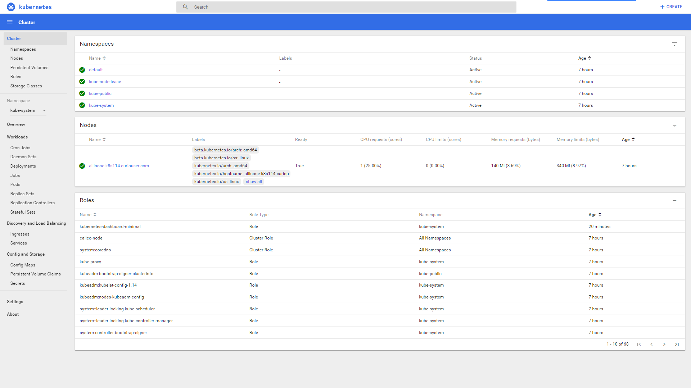
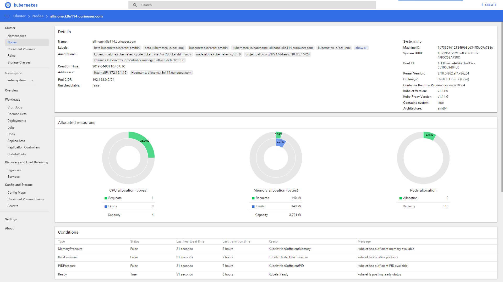
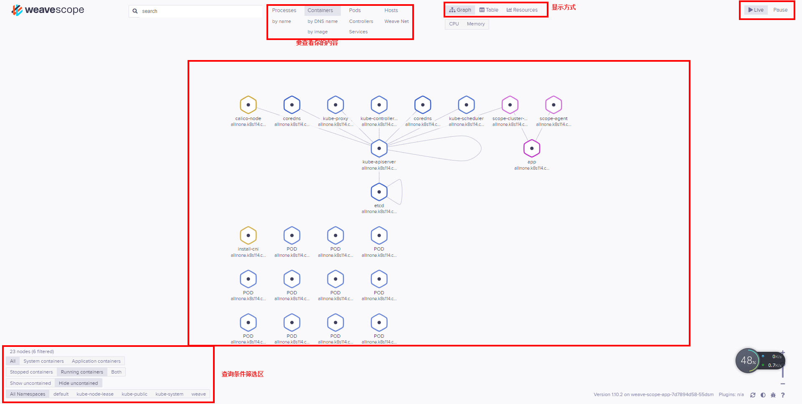
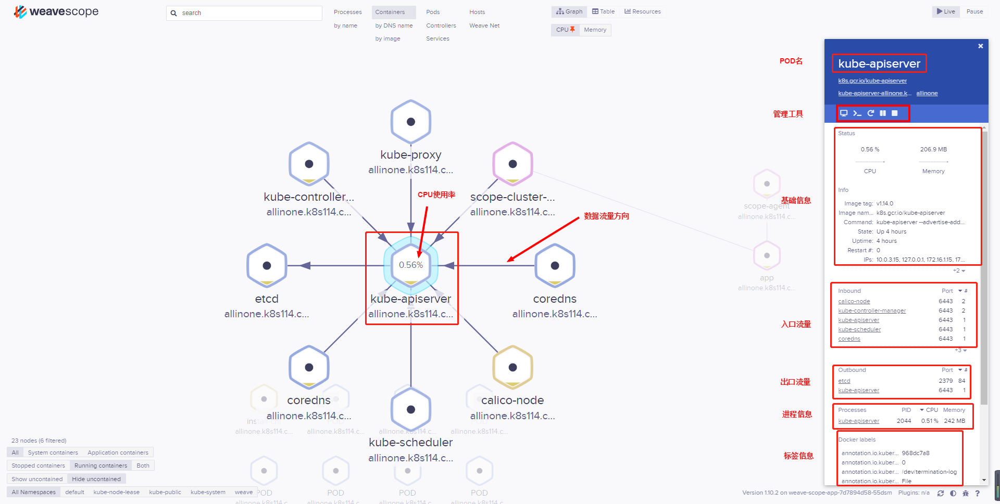

# 使用Kubeadm安装单机版Kubernetes

kubeadm是Kubernetes官方提供的用于快速安装 Kubernetes 集群的工具，通过将集群的各个组件进行容器化安装管理，通过kubeadm的方式安装集群比二进制的方式安装要方便

# Prerequisite

| **Hostname**                  | **IP 地址** | **硬件** | **Kubernetes版本** | **Docker版本** |
| ----------------------------- | ----------- | -------- | ------------------ | -------------- |
| allinone.k8s114.curiouser.com | 172.16.1.12 | 最低2C2G | v1.14.0            | 18.09.4        |

- 关闭防火墙
- 关闭Selinux
- 关闭Swap
- 加载br_netfilter
- 添加配置内核参数
- hosts文件添加主机名与IP的映射关

```bash
#关闭防火墙 \
#关闭Swap \
#关闭Selinux \
#加载br_netfilter \
#添加配置内核参数 \
#加载配置 \
systemctl disable firewalld && systemctl stop firewalld \
swapoff -a && sed -i 's/.\\*swap.\\*/#&/' /etc/fstab \
setenforce 0 \
sed -i "s/^SELINUX=enforcing/SELINUX=disabled/g" /etc/sysconfig/selinux && \
sed -i "s/^SELINUX=enforcing/SELINUX=disabled/g" /etc/selinux/config  && \
sed -i "s/^SELINUX=permissive/SELINUX=disabled/g" /etc/sysconfig/selinux && \
sed -i "s/^SELINUX=permissive/SELINUX=disabled/g" /etc/selinux/config  && \
modprobe br_netfilter && \
bash -c 'cat >  /etc/sysctl.d/k8s.conf <<EOF
net.bridge.bridge-nf-call-ip6tables = 1
net.bridge.bridge-nf-call-iptables = 1
EOF' && \
  sysctl -p /etc/sysctl.d/k8s.conf && \
  ipaddr=$(ip addr | awk '/^[0-9]+: / {}; /inet.*global/ {print gensub(/(.*)\/(.*)/, "\\1", "g", $2)}'| sed -n '1p') && \
  echo $ipaddr $HOSTNAME >> /etc/hosts
```

# 一、安装

1. 安装docker kubeadm kubelet kubectl

    ```bash
    yum -y install yum-utils && \
    yum-config-manager --add-repo https://mirrors.aliyun.com/docker-ce/linux/centos/docker-ce.repo && \
    bash -c 'cat > /etc/yum.repos.d/kubernetes.repo <<EOF 
    [kubernetes]
    name=Kubernetes
    baseurl=https://mirrors.aliyun.com/kubernetes/yum/repos/kubernetes-el7-x86_64/
    enabled=1
    gpgcheck=1
    repo_gpgcheck=1
    gpgkey=https://mirrors.aliyun.com/kubernetes/yum/doc/yum-key.gpg https://mirrors.aliyun.com/kubernetes/yum/doc/rpm-package-key.gpg
    EOF' && \
    yum install -y docker-ce kubeadm kubelet kubectl && \
    systemctl enable kubelet && \
    systemctl enable docker && \
    systemctl start docker && \
    mkdir -p /etc/docker && \
    tee /etc/docker/daemon.json <<-'EOF'
    {
    "registry-mirrors": ["https://zlsoueh7.mirror.aliyuncs.com"]
    }
    EOF
    systemctl daemon-reload && \
    systemctl restart docker
    ```

2. (可选)添加dockers日志相关配置

   ```bash
    --log-driver=json-file --log-opt=max-size=10m --log-opt=max-file=5
   ```

3. (可选)预拉取镜像

   ```bash
    docker pull mirrorgooglecontainers/kube-apiserver:v1.14.0 && \
    docker pull mirrorgooglecontainers/kube-controller-manager:v1.14.0 && \
    docker pull mirrorgooglecontainers/kube-scheduler:v1.14.0 && \
    docker pull mirrorgooglecontainers/kube-proxy:v1.14.0 && \
    docker pull mirrorgooglecontainers/pause:3.1 && \
    docker pull mirrorgooglecontainers/etcd:3.3.10 && \
    docker pull coredns/coredns:1.3.1 && \
    docker pull quay-mirror.qiniu.com/coreos/flannel:v0.11.0-amd64 && \
    docker pull calico/cni:v3.3.6 && \
    docker pull calico/node:v3.3.6 && \
    docker tag mirrorgooglecontainers/kube-proxy:v1.14.0  k8s.gcr.io/kube-proxy:v1.14.0 && \
    docker tag mirrorgooglecontainers/kube-scheduler:v1.14.0 k8s.gcr.io/kube-scheduler:v1.14.0 && \
    docker tag mirrorgooglecontainers/kube-apiserver:v1.14.0 k8s.gcr.io/kube-apiserver:v1.14.0 && \
    docker tag mirrorgooglecontainers/kube-controller-manager:v1.14.0 k8s.gcr.io/kube-controller-manager:v1.14.0 && \
    docker tag mirrorgooglecontainers/pause:3.1  k8s.gcr.io/pause:3.1 && \
    docker tag mirrorgooglecontainers/etcd:3.3.10  k8s.gcr.io/etcd:3.3.10 && \
    docker tag coredns/coredns:1.3.1 k8s.gcr.io/coredns:1.3.1 && \
    docker tag quay-mirror.qiniu.com/coreos/flannel:v0.11.0-amd64 quay.io/coreos/flannel:v0.11.0-amd64 && \
    docker rmi mirrorgooglecontainers/kube-apiserver:v1.14.0 && \
    docker rmi mirrorgooglecontainers/kube-controller-manager:v1.14.0 && \
    docker rmi mirrorgooglecontainers/kube-scheduler:v1.14.0 && \
    docker rmi mirrorgooglecontainers/kube-proxy:v1.14.0 && \
    docker rmi mirrorgooglecontainers/pause:3.1 && \
    docker rmi mirrorgooglecontainers/etcd:3.3.10 && \
    docker rmi coredns/coredns:1.3.1 && \
    docker rmi quay-mirror.qiniu.com/coreos/flannel:v0.11.0-amd64
   ```

4. 初始化apiserver

    ```bash
    kubeadm init --apiserver-advertise-address=0.0.0.0 --kubernetes-version=v1.14.0 --pod-network-cidr=192.168.0.0/16
    ```

5. 配置常规用户或root用户如何使用kubectl访问集群

    ```bash
    mkdir -p $HOME/.kube && \
    cp -i /etc/kubernetes/admin.conf $HOME/.kube/config && \
    chown $(id -u):$(id -g) $HOME/.kube/config
    ```

6. 设置Master节点可被调度

    ```bash
    kubectl taint nodes --all node-role.kubernetes.io/master-
    #该参数node-role.kubernetes.io/master会污染所有节点，包括master节点,这意味着调度器可以调度POD到所有节点。
    ```

7. (可选)设置Kubectl命令别名及命令补全

    ```bash
    yum install -y bash-completion && \
    echo "alias k='kubectl'" >> /etc/bashrc && \
    source <(kubectl completion bash)
    ```

# 二、安装容器网络插件

## Calico

1. kubeadm初始化apiserver时添加"--pod-network-cidr=192.168.0.0/16"
2. 网络工作在amd64，arm64，ppc64le

    ```bash
    kubectl apply -f https://docs.projectcalico.org/v3.3/getting-started/kubernetes/installation/hosted/rbac-kdd.yaml && \
    kubectl apply -f https://docs.projectcalico.org/v3.3/getting-started/kubernetes/installation/hosted/kubernetes-datastore/calico-networking/1.7/calico.yaml
    ```

## Flannel

**Prerequisite**

1. 设置 /proc/sys/net/bridge/bridge-nf-call-iptables为1，将桥接的IPv4流量传递到iptables的链

    ```bash
    sysctl net.bridge.bridge-nf-call-iptables=1
    ```

2. kubeadm初始化apiserver时添加"--pod-network-cidr=10.244.0.0/16"
3. flannel网络工作在amd64, arm, arm64, ppc64le,s390x

**安装**

```bash
kubectl apply -f https://raw.githubusercontent.com/coreos/flannel/a70459be0084506e4ec919aa1c114638878db11b/Documentation/kube-flannel.yml
```

# 三、验证

1. 查看所有namespace下的POD

    ```bash
    kubectl get pods --all-namespaces
    kubectl get pod -n kube-system
    ```

2. 查看集群Node节点

    ```bash
    kubectl get node
    systemctl status kubelet.service
    ```

3. 查看版本

    ```bash
    kubectl  version
    ```
    
4. 显示集群信息

    ```bash
    kubectl cluster-info
    ```

# 四、添加Node节点

```bash
kubeadm join 172.16.1.12:6443 --token i7xcb9.sz5t4sa8xx3ntc2h --discovery-token-ca-cert-hash sha256:487275a22ea4af5a1ea30ee4b0f21f8c27104d17f6a259bf4990f1569a3301cd 
```

查看Master的Token

```bash
kubeadm token list
```

Master创建Token

```bash
kubeadm token create
```

Master节点创建"--discovery-token-ca-cert-hash"值

```bash
openssl x509 -pubkey -in /etc/kubernet
```
# 五、安装UI管理界面

## DashBoard

项目GitHub：https://github.com/kubernetes/dashboard.git

```yaml
# ------------------- Dashboard Secret ------------------- #

apiVersion: v1
kind: Secret
metadata:
  labels:
    k8s-app: kubernetes-dashboard
  name: kubernetes-dashboard-certs
  namespace: kube-system
type: Opaque

---
# ------------------- Dashboard Service Account ------------------- #

apiVersion: v1
kind: ServiceAccount
metadata:
  labels:
    k8s-app: kubernetes-dashboard
  name: kubernetes-dashboard
  namespace: kube-system

---
# ------------------- Dashboard Role & Role Binding ------------------- #
kind: Role
apiVersion: rbac.authorization.k8s.io/v1
metadata:
  name: kubernetes-dashboard-minimal
  namespace: kube-system
rules:
  # Allow Dashboard to create 'kubernetes-dashboard-key-holder' secret.
- apiGroups: [""]
  resources: ["secrets"]
  verbs: ["create"]
  # Allow Dashboard to create 'kubernetes-dashboard-settings' config map.
- apiGroups: [""]
  resources: ["configmaps"]
  verbs: ["create"]
  # Allow Dashboard to get, update and delete Dashboard exclusive secrets.
- apiGroups: [""]
  resources: ["secrets"]
  resourceNames: ["kubernetes-dashboard-key-holder", "kubernetes-dashboard-certs"]
  verbs: ["get", "update", "delete"]
  # Allow Dashboard to get and update 'kubernetes-dashboard-settings' config map.
- apiGroups: [""]
  resources: ["configmaps"]
  resourceNames: ["kubernetes-dashboard-settings"]
  verbs: ["get", "update"]
  # Allow Dashboard to get metrics from heapster.
- apiGroups: [""]
  resources: ["services"]
  resourceNames: ["heapster"]
  verbs: ["proxy"]
- apiGroups: [""]
  resources: ["services/proxy"]
  resourceNames: ["heapster", "http:heapster:", "https:heapster:"]
  verbs: ["get"]

---
apiVersion: rbac.authorization.k8s.io/v1
#===修改原rolebind类型RoleBinding为ClusterRoleBinding
kind: ClusterRoleBinding
metadata:
  name: kubernetes-dashboard-minimal
  namespace: kube-system
roleRef:
  apiGroup: rbac.authorization.k8s.io
  #修改原role类型Role为ClusterRole
  kind: ClusterRole
  name: cluster-admin
subjects:
- kind: ServiceAccount
  name: kubernetes-dashboard
  namespace: kube-system

---
# ------------------- Dashboard Deployment ------------------- #

kind: Deployment
apiVersion: apps/v1
metadata:
  labels:
    k8s-app: kubernetes-dashboard
  name: kubernetes-dashboard
  namespace: kube-system
spec:
  replicas: 1
  revisionHistoryLimit: 10
  selector:
    matchLabels:
      k8s-app: kubernetes-dashboard
  template:
    metadata:
      labels:
        k8s-app: kubernetes-dashboard
    spec:
      containers:
      - name: kubernetes-dashboard
        image: k8s.gcr.io/kubernetes-dashboard-amd64:v1.10.1
        ports:
        #====修改原容器端口8443为9090
        - containerPort: 9090
          protocol: TCP
        args:
          #====
          #- --auto-generate-certificates
          # Uncomment the following line to manually specify Kubernetes API server Host
          # If not specified, Dashboard will attempt to auto discover the API server and connect
          # to it. Uncomment only if the default does not work.
          # - --apiserver-host=http://my-address:port
        volumeMounts:
        - name: kubernetes-dashboard-certs
          mountPath: /certs
          # Create on-disk volume to store exec logs
        - mountPath: /tmp
          name: tmp-volume
        livenessProbe:
          httpGet:
            scheme: HTTP
            path: /
            #修改原健康检查端口8443为9090
            port: 9090
          initialDelaySeconds: 30
          timeoutSeconds: 30
      volumes:
      - name: kubernetes-dashboard-certs
        secret:
          secretName: kubernetes-dashboard-certs
      - name: tmp-volume
        emptyDir: {}
      serviceAccountName: kubernetes-dashboard
      # Comment the following tolerations if Dashboard must not be deployed on master
      tolerations:
      - key: node-role.kubernetes.io/master
        effect: NoSchedule

---
# ------------------- Dashboard Service ------------------- #
#使用Nodeport的方式访问Dashboard
kind: Service
apiVersion: v1
metadata:
  labels:
    k8s-app: kubernetes-dashboard
  name: kubernetes-dashboard-external
  namespace: kube-system
spec:
  ports:
    - port: 9090
      targetPort: 9090
      nodePort: 30090
  type: NodePort
  selector:
    k8s-app: kubernetes-dashboard
```

拉取Template中使用的Image

```bash
docker pull mirrorgooglecontainers/kubernetes-dashboard-amd64:v1.10.1 && \
docker tag mirrorgooglecontainers/kubernetes-dashboard-amd64:v1.10.1 k8s.gcr.io/kubernetes-dashboard-amd64:v1.10.1 && \
docker rmi mirrorgooglecontainers/kubernetes-dashboard-amd64:v1.10.1
```




## Weave Scope

官方文档： https://www.weave.works/docs/scope/latest/installing/#k8s

1. 安装部署

    ```bash
    kubectl apply -f "https://cloud.weave.works/k8s/scope.yaml?k8s-version=$(kubectl version | base64 | tr -d '\n')"
    ```

2. （可选）修改svc使用NodePort访问

  ```bash
  $ kubectl edit service/weave-scope-app -n weave
  apiVersion: v1
  kind: Service
  #.........省略........
  spec:
    externalTrafficPolicy: Cluster
    ports:
    - name: app
      #=====
      nodePort: 30040
      port: 80
      protocol: TCP
      targetPort: 4040
    selector:
      app: weave-scope
      name: weave-scope-app
      weave-cloud-component: scope
      weave-scope-component: app
    sessionAffinity: None
    #======
    type: NodePort
  ```

  
  