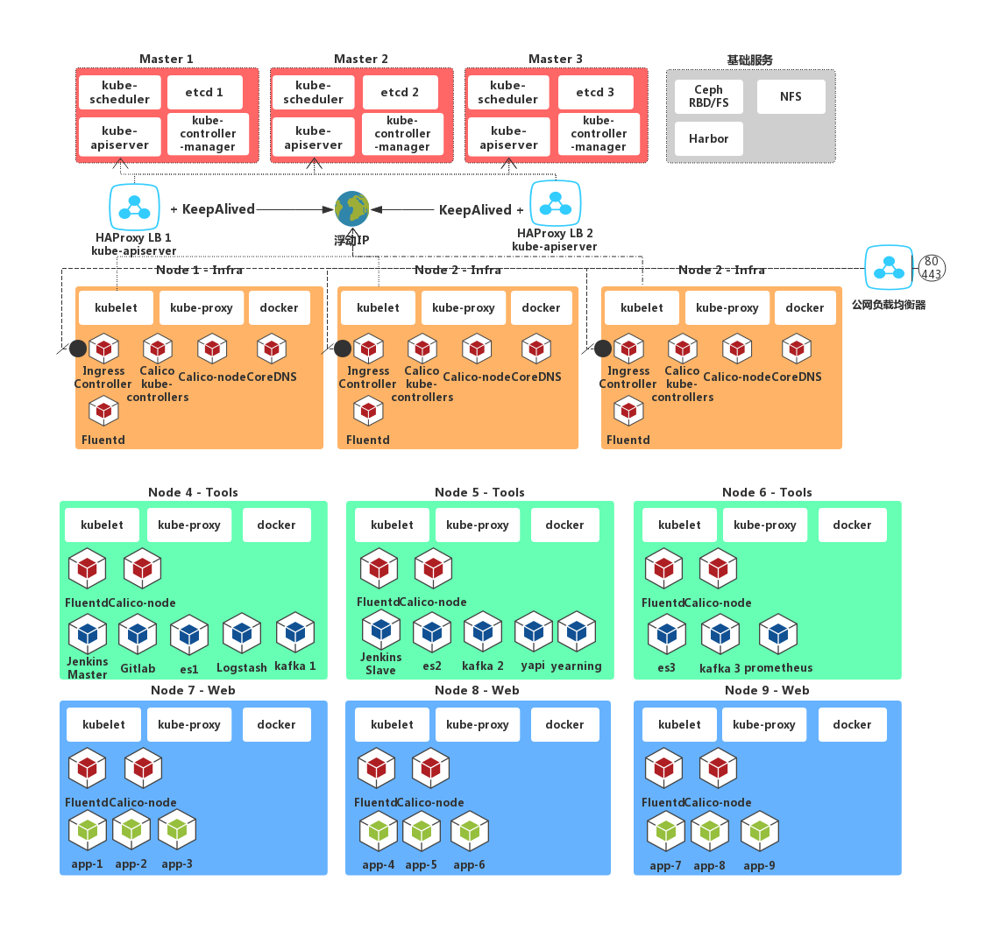

# Kubernetes的集群组件

# 一、集群架构

# 二、etcd

是高可用的 key/value 存储系统，用于持久化存储集群中的所有资源对象，比如：Node，Pod，Serivce，RC,namespace 等。API server 提供了操作 etcd 的封装接口 API，以 Rest 的方式提供，这些 API 基本上都是集群中资源对象的增删改查及监听资源变化的接口，比如创建 Pod、RC，监听 Pod 的变化等接口。API server 是连接其他所有服务组件的中间枢纽。

# 三、kube-apiserver

提供了资源对象的唯一操作入口，其他组件都必须通过它提供的 API 来操作资源数据，通过对相关的资源数据"全量查询" + "变化监听"，这些组件可以很"实时"的完成相关的业务功能。比如提交一个新的 Pod 到 API server 中，Controller Manger 可以立即就发现并开始作用。它还有一套完备的安全机制，包括认证、授权及准入控制等相关模块。

# 四、kube-controllermanager

集群内部的管理控制中心，主要完成了集群的故障检测和恢复的自动化工作。比如对 RC 定义的 Pod 进行维护；根据 service 和 Pod 的关系，完成服务的 Endpoints 对象的创建和更新；还有 Node 的发现、管理和状态监控，死亡容器所占资源及本地缓存的镜像文件的清理等工作

保障集群中各种资源处于期望状态，当监控到某个资源状态不正常时，管理控制器会触发对应的调度操作，主要由以下几个部分组成: 
 节点控制器(Node Controller)
 副本控制器(Replication  Controller)
 端点控制器(Endpoints Controller)
 命名空间控制器(Namespace Controller)
 身份认证控制器(Serviceaccounts  Controller)

# 五、kube-scheduler

集群的调度器，负责 Pod 在集群节点中的调度分配，也负责 Volume（CVI）和网络（CNI）的管理，按照预定的调度策略将 Pod 调度到相应的机器上；

调度器，接收来自于管理控制器(kube-controller-manager)触发的调度操作请求，然后根据请求规格、调度约束、整体资源情况等因素进行调度计算，最后将任务写到etcd，目标节点的kubelet 组件监听到由其负责的资源创建工作，然后执行具体调度任务

# 六、kube-proxy

实现 Service 的代理及软件模式的负载均衡器。

# 七、kubelet

负责本地节点上 Pod 的创建、修改、监控、删除等生命周期管理，同时会上报本 Node 的状态信息到 API server。