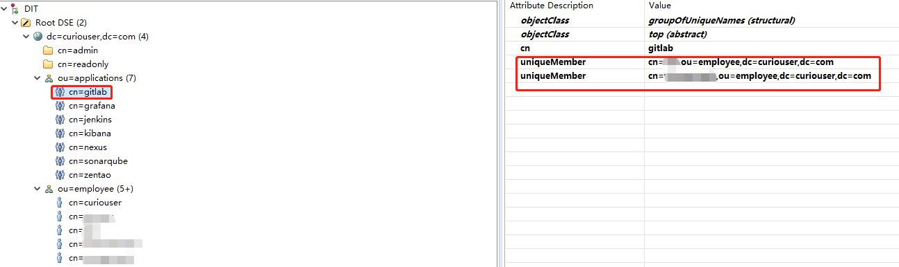
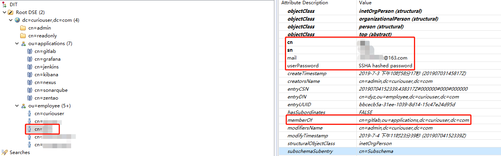
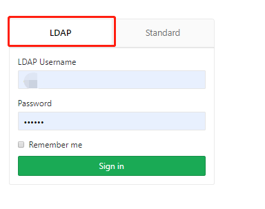
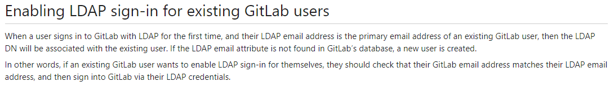
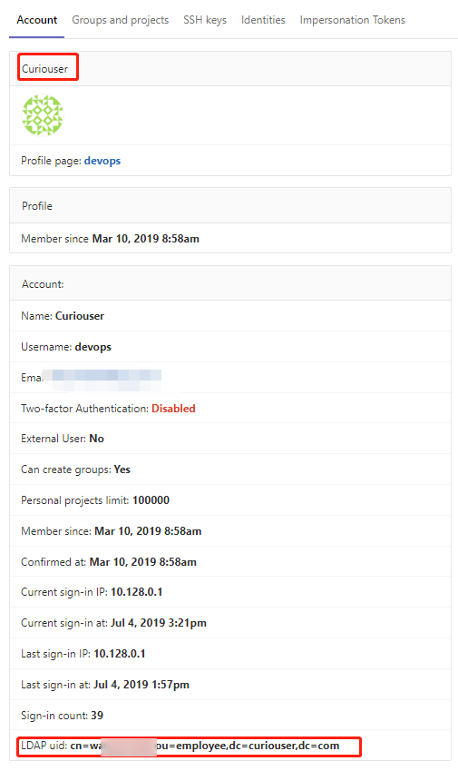

# 一、Context

### OpenLDAP的条目组织形式




# 二、配置

## 1. 修改/etc/gitlab/gitlab.rb

```yaml
..................省略.............................
gitlab_rails['ldap_enabled'] = true
###! **remember to close this block with 'EOS' below**
gitlab_rails['ldap_servers'] = YAML.load <<-'EOS'
  main: 
    label: 'LDAP'
    host: 'openldap-service.openldap.svc'
    port: 389
    uid: 'cn'
    bind_dn: 'cn=admin,dc=curiouser,dc=com'
    password: '********'
    encryption: 'plain' # "start_tls" or "simple_tls" or "plain"
    verify_certificates: false
    active_directory: true
    allow_username_or_email_login: true
    lowercase_usernames: true
    block_auto_created_users: false
    base: 'ou=employee,dc=curiouser,dc=com'
    user_filter: '(&(memberOf=cn=gitlab,ou=applications,dc=curiouser,dc=com))'
    attributes:
      username: ['cn']
      email: ['mail']
      name: ['sn']
    ## EE only
    group_base: ''
    admin_group: ''
    sync_ssh_keys: false

  #secondary: # 'secondary' is the GitLab 'provider ID' of second LDAP server
   # label: 'LDAP'
   # host: '_your_ldap_server'
   # port: 389
   # uid: 'sAMAccountName'
   # bind_dn: '_the_full_dn_of_the_user_you_will_bind_with'
   # password: '_the_password_of_the_bind_user'
   # encryption: 'plain' # "start_tls" or "simple_tls" or "plain"
   # verify_certificates: true
   # active_directory: true
   # allow_username_or_email_login: false
   # lowercase_usernames: false
   # block_auto_created_users: false
   # base: ''
   # user_filter: ''
   # ## EE only
   # group_base: ''
   # admin_group: ''
   # sync_ssh_keys: false
EOS
..................省略.............................
```

# 三、测试登录



# 四、注意

当用户第一次使用LDAP登录GitLab时，如果其LDAP电子邮件地址是现有GitLab用户的电子邮件地址时，那么LDAP DN用户将与现有gitlab用户相关联。如果在GitLab的数据库中没有找到LDAP电子邮件属性，就会创建一个新用户。

换句话说，如果现有的GitLab用户希望自己启用LDAP登录，那么他们应该检查他们的GitLab电子邮件地址是否匹配LDAP电子邮件地址，然后通过他们的LDAP凭证登录GitLab。



https://docs.gitlab.com/ee/administration/auth/ldap.html#enabling-ldap-sign-in-for-existing-gitlab-users



# 参考链接

1. https://blog.csdn.net/tongdao/article/details/52538365
2. https://docs.gitlab.com/ee/administration/auth/ldap.html#configuration
3. https://docs.gitlab.com/ee/administration/auth/how_to_configure_ldap_gitlab_ce/index.html


