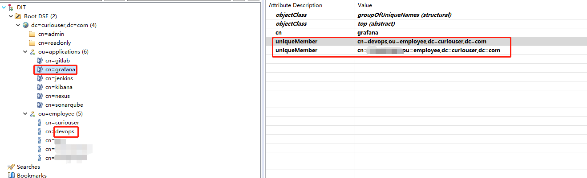
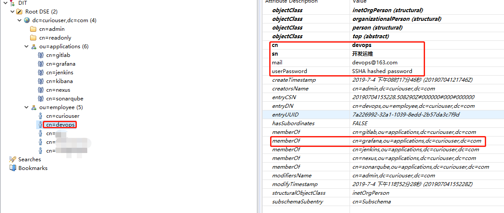

# 一、Context

**OpenLDAP的条目组织形式**




# 二、操作

## 1、修改/etc/grafana/grafana.ini

```ini
.............省略.............
[auth.ldap]
enabled = true
config_file = /etc/grafana/ldap.toml
allow_sign_up = true
.............省略.............
```
## 2、修改/etc/grafana/ldap.toml

```ini
.............省略.............
# To troubleshoot and get more log info enable ldap debug logging in grafana.ini
# [log]
# filters = ldap:debug

[[servers]]
# Ldap server host (specify multiple hosts space separated)
host = "openldap-service.openldap.svc"
# Default port is 389 or 636 if use_ssl = true
port = 389
# Set to true if ldap server supports TLS
use_ssl = false
# Set to true if connect ldap server with STARTTLS pattern (create connection in insecure, then upgrade to secure connection with TLS)
start_tls = false
# set to true if you want to skip ssl cert validation
ssl_skip_verify = false
# set to the path to your root CA certificate or leave unset to use system defaults
# root_ca_cert = "/path/to/certificate.crt"
# Authentication against LDAP servers requiring client certificates
# client_cert = "/path/to/client.crt"
# client_key = "/path/to/client.key"

# Search user bind dn
bind_dn = "cn=admin,dc=curiouser,dc=com"
# Search user bind password，If the password contains # or ; you have to wrap it with triple quotes. Ex """#password;"""
bind_password = '*********'

# User search filter, for example "(cn=%s)" or "(sAMAccountName=%s)" or "(uid=%s)"
search_filter = "(&(memberOf=cn=grafana,ou=applications,dc=curiouser,dc=com))"

# An array of base dns to search through
search_base_dns = ["ou=employee,dc=curiouser,dc=com"]

## For Posix or LDAP setups that does not support member_of attribute you can define the below settings。Please check grafana LDAP docs for examples
# group_search_filter = "(&(objectClass=posixGroup)(memberUid=%s))"
# group_search_base_dns = ["ou=groups,dc=grafana,dc=org"]
# group_search_filter_user_attribute = "uid"

# Specify names of the ldap attributes your ldap uses
[servers.attributes]
name = "sn"
username = "cn"
member_of = "memberOf"
email = "mail"

# Map ldap groups to grafana org roles
[[servers.group_mappings]]
#group_dn = "cn=admins,dc=grafana,dc=org"
#org_role = "Admin"
# To make user an instance admin (Grafana Admin) uncomment line below
# grafana_admin = true
# The Grafana organization database id, optional, if left out the default org (id 1) will be used
# org_id = 1

[[servers.group_mappings]]
group_dn = "cn=users,dc=grafana,dc=org"
org_role = "Editor"

[[servers.group_mappings]]
# If you want to match all (or no ldap groups) then you can use wildcard
group_dn = "*"
#org_role = "Viewer"
.............省略.............
```