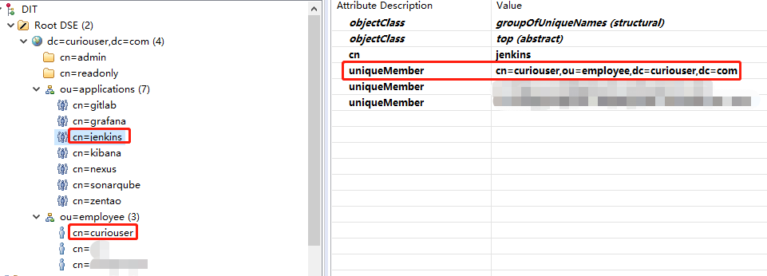
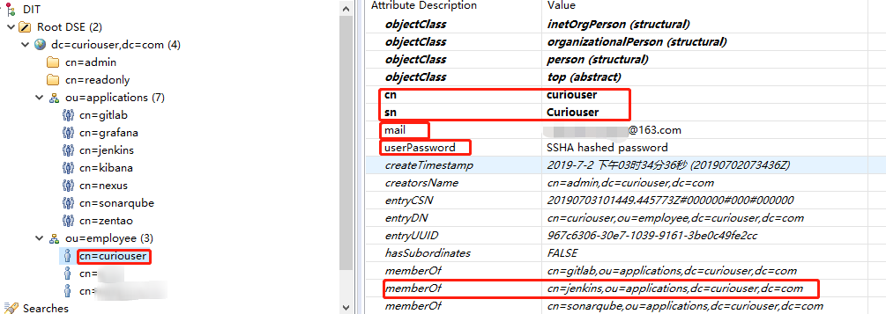
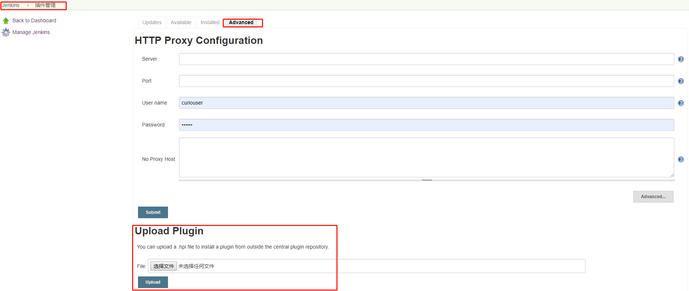
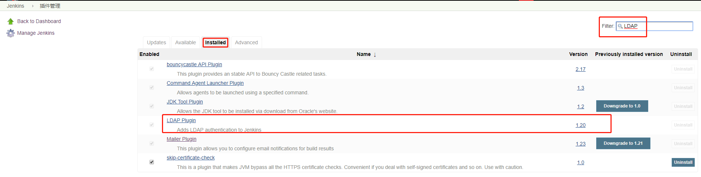
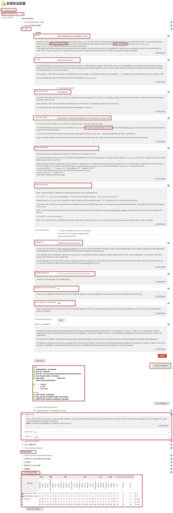
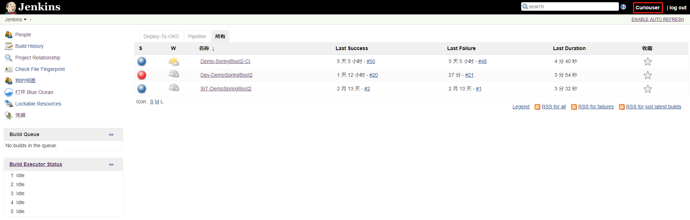

# 一. Context

### OpenLDAP的条目组织形式

# 二. Jenkins配置

## 1. Jenkins安装LDAP插件

### 安装插件有两种方法：

#### 方法一：后台插件管理里直接安装
- 优点：简单方便，不需要考虑插件依赖问题
- 缺点：因为网络等各种问题安装不成功

**安装方法：登录Jenkins --> 系统管理 --> 插件管理 --> 可选插件 --> 搜索LDAP --> 选中 --> 直接安装 --> 安装完成重启**

#### 方法二：官网下载安装文件后台上传
- 优点：一定可以安装成功的
- 缺点：麻烦，要去官网找插件并解决依赖

**安装方法：官网下载插件 --> 登录Jenkins --> 系统管理 --> 插件管理 --> 高级 --> 上传插件 --> 选择文件 --> 上传 --> 安装完成后重启**
LDAP插件下载地址：https://updates.jenkins.io/download/plugins/ldap/

## 2. 登录Jenkins --> 系统管理 --> 全局安全配置

- **root DN**：这里的root DN只是指搜索的根，并非LDAP服务器的root dn。由于LDAP数据库的数据组织结构类似一颗大树，而搜索是递归执行的，理论上，我们如果从子节点（而不是根节点）开始搜索，因为缩小了搜索范围那么就可以获得更高的性能。这里的root DN指的就是这个子节点的DN，当然也可以不填，表示从LDAP的根节点开始搜索
- **User search base**：这个配置也是为了缩小LDAP搜索的范围，例如Jenkins系统只允许ou为Admin下的用户才能登陆，那么你这里可以填写ou=Admin，这是一个相对的值，相对于上边的root DN，例如你上边的root DN填写的是dc=domain,dc=com，那么user search base这里填写了ou=Admin，那么登陆用户去LDAP搜索时就只会搜索ou=Admin,dc=domain,dc=com下的用户了
- **User search filter**：这个配置定义登陆的“用户名”对应LDAP中的哪个字段，如果你想用LDAP中的uid作为用户名来登录，那么这里可以配置为uid={0}（{0}会自动的替换为用户提交的用户名），如果你想用LDAP中的mail作为用户名来登录，那么这里就需要改为mail={0}。在测试的时候如果提示你user xxx does not exist，而你确定密码输入正确时，就要考虑下输入的用户名是不是这里定义的这个值了
- **Group search base**：参考上边User search base解释
- **Group search filter**：这个配置允许你将过滤器限制为所需的objectClass来提高搜索性能，也就是说可以只搜索用户属性中包含某个objectClass的用户，这就要求你对你的LDAP足够了解，一般我们也不配置
- **Group membership**：没配置，没有详细研究
- **Manager DN**：这个配置在你的LDAP服务器不允许匿名访问的情况下用来做认证（详细的认证过程参考文章LDAP落地实战（二）：SVN集成OpenLDAP认证中关于LDAP服务器认证过程的讲解），通常DN为cn=admin,dc=domain,dc=com这样
- **Manager Password**：上边配置dn的密码
- **Display Name LDAP attribute**：配置用户的显示名称，一般为显示名称就配置为uid，如果你想显示其他字段属性也可以这里配置，例如mail
- **Email Address LDAP attribute**：配置用户Email对应的字段属性，一般没有修改过的话都是mail，除非你用其他的字段属性来标识用户邮箱，这里可以配置

## 3. 登录验证

# 参考链接

1. https://mp.weixin.qq.com/s/S5ozDJSh4yTSfP_glNoiOQ
2. https://plugins.jenkins.io/ldap
3. https://wiki.jenkins.io/display/JENKINS/LDAP+Plugin#LDAPPlugin-Groupmembership
4. https://www.cnblogs.com/zhaojiedi1992/p/zhaojiedi_liunx_52_ldap_for_jenkins.html
5. https://blog.csdn.net/wanglei_storage/article/details/52935312 