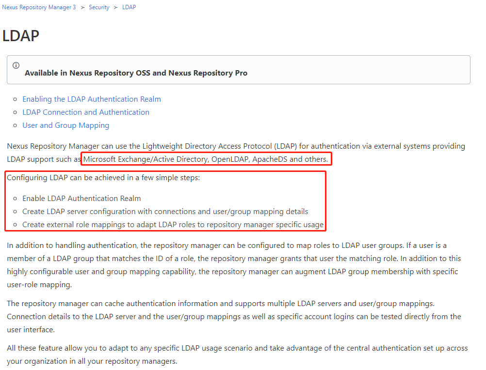
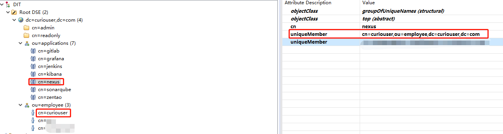
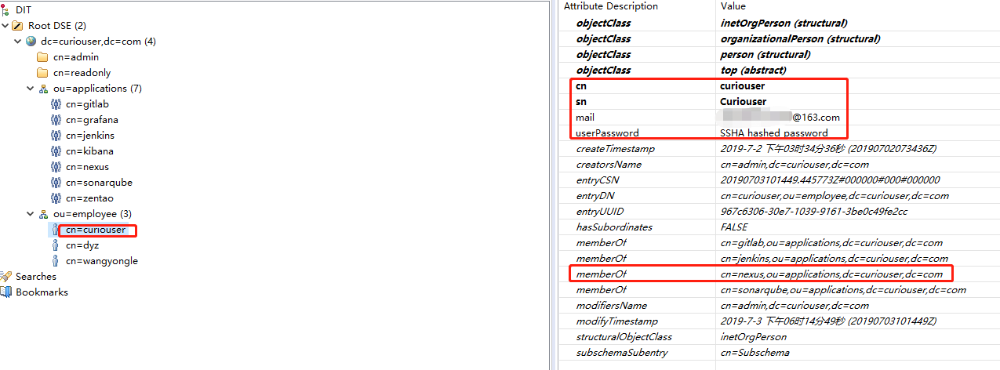
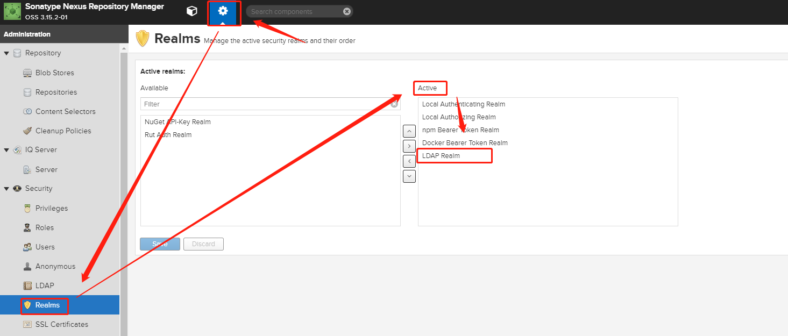
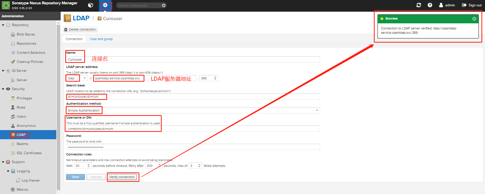
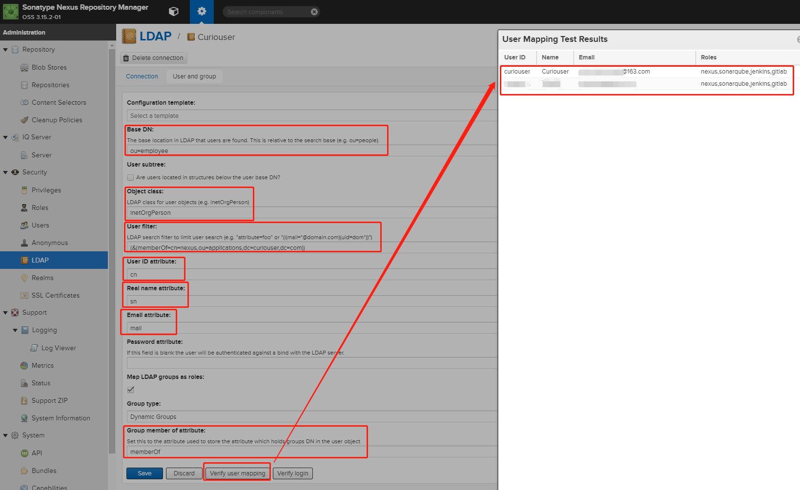
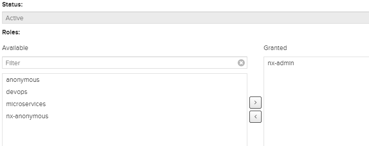
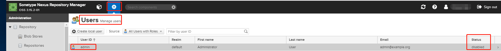

# Preflight

| Nexus 3 | OpenLDAP |
| :----- | :----- |
| 3.15.2-01 | 1.2.4 |

# 一、Context

### OpenLDAP的条目组织形式

# 二、Nexus设置
## 1. Nexus开启认证Realm

## 2. 配置LDAP

- **Name**：Enter a unique name for the new configuration.
- **LDAP server address**：Enter Protocol, Hostname, and Port of your LDAP server.
- **Protocol**：Valid values in this drop-down are ldap and ldaps that correspond to the Lightweight Directory Access Protocol and the Lightweight Directory Access Protocol over SSL.
- **Hostname**：The hostname or IP address of the LDAP server.
- **Port**：The port on which the LDAP server is listening. Port 389 is the default port for the ldap protocol, and port 636 is the default port for the ldaps.
- **Search base**：The search base further qualifies the connection to the LDAP server. The search base usually corresponds to the domain name of an organization. For example, the search base could be dc=example,dc=com.
Note: If the values in your search base contain spaces, escape them with "%20", as in "dc=example%20corp,dc=com"
You can configure one of four authentication methods to be used when connecting to the LDAP Server with the Authentication method drop-down.

- **Simple Authentication**：Simple authentication consists of a Username and Password. Simple authentication is not recommended for production deployments not using the secure ldaps protocol as it sends a clear-text password over the network.
- **Anonymous Authentication**：The anonymous authentication uses the server address and search base without further authentication.
- **Digest-MD5**：This is an improvement on the CRAM-MD5 authentication method. For more information, see RFC-2831.
- **CRAM-MD5**：The Challenge-Response Authentication Method (CRAM) is based on the HMAC-MD5 MAC algorithm. In this authentication method, the server sends a challenge string to the client. The client responds with a username followed by a Hex digest that the server compares to an expected value. For more information, see RFC-2195.For a full discussion of LDAP authentication approaches, see RFC-2829 and RFC-2251.
- **SASL Realm**：The Simple Authentication and Security Layer (SASL) realm used to connect to the LDAP server. It is only available if the authentication method is Digest-MD5 or CRAM-MD5.
- **Username or DN**：Username or DN (Distinguished Name) of an LDAP user with read access to all necessary users and groups. It is used to connect to the LDAP server.
- **Password**：Password for the Username or DN configured above.

- **Base DN**：Corresponds to the collection of distinguished names used as the base for user entries. This DN is relative to the Search Base. For example, if your users are all contained in ou=users,dc=sonatype,dc=com and you specified a Search Base of dc=sonatype,dc=com, you use a value of ou=users.
- **User subtree**：Check the box if True. Uncheck if False. Values are true if there is a tree below the Base DN that can contain user entries and false if all users are contain within the specified Base DN. For example, if all users are in ou=users,dc=sonatype,dc=com this field should be False. If users can appear in organizational units within organizational units such as ou=development,ou=users,dc=sonatype,dc=com, this field should be True .
- **Object class**：This value is a standard object class defined in RFC-2798. It specifies the object class for users. Common values are inetOrgPerson, person, user, or posixAccount.
- **User filter**：This allows you to configure a filter to limit the search for user records. It can be used as a performance improvement.
- **User ID attribute**：This is the attribute of the object class specified above, that supplies the identifier for the user from the LDAP server. The repository manager uses this attribute as the User ID value.
- **Real name attribute**：This is the attribute of the Object class that supplies the real name of the user. The repository manager uses this attribute when it needs to display the real name of a user similar to usage of the internal First name and Last name attributes.
- **Email attribute**：This is the attribute of the Object class that supplies the email address of the user. The repository manager uses this attribute for the Email attribute of the user. It is used for email notifications of the user.
- **Password attribute**：It can be used to configure the Object class, which supplies the password ("userPassword"). If this field is blank the user will be authenticated against a bind with the LDAP server. The password attribute is optional. When not configured authentication will occur as a bind to the LDAP server. Otherwise this is the attribute of the Object class that supplies the password of the user. The repository manager uses this attribute when it is authenticating a user against an LDAP server.
- **Group Base DN**：This field is similar to the Base DN field described for User Element Mapping, but applies to groups instead of users. For example, if your groups were defined under ou=groups,dc=sonatype,dc=com, this field would have a value of ou=groups.
- **Group subtree**：This field is similar to the User subtree field described for User Element Mapping, but configures groups instead of users. If all groups are defined under the entry defined in Base DN, set the field to false. If a group can be defined in a tree of organizational units under the Base DN, set the field to true.
- **Group object class**：This value in this field is a standard object class defined in RFC-2307. The class is simply a collection of references to unique entries in an LDAP directory and can be used to associate user entries with a group. Examples are groupOfUniqueNames, posixGroup or custom values.
- **Group ID attribute**：Specifies the attribute of the object class that specifies the group identifier. If the value of this field corresponds to the ID of a role, members of this group will have the corresponding privileges.
- **Group member attribute**：Specifies the attribute of the object class which specifies a member of a group. An example value is uniqueMember.
- **Group member format**：This field captures the format of the Group Member Attribute, and is used by the repository manager to extract a username from this attribute. An example values is ${dn} .

## 3. 分配Nexus管理员的角色"nx-admin"给LDAP上的一个用户，作为nexus新的管理员。然后将admin用户禁用。

# 参考链接

1. https://help.sonatype.com/repomanager3/security/ldap